# OCF Core — gap report (R5, generated)

GENERATED by scripts/derive-core-build. (a) OCF richness with no Carta home,
per admissible entity, OCF-*required* casualties **bold**; (b) Carta inverse
coverage by slot and object-definition role.

## (a) OCF richness dropped on fold-down

One diagram per OCF object — each polymorphic flavor (`Object [Variant]`) fully separate:
`existence-loss` fields narrow onto a Carta object; `no-destination` fields have no home and
drop to that flavor's own `⌀ no Carta home` sink. Edge labels = field count.
(Reverse-edge `heuristic` lineage is the upstream report's.)

**EquityCompensationIssuance [Sar]**

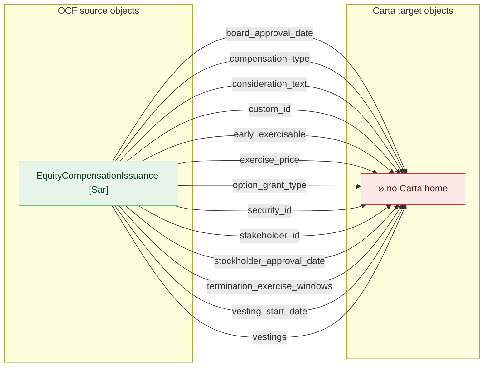

**EquityCompensationIssuance [Rsu]**

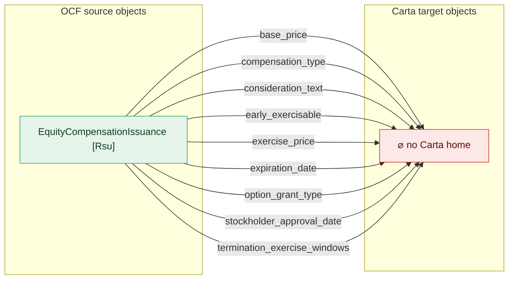

**Issuer**

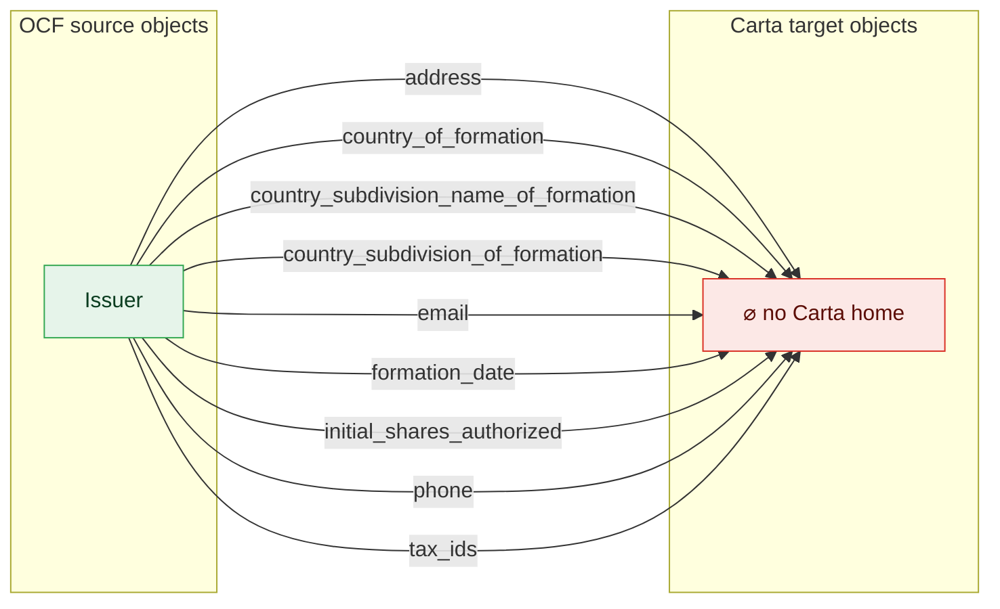

**StockIssuance [Default]**

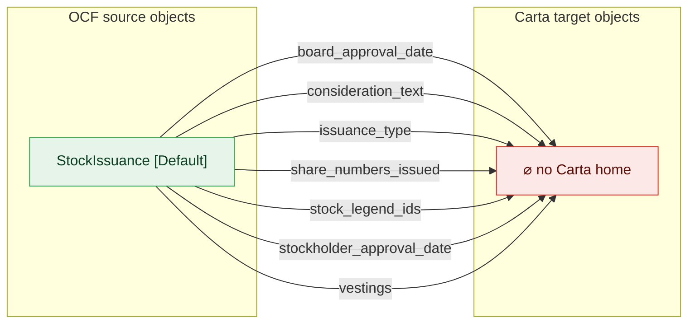

**WarrantIssuance**

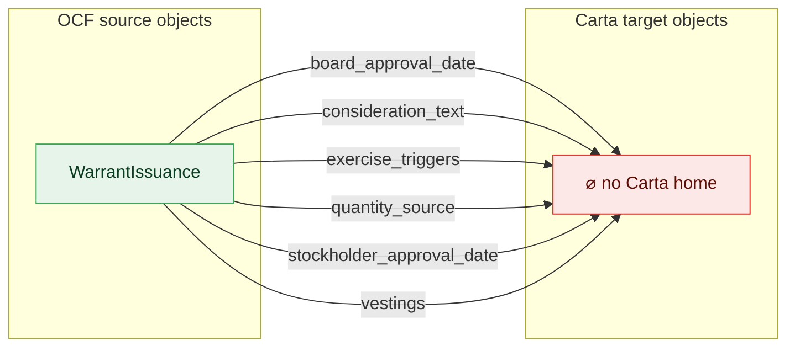

**ConvertibleConversion**

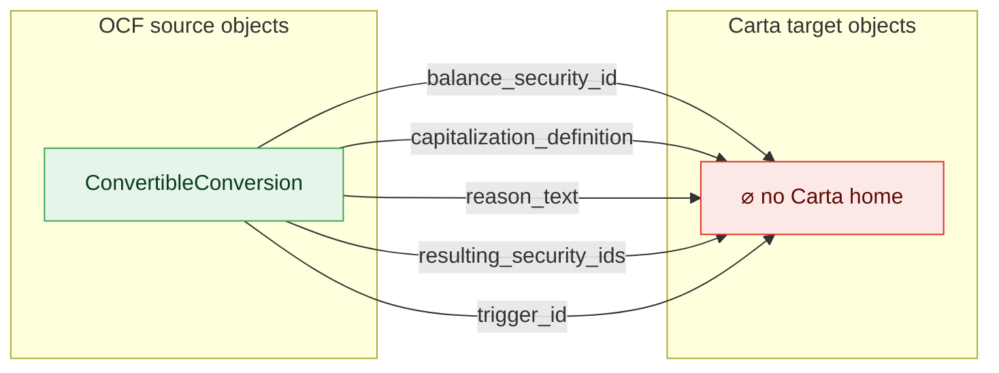

**ConvertibleIssuance**

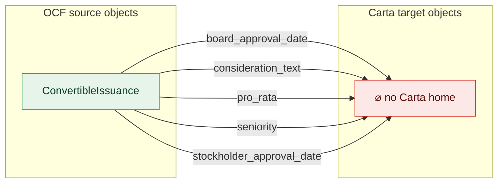

**Stakeholder → Stakeholder**

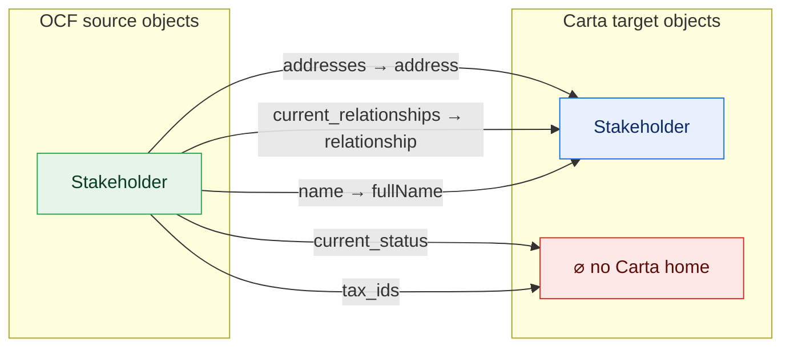

**StockIssuance [Rsa]**

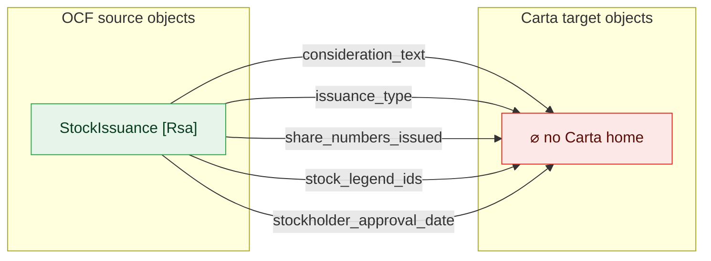

**Valuation**

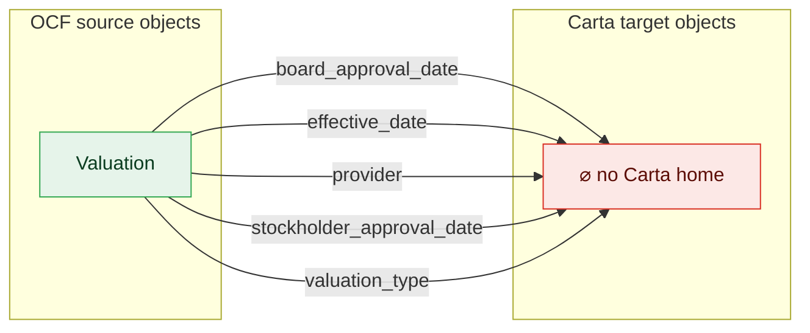

**EquityCompensationIssuance [Option] → OptionGrant**

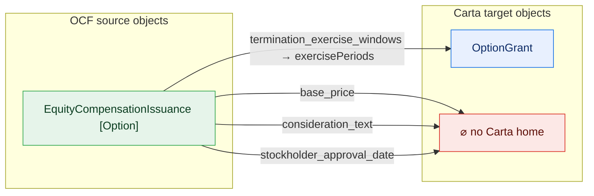

**StockClass → ShareClass**

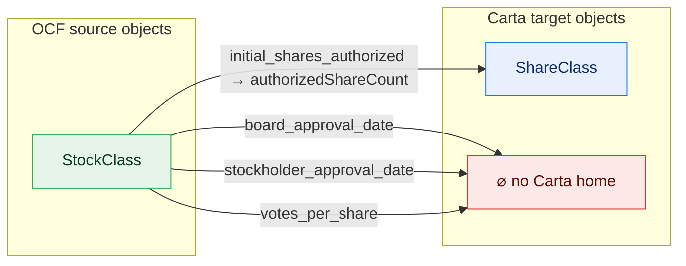

**StockPlan → OptionPoolSummary**

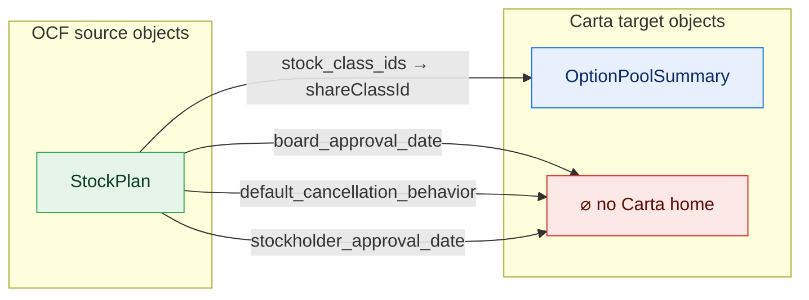

**StockClassAuthorizedSharesAdjustment**

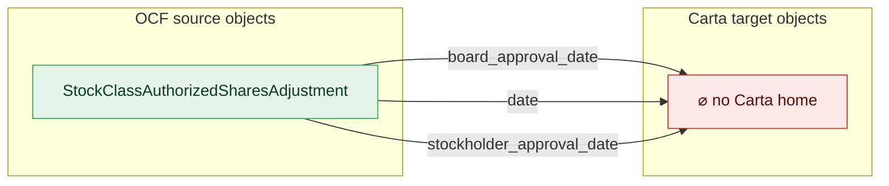

**WarrantTransfer → WarrantTransferTransaction**

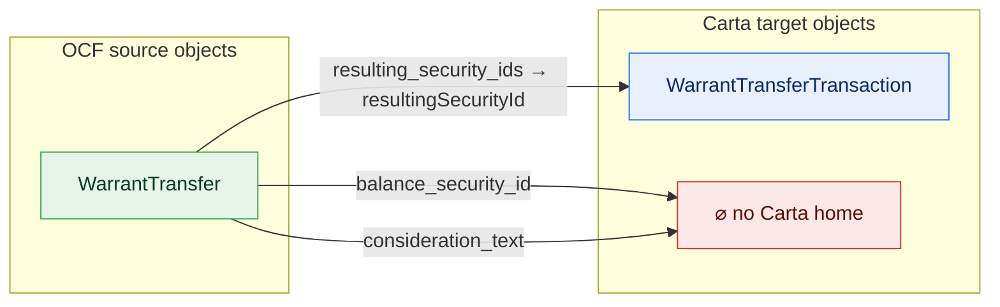

**Document**

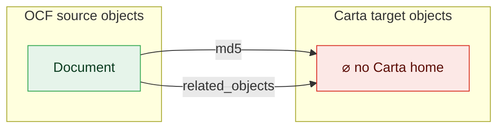

**EquityCompensationCancellation [Option]**

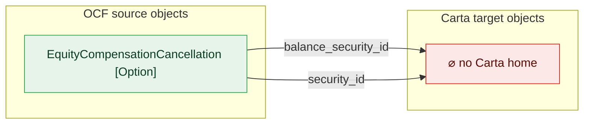

**EquityCompensationCancellation [Rsu]**


**EquityCompensationCancellation [Sar]**

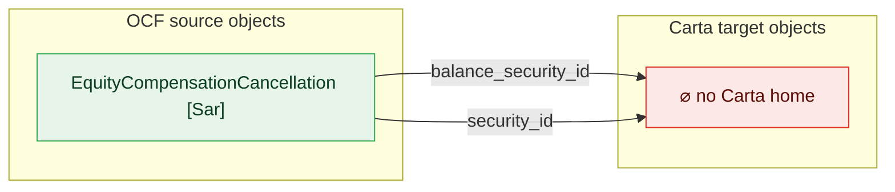

**EquityCompensationExercise [Option]**

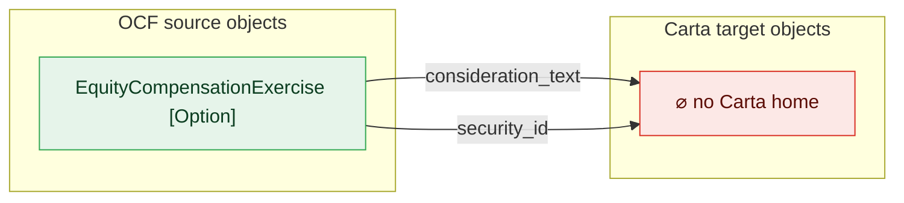

**EquityCompensationExercise [Sar]**

```mermaid
flowchart LR
  classDef adm fill:#e6f4ea,stroke:#34a853,color:#0b3d20;
  classDef notadm fill:#f1f3f4,stroke:#9aa0a6,color:#5f6368,stroke-dasharray:4 3;
  classDef carta fill:#e8f0fe,stroke:#1a73e8,color:#0d2b66;
  classDef sink fill:#fce8e6,stroke:#d93025,color:#5c0d06;
  subgraph SRC["OCF source objects"]
    direction TB
    o0["EquityCompensationExercise [Sar]"]:::adm
  end
  subgraph TGT["Carta target objects"]
    direction TB
    sink["⌀ no Carta home"]:::sink
  end
  o0 -->|"consideration_text"| sink
  o0 -->|"security_id"| sink
```

**EquityCompensationRelease [Rsu]**

```mermaid
flowchart LR
  classDef adm fill:#e6f4ea,stroke:#34a853,color:#0b3d20;
  classDef notadm fill:#f1f3f4,stroke:#9aa0a6,color:#5f6368,stroke-dasharray:4 3;
  classDef carta fill:#e8f0fe,stroke:#1a73e8,color:#0d2b66;
  classDef sink fill:#fce8e6,stroke:#d93025,color:#5c0d06;
  subgraph SRC["OCF source objects"]
    direction TB
    o0["EquityCompensationRelease [Rsu]"]:::adm
  end
  subgraph TGT["Carta target objects"]
    direction TB
    sink["⌀ no Carta home"]:::sink
  end
  o0 -->|"consideration_text"| sink
  o0 -->|"security_id"| sink
```

**EquityCompensationRepricing [Option]**

```mermaid
flowchart LR
  classDef adm fill:#e6f4ea,stroke:#34a853,color:#0b3d20;
  classDef notadm fill:#f1f3f4,stroke:#9aa0a6,color:#5f6368,stroke-dasharray:4 3;
  classDef carta fill:#e8f0fe,stroke:#1a73e8,color:#0d2b66;
  classDef sink fill:#fce8e6,stroke:#d93025,color:#5c0d06;
  subgraph SRC["OCF source objects"]
    direction TB
    o0["EquityCompensationRepricing [Option]"]:::adm
  end
  subgraph TGT["Carta target objects"]
    direction TB
    sink["⌀ no Carta home"]:::sink
  end
  o0 -->|"date"| sink
  o0 -->|"security_id"| sink
```

**EquityCompensationRepricing [Sar]**

```mermaid
flowchart LR
  classDef adm fill:#e6f4ea,stroke:#34a853,color:#0b3d20;
  classDef notadm fill:#f1f3f4,stroke:#9aa0a6,color:#5f6368,stroke-dasharray:4 3;
  classDef carta fill:#e8f0fe,stroke:#1a73e8,color:#0d2b66;
  classDef sink fill:#fce8e6,stroke:#d93025,color:#5c0d06;
  subgraph SRC["OCF source objects"]
    direction TB
    o0["EquityCompensationRepricing [Sar]"]:::adm
  end
  subgraph TGT["Carta target objects"]
    direction TB
    sink["⌀ no Carta home"]:::sink
  end
  o0 -->|"date"| sink
  o0 -->|"security_id"| sink
```

**StockTransfer [Default]**

```mermaid
flowchart LR
  classDef adm fill:#e6f4ea,stroke:#34a853,color:#0b3d20;
  classDef notadm fill:#f1f3f4,stroke:#9aa0a6,color:#5f6368,stroke-dasharray:4 3;
  classDef carta fill:#e8f0fe,stroke:#1a73e8,color:#0d2b66;
  classDef sink fill:#fce8e6,stroke:#d93025,color:#5c0d06;
  subgraph SRC["OCF source objects"]
    direction TB
    o0["StockTransfer [Default]"]:::adm
  end
  subgraph TGT["Carta target objects"]
    direction TB
    sink["⌀ no Carta home"]:::sink
  end
  o0 -->|"consideration_text"| sink
  o0 -->|"security_id"| sink
```

**StockTransfer [Rsa]**

```mermaid
flowchart LR
  classDef adm fill:#e6f4ea,stroke:#34a853,color:#0b3d20;
  classDef notadm fill:#f1f3f4,stroke:#9aa0a6,color:#5f6368,stroke-dasharray:4 3;
  classDef carta fill:#e8f0fe,stroke:#1a73e8,color:#0d2b66;
  classDef sink fill:#fce8e6,stroke:#d93025,color:#5c0d06;
  subgraph SRC["OCF source objects"]
    direction TB
    o0["StockTransfer [Rsa]"]:::adm
  end
  subgraph TGT["Carta target objects"]
    direction TB
    sink["⌀ no Carta home"]:::sink
  end
  o0 -->|"consideration_text"| sink
  o0 -->|"security_id"| sink
```

**WarrantCancellation**

```mermaid
flowchart LR
  classDef adm fill:#e6f4ea,stroke:#34a853,color:#0b3d20;
  classDef notadm fill:#f1f3f4,stroke:#9aa0a6,color:#5f6368,stroke-dasharray:4 3;
  classDef carta fill:#e8f0fe,stroke:#1a73e8,color:#0d2b66;
  classDef sink fill:#fce8e6,stroke:#d93025,color:#5c0d06;
  subgraph SRC["OCF source objects"]
    direction TB
    o0["WarrantCancellation"]:::adm
  end
  subgraph TGT["Carta target objects"]
    direction TB
    sink["⌀ no Carta home"]:::sink
  end
  o0 -->|"balance_security_id"| sink
  o0 -->|"security_id"| sink
```

**ConvertibleCancellation**

```mermaid
flowchart LR
  classDef adm fill:#e6f4ea,stroke:#34a853,color:#0b3d20;
  classDef notadm fill:#f1f3f4,stroke:#9aa0a6,color:#5f6368,stroke-dasharray:4 3;
  classDef carta fill:#e8f0fe,stroke:#1a73e8,color:#0d2b66;
  classDef sink fill:#fce8e6,stroke:#d93025,color:#5c0d06;
  subgraph SRC["OCF source objects"]
    direction TB
    o0["ConvertibleCancellation"]:::adm
  end
  subgraph TGT["Carta target objects"]
    direction TB
    sink["⌀ no Carta home"]:::sink
  end
  o0 -->|"balance_security_id"| sink
```

**StakeholderRelationshipChangeEvent**

```mermaid
flowchart LR
  classDef adm fill:#e6f4ea,stroke:#34a853,color:#0b3d20;
  classDef notadm fill:#f1f3f4,stroke:#9aa0a6,color:#5f6368,stroke-dasharray:4 3;
  classDef carta fill:#e8f0fe,stroke:#1a73e8,color:#0d2b66;
  classDef sink fill:#fce8e6,stroke:#d93025,color:#5c0d06;
  subgraph SRC["OCF source objects"]
    direction TB
    o0["StakeholderRelationshipChangeEvent"]:::adm
  end
  subgraph TGT["Carta target objects"]
    direction TB
    sink["⌀ no Carta home"]:::sink
  end
  o0 -->|"date"| sink
```

**StockCancellation [Default]**

```mermaid
flowchart LR
  classDef adm fill:#e6f4ea,stroke:#34a853,color:#0b3d20;
  classDef notadm fill:#f1f3f4,stroke:#9aa0a6,color:#5f6368,stroke-dasharray:4 3;
  classDef carta fill:#e8f0fe,stroke:#1a73e8,color:#0d2b66;
  classDef sink fill:#fce8e6,stroke:#d93025,color:#5c0d06;
  subgraph SRC["OCF source objects"]
    direction TB
    o0["StockCancellation [Default]"]:::adm
  end
  subgraph TGT["Carta target objects"]
    direction TB
    sink["⌀ no Carta home"]:::sink
  end
  o0 -->|"security_id"| sink
```

**StockCancellation [Rsa]**

```mermaid
flowchart LR
  classDef adm fill:#e6f4ea,stroke:#34a853,color:#0b3d20;
  classDef notadm fill:#f1f3f4,stroke:#9aa0a6,color:#5f6368,stroke-dasharray:4 3;
  classDef carta fill:#e8f0fe,stroke:#1a73e8,color:#0d2b66;
  classDef sink fill:#fce8e6,stroke:#d93025,color:#5c0d06;
  subgraph SRC["OCF source objects"]
    direction TB
    o0["StockCancellation [Rsa]"]:::adm
  end
  subgraph TGT["Carta target objects"]
    direction TB
    sink["⌀ no Carta home"]:::sink
  end
  o0 -->|"security_id"| sink
```

**StockClassConversionRatioAdjustment**

```mermaid
flowchart LR
  classDef adm fill:#e6f4ea,stroke:#34a853,color:#0b3d20;
  classDef notadm fill:#f1f3f4,stroke:#9aa0a6,color:#5f6368,stroke-dasharray:4 3;
  classDef carta fill:#e8f0fe,stroke:#1a73e8,color:#0d2b66;
  classDef sink fill:#fce8e6,stroke:#d93025,color:#5c0d06;
  subgraph SRC["OCF source objects"]
    direction TB
    o0["StockClassConversionRatioAdjustment"]:::adm
  end
  subgraph TGT["Carta target objects"]
    direction TB
    sink["⌀ no Carta home"]:::sink
  end
  o0 -->|"date"| sink
```


### ConvertibleCancellation
- balance_security_id: no-destination — kind unmappable

### ConvertibleConversion
- balance_security_id: no-destination — kind unmappable
- capitalization_definition: no-destination — kind unmappable
- **reason_text** (OCF-required): no-destination — kind unmappable
- **resulting_security_ids** (OCF-required): no-destination — kind unmappable
- **trigger_id** (OCF-required): no-destination — kind unmappable

### ConvertibleIssuance
- board_approval_date: no-destination — kind unmappable
- consideration_text: no-destination — kind unmappable
- pro_rata: no-destination — kind unmappable
- **seniority** (OCF-required): no-destination — kind unmappable
- stockholder_approval_date: no-destination — kind unmappable

### Document
- **md5** (OCF-required): no-destination — kind unmappable
- related_objects: no-destination — kind unmappable

### EquityCompensationCancellation [Option]
- balance_security_id: no-destination — kind unmappable
- **security_id** (OCF-required): no-destination — kind unmappable

### EquityCompensationCancellation [Rsu]
- balance_security_id: no-destination — kind unmappable
- **security_id** (OCF-required): no-destination — kind unmappable

### EquityCompensationCancellation [Sar]
- balance_security_id: no-destination — kind unmappable
- **security_id** (OCF-required): no-destination — kind unmappable

### EquityCompensationExercise [Option]
- consideration_text: no-destination — kind unmappable
- **security_id** (OCF-required): no-destination — kind unmappable

### EquityCompensationExercise [Sar]
- consideration_text: no-destination — kind unmappable
- **security_id** (OCF-required): no-destination — kind unmappable

### EquityCompensationIssuance [Option]
- base_price: no-destination — kind unmappable
- consideration_text: no-destination — kind unmappable
- stockholder_approval_date: no-destination — kind unmappable
- **termination_exercise_windows** (OCF-required): existence-loss — select (first_termination_window)

### EquityCompensationIssuance [Rsu]
- base_price: no-destination — kind unmappable
- **compensation_type** (OCF-required): no-destination — kind unmappable
- consideration_text: no-destination — kind unmappable
- early_exercisable: no-destination — kind unmappable
- exercise_price: no-destination — kind unmappable
- **expiration_date** (OCF-required): no-destination — kind unmappable
- option_grant_type: no-destination — kind unmappable
- stockholder_approval_date: no-destination — kind unmappable
- **termination_exercise_windows** (OCF-required): no-destination — kind unmappable

### EquityCompensationIssuance [Sar]
- board_approval_date: no-destination — kind unmappable
- **compensation_type** (OCF-required): no-destination — kind unmappable
- consideration_text: no-destination — kind unmappable
- **custom_id** (OCF-required): no-destination — kind unmappable
- early_exercisable: no-destination — kind unmappable
- exercise_price: no-destination — kind unmappable
- option_grant_type: no-destination — kind unmappable
- **security_id** (OCF-required): no-destination — kind unmappable
- **stakeholder_id** (OCF-required): no-destination — kind unmappable
- stockholder_approval_date: no-destination — kind unmappable
- **termination_exercise_windows** (OCF-required): no-destination — kind unmappable
- vesting_start_date: no-destination — kind unmappable
- vestings: no-destination — kind unmappable

### EquityCompensationRelease [Rsu]
- consideration_text: no-destination — kind unmappable
- **security_id** (OCF-required): no-destination — kind unmappable

### EquityCompensationRepricing [Option]
- **date** (OCF-required): no-destination — kind unmappable
- **security_id** (OCF-required): no-destination — kind unmappable

### EquityCompensationRepricing [Sar]
- **date** (OCF-required): no-destination — kind unmappable
- **security_id** (OCF-required): no-destination — kind unmappable

### Issuer
- address: no-destination — kind unmappable
- **country_of_formation** (OCF-required): no-destination — kind unmappable
- country_subdivision_name_of_formation: no-destination — kind unmappable
- country_subdivision_of_formation: no-destination — kind unmappable
- email: no-destination — kind unmappable
- **formation_date** (OCF-required): no-destination — kind unmappable
- initial_shares_authorized: no-destination — kind unmappable
- phone: no-destination — kind unmappable
- tax_ids: no-destination — kind unmappable

### Stakeholder
- addresses: existence-loss — select (first_address_country)
- current_relationships: existence-loss — array→scalar
- current_status: no-destination — kind unmappable
- **name** (OCF-required): existence-loss — select (legal_name)
- tax_ids: no-destination — kind unmappable

### StakeholderRelationshipChangeEvent
- **date** (OCF-required): no-destination — kind unmappable

### StockCancellation [Default]
- **security_id** (OCF-required): no-destination — kind unmappable

### StockCancellation [Rsa]
- **security_id** (OCF-required): no-destination — kind unmappable

### StockClass
- board_approval_date: no-destination — kind unmappable
- **initial_shares_authorized** (OCF-required): partial — AuthorizedShares: unmapped members NOT APPLICABLE, UNLIMITED; Numeric: widening
- stockholder_approval_date: no-destination — kind unmappable
- **votes_per_share** (OCF-required): no-destination — kind unmappable

### StockClassAuthorizedSharesAdjustment
- board_approval_date: no-destination — kind unmappable
- **date** (OCF-required): no-destination — kind unmappable
- stockholder_approval_date: no-destination — kind unmappable

### StockClassConversionRatioAdjustment
- **date** (OCF-required): no-destination — kind unmappable

### StockIssuance [Default]
- board_approval_date: no-destination — kind unmappable
- consideration_text: no-destination — kind unmappable
- issuance_type: no-destination — kind unmappable
- share_numbers_issued: no-destination — kind unmappable
- **stock_legend_ids** (OCF-required): no-destination — kind unmappable
- stockholder_approval_date: no-destination — kind unmappable
- vestings: no-destination — kind unmappable

### StockIssuance [Rsa]
- consideration_text: no-destination — kind unmappable
- issuance_type: no-destination — kind unmappable
- share_numbers_issued: no-destination — kind unmappable
- **stock_legend_ids** (OCF-required): no-destination — kind unmappable
- stockholder_approval_date: no-destination — kind unmappable

### StockPlan
- board_approval_date: no-destination — kind unmappable
- default_cancellation_behavior: no-destination — kind unmappable
- stock_class_ids: existence-loss — select (first_stock_class_id)
- stockholder_approval_date: no-destination — kind unmappable

### StockTransfer [Default]
- consideration_text: no-destination — kind unmappable
- **security_id** (OCF-required): no-destination — kind unmappable

### StockTransfer [Rsa]
- consideration_text: no-destination — kind unmappable
- **security_id** (OCF-required): no-destination — kind unmappable

### Valuation
- board_approval_date: no-destination — kind unmappable
- **effective_date** (OCF-required): no-destination — kind unmappable
- provider: no-destination — kind unmappable
- stockholder_approval_date: no-destination — kind unmappable
- **valuation_type** (OCF-required): no-destination — kind unmappable

### WarrantCancellation
- balance_security_id: no-destination — kind unmappable
- **security_id** (OCF-required): no-destination — kind unmappable

### WarrantIssuance
- board_approval_date: no-destination — kind unmappable
- consideration_text: no-destination — kind unmappable
- **exercise_triggers** (OCF-required): no-destination — kind unmappable
- quantity_source: no-destination — kind unmappable
- stockholder_approval_date: no-destination — kind unmappable
- vestings: no-destination — kind unmappable

### WarrantTransfer
- balance_security_id: no-destination — kind unmappable
- consideration_text: no-destination — kind unmappable
- **resulting_security_ids** (OCF-required): existence-loss — select (first_resulting_security_id)

## (b) Carta inverse coverage by object definition

The inverse ledger separates executable slot coverage, reusable type mappings,
structural `$ref` reachability, deferred extraction, expected derived objects,
curated value-type roles, alternate/unreachable shapes, and actionable gap candidates.
A missing root target is therefore not automatically a missing concept.

### CARTA inverse coverage: the simple story

1. Carta defines **139** total definitions.
2. **53** are non-object definitions: **47** scalar enum definitions (field vocabularies) + **6** curated scalar support types; neither is a standalone mapping target.
3. **86** are object-shaped definitions.
4. Of those **86**, **54** are support definitions, not standalone objects (**53** nested objects + **1** object-shaped value type), leaving **32** standalone mapping candidates.
5. **60** support definitions are excluded from standalone mapping: **54** object-shaped support definitions + **6** scalar support types.
6. We have mapping evidence for **15**: **0** fully mapped and **15** partially mapped (**14** direct executable, **1** type-only, **0** deferred).
7. **17** standalone candidates have no mapping evidence yet; their inventory role tells us whether that is expected or actionable (**12** report/read-model roll-ups, **2** alternate shapes, **1** CARTA-specific families without OCF sources, **1** workflow/data gaps, **1** actionable gaps, **0** requiring review).

**Checks:** 139 = 53 non-object + 86 object-shaped; 53 = 47 scalar enum + 6 scalar support; 32 = 15 + 17; 86 = 32 + 54.

### Technical slot diagnostics

| Carta-side dimension | count |
| --- | ---: |
| object slots | 588 |
| defs with direct executable coverage | 14 |
| direct executable slots | 146 |
| defs with type-only slots | 7 |
| defs with only type-only coverage | 1 |
| reusable type-only slots | 34 |
| implicit constant slots | 3 |
| deferred slots | 4 |
| empty slots | 401 |

### Supporting CARTA definitions excluded from standalone mapping targets (60)

53 nested object definitions and 7 curated value types are intentionally not standalone targets.
6 scalar wrappers are outside the object-like definition denominator; 1 value-type definition is object-like.
These definitions are packaging/support types, not standalone mapping targets; their mapping/type evidence remains valid.
The parent column names the immediate parent(s); the reason says whether mapped-parent coverage is established.

| role | Carta `$def` | covered through | reason |
| --- | --- | --- | --- |
| value-type | `#/$defs/Date` | type correspondence: Iso8601CompleteCalendarDate, Iso8601CompleteCalendarDateTime | Partial-date value helper; OCF Date maps to the Iso8601 date wrappers. |
| value-type | `#/$defs/Decimal` | owning Carta object properties; not a standalone entity | Reusable scalar value wrapper, not a standalone Carta entity. |
| value-type | `#/$defs/Iso3166Set1Alpha3Code` | owning Carta object properties; not a standalone entity | Reusable scalar value wrapper, not a standalone Carta entity. |
| value-type | `#/$defs/Iso3166Set2Code` | owning Carta object properties; not a standalone entity | Reusable scalar value wrapper, not a standalone Carta entity. |
| value-type | `#/$defs/Iso4217CurrencyAlphaCode` | owning Carta object properties; not a standalone entity | Reusable scalar value wrapper, not a standalone Carta entity. |
| value-type | `#/$defs/Iso8601CompleteCalendarDate` | owning Carta object properties; not a standalone entity | Reusable calendar-date wrapper, populated through owning object properties. |
| value-type | `#/$defs/Iso8601CompleteCalendarDateTime` | owning Carta object properties; not a standalone entity | Reusable datetime wrapper, populated through owning object properties. |
| nested-obj | `#/$defs/Acceleration` | Vesting | Nested object; no mapped parent coverage established, but not a standalone target. |
| nested-obj | `#/$defs/CertificateCancellationTransaction` | CertificateTransactionItem | Nested object; no mapped parent coverage established, but not a standalone target. |
| nested-obj | `#/$defs/CertificateIssuanceTransaction` | CertificateTransactionItem | Nested object; no mapped parent coverage established, but not a standalone target. |
| nested-obj | `#/$defs/CertificatePrecededBy` | Certificate | Nested object; covered through mapped parent(s). |
| nested-obj | `#/$defs/ConvertibleCancellationTransaction` | ConvertibleTransactionItem | Nested object; covered through mapped parent(s). |
| nested-obj | `#/$defs/ConvertibleIssuanceTransaction` | ConvertibleTransactionItem | Nested object; covered through mapped parent(s). |
| nested-obj | `#/$defs/DividendDetails` | ShareClassDividendDetails | Nested object; covered through mapped parent(s). |
| nested-obj | `#/$defs/Document` | OptionGrantDocuments | Nested object; no mapped parent coverage established, but not a standalone target. |
| nested-obj | `#/$defs/Exercise` | OptionGrant | Nested object; covered through mapped parent(s). |
| nested-obj | `#/$defs/ExercisePeriods` | OptionGrant | Nested object; covered through mapped parent(s). |
| nested-obj | `#/$defs/Jurisdiction` | OptionExerciseTaxWithholdingLineItem | Nested object; no mapped parent coverage established, but not a standalone target. |
| nested-obj | `#/$defs/Money` | Certificate, CertificateIssuanceTransaction, ConvertibleCancellationTransaction, ConvertibleIssuanceTransaction, ConvertibleNote, OptionGrant, OptionIssuanceTransaction, RestrictedStockAward, RestrictedStockUnit, RestrictedStockUnitSettlement, RsaIssuanceTransaction, SarExerciseTransaction, SarIssuanceTransaction, ShareClass, ShareClassRightsAndPreferences, ShareClassValuation, WarrantIssuanceTransaction | Nested object; covered through mapped parent(s). |
| nested-obj | `#/$defs/NoteBlock` | ConvertibleNote | Nested object; covered through mapped parent(s). |
| nested-obj | `#/$defs/OptionCancellationTransaction` | OptionTransactionItem | Nested object; no mapped parent coverage established, but not a standalone target. |
| nested-obj | `#/$defs/OptionExerciseMoneyMovement` | OptionExercise | Nested object; no mapped parent coverage established, but not a standalone target. |
| nested-obj | `#/$defs/OptionExerciseTaxWithholdingLineItem` | OptionExercise | Nested object; no mapped parent coverage established, but not a standalone target. |
| nested-obj | `#/$defs/OptionExerciseTransaction` | OptionTransactionItem | Nested object; no mapped parent coverage established, but not a standalone target. |
| nested-obj | `#/$defs/OptionGrantVestingEvent` | OptionGrant | Nested object; covered through mapped parent(s). |
| nested-obj | `#/$defs/OptionIssuanceTransaction` | OptionTransactionItem | Nested object; no mapped parent coverage established, but not a standalone target. |
| nested-obj | `#/$defs/PerformanceCondition` | VestingPeriod | Nested object; covered through mapped parent(s). |
| nested-obj | `#/$defs/PhantomCancellationTransaction` | PhantomTransactionItem | Nested object; no mapped parent coverage established, but not a standalone target. |
| nested-obj | `#/$defs/PhantomIssuanceTransaction` | PhantomTransactionItem | Nested object; no mapped parent coverage established, but not a standalone target. |
| nested-obj | `#/$defs/PiuCancellationTransaction` | PiuTransactionItem | Nested object; no mapped parent coverage established, but not a standalone target. |
| nested-obj | `#/$defs/PiuIssuanceTransaction` | PiuTransactionItem | Nested object; no mapped parent coverage established, but not a standalone target. |
| nested-obj | `#/$defs/PrecededBySecurity` | CertificatePrecededBy, RestrictedStockAwardPrecededBy | Nested object; covered through mapped parent(s). |
| nested-obj | `#/$defs/PreferredShareClassDetails` | ShareClass | Nested object; covered through mapped parent(s). |
| nested-obj | `#/$defs/RestrictedStockAwardPrecededBy` | RestrictedStockAward | Nested object; covered through mapped parent(s). |
| nested-obj | `#/$defs/RestrictedStockAwardVestingEvent` | RestrictedStockAward | Nested object; covered through mapped parent(s). |
| nested-obj | `#/$defs/RestrictedStockUnitSettlement` | RestrictedStockUnit | Nested object; covered through mapped parent(s). |
| nested-obj | `#/$defs/RestrictedStockUnitVestingEvent` | RestrictedStockUnit | Nested object; covered through mapped parent(s). |
| nested-obj | `#/$defs/RsaCancellationTransaction` | RsaTransactionItem | Nested object; no mapped parent coverage established, but not a standalone target. |
| nested-obj | `#/$defs/RsaIssuanceTransaction` | RsaTransactionItem | Nested object; no mapped parent coverage established, but not a standalone target. |
| nested-obj | `#/$defs/RsuCancellationTransaction` | RsuTransactionItem | Nested object; no mapped parent coverage established, but not a standalone target. |
| nested-obj | `#/$defs/RsuIssuanceTransaction` | RsuTransactionItem | Nested object; no mapped parent coverage established, but not a standalone target. |
| nested-obj | `#/$defs/RsuSettlementTransaction` | RsuTransactionItem | Nested object; no mapped parent coverage established, but not a standalone target. |
| nested-obj | `#/$defs/SarCancellationTransaction` | SarTransactionItem | Nested object; no mapped parent coverage established, but not a standalone target. |
| nested-obj | `#/$defs/SarExerciseTransaction` | SarTransactionItem | Nested object; no mapped parent coverage established, but not a standalone target. |
| nested-obj | `#/$defs/SarIssuanceTransaction` | SarTransactionItem | Nested object; no mapped parent coverage established, but not a standalone target. |
| nested-obj | `#/$defs/ShareClassDividendDetails` | PreferredShareClassDetails | Nested object; covered through mapped parent(s). |
| nested-obj | `#/$defs/ShareClassRightsAndPreferences` | PreferredShareClassDetails | Nested object; covered through mapped parent(s). |
| nested-obj | `#/$defs/StakeholderAddress` | Stakeholder | Nested object; covered through mapped parent(s). |
| nested-obj | `#/$defs/StakeholderCapitalizationTableSummary` | StakeholderGroup | Nested object; no mapped parent coverage established, but not a standalone target. |
| nested-obj | `#/$defs/StakeholderNoteBlockSummary` | StakeholderGroup | Nested object; no mapped parent coverage established, but not a standalone target. |
| nested-obj | `#/$defs/StakeholderOptionPoolSummary` | StakeholderGroup | Nested object; no mapped parent coverage established, but not a standalone target. |
| nested-obj | `#/$defs/StakeholderShareClassSummary` | StakeholderGroup | Nested object; no mapped parent coverage established, but not a standalone target. |
| nested-obj | `#/$defs/StakeholderWarrantBlockSummary` | StakeholderGroup | Nested object; no mapped parent coverage established, but not a standalone target. |
| nested-obj | `#/$defs/ThresholdDetails` | Interest | Nested object; no mapped parent coverage established, but not a standalone target. |
| nested-obj | `#/$defs/VestingPeriod` | VestingScheduleTemplate | Nested object; covered through mapped parent(s). |
| nested-obj | `#/$defs/VestingSchedule` | OptionGrant, RestrictedStockAward, RestrictedStockUnit | Nested object; covered through mapped parent(s). |
| nested-obj | `#/$defs/WarrantCancellationTransaction` | WarrantTransactionItem | Nested object; covered through mapped parent(s). |
| nested-obj | `#/$defs/WarrantExerciseTransaction` | WarrantTransactionItem | Nested object; covered through mapped parent(s). |
| nested-obj | `#/$defs/WarrantIssuanceTransaction` | WarrantTransactionItem | Nested object; covered through mapped parent(s). |
| nested-obj | `#/$defs/WarrantTransferTransaction` | WarrantTransactionItem | Nested object; covered through mapped parent(s). |

### Standalone candidates requiring inventory detail (17)

The summary above counts these definitions once. The status and reason columns below
explain whether each is a read-model roll-up, alternate shape, CARTA-specific family
without an OCF source, workflow/data gap, or actionable mapping candidate.

| Carta `$def` | status | structural parent(s) | reason |
| --- | --- | --- | --- |
| `#/$defs/CapitalizationTableSummary` | report-rollup | — | Carta read-model aggregate; OCF records the underlying leaf facts instead. |
| `#/$defs/CertificateTransactionItem` | report-rollup | — | Carta read-model aggregate; OCF records the underlying leaf facts instead. |
| `#/$defs/Corporation` | alternate | — | Unused alternate issuer shape; OCF Issuer maps to Carta Issuer. |
| `#/$defs/Interest` | vendor-family | — | Carta profits-interest security family has no OCF source object. |
| `#/$defs/NoteBlockSummary` | report-rollup | — | Carta read-model aggregate; OCF records the underlying leaf facts instead. |
| `#/$defs/OptionExercise` | workflow-gap | — | Carta exercise-request workflow object; OCF maps the realized transaction instead. |
| `#/$defs/OptionGrantDocuments` | gap | — | Carta grant-document relationship has no OCF source relationship. |
| `#/$defs/OptionTransactionItem` | report-rollup | — | Carta read-model aggregate; OCF records the underlying leaf facts instead. |
| `#/$defs/PhantomTransactionItem` | report-rollup | — | Carta read-model aggregate; OCF records the underlying leaf facts instead. |
| `#/$defs/PiuTransactionItem` | report-rollup | — | Carta read-model aggregate; OCF records the underlying leaf facts instead. |
| `#/$defs/RsaTransactionItem` | report-rollup | — | Carta read-model aggregate; OCF records the underlying leaf facts instead. |
| `#/$defs/RsuTransactionItem` | report-rollup | — | Carta read-model aggregate; OCF records the underlying leaf facts instead. |
| `#/$defs/SarTransactionItem` | report-rollup | — | Carta read-model aggregate; OCF records the underlying leaf facts instead. |
| `#/$defs/ShareClassSummary` | report-rollup | — | Carta read-model aggregate; OCF records the underlying leaf facts instead. |
| `#/$defs/StakeholderGroup` | report-rollup | — | Carta read-model aggregate; OCF records the underlying leaf facts instead. |
| `#/$defs/Vesting` | alternate | — | Unreachable option-grant vesting shape; mapped OCF vesting uses schedule/event defs. |
| `#/$defs/WarrantBlockSummary` | report-rollup | — | Carta read-model aggregate; OCF records the underlying leaf facts instead. |

### Reusable and schema-aware type correspondences (8 selected examples)

These rows explain why a source-side complex/scalar type may have no same-named Carta
`$def`: the actual destination can be a wrapped scalar or a context-specific property.

| OCF type | Carta type/shape | evidence edges |
| --- | --- | ---: |
| `Address` | `StakeholderAddress` | 2 |
| `ContactInfo` | `PointOfContact` | 2 |
| `ContactInfoWithoutName` | `PointOfContact` | 1 |
| `Date` | `Iso8601CompleteCalendarDate` | 9 |
| `Date` | `Iso8601CompleteCalendarDateTime` | 27 |
| `Monetary` | `Decimal` | 1 |
| `Monetary` | `Iso4217CurrencyAlphaCode` | 1 |
| `Monetary` | `Money` | 16 |

### Actionable inverse candidates

These are Carta capabilities with no current executable OCF source edge after the
role policy excludes expected roll-ups and alternate schema shapes.

| Carta `$def` | disposition | reason |
| --- | --- | --- |
| `#/$defs/Interest` | vendor-family | Carta profits-interest security family has no OCF source object. |
| `#/$defs/OptionExercise` | workflow-gap | Carta exercise-request workflow object; OCF maps the realized transaction instead. |
| `#/$defs/OptionGrantDocuments` | gap | Carta grant-document relationship has no OCF source relationship. |

