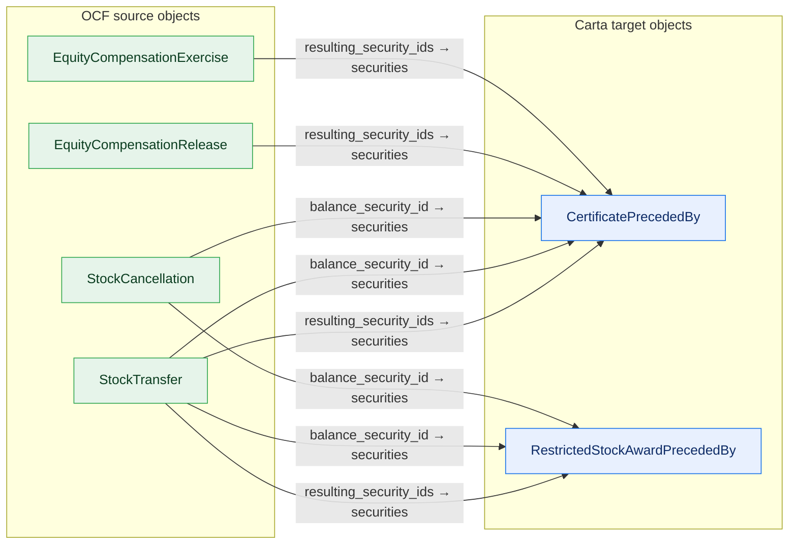
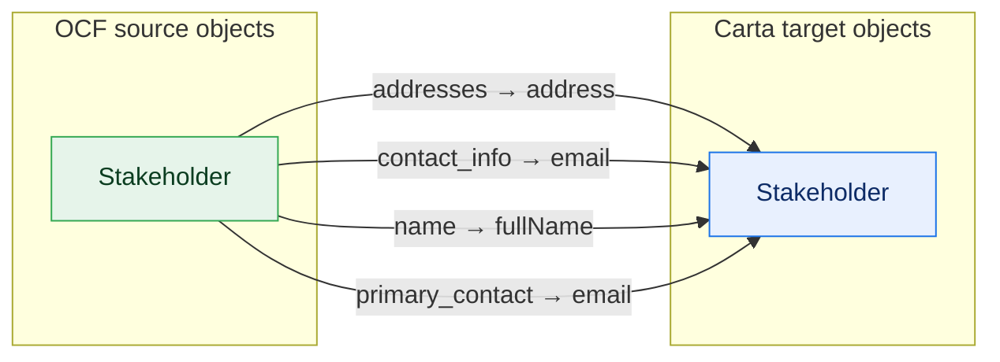
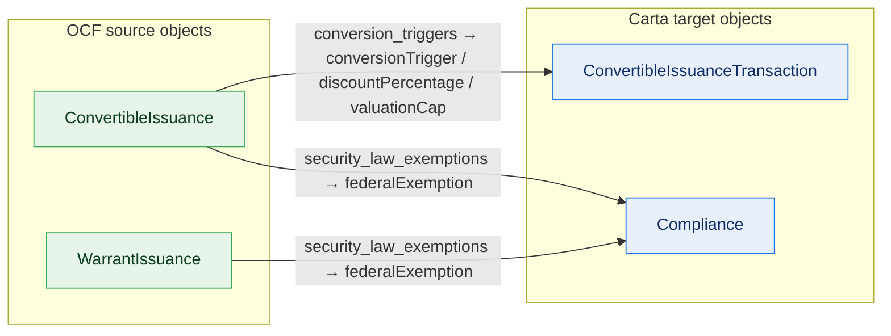
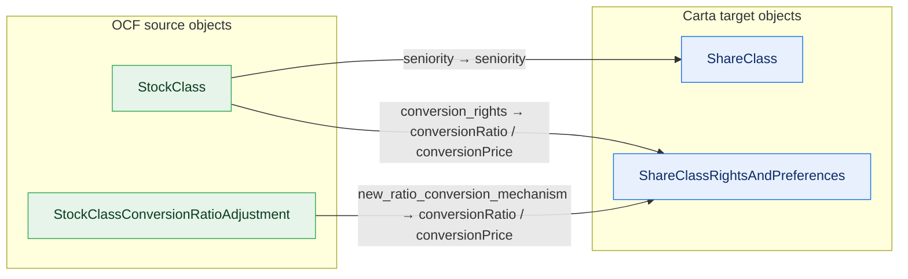
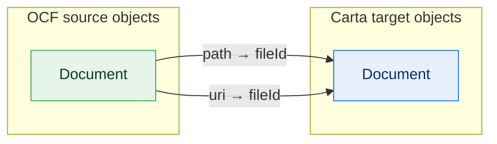
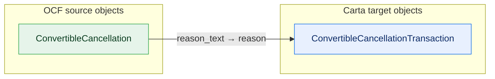
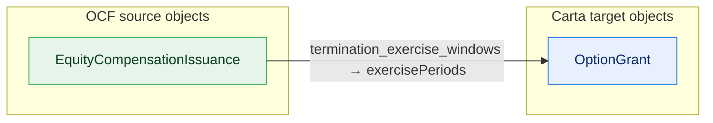
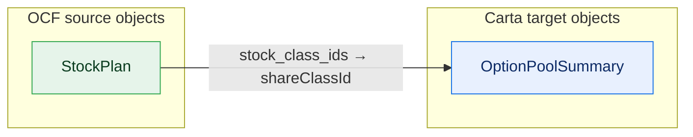
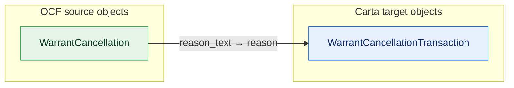
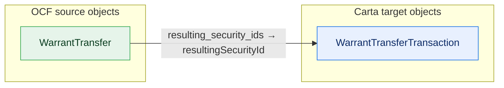

# OCF Core (rich) — upstream-OCF change candidates (generated)

GENERATED by scripts/derive-core-build — do not hand-edit; pinned by `core:check`.

rich-Core keeps these fields in **OCF's own shape**; the target can only hold a
narrowed form. So Core→target is lossy (expected), and a target-sourced Core doc
may not validate back as OCF without OCF relaxing a constraint. These are the
upstream-OCF-change candidates; OCF-*required* fields (**bold**) are the strongest.

## Overview — where rich-Core's lossy fields flow (26 fields, 15 OCF-required)

One diagram per connected group — objects that exchange properties (directly or via a
shared Carta target) are drawn together, unrelated mappings separately. Edge labels = field
count; convergence (several sources on one Carta node) marks the narrowest folds.

**→ CertificatePrecededBy, RestrictedStockAwardPrecededBy**

**→ Stakeholder**

**→ Compliance, ConvertibleIssuanceTransaction**

**→ ShareClass, ShareClassRightsAndPreferences**

**→ Document**

**→ ConvertibleCancellationTransaction**

**→ OptionGrant**

**→ OptionPoolSummary**

**→ WarrantCancellationTransaction**

**→ WarrantTransferTransaction**

## By OCF object — each field and its narrowed Carta home

### ConvertibleCancellation — in Core (admissible)

| field | OCF-req | variant(s) | flows to (Carta) | loss |
| --- | :---: | --- | --- | --- |
| reason_text | **yes** |  | ConvertibleCancellationTransaction.reason | heuristic (computed) |

### ConvertibleIssuance — in Core (admissible)

| field | OCF-req | variant(s) | flows to (Carta) | loss |
| --- | :---: | --- | --- | --- |
| conversion_triggers | **yes** |  | ConvertibleIssuanceTransaction.{conversionTrigger, discountPercentage, valuationCap} | heuristic (split) |
| security_law_exemptions | **yes** |  | Compliance.federalExemption | heuristic (computed) |

### Document — in Core (admissible)

| field | OCF-req | variant(s) | flows to (Carta) | loss |
| --- | :---: | --- | --- | --- |
| path |  |  | Document.fileId | heuristic (computed) |
| uri |  |  | Document.fileId | heuristic (computed) |

### EquityCompensationExercise — in Core (admissible)

| field | OCF-req | variant(s) | flows to (Carta) | loss |
| --- | :---: | --- | --- | --- |
| resulting_security_ids | **yes** | Option, Sar | CertificatePrecededBy.securities | heuristic (computed) |

### EquityCompensationIssuance — in Core (admissible)

| field | OCF-req | variant(s) | flows to (Carta) | loss |
| --- | :---: | --- | --- | --- |
| termination_exercise_windows | **yes** | Option | OptionGrant.exercisePeriods | existence-loss (array→scalar) |

### EquityCompensationRelease — in Core (admissible)

| field | OCF-req | variant(s) | flows to (Carta) | loss |
| --- | :---: | --- | --- | --- |
| resulting_security_ids | **yes** | Rsu | CertificatePrecededBy.securities | heuristic (computed) |

### Stakeholder — in Core (admissible)

| field | OCF-req | variant(s) | flows to (Carta) | loss |
| --- | :---: | --- | --- | --- |
| addresses |  |  | Stakeholder.address | existence-loss (array→scalar) |
| contact_info |  |  | Stakeholder.email | heuristic (combine) |
| name | **yes** |  | Stakeholder.fullName | existence-loss (structure→scalar) |
| primary_contact |  |  | Stakeholder.email | heuristic (combine) |

### StockCancellation — in Core (admissible)

| field | OCF-req | variant(s) | flows to (Carta) | loss |
| --- | :---: | --- | --- | --- |
| balance_security_id |  | Rsa | RestrictedStockAwardPrecededBy.securities | heuristic (computed) |
| balance_security_id |  | Default | CertificatePrecededBy.securities | heuristic (computed) |

### StockClass — in Core (admissible)

| field | OCF-req | variant(s) | flows to (Carta) | loss |
| --- | :---: | --- | --- | --- |
| conversion_rights |  |  | ShareClassRightsAndPreferences.{conversionRatio, conversionPrice} | heuristic (split) |
| seniority | **yes** |  | ShareClass.seniority | heuristic (computed) |

### StockClassConversionRatioAdjustment — in Core (admissible)

| field | OCF-req | variant(s) | flows to (Carta) | loss |
| --- | :---: | --- | --- | --- |
| new_ratio_conversion_mechanism | **yes** |  | ShareClassRightsAndPreferences.{conversionRatio, conversionPrice} | heuristic (split) |

### StockPlan — in Core (admissible)

| field | OCF-req | variant(s) | flows to (Carta) | loss |
| --- | :---: | --- | --- | --- |
| stock_class_ids |  |  | OptionPoolSummary.shareClassId | existence-loss (array→scalar) |

### StockTransfer — in Core (admissible)

| field | OCF-req | variant(s) | flows to (Carta) | loss |
| --- | :---: | --- | --- | --- |
| balance_security_id |  | Rsa | RestrictedStockAwardPrecededBy.securities | heuristic (computed) |
| balance_security_id |  | Default | CertificatePrecededBy.securities | heuristic (computed) |
| resulting_security_ids | **yes** | Rsa | RestrictedStockAwardPrecededBy.securities | heuristic (computed) |
| resulting_security_ids | **yes** | Default | CertificatePrecededBy.securities | heuristic (computed) |

### WarrantCancellation — in Core (admissible)

| field | OCF-req | variant(s) | flows to (Carta) | loss |
| --- | :---: | --- | --- | --- |
| reason_text | **yes** |  | WarrantCancellationTransaction.reason | heuristic (computed) |

### WarrantIssuance — in Core (admissible)

| field | OCF-req | variant(s) | flows to (Carta) | loss |
| --- | :---: | --- | --- | --- |
| security_law_exemptions | **yes** |  | Compliance.federalExemption | heuristic (computed) |

### WarrantTransfer — in Core (admissible)

| field | OCF-req | variant(s) | flows to (Carta) | loss |
| --- | :---: | --- | --- | --- |
| resulting_security_ids | **yes** |  | WarrantTransferTransaction.resultingSecurityId | existence-loss (array→scalar) |

## Flow map — Carta slot ← OCF sources (the narrowest are the strongest upstream asks)

- `CertificatePrecededBy.securities` ← 5: `EquityCompensationExercise.resulting_security_ids [Option, Sar]`, `EquityCompensationRelease.resulting_security_ids [Rsu]`, `StockCancellation.balance_security_id [Default]`, `StockTransfer.balance_security_id [Default]`, `StockTransfer.resulting_security_ids [Default]`
- `RestrictedStockAwardPrecededBy.securities` ← 3: `StockCancellation.balance_security_id [Rsa]`, `StockTransfer.balance_security_id [Rsa]`, `StockTransfer.resulting_security_ids [Rsa]`
- `Compliance.federalExemption` ← 2: `ConvertibleIssuance.security_law_exemptions`, `WarrantIssuance.security_law_exemptions`
- `Document.fileId` ← 2: `Document.path`, `Document.uri`
- `ShareClassRightsAndPreferences.conversionPrice` ← 2: `StockClass.conversion_rights`, `StockClassConversionRatioAdjustment.new_ratio_conversion_mechanism`
- `ShareClassRightsAndPreferences.conversionRatio` ← 2: `StockClass.conversion_rights`, `StockClassConversionRatioAdjustment.new_ratio_conversion_mechanism`
- `Stakeholder.email` ← 2: `Stakeholder.contact_info`, `Stakeholder.primary_contact`
- `ConvertibleCancellationTransaction.reason` ← 1: `ConvertibleCancellation.reason_text`
- `ConvertibleIssuanceTransaction.conversionTrigger` ← 1: `ConvertibleIssuance.conversion_triggers`
- `ConvertibleIssuanceTransaction.discountPercentage` ← 1: `ConvertibleIssuance.conversion_triggers`
- `ConvertibleIssuanceTransaction.valuationCap` ← 1: `ConvertibleIssuance.conversion_triggers`
- `OptionGrant.exercisePeriods` ← 1: `EquityCompensationIssuance.termination_exercise_windows [Option]`
- `OptionPoolSummary.shareClassId` ← 1: `StockPlan.stock_class_ids`
- `ShareClass.seniority` ← 1: `StockClass.seniority`
- `Stakeholder.address` ← 1: `Stakeholder.addresses`
- `Stakeholder.fullName` ← 1: `Stakeholder.name`
- `WarrantCancellationTransaction.reason` ← 1: `WarrantCancellation.reason_text`
- `WarrantTransferTransaction.resultingSecurityId` ← 1: `WarrantTransfer.resulting_security_ids`

