# OCF Core (rich) — upstream-OCF change candidates (generated)

GENERATED by scripts/derive-core-build — do not hand-edit; pinned by `core:check`.

rich-Core keeps these fields in **OCF's own shape**; the target can only hold a
narrowed form. So Core→target is lossy (expected), and a target-sourced Core doc
may not validate back as OCF without OCF relaxing a constraint. These are the
upstream-OCF-change candidates; OCF-*required* fields (**bold**) are the strongest.

## Overview — where rich-Core's lossy fields flow (39 fields, 27 OCF-required)

One diagram per OCF object — each polymorphic flavor (`Object [Variant]`) fully separate — with
the Carta objects it lands on. Edge labels = the property flowing; cross-object convergence
(several sources on one Carta slot) is in the flow map below.

**Stakeholder → Stakeholder**

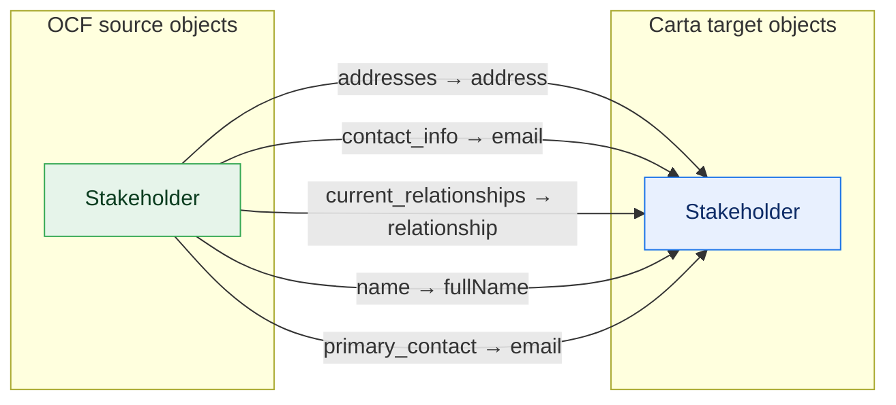

**StockClass → ShareClass, ShareClassRightsAndPreferences**

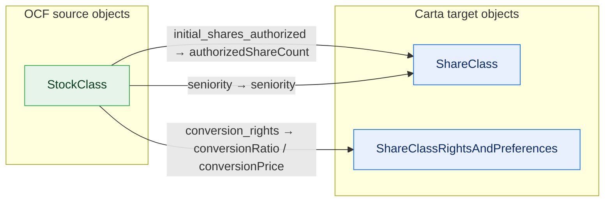

**ConvertibleIssuance → Compliance, ConvertibleIssuanceTransaction**

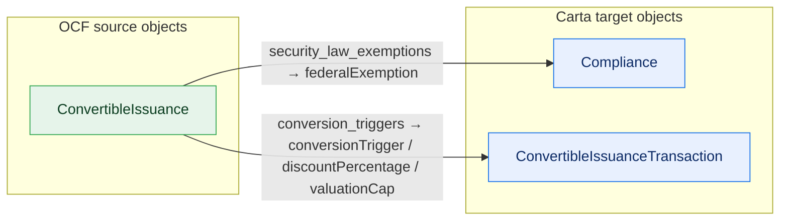

**Document → Document**

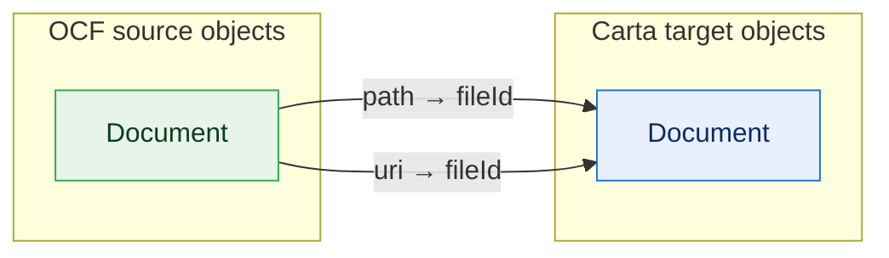

**EquityCompensationIssuance [Option] → Compliance, OptionGrant**

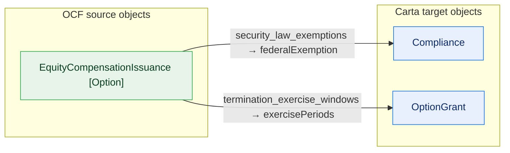

**StockCancellation [Default] → CertificateCancellationTransaction, CertificatePrecededBy**

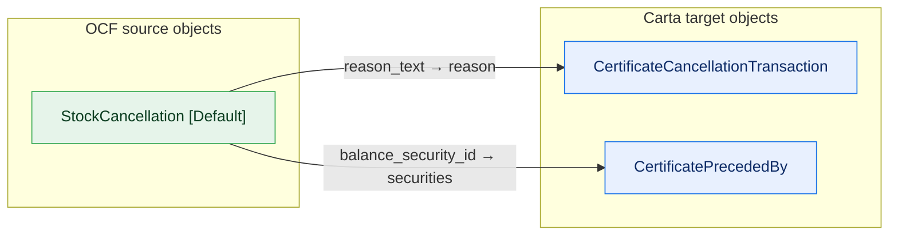

**StockCancellation [Rsa] → RestrictedStockAwardPrecededBy, RsaCancellationTransaction**

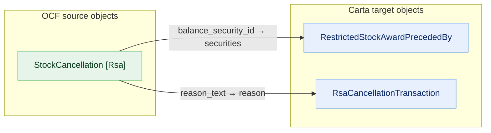

**StockTransfer [Default] → CertificatePrecededBy**

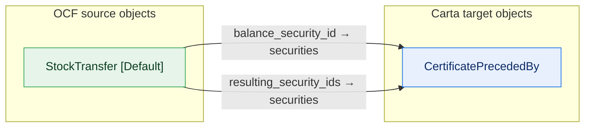

**StockTransfer [Rsa] → RestrictedStockAwardPrecededBy**

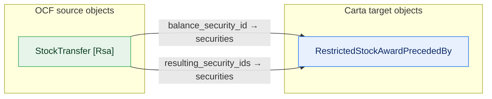

**ConvertibleCancellation → ConvertibleCancellationTransaction**

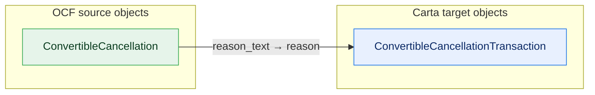

**EquityCompensationCancellation [Option] → OptionCancellationTransaction**

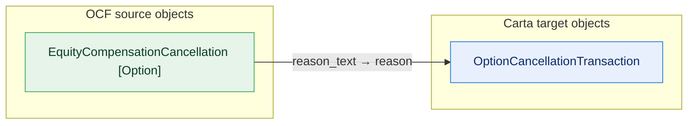

**EquityCompensationCancellation [Rsu] → RsuCancellationTransaction**


**EquityCompensationCancellation [Sar] → SarCancellationTransaction**

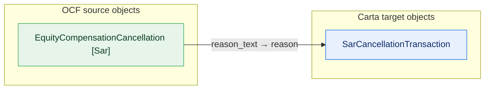

**EquityCompensationExercise [Option] → CertificatePrecededBy**

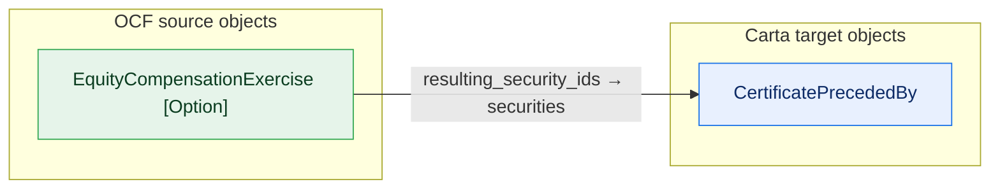

**EquityCompensationExercise [Sar] → CertificatePrecededBy**

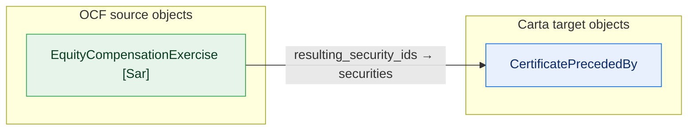

**EquityCompensationIssuance [Rsu] → Compliance**

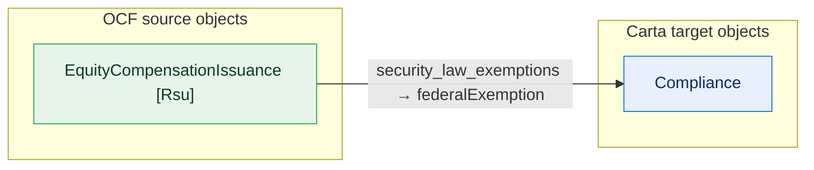

**EquityCompensationIssuance [Sar] → Compliance**


**EquityCompensationRelease [Rsu] → CertificatePrecededBy**

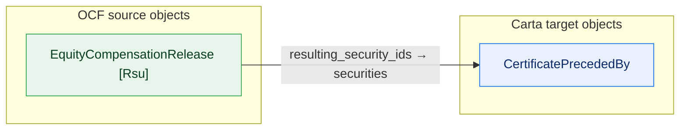

**StockClassConversionRatioAdjustment → ShareClassRightsAndPreferences**

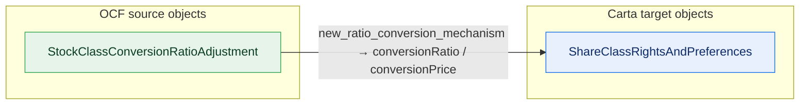

**StockIssuance [Default] → Compliance**

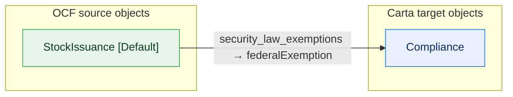

**StockIssuance [Rsa] → Compliance**

```mermaid
flowchart LR
  classDef adm fill:#e6f4ea,stroke:#34a853,color:#0b3d20;
  classDef notadm fill:#f1f3f4,stroke:#9aa0a6,color:#5f6368,stroke-dasharray:4 3;
  classDef carta fill:#e8f0fe,stroke:#1a73e8,color:#0d2b66;
  classDef sink fill:#fce8e6,stroke:#d93025,color:#5c0d06;
  subgraph SRC["OCF source objects"]
    direction TB
    o0["StockIssuance [Rsa]"]:::adm
  end
  subgraph TGT["Carta target objects"]
    direction TB
    t0["Compliance"]:::carta
  end
  o0 -->|"security_law_exemptions → federalExemption"| t0
```

**StockPlan → OptionPoolSummary**

```mermaid
flowchart LR
  classDef adm fill:#e6f4ea,stroke:#34a853,color:#0b3d20;
  classDef notadm fill:#f1f3f4,stroke:#9aa0a6,color:#5f6368,stroke-dasharray:4 3;
  classDef carta fill:#e8f0fe,stroke:#1a73e8,color:#0d2b66;
  classDef sink fill:#fce8e6,stroke:#d93025,color:#5c0d06;
  subgraph SRC["OCF source objects"]
    direction TB
    o0["StockPlan"]:::adm
  end
  subgraph TGT["Carta target objects"]
    direction TB
    t0["OptionPoolSummary"]:::carta
  end
  o0 -->|"stock_class_ids → shareClassId"| t0
```

**VestingTerms → VestingScheduleTemplate**

```mermaid
flowchart LR
  classDef adm fill:#e6f4ea,stroke:#34a853,color:#0b3d20;
  classDef notadm fill:#f1f3f4,stroke:#9aa0a6,color:#5f6368,stroke-dasharray:4 3;
  classDef carta fill:#e8f0fe,stroke:#1a73e8,color:#0d2b66;
  classDef sink fill:#fce8e6,stroke:#d93025,color:#5c0d06;
  subgraph SRC["OCF source objects"]
    direction TB
    o0["VestingTerms"]:::adm
  end
  subgraph TGT["Carta target objects"]
    direction TB
    t0["VestingScheduleTemplate"]:::carta
  end
  o0 -->|"statements → periods"| t0
```

**WarrantCancellation → WarrantCancellationTransaction**

```mermaid
flowchart LR
  classDef adm fill:#e6f4ea,stroke:#34a853,color:#0b3d20;
  classDef notadm fill:#f1f3f4,stroke:#9aa0a6,color:#5f6368,stroke-dasharray:4 3;
  classDef carta fill:#e8f0fe,stroke:#1a73e8,color:#0d2b66;
  classDef sink fill:#fce8e6,stroke:#d93025,color:#5c0d06;
  subgraph SRC["OCF source objects"]
    direction TB
    o0["WarrantCancellation"]:::adm
  end
  subgraph TGT["Carta target objects"]
    direction TB
    t0["WarrantCancellationTransaction"]:::carta
  end
  o0 -->|"reason_text → reason"| t0
```

**WarrantIssuance → Compliance**

```mermaid
flowchart LR
  classDef adm fill:#e6f4ea,stroke:#34a853,color:#0b3d20;
  classDef notadm fill:#f1f3f4,stroke:#9aa0a6,color:#5f6368,stroke-dasharray:4 3;
  classDef carta fill:#e8f0fe,stroke:#1a73e8,color:#0d2b66;
  classDef sink fill:#fce8e6,stroke:#d93025,color:#5c0d06;
  subgraph SRC["OCF source objects"]
    direction TB
    o0["WarrantIssuance"]:::adm
  end
  subgraph TGT["Carta target objects"]
    direction TB
    t0["Compliance"]:::carta
  end
  o0 -->|"security_law_exemptions → federalExemption"| t0
```

**WarrantTransfer → WarrantTransferTransaction**

```mermaid
flowchart LR
  classDef adm fill:#e6f4ea,stroke:#34a853,color:#0b3d20;
  classDef notadm fill:#f1f3f4,stroke:#9aa0a6,color:#5f6368,stroke-dasharray:4 3;
  classDef carta fill:#e8f0fe,stroke:#1a73e8,color:#0d2b66;
  classDef sink fill:#fce8e6,stroke:#d93025,color:#5c0d06;
  subgraph SRC["OCF source objects"]
    direction TB
    o0["WarrantTransfer"]:::adm
  end
  subgraph TGT["Carta target objects"]
    direction TB
    t0["WarrantTransferTransaction"]:::carta
  end
  o0 -->|"resulting_security_ids → resultingSecurityId"| t0
```


## By OCF object — each field and its narrowed Carta home

### ConvertibleCancellation — in Core (admissible)

| field | OCF-req | variant(s) | flows to (Carta) | loss |
| --- | :---: | --- | --- | --- |
| reason_text | **yes** |  | ConvertibleCancellationTransaction.reason | heuristic (computed) |

### ConvertibleIssuance — in Core (admissible)

| field | OCF-req | variant(s) | flows to (Carta) | loss |
| --- | :---: | --- | --- | --- |
| conversion_triggers | **yes** |  | ConvertibleIssuanceTransaction.{conversionTrigger, discountPercentage, valuationCap} | heuristic (split) |
| security_law_exemptions | **yes** |  | Compliance.federalExemption | heuristic (computed) |

### Document — in Core (admissible)

| field | OCF-req | variant(s) | flows to (Carta) | loss |
| --- | :---: | --- | --- | --- |
| path |  |  | Document.fileId | heuristic (computed) |
| uri |  |  | Document.fileId | heuristic (computed) |

### EquityCompensationCancellation — in Core (admissible)

| field | OCF-req | variant(s) | flows to (Carta) | loss |
| --- | :---: | --- | --- | --- |
| reason_text | **yes** | Option | OptionCancellationTransaction.reason | heuristic (computed) |
| reason_text | **yes** | Rsu | RsuCancellationTransaction.reason | heuristic (computed) |
| reason_text | **yes** | Sar | SarCancellationTransaction.reason | heuristic (computed) |

### EquityCompensationExercise — in Core (admissible)

| field | OCF-req | variant(s) | flows to (Carta) | loss |
| --- | :---: | --- | --- | --- |
| resulting_security_ids | **yes** | Option, Sar | CertificatePrecededBy.securities | heuristic (computed) |

### EquityCompensationIssuance — in Core (admissible)

| field | OCF-req | variant(s) | flows to (Carta) | loss |
| --- | :---: | --- | --- | --- |
| security_law_exemptions | **yes** | Option, Rsu, Sar | Compliance.federalExemption | heuristic (computed) |
| termination_exercise_windows | **yes** | Option | OptionGrant.exercisePeriods | existence-loss (select (first_termination_window)) |

### EquityCompensationRelease — in Core (admissible)

| field | OCF-req | variant(s) | flows to (Carta) | loss |
| --- | :---: | --- | --- | --- |
| resulting_security_ids | **yes** | Rsu | CertificatePrecededBy.securities | heuristic (computed) |

### Stakeholder — in Core (admissible)

| field | OCF-req | variant(s) | flows to (Carta) | loss |
| --- | :---: | --- | --- | --- |
| addresses |  |  | Stakeholder.address | existence-loss (select (first_address_country)) |
| contact_info |  |  | Stakeholder.email | heuristic (combine) |
| current_relationships |  |  | Stakeholder.relationship | existence-loss (array→scalar) |
| name | **yes** |  | Stakeholder.fullName | existence-loss (select (legal_name)) |
| primary_contact |  |  | Stakeholder.email | heuristic (combine) |

### StockCancellation — in Core (admissible)

| field | OCF-req | variant(s) | flows to (Carta) | loss |
| --- | :---: | --- | --- | --- |
| balance_security_id |  | Rsa | RestrictedStockAwardPrecededBy.securities | heuristic (computed) |
| balance_security_id |  | Default | CertificatePrecededBy.securities | heuristic (computed) |
| reason_text | **yes** | Rsa | RsaCancellationTransaction.reason | heuristic (computed) |
| reason_text | **yes** | Default | CertificateCancellationTransaction.reason | heuristic (computed) |

### StockClass — in Core (admissible)

| field | OCF-req | variant(s) | flows to (Carta) | loss |
| --- | :---: | --- | --- | --- |
| conversion_rights |  |  | ShareClassRightsAndPreferences.{conversionRatio, conversionPrice} | heuristic (sequential_transform (select first_ratio_conversion_right)) |
| initial_shares_authorized | **yes** |  | ShareClass.authorizedShareCount | partial (AuthorizedShares: unmapped members NOT APPLICABLE, UNLIMITED; Numeric: widening) |
| seniority | **yes** |  | ShareClass.seniority | heuristic (computed) |

### StockClassConversionRatioAdjustment — in Core (admissible)

| field | OCF-req | variant(s) | flows to (Carta) | loss |
| --- | :---: | --- | --- | --- |
| new_ratio_conversion_mechanism | **yes** |  | ShareClassRightsAndPreferences.{conversionRatio, conversionPrice} | heuristic (split) |

### StockIssuance — in Core (admissible)

| field | OCF-req | variant(s) | flows to (Carta) | loss |
| --- | :---: | --- | --- | --- |
| security_law_exemptions | **yes** | Rsa, Default | Compliance.federalExemption | heuristic (computed) |

### StockPlan — in Core (admissible)

| field | OCF-req | variant(s) | flows to (Carta) | loss |
| --- | :---: | --- | --- | --- |
| stock_class_ids |  |  | OptionPoolSummary.shareClassId | existence-loss (select (first_stock_class_id)) |

### StockTransfer — in Core (admissible)

| field | OCF-req | variant(s) | flows to (Carta) | loss |
| --- | :---: | --- | --- | --- |
| balance_security_id |  | Rsa | RestrictedStockAwardPrecededBy.securities | heuristic (computed) |
| balance_security_id |  | Default | CertificatePrecededBy.securities | heuristic (computed) |
| resulting_security_ids | **yes** | Rsa | RestrictedStockAwardPrecededBy.securities | heuristic (computed) |
| resulting_security_ids | **yes** | Default | CertificatePrecededBy.securities | heuristic (computed) |

### VestingTerms — in Core (admissible)

| field | OCF-req | variant(s) | flows to (Carta) | loss |
| --- | :---: | --- | --- | --- |
| statements | **yes** |  | VestingScheduleTemplate.periods | heuristic (items: VestingStatement drops schedule, event_condition (per type mapping)) |

### WarrantCancellation — in Core (admissible)

| field | OCF-req | variant(s) | flows to (Carta) | loss |
| --- | :---: | --- | --- | --- |
| reason_text | **yes** |  | WarrantCancellationTransaction.reason | heuristic (computed) |

### WarrantIssuance — in Core (admissible)

| field | OCF-req | variant(s) | flows to (Carta) | loss |
| --- | :---: | --- | --- | --- |
| security_law_exemptions | **yes** |  | Compliance.federalExemption | heuristic (computed) |

### WarrantTransfer — in Core (admissible)

| field | OCF-req | variant(s) | flows to (Carta) | loss |
| --- | :---: | --- | --- | --- |
| resulting_security_ids | **yes** |  | WarrantTransferTransaction.resultingSecurityId | existence-loss (select (first_resulting_security_id)) |

## Flow map — Carta slot ← OCF sources (the narrowest are the strongest upstream asks)

- `CertificatePrecededBy.securities` ← 5: `EquityCompensationExercise.resulting_security_ids [Option, Sar]`, `EquityCompensationRelease.resulting_security_ids [Rsu]`, `StockCancellation.balance_security_id [Default]`, `StockTransfer.balance_security_id [Default]`, `StockTransfer.resulting_security_ids [Default]`
- `Compliance.federalExemption` ← 4: `ConvertibleIssuance.security_law_exemptions`, `EquityCompensationIssuance.security_law_exemptions [Option, Rsu, Sar]`, `StockIssuance.security_law_exemptions [Rsa, Default]`, `WarrantIssuance.security_law_exemptions`
- `RestrictedStockAwardPrecededBy.securities` ← 3: `StockCancellation.balance_security_id [Rsa]`, `StockTransfer.balance_security_id [Rsa]`, `StockTransfer.resulting_security_ids [Rsa]`
- `Document.fileId` ← 2: `Document.path`, `Document.uri`
- `ShareClassRightsAndPreferences.conversionPrice` ← 2: `StockClass.conversion_rights`, `StockClassConversionRatioAdjustment.new_ratio_conversion_mechanism`
- `ShareClassRightsAndPreferences.conversionRatio` ← 2: `StockClass.conversion_rights`, `StockClassConversionRatioAdjustment.new_ratio_conversion_mechanism`
- `Stakeholder.email` ← 2: `Stakeholder.contact_info`, `Stakeholder.primary_contact`
- `CertificateCancellationTransaction.reason` ← 1: `StockCancellation.reason_text [Default]`
- `ConvertibleCancellationTransaction.reason` ← 1: `ConvertibleCancellation.reason_text`
- `ConvertibleIssuanceTransaction.conversionTrigger` ← 1: `ConvertibleIssuance.conversion_triggers`
- `ConvertibleIssuanceTransaction.discountPercentage` ← 1: `ConvertibleIssuance.conversion_triggers`
- `ConvertibleIssuanceTransaction.valuationCap` ← 1: `ConvertibleIssuance.conversion_triggers`
- `OptionCancellationTransaction.reason` ← 1: `EquityCompensationCancellation.reason_text [Option]`
- `OptionGrant.exercisePeriods` ← 1: `EquityCompensationIssuance.termination_exercise_windows [Option]`
- `OptionPoolSummary.shareClassId` ← 1: `StockPlan.stock_class_ids`
- `RsaCancellationTransaction.reason` ← 1: `StockCancellation.reason_text [Rsa]`
- `RsuCancellationTransaction.reason` ← 1: `EquityCompensationCancellation.reason_text [Rsu]`
- `SarCancellationTransaction.reason` ← 1: `EquityCompensationCancellation.reason_text [Sar]`
- `ShareClass.authorizedShareCount` ← 1: `StockClass.initial_shares_authorized`
- `ShareClass.seniority` ← 1: `StockClass.seniority`
- `Stakeholder.address` ← 1: `Stakeholder.addresses`
- `Stakeholder.fullName` ← 1: `Stakeholder.name`
- `Stakeholder.relationship` ← 1: `Stakeholder.current_relationships`
- `VestingScheduleTemplate.periods` ← 1: `VestingTerms.statements`
- `WarrantCancellationTransaction.reason` ← 1: `WarrantCancellation.reason_text`
- `WarrantTransferTransaction.resultingSecurityId` ← 1: `WarrantTransfer.resulting_security_ids`

