# OCF Core — gap report (R5, generated)

GENERATED by scripts/derive-core-build. (a) OCF richness with no Carta home,
per admissible entity, OCF-*required* casualties **bold**; (b) Carta inverse
coverage by slot and object-definition role.

## (a) OCF richness dropped on fold-down

One diagram per OCF object — each polymorphic flavor (`Object [Variant]`) fully separate:
`existence-loss` fields narrow onto a Carta object; `no-destination` fields have no home and
drop to that flavor's own `⌀ no Carta home` sink. Edge labels = field count.
(Reverse-edge `heuristic` lineage is the upstream report's.)

**Issuer**

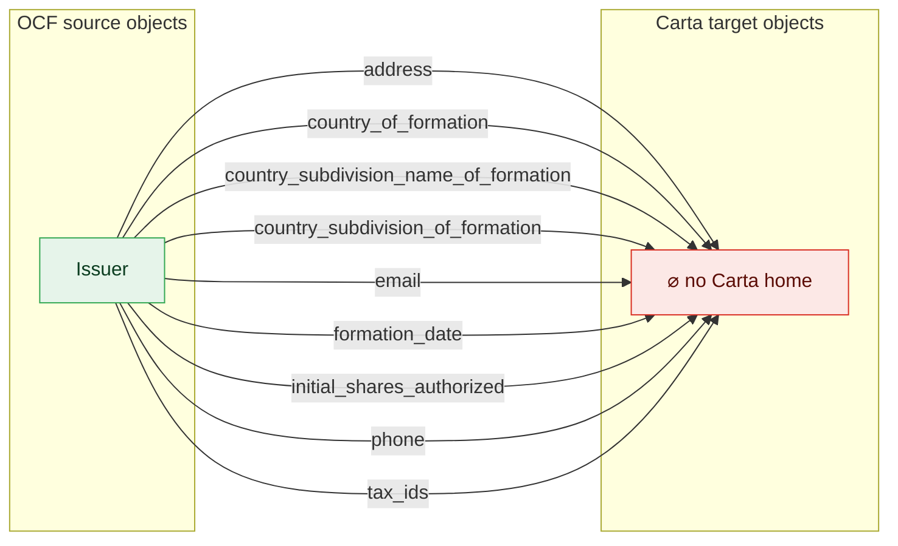

**ConvertibleConversion**

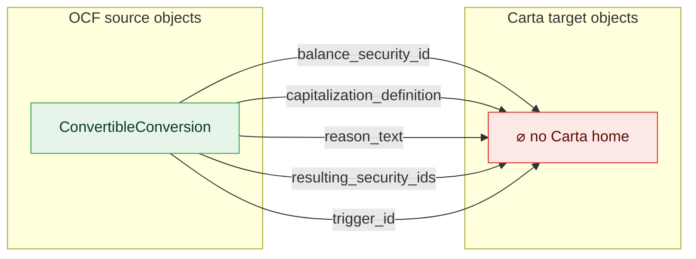

**ConvertibleIssuance**

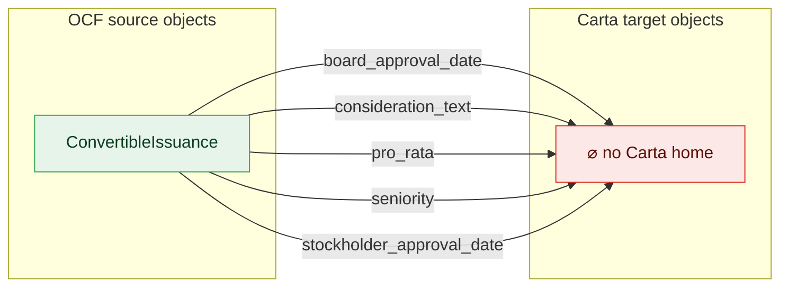

**Stakeholder → Stakeholder**

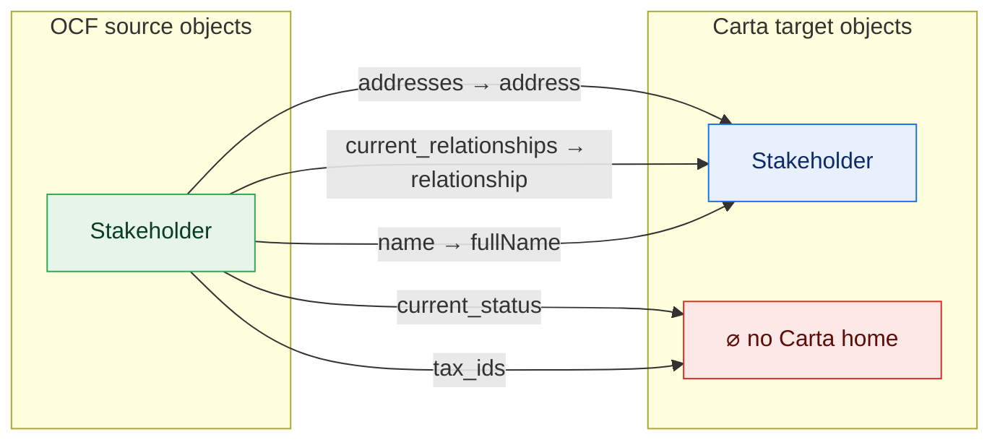

**Valuation**

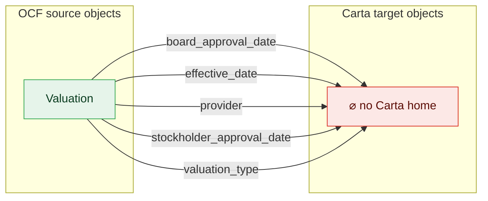

**StockClass → ShareClass**

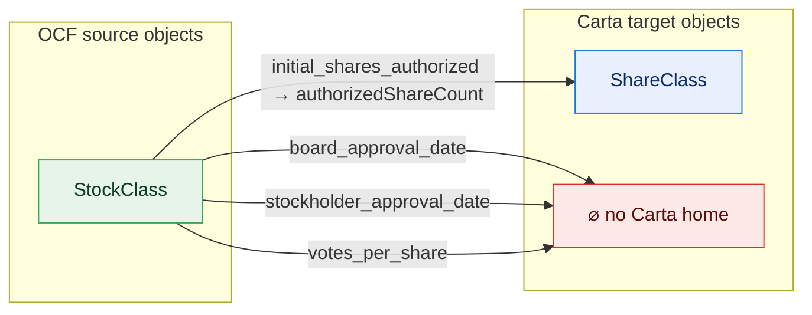

**StockPlan → OptionPoolSummary**

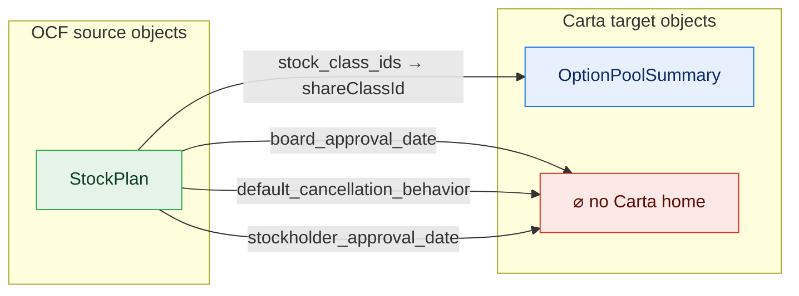

**StockClassAuthorizedSharesAdjustment**

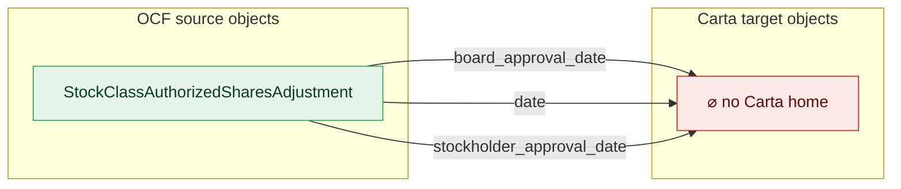

**WarrantTransfer → WarrantTransferTransaction**

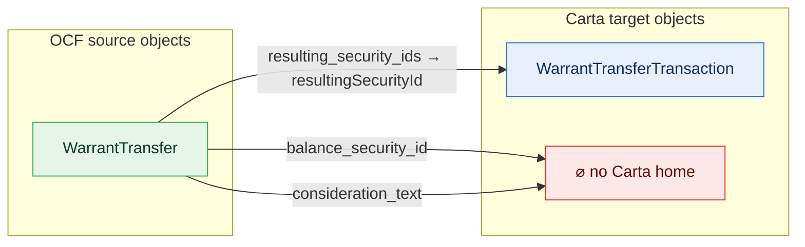

**EquityCompensationCancellation [Option]**

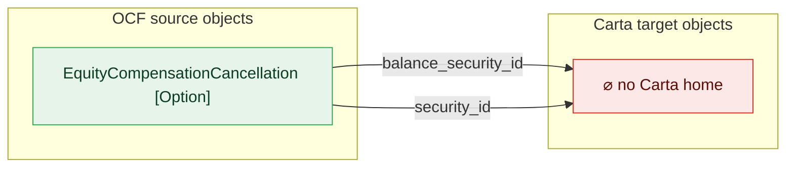

**EquityCompensationCancellation [Rsu]**


**EquityCompensationCancellation [Sar]**

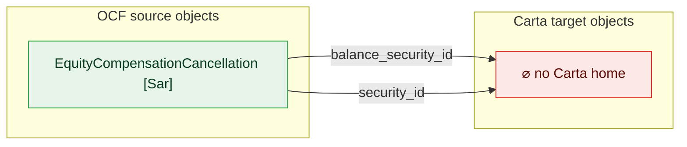

**EquityCompensationExercise [Option]**

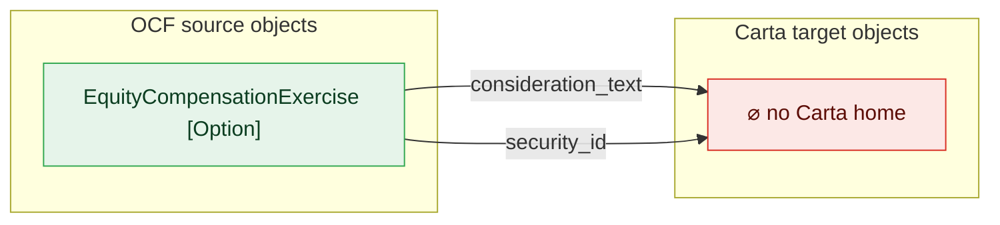

**EquityCompensationExercise [Sar]**

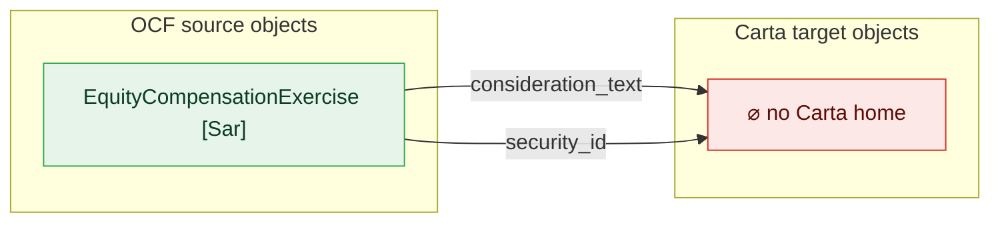

**EquityCompensationRelease [Rsu]**


**EquityCompensationRepricing [Option]**

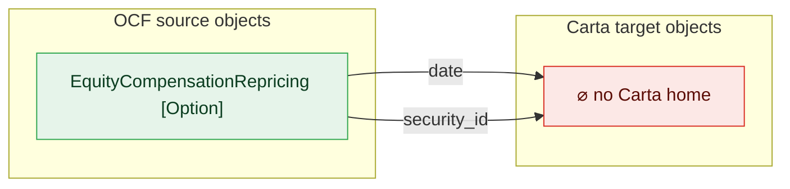

**EquityCompensationRepricing [Sar]**

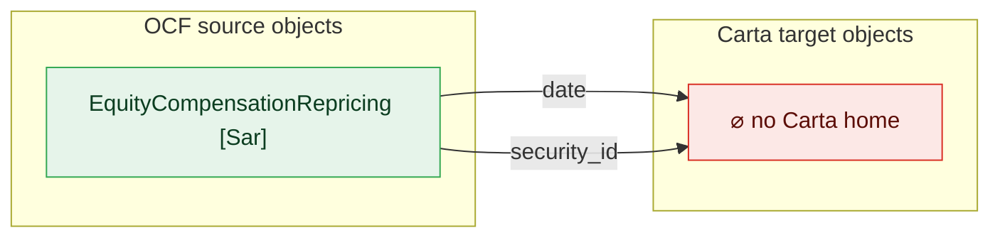

**StockTransfer [Default]**

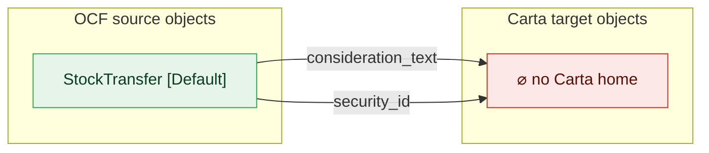

**StockTransfer [Rsa]**

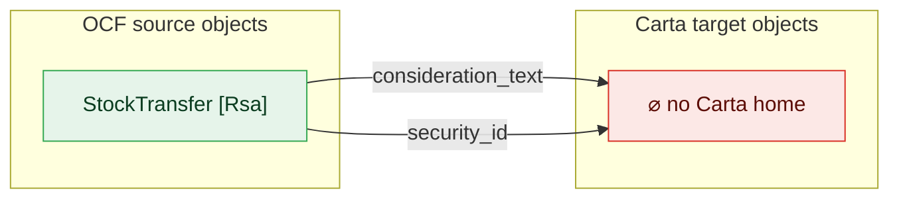

**WarrantCancellation**

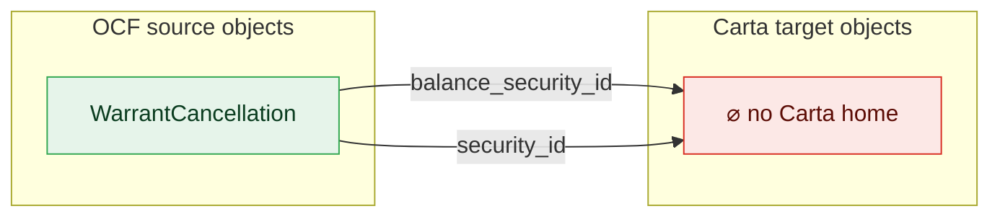

**ConvertibleCancellation**

```mermaid
flowchart LR
  classDef adm fill:#e6f4ea,stroke:#34a853,color:#0b3d20;
  classDef notadm fill:#f1f3f4,stroke:#9aa0a6,color:#5f6368,stroke-dasharray:4 3;
  classDef carta fill:#e8f0fe,stroke:#1a73e8,color:#0d2b66;
  classDef sink fill:#fce8e6,stroke:#d93025,color:#5c0d06;
  subgraph SRC["OCF source objects"]
    direction TB
    o0["ConvertibleCancellation"]:::adm
  end
  subgraph TGT["Carta target objects"]
    direction TB
    sink["⌀ no Carta home"]:::sink
  end
  o0 -->|"balance_security_id"| sink
```

**StakeholderRelationshipChangeEvent**

```mermaid
flowchart LR
  classDef adm fill:#e6f4ea,stroke:#34a853,color:#0b3d20;
  classDef notadm fill:#f1f3f4,stroke:#9aa0a6,color:#5f6368,stroke-dasharray:4 3;
  classDef carta fill:#e8f0fe,stroke:#1a73e8,color:#0d2b66;
  classDef sink fill:#fce8e6,stroke:#d93025,color:#5c0d06;
  subgraph SRC["OCF source objects"]
    direction TB
    o0["StakeholderRelationshipChangeEvent"]:::adm
  end
  subgraph TGT["Carta target objects"]
    direction TB
    sink["⌀ no Carta home"]:::sink
  end
  o0 -->|"date"| sink
```

**StockCancellation [Default]**

```mermaid
flowchart LR
  classDef adm fill:#e6f4ea,stroke:#34a853,color:#0b3d20;
  classDef notadm fill:#f1f3f4,stroke:#9aa0a6,color:#5f6368,stroke-dasharray:4 3;
  classDef carta fill:#e8f0fe,stroke:#1a73e8,color:#0d2b66;
  classDef sink fill:#fce8e6,stroke:#d93025,color:#5c0d06;
  subgraph SRC["OCF source objects"]
    direction TB
    o0["StockCancellation [Default]"]:::adm
  end
  subgraph TGT["Carta target objects"]
    direction TB
    sink["⌀ no Carta home"]:::sink
  end
  o0 -->|"security_id"| sink
```

**StockCancellation [Rsa]**

```mermaid
flowchart LR
  classDef adm fill:#e6f4ea,stroke:#34a853,color:#0b3d20;
  classDef notadm fill:#f1f3f4,stroke:#9aa0a6,color:#5f6368,stroke-dasharray:4 3;
  classDef carta fill:#e8f0fe,stroke:#1a73e8,color:#0d2b66;
  classDef sink fill:#fce8e6,stroke:#d93025,color:#5c0d06;
  subgraph SRC["OCF source objects"]
    direction TB
    o0["StockCancellation [Rsa]"]:::adm
  end
  subgraph TGT["Carta target objects"]
    direction TB
    sink["⌀ no Carta home"]:::sink
  end
  o0 -->|"security_id"| sink
```


### ConvertibleCancellation
- balance_security_id: no-destination — kind unmappable

### ConvertibleConversion
- balance_security_id: no-destination — kind unmappable
- capitalization_definition: no-destination — kind unmappable
- **reason_text** (OCF-required): no-destination — kind unmappable
- **resulting_security_ids** (OCF-required): no-destination — kind unmappable
- **trigger_id** (OCF-required): no-destination — kind unmappable

### ConvertibleIssuance
- board_approval_date: no-destination — kind unmappable
- consideration_text: no-destination — kind unmappable
- pro_rata: no-destination — kind unmappable
- **seniority** (OCF-required): no-destination — kind unmappable
- stockholder_approval_date: no-destination — kind unmappable

### EquityCompensationCancellation [Option]
- balance_security_id: no-destination — kind unmappable
- **security_id** (OCF-required): no-destination — kind unmappable

### EquityCompensationCancellation [Rsu]
- balance_security_id: no-destination — kind unmappable
- **security_id** (OCF-required): no-destination — kind unmappable

### EquityCompensationCancellation [Sar]
- balance_security_id: no-destination — kind unmappable
- **security_id** (OCF-required): no-destination — kind unmappable

### EquityCompensationExercise [Option]
- consideration_text: no-destination — kind unmappable
- **security_id** (OCF-required): no-destination — kind unmappable

### EquityCompensationExercise [Sar]
- consideration_text: no-destination — kind unmappable
- **security_id** (OCF-required): no-destination — kind unmappable

### EquityCompensationRelease [Rsu]
- consideration_text: no-destination — kind unmappable
- **security_id** (OCF-required): no-destination — kind unmappable

### EquityCompensationRepricing [Option]
- **date** (OCF-required): no-destination — kind unmappable
- **security_id** (OCF-required): no-destination — kind unmappable

### EquityCompensationRepricing [Sar]
- **date** (OCF-required): no-destination — kind unmappable
- **security_id** (OCF-required): no-destination — kind unmappable

### Issuer
- address: no-destination — kind unmappable
- **country_of_formation** (OCF-required): no-destination — kind unmappable
- country_subdivision_name_of_formation: no-destination — kind unmappable
- country_subdivision_of_formation: no-destination — kind unmappable
- email: no-destination — kind unmappable
- **formation_date** (OCF-required): no-destination — kind unmappable
- initial_shares_authorized: no-destination — kind unmappable
- phone: no-destination — kind unmappable
- tax_ids: no-destination — kind unmappable

### Stakeholder
- addresses: existence-loss — select (first_address_country)
- current_relationships: existence-loss — array→scalar
- current_status: no-destination — kind unmappable
- **name** (OCF-required): existence-loss — select (legal_name)
- tax_ids: no-destination — kind unmappable

### StakeholderRelationshipChangeEvent
- **date** (OCF-required): no-destination — kind unmappable

### StockCancellation [Default]
- **security_id** (OCF-required): no-destination — kind unmappable

### StockCancellation [Rsa]
- **security_id** (OCF-required): no-destination — kind unmappable

### StockClass
- board_approval_date: no-destination — kind unmappable
- **initial_shares_authorized** (OCF-required): partial — AuthorizedShares: unmapped members NOT APPLICABLE, UNLIMITED; Numeric: widening
- stockholder_approval_date: no-destination — kind unmappable
- **votes_per_share** (OCF-required): no-destination — kind unmappable

### StockClassAuthorizedSharesAdjustment
- board_approval_date: no-destination — kind unmappable
- **date** (OCF-required): no-destination — kind unmappable
- stockholder_approval_date: no-destination — kind unmappable

### StockPlan
- board_approval_date: no-destination — kind unmappable
- default_cancellation_behavior: no-destination — kind unmappable
- stock_class_ids: existence-loss — select (first_stock_class_id)
- stockholder_approval_date: no-destination — kind unmappable

### StockTransfer [Default]
- consideration_text: no-destination — kind unmappable
- **security_id** (OCF-required): no-destination — kind unmappable

### StockTransfer [Rsa]
- consideration_text: no-destination — kind unmappable
- **security_id** (OCF-required): no-destination — kind unmappable

### Valuation
- board_approval_date: no-destination — kind unmappable
- **effective_date** (OCF-required): no-destination — kind unmappable
- provider: no-destination — kind unmappable
- stockholder_approval_date: no-destination — kind unmappable
- **valuation_type** (OCF-required): no-destination — kind unmappable

### WarrantCancellation
- balance_security_id: no-destination — kind unmappable
- **security_id** (OCF-required): no-destination — kind unmappable

### WarrantTransfer
- balance_security_id: no-destination — kind unmappable
- consideration_text: no-destination — kind unmappable
- **resulting_security_ids** (OCF-required): existence-loss — select (first_resulting_security_id)

## (b) Carta inverse coverage by object definition

The inverse ledger separates executable slot coverage, reusable type mappings,
structural `$ref` reachability, deferred extraction, expected derived objects,
curated value-type roles, alternate/unreachable shapes, and actionable gap candidates.
A missing root target is therefore not automatically a missing concept.

| Carta-side dimension | count |
| --- | ---: |
| Carta `$defs` total | 139 |
| object-like Carta `$defs` | 86 |
| object slots | 588 |
| defs with direct executable coverage | 39 |
| direct executable slots | 146 |
| defs with type-only slots | 7 |
| defs with only type-only coverage | 6 |
| reusable type-only slots | 34 |
| implicit constant slots | 3 |
| deferred slots | 4 |
| empty slots | 401 |
| nested-covered defs | 9 |
| expected report roll-ups | 17 |
| curated value-type policy entries | 7 |
| object-like value-type/non-target defs | 1 |
| alternate/unreachable shapes | 3 |
| vendor-only family candidates | 6 |
| workflow/data-shape gap candidates | 4 |
| actionable inverse gap candidates | 11 |
| unresolved role-review candidates | 0 |

### Object-definition role accounting

Primary definition role is mutually exclusive and accounts for every object-like Carta definition.
Slot-level evidence can overlap: for example, a direct definition may also contain deferred or
type-only slots.

| primary role | object-like defs |
| --- | ---: |
| direct executable | 39 |
| type-only | 6 |
| deferred | 0 |
| nested-covered | 9 |
| value-type / non-target | 1 |
| report roll-up | 17 |
| alternate shape | 3 |
| vendor family | 6 |
| workflow/data gap | 4 |
| actionable gap | 1 |
| review required | 0 |
| **total** | **86** |

### Definitions without direct executable coverage (41)

These are definition-level diagnostics. Use the status and reason columns to distinguish
nested coverage, derived containers, alternate schema shapes, and actual inverse candidates.

| Carta `$def` | status | structural parent(s) | reason |
| --- | --- | --- | --- |
| `#/$defs/Acceleration` | alternate | — | Child of the unreachable Carta Vesting shape. |
| `#/$defs/CapitalizationTableSummary` | report-rollup | — | Carta read-model aggregate; OCF records the underlying leaf facts instead. |
| `#/$defs/CertificateTransactionItem` | report-rollup | — | Carta read-model aggregate; OCF records the underlying leaf facts instead. |
| `#/$defs/Corporation` | alternate | — | Unused alternate issuer shape; OCF Issuer maps to Carta Issuer. |
| `#/$defs/Date` | value-type | — | Partial-date value helper; OCF Date maps to the Iso8601 date wrappers. |
| `#/$defs/DividendDetails` | nested-covered | ShareClassDividendDetails | — |
| `#/$defs/Exercise` | nested-covered | OptionGrant | — |
| `#/$defs/Interest` | vendor-family | — | Carta profits-interest security family has no OCF source object. |
| `#/$defs/Jurisdiction` | workflow-gap | — | Carta tax-withholding jurisdiction; OCF address/exemption jurisdictions are different concepts. |
| `#/$defs/NoteBlockSummary` | report-rollup | — | Carta read-model aggregate; OCF records the underlying leaf facts instead. |
| `#/$defs/OptionExercise` | workflow-gap | — | Carta exercise-request workflow object; OCF maps the realized transaction instead. |
| `#/$defs/OptionExerciseMoneyMovement` | workflow-gap | — | Nested Carta exercise-funding workflow data has no OCF source. |
| `#/$defs/OptionExerciseTaxWithholdingLineItem` | workflow-gap | — | Nested Carta tax-withholding workflow data has no OCF source. |
| `#/$defs/OptionGrantDocuments` | gap | — | Carta grant-document relationship has no OCF source relationship. |
| `#/$defs/OptionTransactionItem` | report-rollup | — | Carta read-model aggregate; OCF records the underlying leaf facts instead. |
| `#/$defs/PerformanceCondition` | nested-covered | VestingPeriod | — |
| `#/$defs/PhantomCancellationTransaction` | vendor-family | — | Carta phantom-equity transaction family has no OCF route. |
| `#/$defs/PhantomIssuanceTransaction` | vendor-family | — | Carta phantom-equity transaction family has no OCF route. |
| `#/$defs/PhantomTransactionItem` | report-rollup | — | Carta read-model aggregate; OCF records the underlying leaf facts instead. |
| `#/$defs/PiuCancellationTransaction` | vendor-family | — | Carta profits-interest-unit transaction family has no OCF route. |
| `#/$defs/PiuIssuanceTransaction` | vendor-family | — | Carta profits-interest-unit transaction family has no OCF route. |
| `#/$defs/PiuTransactionItem` | report-rollup | — | Carta read-model aggregate; OCF records the underlying leaf facts instead. |
| `#/$defs/PrecededBySecurity` | nested-covered | CertificatePrecededBy, RestrictedStockAwardPrecededBy | — |
| `#/$defs/PreferredShareClassDetails` | nested-covered | ShareClass | — |
| `#/$defs/RestrictedStockAwardVestingEvent` | nested-covered | RestrictedStockAward | — |
| `#/$defs/RestrictedStockUnitVestingEvent` | nested-covered | RestrictedStockUnit | — |
| `#/$defs/RsaTransactionItem` | report-rollup | — | Carta read-model aggregate; OCF records the underlying leaf facts instead. |
| `#/$defs/RsuTransactionItem` | report-rollup | — | Carta read-model aggregate; OCF records the underlying leaf facts instead. |
| `#/$defs/SarTransactionItem` | report-rollup | — | Carta read-model aggregate; OCF records the underlying leaf facts instead. |
| `#/$defs/ShareClassDividendDetails` | nested-covered | PreferredShareClassDetails | — |
| `#/$defs/ShareClassSummary` | report-rollup | — | Carta read-model aggregate; OCF records the underlying leaf facts instead. |
| `#/$defs/StakeholderCapitalizationTableSummary` | report-rollup | — | Carta read-model aggregate; OCF records the underlying leaf facts instead. |
| `#/$defs/StakeholderGroup` | report-rollup | — | Carta read-model aggregate; OCF records the underlying leaf facts instead. |
| `#/$defs/StakeholderNoteBlockSummary` | report-rollup | — | Carta read-model aggregate; OCF records the underlying leaf facts instead. |
| `#/$defs/StakeholderOptionPoolSummary` | report-rollup | — | Carta read-model aggregate; OCF records the underlying leaf facts instead. |
| `#/$defs/StakeholderShareClassSummary` | report-rollup | — | Carta read-model aggregate; OCF records the underlying leaf facts instead. |
| `#/$defs/StakeholderWarrantBlockSummary` | report-rollup | — | Carta read-model aggregate; OCF records the underlying leaf facts instead. |
| `#/$defs/ThresholdDetails` | vendor-family | — | Nested profits-interest threshold details have no OCF source. |
| `#/$defs/Vesting` | alternate | — | Unreachable option-grant vesting shape; mapped OCF vesting uses schedule/event defs. |
| `#/$defs/VestingSchedule` | nested-covered | OptionGrant, RestrictedStockAward, RestrictedStockUnit | — |
| `#/$defs/WarrantBlockSummary` | report-rollup | — | Carta read-model aggregate; OCF records the underlying leaf facts instead. |

### Reusable and schema-aware type correspondences (8 selected examples)

These rows explain why a source-side complex/scalar type may have no same-named Carta
`$def`: the actual destination can be a wrapped scalar or a context-specific property.

| OCF type | Carta type/shape | evidence edges |
| --- | --- | ---: |
| `Address` | `StakeholderAddress` | 2 |
| `ContactInfo` | `PointOfContact` | 2 |
| `ContactInfoWithoutName` | `PointOfContact` | 1 |
| `Date` | `Iso8601CompleteCalendarDate` | 9 |
| `Date` | `Iso8601CompleteCalendarDateTime` | 27 |
| `Monetary` | `Decimal` | 1 |
| `Monetary` | `Iso4217CurrencyAlphaCode` | 1 |
| `Monetary` | `Money` | 16 |

### Actionable inverse candidates

These are Carta capabilities with no current executable OCF source edge after the
role policy excludes expected roll-ups and alternate schema shapes.

| Carta `$def` | disposition | reason |
| --- | --- | --- |
| `#/$defs/Interest` | vendor-family | Carta profits-interest security family has no OCF source object. |
| `#/$defs/Jurisdiction` | workflow-gap | Carta tax-withholding jurisdiction; OCF address/exemption jurisdictions are different concepts. |
| `#/$defs/OptionExercise` | workflow-gap | Carta exercise-request workflow object; OCF maps the realized transaction instead. |
| `#/$defs/OptionExerciseMoneyMovement` | workflow-gap | Nested Carta exercise-funding workflow data has no OCF source. |
| `#/$defs/OptionExerciseTaxWithholdingLineItem` | workflow-gap | Nested Carta tax-withholding workflow data has no OCF source. |
| `#/$defs/OptionGrantDocuments` | gap | Carta grant-document relationship has no OCF source relationship. |
| `#/$defs/PhantomCancellationTransaction` | vendor-family | Carta phantom-equity transaction family has no OCF route. |
| `#/$defs/PhantomIssuanceTransaction` | vendor-family | Carta phantom-equity transaction family has no OCF route. |
| `#/$defs/PiuCancellationTransaction` | vendor-family | Carta profits-interest-unit transaction family has no OCF route. |
| `#/$defs/PiuIssuanceTransaction` | vendor-family | Carta profits-interest-unit transaction family has no OCF route. |
| `#/$defs/ThresholdDetails` | vendor-family | Nested profits-interest threshold details have no OCF source. |

