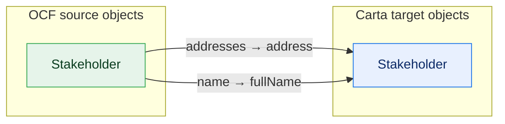
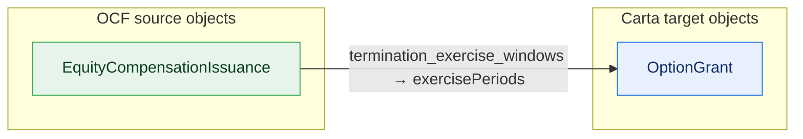
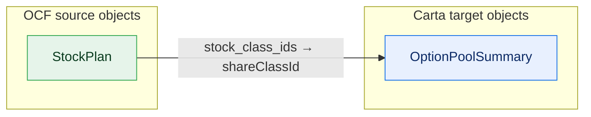
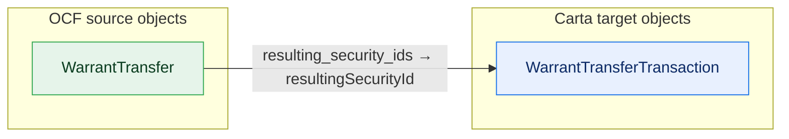

# OCF Core — gap report (R5, generated)

GENERATED by scripts/derive-core-build. (a) OCF richness with no Carta home,
per admissible entity, OCF-*required* casualties **bold**; (b) Carta object
types no green mapping writes to.

## (a) OCF richness dropped on fold-down

One diagram per connected group of objects that share a (lossy) Carta destination:
`existence-loss` fields narrow onto a Carta object; `no-destination` fields have no home and
are collected into one final `⌀ no Carta home` diagram. Edge labels = field count.
(Reverse-edge `heuristic` lineage is the upstream report's.)

**→ Stakeholder**

**→ OptionGrant**

**→ OptionPoolSummary**

**→ WarrantTransferTransaction**

**→ ⌀ no Carta home**

```mermaid
flowchart LR
  classDef adm fill:#e6f4ea,stroke:#34a853,color:#0b3d20;
  classDef notadm fill:#f1f3f4,stroke:#9aa0a6,color:#5f6368,stroke-dasharray:4 3;
  classDef carta fill:#e8f0fe,stroke:#1a73e8,color:#0d2b66;
  classDef sink fill:#fce8e6,stroke:#d93025,color:#5c0d06;
  subgraph SRC["OCF source objects"]
    direction TB
    o0["ConvertibleCancellation"]:::adm
    o1["ConvertibleConversion"]:::adm
    o2["ConvertibleIssuance"]:::adm
    o3["EquityCompensationCancellation"]:::adm
    o4["EquityCompensationExercise"]:::adm
    o5["EquityCompensationIssuance"]:::adm
    o6["EquityCompensationRelease"]:::adm
    o7["EquityCompensationRepricing"]:::adm
    o8["Issuer"]:::adm
    o9["Stakeholder"]:::adm
    o10["StakeholderRelationshipChangeEvent"]:::adm
    o11["StockCancellation"]:::adm
    o12["StockClass"]:::adm
    o13["StockClassAuthorizedSharesAdjustment"]:::adm
    o14["StockIssuance"]:::adm
    o15["StockPlan"]:::adm
    o16["Valuation"]:::adm
    o17["WarrantCancellation"]:::adm
    o18["WarrantIssuance"]:::adm
    o19["WarrantTransfer"]:::adm
  end
  subgraph TGT["Carta target objects"]
    direction TB
    sink["⌀ no Carta home"]:::sink
  end
  o0 -->|"balance_security_id"| sink
  o1 -->|"balance_security_id"| sink
  o1 -->|"capitalization_definition"| sink
  o1 -->|"reason_text"| sink
  o1 -->|"resulting_security_ids"| sink
  o1 -->|"trigger_id"| sink
  o2 -->|"board_approval_date"| sink
  o2 -->|"consideration_text"| sink
  o2 -->|"pro_rata"| sink
  o2 -->|"seniority"| sink
  o2 -->|"stockholder_approval_date"| sink
  o3 -->|"balance_security_id"| sink
  o3 -->|"reason_text"| sink
  o3 -->|"security_id"| sink
  o4 -->|"consideration_text"| sink
  o4 -->|"security_id"| sink
  o5 -->|"base_price"| sink
  o5 -->|"board_approval_date"| sink
  o5 -->|"compensation_type"| sink
  o5 -->|"consideration_text"| sink
  o5 -->|"custom_id"| sink
  o5 -->|"early_exercisable"| sink
  o5 -->|"exercise_price"| sink
  o5 -->|"expiration_date"| sink
  o5 -->|"option_grant_type"| sink
  o5 -->|"security_id"| sink
  o5 -->|"security_law_exemptions"| sink
  o5 -->|"stakeholder_id"| sink
  o5 -->|"stockholder_approval_date"| sink
  o5 -->|"termination_exercise_windows"| sink
  o5 -->|"vesting_start_date"| sink
  o5 -->|"vestings"| sink
  o6 -->|"consideration_text"| sink
  o6 -->|"security_id"| sink
  o7 -->|"date"| sink
  o7 -->|"security_id"| sink
  o8 -->|"address"| sink
  o8 -->|"country_of_formation"| sink
  o8 -->|"country_subdivision_name_of_formation"| sink
  o8 -->|"country_subdivision_of_formation"| sink
  o8 -->|"email"| sink
  o8 -->|"formation_date"| sink
  o8 -->|"initial_shares_authorized"| sink
  o8 -->|"phone"| sink
  o8 -->|"tax_ids"| sink
  o9 -->|"current_status"| sink
  o9 -->|"tax_ids"| sink
  o10 -->|"date"| sink
  o11 -->|"reason_text"| sink
  o11 -->|"security_id"| sink
  o12 -->|"board_approval_date"| sink
  o12 -->|"stockholder_approval_date"| sink
  o12 -->|"votes_per_share"| sink
  o13 -->|"board_approval_date"| sink
  o13 -->|"date"| sink
  o13 -->|"stockholder_approval_date"| sink
  o14 -->|"board_approval_date"| sink
  o14 -->|"consideration_text"| sink
  o14 -->|"issuance_type"| sink
  o14 -->|"security_law_exemptions"| sink
  o14 -->|"share_numbers_issued"| sink
  o14 -->|"stock_legend_ids"| sink
  o14 -->|"stockholder_approval_date"| sink
  o14 -->|"vestings"| sink
  o15 -->|"board_approval_date"| sink
  o15 -->|"default_cancellation_behavior"| sink
  o15 -->|"stockholder_approval_date"| sink
  o16 -->|"board_approval_date"| sink
  o16 -->|"effective_date"| sink
  o16 -->|"provider"| sink
  o16 -->|"stockholder_approval_date"| sink
  o16 -->|"valuation_type"| sink
  o17 -->|"balance_security_id"| sink
  o17 -->|"security_id"| sink
  o18 -->|"board_approval_date"| sink
  o18 -->|"consideration_text"| sink
  o18 -->|"exercise_triggers"| sink
  o18 -->|"quantity_source"| sink
  o18 -->|"stockholder_approval_date"| sink
  o18 -->|"vestings"| sink
  o19 -->|"balance_security_id"| sink
  o19 -->|"consideration_text"| sink
```

### ConvertibleCancellation
- balance_security_id: no-destination — kind unmappable

### ConvertibleConversion
- balance_security_id: no-destination — kind unmappable
- capitalization_definition: no-destination — kind unmappable
- **reason_text** (OCF-required): no-destination — kind unmappable
- **resulting_security_ids** (OCF-required): no-destination — kind unmappable
- **trigger_id** (OCF-required): no-destination — kind unmappable

### ConvertibleIssuance
- board_approval_date: no-destination — kind unmappable
- consideration_text: no-destination — kind unmappable
- pro_rata: no-destination — kind unmappable
- **seniority** (OCF-required): no-destination — kind unmappable
- stockholder_approval_date: no-destination — kind unmappable

### EquityCompensationCancellation [Option]
- balance_security_id: no-destination — kind unmappable
- **reason_text** (OCF-required): no-destination — kind unmappable
- **security_id** (OCF-required): no-destination — kind unmappable

### EquityCompensationCancellation [Rsu]
- balance_security_id: no-destination — kind unmappable
- **reason_text** (OCF-required): no-destination — kind unmappable
- **security_id** (OCF-required): no-destination — kind unmappable

### EquityCompensationCancellation [Sar]
- balance_security_id: no-destination — kind unmappable
- **reason_text** (OCF-required): no-destination — kind unmappable
- **security_id** (OCF-required): no-destination — kind unmappable

### EquityCompensationExercise [Option]
- consideration_text: no-destination — kind unmappable
- **security_id** (OCF-required): no-destination — kind unmappable

### EquityCompensationExercise [Sar]
- consideration_text: no-destination — kind unmappable
- **security_id** (OCF-required): no-destination — kind unmappable

### EquityCompensationIssuance [Option]
- base_price: no-destination — kind unmappable
- consideration_text: no-destination — kind unmappable
- **security_law_exemptions** (OCF-required): no-destination — kind unmappable
- stockholder_approval_date: no-destination — kind unmappable
- **termination_exercise_windows** (OCF-required): existence-loss — array→scalar

### EquityCompensationIssuance [Rsu]
- base_price: no-destination — kind unmappable
- **compensation_type** (OCF-required): no-destination — kind unmappable
- consideration_text: no-destination — kind unmappable
- early_exercisable: no-destination — kind unmappable
- exercise_price: no-destination — kind unmappable
- **expiration_date** (OCF-required): no-destination — kind unmappable
- option_grant_type: no-destination — kind unmappable
- **security_law_exemptions** (OCF-required): no-destination — kind unmappable
- stockholder_approval_date: no-destination — kind unmappable
- **termination_exercise_windows** (OCF-required): no-destination — kind unmappable

### EquityCompensationIssuance [Sar]
- board_approval_date: no-destination — kind unmappable
- **compensation_type** (OCF-required): no-destination — kind unmappable
- consideration_text: no-destination — kind unmappable
- **custom_id** (OCF-required): no-destination — kind unmappable
- early_exercisable: no-destination — kind unmappable
- exercise_price: no-destination — kind unmappable
- option_grant_type: no-destination — kind unmappable
- **security_id** (OCF-required): no-destination — kind unmappable
- **security_law_exemptions** (OCF-required): no-destination — kind unmappable
- **stakeholder_id** (OCF-required): no-destination — kind unmappable
- stockholder_approval_date: no-destination — kind unmappable
- **termination_exercise_windows** (OCF-required): no-destination — kind unmappable
- vesting_start_date: no-destination — kind unmappable
- vestings: no-destination — kind unmappable

### EquityCompensationRelease [Rsu]
- consideration_text: no-destination — kind unmappable
- **security_id** (OCF-required): no-destination — kind unmappable

### EquityCompensationRepricing [Option]
- **date** (OCF-required): no-destination — kind unmappable
- **security_id** (OCF-required): no-destination — kind unmappable

### EquityCompensationRepricing [Sar]
- **date** (OCF-required): no-destination — kind unmappable
- **security_id** (OCF-required): no-destination — kind unmappable

### Issuer
- address: no-destination — kind unmappable
- **country_of_formation** (OCF-required): no-destination — kind unmappable
- country_subdivision_name_of_formation: no-destination — kind unmappable
- country_subdivision_of_formation: no-destination — kind unmappable
- email: no-destination — kind unmappable
- **formation_date** (OCF-required): no-destination — kind unmappable
- initial_shares_authorized: no-destination — kind unmappable
- phone: no-destination — kind unmappable
- tax_ids: no-destination — kind unmappable

### Stakeholder
- addresses: existence-loss — array→scalar
- current_status: no-destination — kind unmappable
- **name** (OCF-required): existence-loss — structure→scalar
- tax_ids: no-destination — kind unmappable

### StakeholderRelationshipChangeEvent
- **date** (OCF-required): no-destination — kind unmappable

### StockCancellation [Default]
- **reason_text** (OCF-required): no-destination — kind unmappable
- **security_id** (OCF-required): no-destination — kind unmappable

### StockCancellation [Rsa]
- **reason_text** (OCF-required): no-destination — kind unmappable
- **security_id** (OCF-required): no-destination — kind unmappable

### StockClass
- board_approval_date: no-destination — kind unmappable
- stockholder_approval_date: no-destination — kind unmappable
- **votes_per_share** (OCF-required): no-destination — kind unmappable

### StockClassAuthorizedSharesAdjustment
- board_approval_date: no-destination — kind unmappable
- **date** (OCF-required): no-destination — kind unmappable
- stockholder_approval_date: no-destination — kind unmappable

### StockIssuance [Default]
- board_approval_date: no-destination — kind unmappable
- consideration_text: no-destination — kind unmappable
- issuance_type: no-destination — kind unmappable
- **security_law_exemptions** (OCF-required): no-destination — kind unmappable
- share_numbers_issued: no-destination — kind unmappable
- **stock_legend_ids** (OCF-required): no-destination — kind unmappable
- stockholder_approval_date: no-destination — kind unmappable
- vestings: no-destination — kind unmappable

### StockIssuance [Rsa]
- consideration_text: no-destination — kind unmappable
- issuance_type: no-destination — kind unmappable
- **security_law_exemptions** (OCF-required): no-destination — kind unmappable
- share_numbers_issued: no-destination — kind unmappable
- **stock_legend_ids** (OCF-required): no-destination — kind unmappable
- stockholder_approval_date: no-destination — kind unmappable

### StockPlan
- board_approval_date: no-destination — kind unmappable
- default_cancellation_behavior: no-destination — kind unmappable
- stock_class_ids: existence-loss — array→scalar
- stockholder_approval_date: no-destination — kind unmappable

### Valuation
- board_approval_date: no-destination — kind unmappable
- **effective_date** (OCF-required): no-destination — kind unmappable
- provider: no-destination — kind unmappable
- stockholder_approval_date: no-destination — kind unmappable
- **valuation_type** (OCF-required): no-destination — kind unmappable

### WarrantCancellation
- balance_security_id: no-destination — kind unmappable
- **security_id** (OCF-required): no-destination — kind unmappable

### WarrantIssuance
- board_approval_date: no-destination — kind unmappable
- consideration_text: no-destination — kind unmappable
- **exercise_triggers** (OCF-required): no-destination — kind unmappable
- quantity_source: no-destination — kind unmappable
- stockholder_approval_date: no-destination — kind unmappable
- vestings: no-destination — kind unmappable

### WarrantTransfer
- balance_security_id: no-destination — kind unmappable
- consideration_text: no-destination — kind unmappable
- **resulting_security_ids** (OCF-required): existence-loss — array→scalar

## (b) Carta object types no green mapping writes to

41 of 139 Carta `$defs` are object-typed
and are not the **root** of any green mapping target. They split three ways:

### (b1) Nested-covered — written to via a parent (9)

Reached by `$ref` from a Carta object a green mapping does write to, so the concept
is covered indirectly; it is just never named as a root target. Not a gap.

- `#/$defs/DividendDetails`
- `#/$defs/Exercise`
- `#/$defs/PerformanceCondition`
- `#/$defs/PrecededBySecurity`
- `#/$defs/PreferredShareClassDetails`
- `#/$defs/RestrictedStockAwardVestingEvent`
- `#/$defs/RestrictedStockUnitVestingEvent`
- `#/$defs/ShareClassDividendDetails`
- `#/$defs/VestingSchedule`

### (b2) Carta report roll-ups — no OCF source fact (17)

Carta read-model aggregates (…Summary / …TransactionItem / stakeholder groupings).
OCF records the leaf events, never the derived container. Expected non-targets.

- `#/$defs/CapitalizationTableSummary`
- `#/$defs/CertificateTransactionItem`
- `#/$defs/NoteBlockSummary`
- `#/$defs/OptionTransactionItem`
- `#/$defs/PhantomTransactionItem`
- `#/$defs/PiuTransactionItem`
- `#/$defs/RsaTransactionItem`
- `#/$defs/RsuTransactionItem`
- `#/$defs/SarTransactionItem`
- `#/$defs/ShareClassSummary`
- `#/$defs/StakeholderCapitalizationTableSummary`
- `#/$defs/StakeholderGroup`
- `#/$defs/StakeholderNoteBlockSummary`
- `#/$defs/StakeholderOptionPoolSummary`
- `#/$defs/StakeholderShareClassSummary`
- `#/$defs/StakeholderWarrantBlockSummary`
- `#/$defs/WarrantBlockSummary`

### (b3) True gaps — OCF lacks the concept, or the parent is unmapped (15)

The real candidates: OCF has no equivalent (e.g. phantom-equity / profits-interest),
or the def sits under a Carta parent that itself has no green mapping.

- `#/$defs/Acceleration`
- `#/$defs/Corporation`
- `#/$defs/Date`
- `#/$defs/Interest`
- `#/$defs/Jurisdiction`
- `#/$defs/OptionExercise`
- `#/$defs/OptionExerciseMoneyMovement`
- `#/$defs/OptionExerciseTaxWithholdingLineItem`
- `#/$defs/OptionGrantDocuments`
- `#/$defs/PhantomCancellationTransaction`
- `#/$defs/PhantomIssuanceTransaction`
- `#/$defs/PiuCancellationTransaction`
- `#/$defs/PiuIssuanceTransaction`
- `#/$defs/ThresholdDetails`
- `#/$defs/Vesting`

