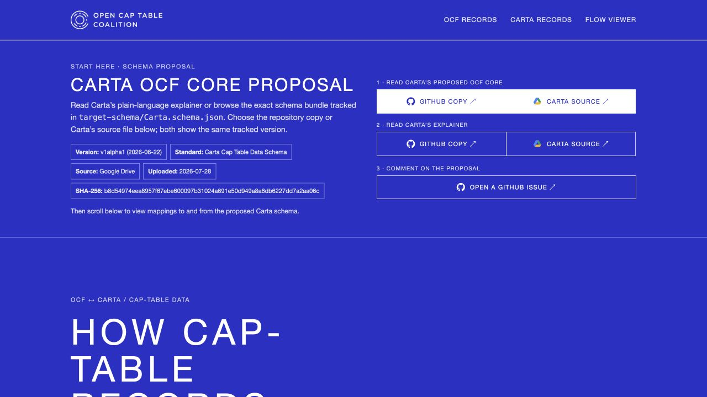
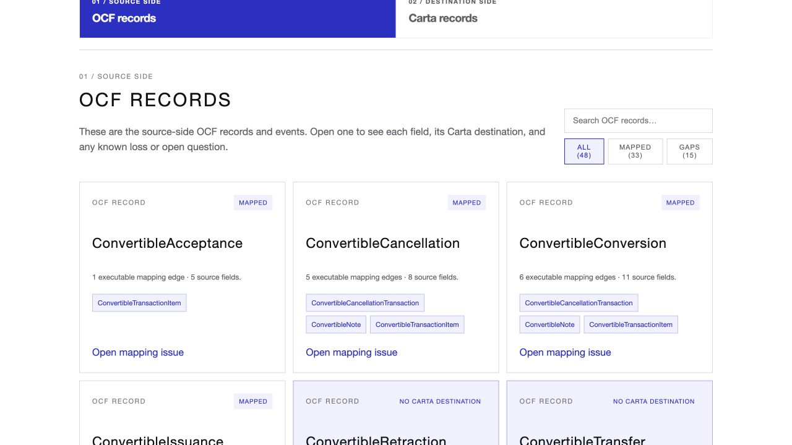
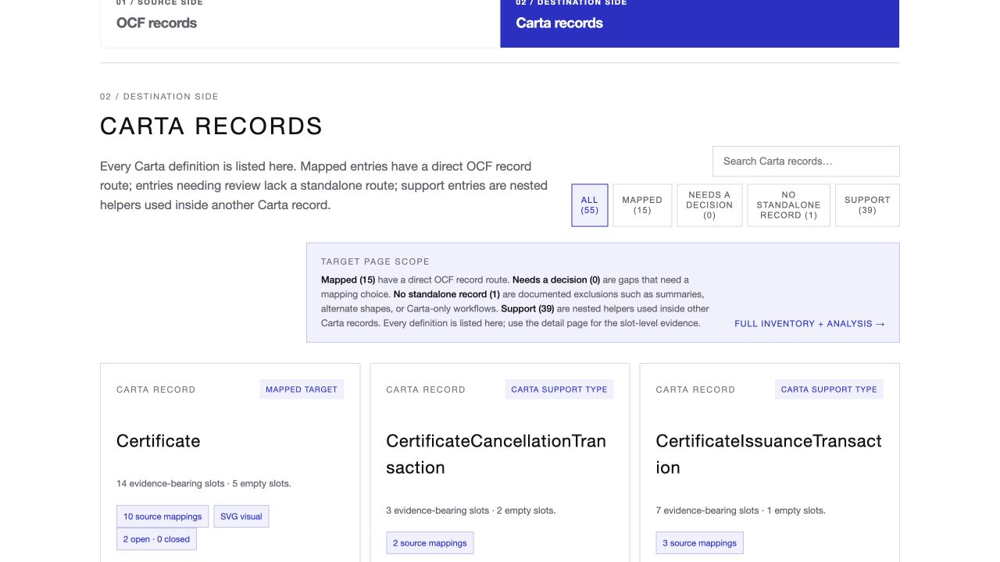
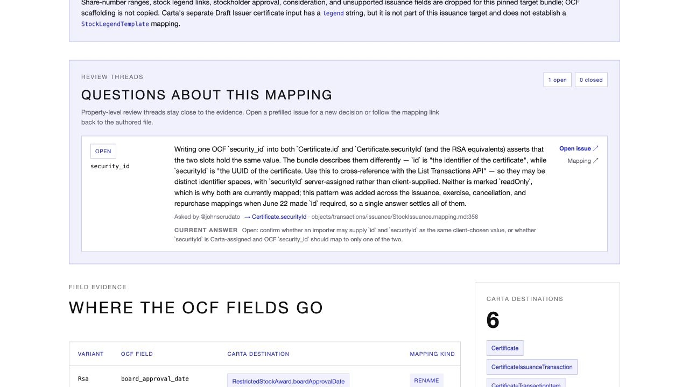

# How to review Carta’s proposal and the OCF comparison

You do not need to understand code. Open the [OCF ↔ Carta Mapping Explorer](https://open-cap-table-coalition.github.io/OCF-Composed-Schemas/). A free GitHub account is needed only when you want to leave feedback.

## View Carta’s proposal

At the top of the page, find **Carta OCF Core proposal**. Select **1 · Read Carta’s proposed OCF Core** for the exact schema, then **2 · Read Carta’s explainer** for the plain-language tour. For either file, choose **GitHub** for the pinned repository copy or **Drive** for Carta’s source. Scroll below the proposal to view mappings to and from the proposed Carta schema. You can read everything without editing or downloading anything.

## Understand the OCF gap analyses

The explorer compares the proposal with today’s Open Cap Format (OCF) in both directions. These are generated analyses, not a converter or a final standards decision.

- **OCF records** asks, “Where would each existing OCF record and field go in Carta?” Choose **Gaps** to find records with no Carta destination. Open a record for the field-by-field evidence, known loss, and review questions.
- **Carta records** asks, “Which Carta definitions have supporting OCF records?” **Needs a decision** is an unresolved gap; **No standalone record** is an explained exception; **Support** means a nested helper used inside another record. **Mapped** means a route is documented—not necessarily that every detail survives unchanged. **Full inventory + analysis** opens the complete ledger.

## Comment or raise an issue

The explorer is read-only; discussion happens in GitHub.

1. For the proposal itself, under **3 · Comment on the proposal**, select **Open a GitHub issue**.
2. For a mapping, open an OCF or Carta record. Select **Open mapping issue** for the whole record, **Issue** beside a particular field, or **Open issue** beside an existing review question.
3. Sign in to GitHub if asked. The form already includes the relevant links. Describe what seems wrong or unclear in ordinary language, then select **Submit new issue**.
4. To join an existing discussion, open the repository’s [Issues list](https://github.com/Open-Cap-Table-Coalition/OCF-Composed-Schemas/issues), choose the matching issue, type in **Add a comment**, and select **Comment**. Name the record and field when possible, and keep one topic per issue.

