# OCF Core — bidirectional coverage (generated, discussion artifact)

GENERATED by `npm run core:bidi`. NOT drift-gated — an analysis input, not a contract.

**OCF Core (rich)** is the interop hub. Both formats feed it: OCF *projects* into Core
(Core is OCF-shaped), and Carta *populates* Core via the reverse of each mapping edge. This
shows, from each side, what flows IN and what is LEFT BEHIND.

## Overview

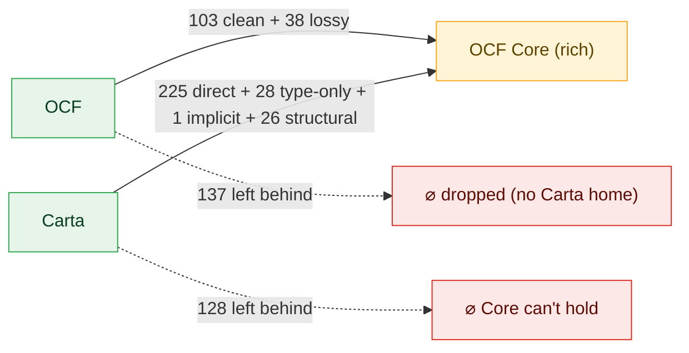
```mermaid
flowchart LR
  classDef core fill:#fff4d6,stroke:#f9a825,color:#5c4400;
  classDef in fill:#e6f4ea,stroke:#34a853,color:#0b3d20;
  classDef out fill:#fce8e6,stroke:#d93025,color:#5c0d06;
  classDef defer fill:#fff8e1,stroke:#f9a825,color:#5c4400,stroke-dasharray:4 3;
  OCF["OCF"]:::in -->|"103 clean + 38 lossy"| CORE
  OCF -.->|"137 left behind"| ocfvoid["⌀ dropped (no Carta home)"]:::out
  CORE["OCF Core (rich)"]:::core
  Carta["Carta"]:::in -->|"225 direct + 28 type-only + 1 implicit + 26 structural"| CORE
  Carta -.->|"128 left behind"| cartavoid["⌀ Core can't hold"]:::out
```

- **OCF → Core**: a property flows in if it is a Core member (mapped, even lossily); it is
  left behind only if it has **no Carta home** (`no-destination`).
- **Carta → Core**: direct slots are populated by executable object/composite mappings;
  type-only slots are reusable correspondences whose concrete object context is supplied
  separately; implicit slots come from deterministic constants; structural slots are
  schema-backed parent containers populated by mapped child records plus parent-anchor
  evidence. Empty slots are reported
  separately from unmapped `$defs` so root shape, nested coverage, and semantic type coverage
  are not conflated. Curated value-type roles (for example, date/datetime wrappers) remain
  available for type correspondences but are not treated as standalone inverse entities.

## Technical slot diagnostics

These counts are mutually descriptive dimensions of the same ledger, not a single loss total.

| Carta-side dimension | count |
| --- | ---: |
| Carta object slots | 588 |
| defs with direct executable coverage | 19 |
| direct executable slots | 225 |
| defs with type-only slots | 6 |
| defs with only type-only coverage | 1 |
| type-only slots | 28 |
| implicit constant slots | 1 |
| deferred slots | 0 |
| structural child-container slots | 26 |

### CARTA inverse coverage: the simple story

1. Carta defines **139** total definitions.
2. **53** are non-object definitions: **47** scalar enum definitions (field vocabularies) + **6** curated scalar support types; neither is a standalone mapping target.
3. **86** are object-shaped definitions.
4. Of those **86**, **54** are support definitions, not standalone objects (**53** nested objects + **1** object-shaped value type), leaving **32** standalone mapping candidates.
5. **60** support definitions are excluded from standalone mapping: **54** object-shaped support definitions + **6** scalar support types.
6. We have mapping evidence for **20**: **8** fully mapped and **12** partially mapped (**19** direct executable, **1** type-only, **0** deferred).
7. **12** standalone candidates have no mapping evidence yet; their inventory role tells us whether that is expected or actionable (**7** report/read-model roll-ups, **2** alternate shapes, **1** CARTA-specific families without OCF sources, **1** workflow/data gaps, **1** actionable gaps, **0** requiring review).

**Checks:** 139 = 53 non-object + 86 object-shaped; 53 = 47 scalar enum + 6 scalar support; 32 = 20 + 12; 86 = 32 + 54.

### Supporting CARTA definitions excluded from standalone mapping targets (60)

53 nested object definitions and 7 value-type support definitions are intentionally not standalone targets.
6 scalar wrappers are outside the object-like definition denominator; 1 value-type definition is object-like.
These definitions are packaging/support types, not standalone mapping targets; their mapping/type evidence remains valid.
The groups below distinguish nested objects with mapped-parent coverage from nested objects without it.

#### Value-type support definitions (7)

| Carta `$def` | covered through | note |
| --- | --- | --- |
| `#/$defs/Date` | type correspondence: Iso8601CompleteCalendarDate, Iso8601CompleteCalendarDateTime | Partial-date value helper; OCF Date maps to the Iso8601 date wrappers. |
| `#/$defs/Decimal` | owning Carta object properties; not a standalone entity | Reusable scalar value wrapper, not a standalone Carta entity. |
| `#/$defs/Iso3166Set1Alpha3Code` | owning Carta object properties; not a standalone entity | Reusable scalar value wrapper, not a standalone Carta entity. |
| `#/$defs/Iso3166Set2Code` | owning Carta object properties; not a standalone entity | Reusable scalar value wrapper, not a standalone Carta entity. |
| `#/$defs/Iso4217CurrencyAlphaCode` | owning Carta object properties; not a standalone entity | Reusable scalar value wrapper, not a standalone Carta entity. |
| `#/$defs/Iso8601CompleteCalendarDate` | owning Carta object properties; not a standalone entity | Reusable calendar-date wrapper, populated through owning object properties. |
| `#/$defs/Iso8601CompleteCalendarDateTime` | owning Carta object properties; not a standalone entity | Reusable datetime wrapper, populated through owning object properties. |

#### Nested objects with mapped parent coverage (38)

| Carta `$def` | immediate parent(s) |
| --- | --- |
| `#/$defs/CertificateCancellationTransaction` | CertificateTransactionItem |
| `#/$defs/CertificateIssuanceTransaction` | CertificateTransactionItem |
| `#/$defs/CertificatePrecededBy` | Certificate |
| `#/$defs/ConvertibleCancellationTransaction` | ConvertibleTransactionItem |
| `#/$defs/ConvertibleIssuanceTransaction` | ConvertibleTransactionItem |
| `#/$defs/DividendDetails` | ShareClassDividendDetails |
| `#/$defs/Exercise` | OptionGrant |
| `#/$defs/ExercisePeriods` | OptionGrant |
| `#/$defs/Money` | Certificate, CertificateIssuanceTransaction, ConvertibleCancellationTransaction, ConvertibleIssuanceTransaction, ConvertibleNote, OptionGrant, OptionIssuanceTransaction, RestrictedStockAward, RestrictedStockUnit, RestrictedStockUnitSettlement, RsaIssuanceTransaction, SarExerciseTransaction, SarIssuanceTransaction, ShareClass, ShareClassRightsAndPreferences, ShareClassValuation, WarrantIssuanceTransaction |
| `#/$defs/NoteBlock` | ConvertibleNote |
| `#/$defs/OptionCancellationTransaction` | OptionTransactionItem |
| `#/$defs/OptionExerciseTransaction` | OptionTransactionItem |
| `#/$defs/OptionGrantVestingEvent` | OptionGrant |
| `#/$defs/OptionIssuanceTransaction` | OptionTransactionItem |
| `#/$defs/PerformanceCondition` | VestingPeriod |
| `#/$defs/PrecededBySecurity` | CertificatePrecededBy, RestrictedStockAwardPrecededBy |
| `#/$defs/PreferredShareClassDetails` | ShareClass |
| `#/$defs/RestrictedStockAwardPrecededBy` | RestrictedStockAward |
| `#/$defs/RestrictedStockAwardVestingEvent` | RestrictedStockAward |
| `#/$defs/RestrictedStockUnitSettlement` | RestrictedStockUnit |
| `#/$defs/RestrictedStockUnitVestingEvent` | RestrictedStockUnit |
| `#/$defs/RsaCancellationTransaction` | RsaTransactionItem |
| `#/$defs/RsaIssuanceTransaction` | RsaTransactionItem |
| `#/$defs/RsuCancellationTransaction` | RsuTransactionItem |
| `#/$defs/RsuIssuanceTransaction` | RsuTransactionItem |
| `#/$defs/RsuSettlementTransaction` | RsuTransactionItem |
| `#/$defs/SarCancellationTransaction` | SarTransactionItem |
| `#/$defs/SarExerciseTransaction` | SarTransactionItem |
| `#/$defs/SarIssuanceTransaction` | SarTransactionItem |
| `#/$defs/ShareClassDividendDetails` | PreferredShareClassDetails |
| `#/$defs/ShareClassRightsAndPreferences` | PreferredShareClassDetails |
| `#/$defs/StakeholderAddress` | Stakeholder |
| `#/$defs/VestingPeriod` | VestingScheduleTemplate |
| `#/$defs/VestingSchedule` | OptionGrant, RestrictedStockAward, RestrictedStockUnit |
| `#/$defs/WarrantCancellationTransaction` | WarrantTransactionItem |
| `#/$defs/WarrantExerciseTransaction` | WarrantTransactionItem |
| `#/$defs/WarrantIssuanceTransaction` | WarrantTransactionItem |
| `#/$defs/WarrantTransferTransaction` | WarrantTransactionItem |

#### Nested objects without mapped parent coverage (15)

| Carta `$def` | immediate parent(s) |
| --- | --- |
| `#/$defs/Acceleration` | Vesting |
| `#/$defs/Document` | OptionGrantDocuments |
| `#/$defs/Jurisdiction` | OptionExerciseTaxWithholdingLineItem |
| `#/$defs/OptionExerciseMoneyMovement` | OptionExercise |
| `#/$defs/OptionExerciseTaxWithholdingLineItem` | OptionExercise |
| `#/$defs/PhantomCancellationTransaction` | PhantomTransactionItem |
| `#/$defs/PhantomIssuanceTransaction` | PhantomTransactionItem |
| `#/$defs/PiuCancellationTransaction` | PiuTransactionItem |
| `#/$defs/PiuIssuanceTransaction` | PiuTransactionItem |
| `#/$defs/StakeholderCapitalizationTableSummary` | StakeholderGroup |
| `#/$defs/StakeholderNoteBlockSummary` | StakeholderGroup |
| `#/$defs/StakeholderOptionPoolSummary` | StakeholderGroup |
| `#/$defs/StakeholderShareClassSummary` | StakeholderGroup |
| `#/$defs/StakeholderWarrantBlockSummary` | StakeholderGroup |
| `#/$defs/ThresholdDetails` | Interest |

## Hub flow — per related group (what flows in vs is lost, both sides)

One diagram per OCF object — each polymorphic flavor (`Object [Variant]`) fully separate — with
the Carta objects it maps into. **Solid** edges = a property that FLOWS IN
(`OCF field → Carta prop`). **`⊙`** edges = a Carta slot the composite fills with a FIXED value
(the `*_TRANSFERRED` reason codes) — known implicitly, not from an OCF field. **Dashed** edges to
a red void = properties LOST: OCF fields with no Carta home, and Carta fields no OCF source fills.
Loss lists are capped per object (full names in the tables below); OCF nodes are green (in Core) /
dashed grey (not admissible).

**EquityCompensationIssuance [Option] → Compliance, OptionGrant, OptionIssuanceTransaction, OptionTransactionItem, VestingSchedule**

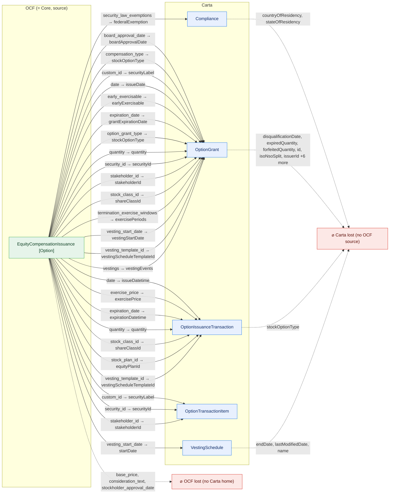
```mermaid
flowchart LR
  classDef adm fill:#e6f4ea,stroke:#34a853,color:#0b3d20;
  classDef notadm fill:#f1f3f4,stroke:#9aa0a6,color:#5f6368,stroke-dasharray:4 3;
  classDef carta fill:#e8f0fe,stroke:#1a73e8,color:#0d2b66;
  classDef lost fill:#fce8e6,stroke:#d93025,color:#5c0d06;
  subgraph SRC["OCF (= Core, source)"]
    direction TB
    o0["EquityCompensationIssuance [Option]"]:::adm
  end
  subgraph TGT["Carta"]
    direction TB
    t0["Compliance"]:::carta
    t1["OptionGrant"]:::carta
    t2["OptionIssuanceTransaction"]:::carta
    t3["OptionTransactionItem"]:::carta
    t4["VestingSchedule"]:::carta
  end
  ocflost["⌀ OCF lost (no Carta home)"]:::lost
  cartalost["⌀ Carta lost (no OCF source)"]:::lost
  o0 -->|"board_approval_date → boardApprovalDate"| t1
  o0 -->|"compensation_type → stockOptionType"| t1
  o0 -->|"custom_id → securityLabel"| t3
  o0 -->|"custom_id → securityLabel"| t1
  o0 -->|"date → issueDatetime"| t2
  o0 -->|"date → issueDate"| t1
  o0 -->|"early_exercisable → earlyExercisable"| t1
  o0 -->|"exercise_price → exercisePrice"| t2
  o0 -->|"expiration_date → expirationDatetime"| t2
  o0 -->|"expiration_date → grantExpirationDate"| t1
  o0 -->|"option_grant_type → stockOptionType"| t1
  o0 -->|"quantity → quantity"| t2
  o0 -->|"quantity → quantity"| t1
  o0 -->|"security_id → securityId"| t3
  o0 -->|"security_id → securityId"| t1
  o0 -->|"security_law_exemptions → federalExemption"| t0
  o0 -->|"stakeholder_id → stakeholderId"| t3
  o0 -->|"stakeholder_id → stakeholderId"| t1
  o0 -->|"stock_class_id → shareClassId"| t2
  o0 -->|"stock_class_id → shareClassId"| t1
  o0 -->|"stock_plan_id → equityPlanId"| t2
  o0 -->|"termination_exercise_windows → exercisePeriods"| t1
  o0 -->|"vesting_start_date → vestingStartDate"| t1
  o0 -->|"vesting_start_date → startDate"| t4
  o0 -->|"vesting_template_id → vestingScheduleTemplateId"| t2
  o0 -->|"vesting_template_id → vestingScheduleTemplateId"| t1
  o0 -->|"vestings → vestingEvents"| t1
  o0 -.->|"base_price, consideration_text, stockholder_approval_date"| ocflost
  t0 -.->|"countryOfResidency, stateOfResidency"| cartalost
  t1 -.->|"disqualificationDate, expiredQuantity, forfeitedQuantity, id, isoNsoSplit, issuerId +6 more"| cartalost
  t2 -.->|"stockOptionType"| cartalost
  t4 -.->|"endDate, lastModifiedDate, name"| cartalost
```

**EquityCompensationIssuance [Rsu] → Compliance, RestrictedStockUnit, RsuIssuanceTransaction, RsuTransactionItem, VestingSchedule**

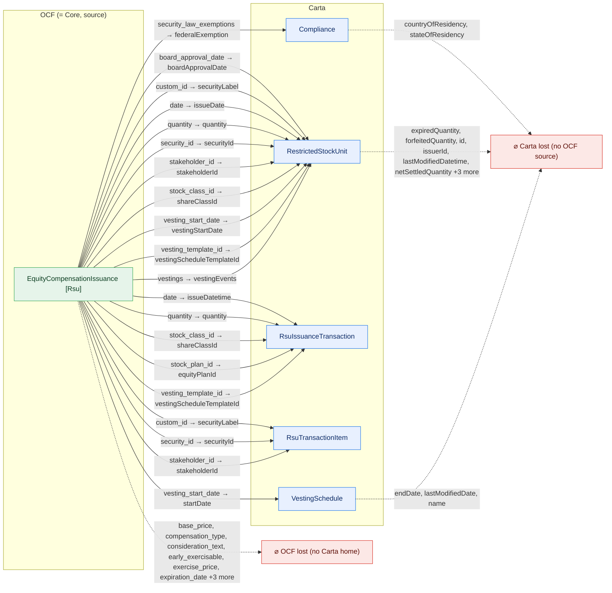
```mermaid
flowchart LR
  classDef adm fill:#e6f4ea,stroke:#34a853,color:#0b3d20;
  classDef notadm fill:#f1f3f4,stroke:#9aa0a6,color:#5f6368,stroke-dasharray:4 3;
  classDef carta fill:#e8f0fe,stroke:#1a73e8,color:#0d2b66;
  classDef lost fill:#fce8e6,stroke:#d93025,color:#5c0d06;
  subgraph SRC["OCF (= Core, source)"]
    direction TB
    o0["EquityCompensationIssuance [Rsu]"]:::adm
  end
  subgraph TGT["Carta"]
    direction TB
    t0["Compliance"]:::carta
    t1["RestrictedStockUnit"]:::carta
    t2["RsuIssuanceTransaction"]:::carta
    t3["RsuTransactionItem"]:::carta
    t4["VestingSchedule"]:::carta
  end
  ocflost["⌀ OCF lost (no Carta home)"]:::lost
  cartalost["⌀ Carta lost (no OCF source)"]:::lost
  o0 -->|"board_approval_date → boardApprovalDate"| t1
  o0 -->|"custom_id → securityLabel"| t3
  o0 -->|"custom_id → securityLabel"| t1
  o0 -->|"date → issueDatetime"| t2
  o0 -->|"date → issueDate"| t1
  o0 -->|"quantity → quantity"| t2
  o0 -->|"quantity → quantity"| t1
  o0 -->|"security_id → securityId"| t3
  o0 -->|"security_id → securityId"| t1
  o0 -->|"security_law_exemptions → federalExemption"| t0
  o0 -->|"stakeholder_id → stakeholderId"| t3
  o0 -->|"stakeholder_id → stakeholderId"| t1
  o0 -->|"stock_class_id → shareClassId"| t2
  o0 -->|"stock_class_id → shareClassId"| t1
  o0 -->|"stock_plan_id → equityPlanId"| t2
  o0 -->|"vesting_start_date → vestingStartDate"| t1
  o0 -->|"vesting_start_date → startDate"| t4
  o0 -->|"vesting_template_id → vestingScheduleTemplateId"| t2
  o0 -->|"vesting_template_id → vestingScheduleTemplateId"| t1
  o0 -->|"vestings → vestingEvents"| t1
  o0 -.->|"base_price, compensation_type, consideration_text, early_exercisable, exercise_price, expiration_date +3 more"| ocflost
  t0 -.->|"countryOfResidency, stateOfResidency"| cartalost
  t1 -.->|"expiredQuantity, forfeitedQuantity, id, issuerId, lastModifiedDatetime, netSettledQuantity +3 more"| cartalost
  t4 -.->|"endDate, lastModifiedDate, name"| cartalost
```

**StockIssuance [Rsa] → Compliance, RestrictedStockAward, RsaIssuanceTransaction, RsaTransactionItem**

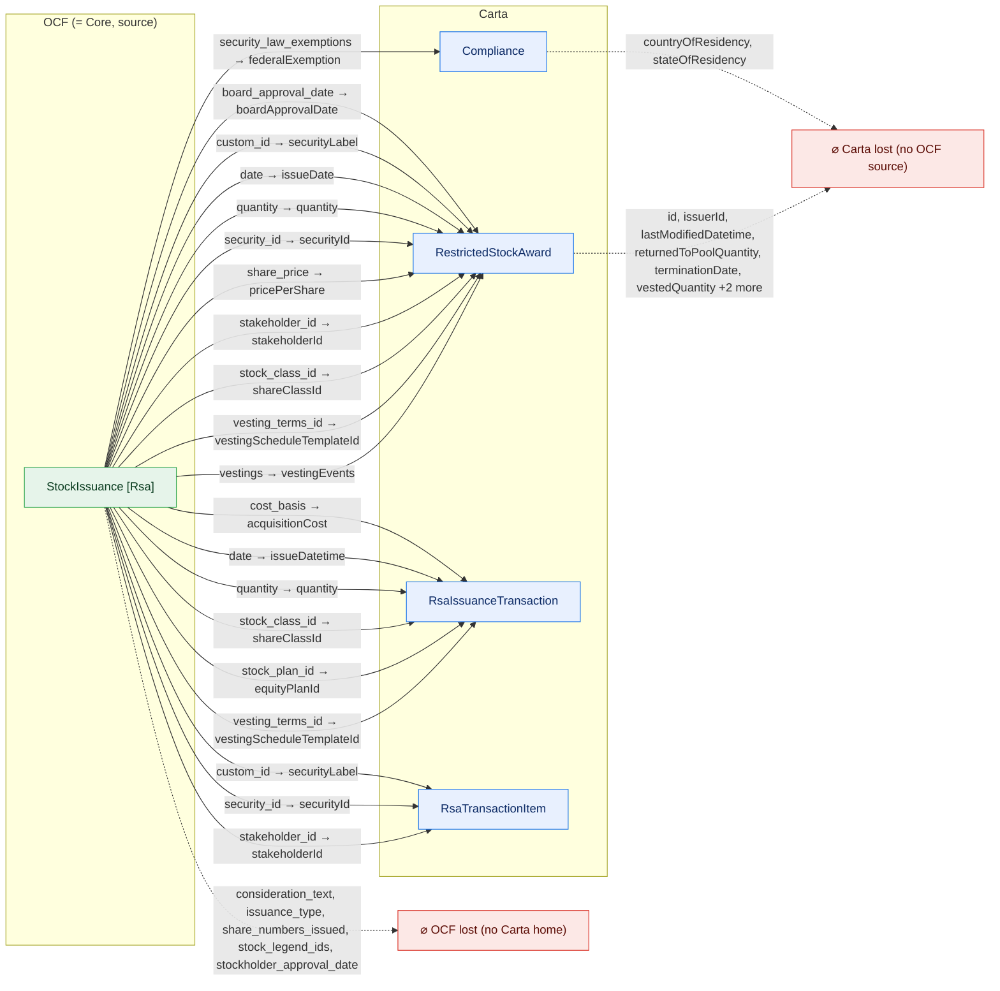
```mermaid
flowchart LR
  classDef adm fill:#e6f4ea,stroke:#34a853,color:#0b3d20;
  classDef notadm fill:#f1f3f4,stroke:#9aa0a6,color:#5f6368,stroke-dasharray:4 3;
  classDef carta fill:#e8f0fe,stroke:#1a73e8,color:#0d2b66;
  classDef lost fill:#fce8e6,stroke:#d93025,color:#5c0d06;
  subgraph SRC["OCF (= Core, source)"]
    direction TB
    o0["StockIssuance [Rsa]"]:::adm
  end
  subgraph TGT["Carta"]
    direction TB
    t0["Compliance"]:::carta
    t1["RestrictedStockAward"]:::carta
    t2["RsaIssuanceTransaction"]:::carta
    t3["RsaTransactionItem"]:::carta
  end
  ocflost["⌀ OCF lost (no Carta home)"]:::lost
  cartalost["⌀ Carta lost (no OCF source)"]:::lost
  o0 -->|"board_approval_date → boardApprovalDate"| t1
  o0 -->|"cost_basis → acquisitionCost"| t2
  o0 -->|"custom_id → securityLabel"| t3
  o0 -->|"custom_id → securityLabel"| t1
  o0 -->|"date → issueDatetime"| t2
  o0 -->|"date → issueDate"| t1
  o0 -->|"quantity → quantity"| t2
  o0 -->|"quantity → quantity"| t1
  o0 -->|"security_id → securityId"| t3
  o0 -->|"security_id → securityId"| t1
  o0 -->|"security_law_exemptions → federalExemption"| t0
  o0 -->|"share_price → pricePerShare"| t1
  o0 -->|"stakeholder_id → stakeholderId"| t3
  o0 -->|"stakeholder_id → stakeholderId"| t1
  o0 -->|"stock_class_id → shareClassId"| t2
  o0 -->|"stock_class_id → shareClassId"| t1
  o0 -->|"stock_plan_id → equityPlanId"| t2
  o0 -->|"vesting_terms_id → vestingScheduleTemplateId"| t2
  o0 -->|"vesting_terms_id → vestingScheduleTemplateId"| t1
  o0 -->|"vestings → vestingEvents"| t1
  o0 -.->|"consideration_text, issuance_type, share_numbers_issued, stock_legend_ids, stockholder_approval_date"| ocflost
  t0 -.->|"countryOfResidency, stateOfResidency"| cartalost
  t1 -.->|"id, issuerId, lastModifiedDatetime, returnedToPoolQuantity, terminationDate, vestedQuantity +2 more"| cartalost
```

**StockIssuance [Default] → Certificate, CertificateIssuanceTransaction, CertificateTransactionItem, Compliance**

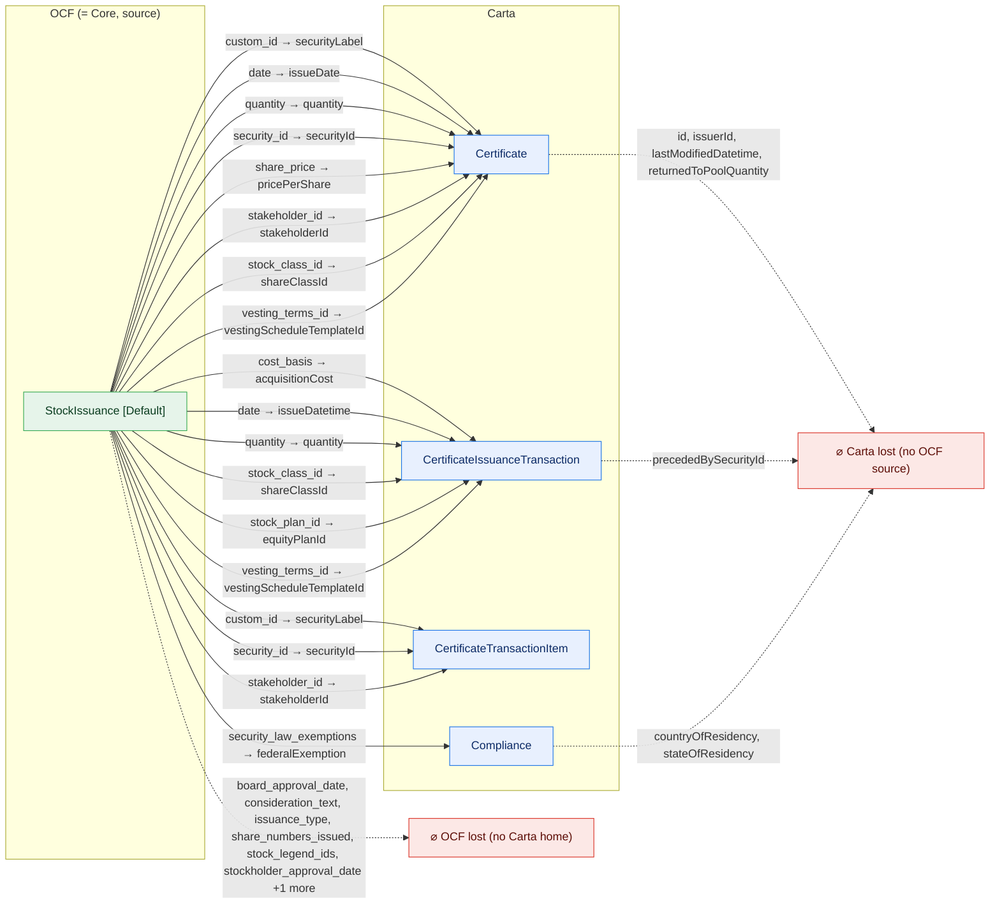
```mermaid
flowchart LR
  classDef adm fill:#e6f4ea,stroke:#34a853,color:#0b3d20;
  classDef notadm fill:#f1f3f4,stroke:#9aa0a6,color:#5f6368,stroke-dasharray:4 3;
  classDef carta fill:#e8f0fe,stroke:#1a73e8,color:#0d2b66;
  classDef lost fill:#fce8e6,stroke:#d93025,color:#5c0d06;
  subgraph SRC["OCF (= Core, source)"]
    direction TB
    o0["StockIssuance [Default]"]:::adm
  end
  subgraph TGT["Carta"]
    direction TB
    t0["Certificate"]:::carta
    t1["CertificateIssuanceTransaction"]:::carta
    t2["CertificateTransactionItem"]:::carta
    t3["Compliance"]:::carta
  end
  ocflost["⌀ OCF lost (no Carta home)"]:::lost
  cartalost["⌀ Carta lost (no OCF source)"]:::lost
  o0 -->|"cost_basis → acquisitionCost"| t1
  o0 -->|"custom_id → securityLabel"| t2
  o0 -->|"custom_id → securityLabel"| t0
  o0 -->|"date → issueDatetime"| t1
  o0 -->|"date → issueDate"| t0
  o0 -->|"quantity → quantity"| t1
  o0 -->|"quantity → quantity"| t0
  o0 -->|"security_id → securityId"| t2
  o0 -->|"security_id → securityId"| t0
  o0 -->|"security_law_exemptions → federalExemption"| t3
  o0 -->|"share_price → pricePerShare"| t0
  o0 -->|"stakeholder_id → stakeholderId"| t2
  o0 -->|"stakeholder_id → stakeholderId"| t0
  o0 -->|"stock_class_id → shareClassId"| t1
  o0 -->|"stock_class_id → shareClassId"| t0
  o0 -->|"stock_plan_id → equityPlanId"| t1
  o0 -->|"vesting_terms_id → vestingScheduleTemplateId"| t1
  o0 -->|"vesting_terms_id → vestingScheduleTemplateId"| t0
  o0 -.->|"board_approval_date, consideration_text, issuance_type, share_numbers_issued, stock_legend_ids, stockholder_approval_date +1 more"| ocflost
  t0 -.->|"id, issuerId, lastModifiedDatetime, returnedToPoolQuantity"| cartalost
  t1 -.->|"precededBySecurityId"| cartalost
  t3 -.->|"countryOfResidency, stateOfResidency"| cartalost
```

**StockClass → Certificate, RestrictedStockAward, ShareClass, ShareClassRightsAndPreferences, ShareClassValuation**

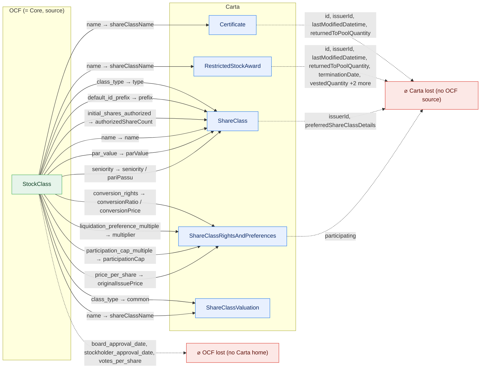
```mermaid
flowchart LR
  classDef adm fill:#e6f4ea,stroke:#34a853,color:#0b3d20;
  classDef notadm fill:#f1f3f4,stroke:#9aa0a6,color:#5f6368,stroke-dasharray:4 3;
  classDef carta fill:#e8f0fe,stroke:#1a73e8,color:#0d2b66;
  classDef lost fill:#fce8e6,stroke:#d93025,color:#5c0d06;
  subgraph SRC["OCF (= Core, source)"]
    direction TB
    o0["StockClass"]:::adm
  end
  subgraph TGT["Carta"]
    direction TB
    t0["Certificate"]:::carta
    t1["RestrictedStockAward"]:::carta
    t2["ShareClass"]:::carta
    t3["ShareClassRightsAndPreferences"]:::carta
    t4["ShareClassValuation"]:::carta
  end
  ocflost["⌀ OCF lost (no Carta home)"]:::lost
  cartalost["⌀ Carta lost (no OCF source)"]:::lost
  o0 -->|"class_type → type"| t2
  o0 -->|"class_type → common"| t4
  o0 -->|"conversion_rights → conversionRatio / conversionPrice"| t3
  o0 -->|"default_id_prefix → prefix"| t2
  o0 -->|"initial_shares_authorized → authorizedShareCount"| t2
  o0 -->|"liquidation_preference_multiple → multiplier"| t3
  o0 -->|"name → name"| t2
  o0 -->|"name → shareClassName"| t4
  o0 -->|"name → shareClassName"| t0
  o0 -->|"name → shareClassName"| t1
  o0 -->|"par_value → parValue"| t2
  o0 -->|"participation_cap_multiple → participationCap"| t3
  o0 -->|"price_per_share → originalIssuePrice"| t3
  o0 -->|"seniority → seniority / pariPassu"| t2
  o0 -.->|"board_approval_date, stockholder_approval_date, votes_per_share"| ocflost
  t0 -.->|"id, issuerId, lastModifiedDatetime, returnedToPoolQuantity"| cartalost
  t1 -.->|"id, issuerId, lastModifiedDatetime, returnedToPoolQuantity, terminationDate, vestedQuantity +2 more"| cartalost
  t2 -.->|"issuerId, preferredShareClassDetails"| cartalost
  t3 -.->|"participating"| cartalost
```

**ConvertibleIssuance → Compliance, ConvertibleIssuanceTransaction, ConvertibleNote, ConvertibleTransactionItem, NoteBlock**

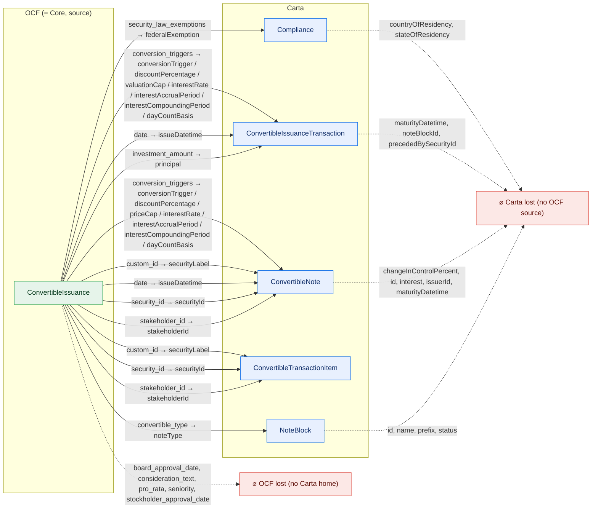
```mermaid
flowchart LR
  classDef adm fill:#e6f4ea,stroke:#34a853,color:#0b3d20;
  classDef notadm fill:#f1f3f4,stroke:#9aa0a6,color:#5f6368,stroke-dasharray:4 3;
  classDef carta fill:#e8f0fe,stroke:#1a73e8,color:#0d2b66;
  classDef lost fill:#fce8e6,stroke:#d93025,color:#5c0d06;
  subgraph SRC["OCF (= Core, source)"]
    direction TB
    o0["ConvertibleIssuance"]:::adm
  end
  subgraph TGT["Carta"]
    direction TB
    t0["Compliance"]:::carta
    t1["ConvertibleIssuanceTransaction"]:::carta
    t2["ConvertibleNote"]:::carta
    t3["ConvertibleTransactionItem"]:::carta
    t4["NoteBlock"]:::carta
  end
  ocflost["⌀ OCF lost (no Carta home)"]:::lost
  cartalost["⌀ Carta lost (no OCF source)"]:::lost
  o0 -->|"conversion_triggers → conversionTrigger / discountPercentage / valuationCap / interestRate / interestAccrualPeriod / interestCompoundingPeriod / dayCountBasis"| t1
  o0 -->|"conversion_triggers → conversionTrigger / discountPercentage / priceCap / interestRate / interestAccrualPeriod / interestCompoundingPeriod / dayCountBasis"| t2
  o0 -->|"convertible_type → noteType"| t4
  o0 -->|"custom_id → securityLabel"| t3
  o0 -->|"custom_id → securityLabel"| t2
  o0 -->|"date → issueDatetime"| t1
  o0 -->|"date → issueDatetime"| t2
  o0 -->|"investment_amount → principal"| t1
  o0 -->|"security_id → securityId"| t3
  o0 -->|"security_id → securityId"| t2
  o0 -->|"security_law_exemptions → federalExemption"| t0
  o0 -->|"stakeholder_id → stakeholderId"| t3
  o0 -->|"stakeholder_id → stakeholderId"| t2
  o0 -.->|"board_approval_date, consideration_text, pro_rata, seniority, stockholder_approval_date"| ocflost
  t0 -.->|"countryOfResidency, stateOfResidency"| cartalost
  t1 -.->|"maturityDatetime, noteBlockId, precededBySecurityId"| cartalost
  t2 -.->|"changeInControlPercent, id, interest, issuerId, maturityDatetime"| cartalost
  t4 -.->|"id, name, prefix, status"| cartalost
```

**EquityCompensationIssuance [Sar] → Compliance, SarIssuanceTransaction, SarTransactionItem**

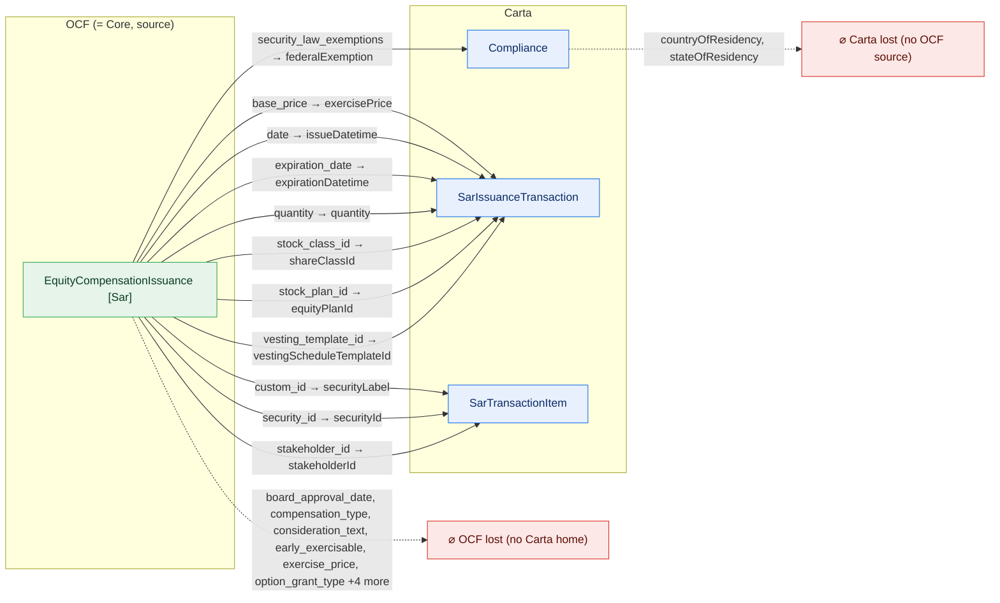
```mermaid
flowchart LR
  classDef adm fill:#e6f4ea,stroke:#34a853,color:#0b3d20;
  classDef notadm fill:#f1f3f4,stroke:#9aa0a6,color:#5f6368,stroke-dasharray:4 3;
  classDef carta fill:#e8f0fe,stroke:#1a73e8,color:#0d2b66;
  classDef lost fill:#fce8e6,stroke:#d93025,color:#5c0d06;
  subgraph SRC["OCF (= Core, source)"]
    direction TB
    o0["EquityCompensationIssuance [Sar]"]:::adm
  end
  subgraph TGT["Carta"]
    direction TB
    t0["Compliance"]:::carta
    t1["SarIssuanceTransaction"]:::carta
    t2["SarTransactionItem"]:::carta
  end
  ocflost["⌀ OCF lost (no Carta home)"]:::lost
  cartalost["⌀ Carta lost (no OCF source)"]:::lost
  o0 -->|"base_price → exercisePrice"| t1
  o0 -->|"custom_id → securityLabel"| t2
  o0 -->|"date → issueDatetime"| t1
  o0 -->|"expiration_date → expirationDatetime"| t1
  o0 -->|"quantity → quantity"| t1
  o0 -->|"security_id → securityId"| t2
  o0 -->|"security_law_exemptions → federalExemption"| t0
  o0 -->|"stakeholder_id → stakeholderId"| t2
  o0 -->|"stock_class_id → shareClassId"| t1
  o0 -->|"stock_plan_id → equityPlanId"| t1
  o0 -->|"vesting_template_id → vestingScheduleTemplateId"| t1
  o0 -.->|"board_approval_date, compensation_type, consideration_text, early_exercisable, exercise_price, option_grant_type +4 more"| ocflost
  t0 -.->|"countryOfResidency, stateOfResidency"| cartalost
```

**EquityCompensationExercise [Option] → Certificate, CertificatePrecededBy, Exercise, OptionExerciseTransaction, OptionGrant, OptionTransactionItem**

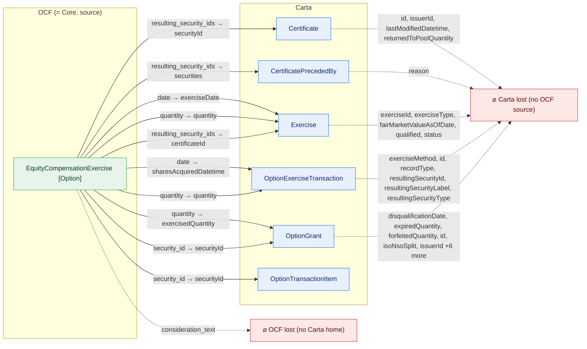
```mermaid
flowchart LR
  classDef adm fill:#e6f4ea,stroke:#34a853,color:#0b3d20;
  classDef notadm fill:#f1f3f4,stroke:#9aa0a6,color:#5f6368,stroke-dasharray:4 3;
  classDef carta fill:#e8f0fe,stroke:#1a73e8,color:#0d2b66;
  classDef lost fill:#fce8e6,stroke:#d93025,color:#5c0d06;
  subgraph SRC["OCF (= Core, source)"]
    direction TB
    o0["EquityCompensationExercise [Option]"]:::adm
  end
  subgraph TGT["Carta"]
    direction TB
    t0["Certificate"]:::carta
    t1["CertificatePrecededBy"]:::carta
    t2["Exercise"]:::carta
    t3["OptionExerciseTransaction"]:::carta
    t4["OptionGrant"]:::carta
    t5["OptionTransactionItem"]:::carta
  end
  ocflost["⌀ OCF lost (no Carta home)"]:::lost
  cartalost["⌀ Carta lost (no OCF source)"]:::lost
  o0 -->|"date → sharesAcquiredDatetime"| t3
  o0 -->|"date → exerciseDate"| t2
  o0 -->|"quantity → quantity"| t3
  o0 -->|"quantity → quantity"| t2
  o0 -->|"quantity → exercisedQuantity"| t4
  o0 -->|"resulting_security_ids → securityId"| t0
  o0 -->|"resulting_security_ids → securities"| t1
  o0 -->|"resulting_security_ids → certificateId"| t2
  o0 -->|"security_id → securityId"| t5
  o0 -->|"security_id → securityId"| t4
  o0 -.->|"consideration_text"| ocflost
  t0 -.->|"id, issuerId, lastModifiedDatetime, returnedToPoolQuantity"| cartalost
  t1 -.->|"reason"| cartalost
  t2 -.->|"exerciseId, exerciseType, fairMarketValueAsOfDate, qualified, status"| cartalost
  t3 -.->|"exerciseMethod, id, recordType, resultingSecurityId, resultingSecurityLabel, resultingSecurityType"| cartalost
  t4 -.->|"disqualificationDate, expiredQuantity, forfeitedQuantity, id, isoNsoSplit, issuerId +6 more"| cartalost
```

**EquityCompensationRelease [Rsu] → CertificatePrecededBy, RestrictedStockUnit, RestrictedStockUnitSettlement, RsuSettlementTransaction, RsuTransactionItem**

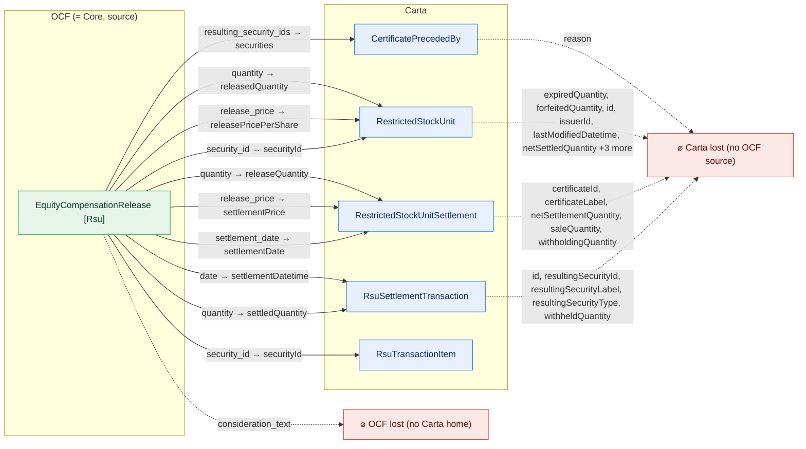
```mermaid
flowchart LR
  classDef adm fill:#e6f4ea,stroke:#34a853,color:#0b3d20;
  classDef notadm fill:#f1f3f4,stroke:#9aa0a6,color:#5f6368,stroke-dasharray:4 3;
  classDef carta fill:#e8f0fe,stroke:#1a73e8,color:#0d2b66;
  classDef lost fill:#fce8e6,stroke:#d93025,color:#5c0d06;
  subgraph SRC["OCF (= Core, source)"]
    direction TB
    o0["EquityCompensationRelease [Rsu]"]:::adm
  end
  subgraph TGT["Carta"]
    direction TB
    t0["CertificatePrecededBy"]:::carta
    t1["RestrictedStockUnit"]:::carta
    t2["RestrictedStockUnitSettlement"]:::carta
    t3["RsuSettlementTransaction"]:::carta
    t4["RsuTransactionItem"]:::carta
  end
  ocflost["⌀ OCF lost (no Carta home)"]:::lost
  cartalost["⌀ Carta lost (no OCF source)"]:::lost
  o0 -->|"date → settlementDatetime"| t3
  o0 -->|"quantity → settledQuantity"| t3
  o0 -->|"quantity → releaseQuantity"| t2
  o0 -->|"quantity → releasedQuantity"| t1
  o0 -->|"release_price → settlementPrice"| t2
  o0 -->|"release_price → releasePricePerShare"| t1
  o0 -->|"resulting_security_ids → securities"| t0
  o0 -->|"security_id → securityId"| t4
  o0 -->|"security_id → securityId"| t1
  o0 -->|"settlement_date → settlementDate"| t2
  o0 -.->|"consideration_text"| ocflost
  t0 -.->|"reason"| cartalost
  t1 -.->|"expiredQuantity, forfeitedQuantity, id, issuerId, lastModifiedDatetime, netSettledQuantity +3 more"| cartalost
  t2 -.->|"certificateId, certificateLabel, netSettlementQuantity, saleQuantity, withholdingQuantity"| cartalost
  t3 -.->|"id, resultingSecurityId, resultingSecurityLabel, resultingSecurityType, withheldQuantity"| cartalost
```

**WarrantIssuance → Compliance, WarrantIssuanceTransaction, WarrantTransactionItem**

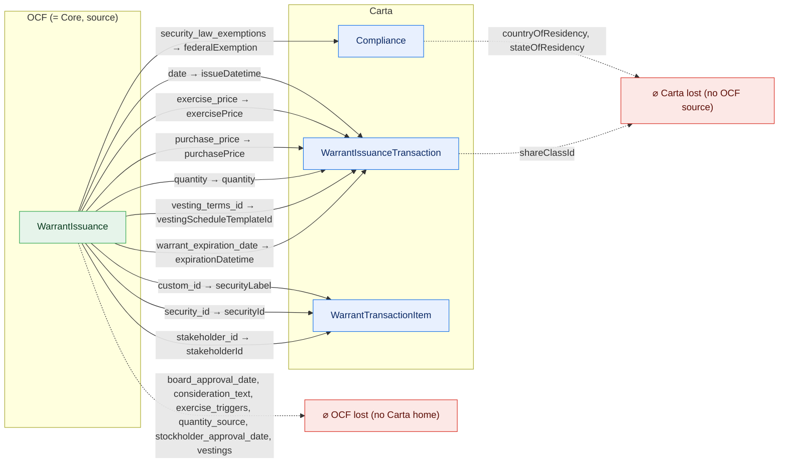
```mermaid
flowchart LR
  classDef adm fill:#e6f4ea,stroke:#34a853,color:#0b3d20;
  classDef notadm fill:#f1f3f4,stroke:#9aa0a6,color:#5f6368,stroke-dasharray:4 3;
  classDef carta fill:#e8f0fe,stroke:#1a73e8,color:#0d2b66;
  classDef lost fill:#fce8e6,stroke:#d93025,color:#5c0d06;
  subgraph SRC["OCF (= Core, source)"]
    direction TB
    o0["WarrantIssuance"]:::adm
  end
  subgraph TGT["Carta"]
    direction TB
    t0["Compliance"]:::carta
    t1["WarrantIssuanceTransaction"]:::carta
    t2["WarrantTransactionItem"]:::carta
  end
  ocflost["⌀ OCF lost (no Carta home)"]:::lost
  cartalost["⌀ Carta lost (no OCF source)"]:::lost
  o0 -->|"custom_id → securityLabel"| t2
  o0 -->|"date → issueDatetime"| t1
  o0 -->|"exercise_price → exercisePrice"| t1
  o0 -->|"purchase_price → purchasePrice"| t1
  o0 -->|"quantity → quantity"| t1
  o0 -->|"security_id → securityId"| t2
  o0 -->|"security_law_exemptions → federalExemption"| t0
  o0 -->|"stakeholder_id → stakeholderId"| t2
  o0 -->|"vesting_terms_id → vestingScheduleTemplateId"| t1
  o0 -->|"warrant_expiration_date → expirationDatetime"| t1
  o0 -.->|"board_approval_date, consideration_text, exercise_triggers, quantity_source, stockholder_approval_date, vestings"| ocflost
  t0 -.->|"countryOfResidency, stateOfResidency"| cartalost
  t1 -.->|"shareClassId"| cartalost
```

**StockCancellation [Default] → Certificate, CertificateCancellationTransaction, CertificatePrecededBy, CertificateTransactionItem**

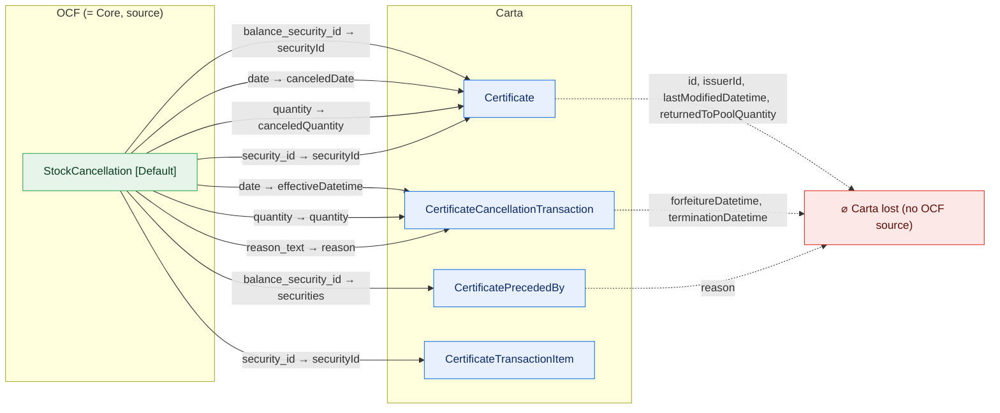
```mermaid
flowchart LR
  classDef adm fill:#e6f4ea,stroke:#34a853,color:#0b3d20;
  classDef notadm fill:#f1f3f4,stroke:#9aa0a6,color:#5f6368,stroke-dasharray:4 3;
  classDef carta fill:#e8f0fe,stroke:#1a73e8,color:#0d2b66;
  classDef lost fill:#fce8e6,stroke:#d93025,color:#5c0d06;
  subgraph SRC["OCF (= Core, source)"]
    direction TB
    o0["StockCancellation [Default]"]:::adm
  end
  subgraph TGT["Carta"]
    direction TB
    t0["Certificate"]:::carta
    t1["CertificateCancellationTransaction"]:::carta
    t2["CertificatePrecededBy"]:::carta
    t3["CertificateTransactionItem"]:::carta
  end
  cartalost["⌀ Carta lost (no OCF source)"]:::lost
  o0 -->|"balance_security_id → securityId"| t0
  o0 -->|"balance_security_id → securities"| t2
  o0 -->|"date → effectiveDatetime"| t1
  o0 -->|"date → canceledDate"| t0
  o0 -->|"quantity → quantity"| t1
  o0 -->|"quantity → canceledQuantity"| t0
  o0 -->|"reason_text → reason"| t1
  o0 -->|"security_id → securityId"| t3
  o0 -->|"security_id → securityId"| t0
  t0 -.->|"id, issuerId, lastModifiedDatetime, returnedToPoolQuantity"| cartalost
  t1 -.->|"forfeitureDatetime, terminationDatetime"| cartalost
  t2 -.->|"reason"| cartalost
```

**StockCancellation [Rsa] → RestrictedStockAward, RestrictedStockAwardPrecededBy, RsaCancellationTransaction, RsaTransactionItem**

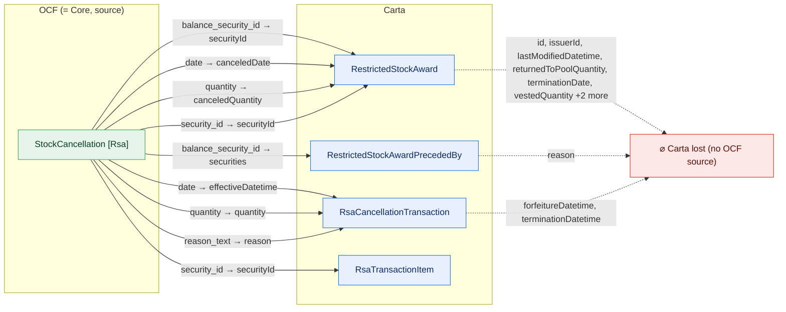
```mermaid
flowchart LR
  classDef adm fill:#e6f4ea,stroke:#34a853,color:#0b3d20;
  classDef notadm fill:#f1f3f4,stroke:#9aa0a6,color:#5f6368,stroke-dasharray:4 3;
  classDef carta fill:#e8f0fe,stroke:#1a73e8,color:#0d2b66;
  classDef lost fill:#fce8e6,stroke:#d93025,color:#5c0d06;
  subgraph SRC["OCF (= Core, source)"]
    direction TB
    o0["StockCancellation [Rsa]"]:::adm
  end
  subgraph TGT["Carta"]
    direction TB
    t0["RestrictedStockAward"]:::carta
    t1["RestrictedStockAwardPrecededBy"]:::carta
    t2["RsaCancellationTransaction"]:::carta
    t3["RsaTransactionItem"]:::carta
  end
  cartalost["⌀ Carta lost (no OCF source)"]:::lost
  o0 -->|"balance_security_id → securityId"| t0
  o0 -->|"balance_security_id → securities"| t1
  o0 -->|"date → effectiveDatetime"| t2
  o0 -->|"date → canceledDate"| t0
  o0 -->|"quantity → quantity"| t2
  o0 -->|"quantity → canceledQuantity"| t0
  o0 -->|"reason_text → reason"| t2
  o0 -->|"security_id → securityId"| t3
  o0 -->|"security_id → securityId"| t0
  t0 -.->|"id, issuerId, lastModifiedDatetime, returnedToPoolQuantity, terminationDate, vestedQuantity +2 more"| cartalost
  t1 -.->|"reason"| cartalost
  t2 -.->|"forfeitureDatetime, terminationDatetime"| cartalost
```

**Stakeholder → Stakeholder**

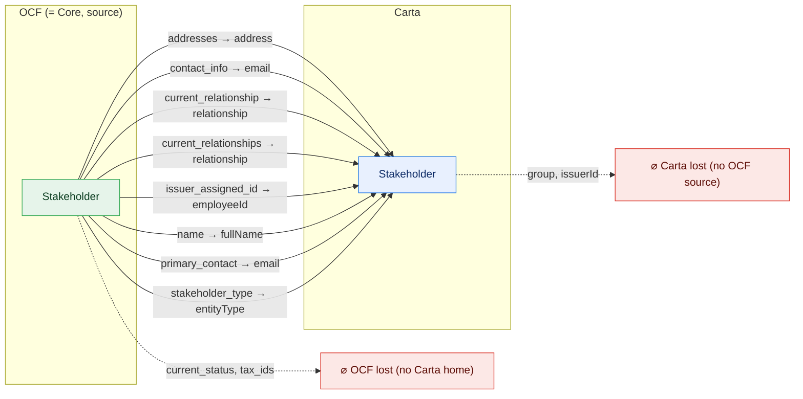
```mermaid
flowchart LR
  classDef adm fill:#e6f4ea,stroke:#34a853,color:#0b3d20;
  classDef notadm fill:#f1f3f4,stroke:#9aa0a6,color:#5f6368,stroke-dasharray:4 3;
  classDef carta fill:#e8f0fe,stroke:#1a73e8,color:#0d2b66;
  classDef lost fill:#fce8e6,stroke:#d93025,color:#5c0d06;
  subgraph SRC["OCF (= Core, source)"]
    direction TB
    o0["Stakeholder"]:::adm
  end
  subgraph TGT["Carta"]
    direction TB
    t0["Stakeholder"]:::carta
  end
  ocflost["⌀ OCF lost (no Carta home)"]:::lost
  cartalost["⌀ Carta lost (no OCF source)"]:::lost
  o0 -->|"addresses → address"| t0
  o0 -->|"contact_info → email"| t0
  o0 -->|"current_relationship → relationship"| t0
  o0 -->|"current_relationships → relationship"| t0
  o0 -->|"issuer_assigned_id → employeeId"| t0
  o0 -->|"name → fullName"| t0
  o0 -->|"primary_contact → email"| t0
  o0 -->|"stakeholder_type → entityType"| t0
  o0 -.->|"current_status, tax_ids"| ocflost
  t0 -.->|"group, issuerId"| cartalost
```

**StockTransfer [Default] → Certificate, CertificateCancellationTransaction, CertificateIssuanceTransaction, CertificatePrecededBy**

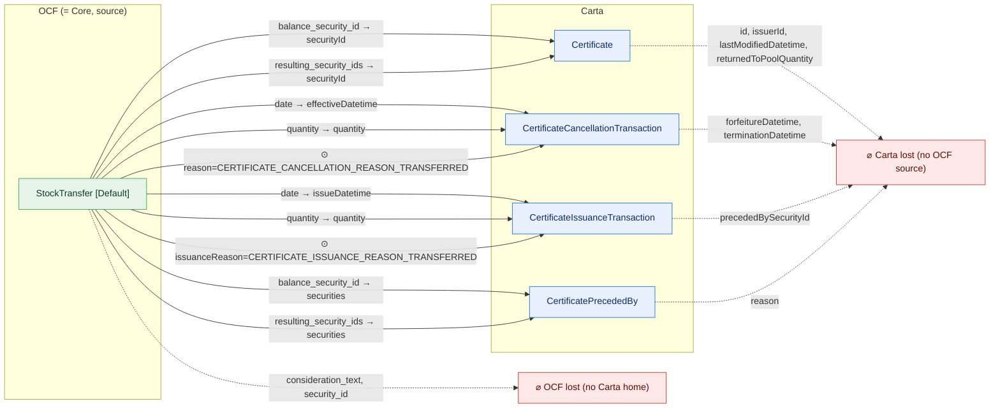
```mermaid
flowchart LR
  classDef adm fill:#e6f4ea,stroke:#34a853,color:#0b3d20;
  classDef notadm fill:#f1f3f4,stroke:#9aa0a6,color:#5f6368,stroke-dasharray:4 3;
  classDef carta fill:#e8f0fe,stroke:#1a73e8,color:#0d2b66;
  classDef lost fill:#fce8e6,stroke:#d93025,color:#5c0d06;
  subgraph SRC["OCF (= Core, source)"]
    direction TB
    o0["StockTransfer [Default]"]:::adm
  end
  subgraph TGT["Carta"]
    direction TB
    t0["Certificate"]:::carta
    t1["CertificateCancellationTransaction"]:::carta
    t2["CertificateIssuanceTransaction"]:::carta
    t3["CertificatePrecededBy"]:::carta
  end
  ocflost["⌀ OCF lost (no Carta home)"]:::lost
  cartalost["⌀ Carta lost (no OCF source)"]:::lost
  o0 -->|"balance_security_id → securityId"| t0
  o0 -->|"balance_security_id → securities"| t3
  o0 -->|"date → effectiveDatetime"| t1
  o0 -->|"date → issueDatetime"| t2
  o0 -->|"quantity → quantity"| t1
  o0 -->|"quantity → quantity"| t2
  o0 -->|"resulting_security_ids → securityId"| t0
  o0 -->|"resulting_security_ids → securities"| t3
  o0 -->|"⊙ reason=CERTIFICATE_CANCELLATION_REASON_TRANSFERRED"| t1
  o0 -->|"⊙ issuanceReason=CERTIFICATE_ISSUANCE_REASON_TRANSFERRED"| t2
  o0 -.->|"consideration_text, security_id"| ocflost
  t0 -.->|"id, issuerId, lastModifiedDatetime, returnedToPoolQuantity"| cartalost
  t1 -.->|"forfeitureDatetime, terminationDatetime"| cartalost
  t2 -.->|"precededBySecurityId"| cartalost
  t3 -.->|"reason"| cartalost
```

**StockTransfer [Rsa] → RestrictedStockAward, RestrictedStockAwardPrecededBy, RsaCancellationTransaction, RsaIssuanceTransaction**

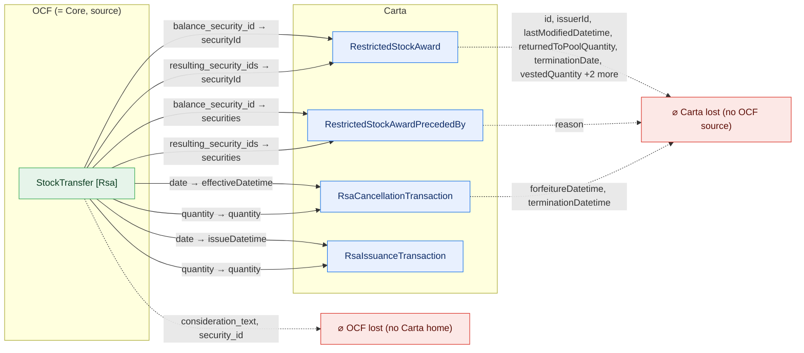
```mermaid
flowchart LR
  classDef adm fill:#e6f4ea,stroke:#34a853,color:#0b3d20;
  classDef notadm fill:#f1f3f4,stroke:#9aa0a6,color:#5f6368,stroke-dasharray:4 3;
  classDef carta fill:#e8f0fe,stroke:#1a73e8,color:#0d2b66;
  classDef lost fill:#fce8e6,stroke:#d93025,color:#5c0d06;
  subgraph SRC["OCF (= Core, source)"]
    direction TB
    o0["StockTransfer [Rsa]"]:::adm
  end
  subgraph TGT["Carta"]
    direction TB
    t0["RestrictedStockAward"]:::carta
    t1["RestrictedStockAwardPrecededBy"]:::carta
    t2["RsaCancellationTransaction"]:::carta
    t3["RsaIssuanceTransaction"]:::carta
  end
  ocflost["⌀ OCF lost (no Carta home)"]:::lost
  cartalost["⌀ Carta lost (no OCF source)"]:::lost
  o0 -->|"balance_security_id → securityId"| t0
  o0 -->|"balance_security_id → securities"| t1
  o0 -->|"date → effectiveDatetime"| t2
  o0 -->|"date → issueDatetime"| t3
  o0 -->|"quantity → quantity"| t2
  o0 -->|"quantity → quantity"| t3
  o0 -->|"resulting_security_ids → securityId"| t0
  o0 -->|"resulting_security_ids → securities"| t1
  o0 -.->|"consideration_text, security_id"| ocflost
  t0 -.->|"id, issuerId, lastModifiedDatetime, returnedToPoolQuantity, terminationDate, vestedQuantity +2 more"| cartalost
  t1 -.->|"reason"| cartalost
  t2 -.->|"forfeitureDatetime, terminationDatetime"| cartalost
```

**EquityCompensationCancellation [Option] → OptionCancellationTransaction, OptionGrant, OptionTransactionItem**

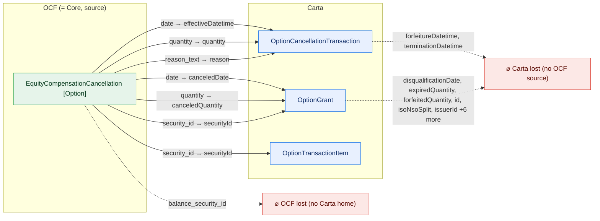
```mermaid
flowchart LR
  classDef adm fill:#e6f4ea,stroke:#34a853,color:#0b3d20;
  classDef notadm fill:#f1f3f4,stroke:#9aa0a6,color:#5f6368,stroke-dasharray:4 3;
  classDef carta fill:#e8f0fe,stroke:#1a73e8,color:#0d2b66;
  classDef lost fill:#fce8e6,stroke:#d93025,color:#5c0d06;
  subgraph SRC["OCF (= Core, source)"]
    direction TB
    o0["EquityCompensationCancellation [Option]"]:::adm
  end
  subgraph TGT["Carta"]
    direction TB
    t0["OptionCancellationTransaction"]:::carta
    t1["OptionGrant"]:::carta
    t2["OptionTransactionItem"]:::carta
  end
  ocflost["⌀ OCF lost (no Carta home)"]:::lost
  cartalost["⌀ Carta lost (no OCF source)"]:::lost
  o0 -->|"date → effectiveDatetime"| t0
  o0 -->|"date → canceledDate"| t1
  o0 -->|"quantity → quantity"| t0
  o0 -->|"quantity → canceledQuantity"| t1
  o0 -->|"reason_text → reason"| t0
  o0 -->|"security_id → securityId"| t2
  o0 -->|"security_id → securityId"| t1
  o0 -.->|"balance_security_id"| ocflost
  t0 -.->|"forfeitureDatetime, terminationDatetime"| cartalost
  t1 -.->|"disqualificationDate, expiredQuantity, forfeitedQuantity, id, isoNsoSplit, issuerId +6 more"| cartalost
```

**EquityCompensationCancellation [Rsu] → RestrictedStockUnit, RsuCancellationTransaction, RsuTransactionItem**

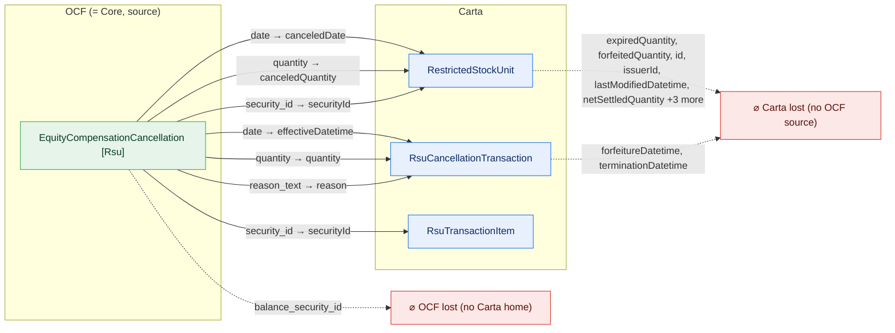
```mermaid
flowchart LR
  classDef adm fill:#e6f4ea,stroke:#34a853,color:#0b3d20;
  classDef notadm fill:#f1f3f4,stroke:#9aa0a6,color:#5f6368,stroke-dasharray:4 3;
  classDef carta fill:#e8f0fe,stroke:#1a73e8,color:#0d2b66;
  classDef lost fill:#fce8e6,stroke:#d93025,color:#5c0d06;
  subgraph SRC["OCF (= Core, source)"]
    direction TB
    o0["EquityCompensationCancellation [Rsu]"]:::adm
  end
  subgraph TGT["Carta"]
    direction TB
    t0["RestrictedStockUnit"]:::carta
    t1["RsuCancellationTransaction"]:::carta
    t2["RsuTransactionItem"]:::carta
  end
  ocflost["⌀ OCF lost (no Carta home)"]:::lost
  cartalost["⌀ Carta lost (no OCF source)"]:::lost
  o0 -->|"date → effectiveDatetime"| t1
  o0 -->|"date → canceledDate"| t0
  o0 -->|"quantity → quantity"| t1
  o0 -->|"quantity → canceledQuantity"| t0
  o0 -->|"reason_text → reason"| t1
  o0 -->|"security_id → securityId"| t2
  o0 -->|"security_id → securityId"| t0
  o0 -.->|"balance_security_id"| ocflost
  t0 -.->|"expiredQuantity, forfeitedQuantity, id, issuerId, lastModifiedDatetime, netSettledQuantity +3 more"| cartalost
  t1 -.->|"forfeitureDatetime, terminationDatetime"| cartalost
```

**StockPlan → OptionGrant, OptionPoolSummary, RestrictedStockAward, RestrictedStockUnit**

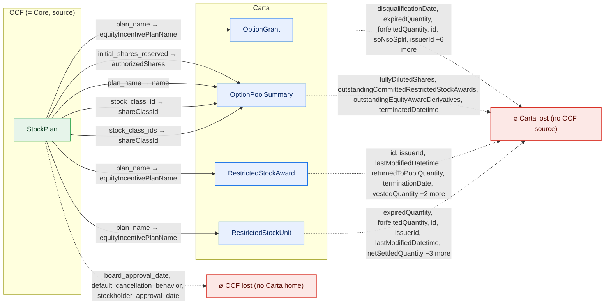
```mermaid
flowchart LR
  classDef adm fill:#e6f4ea,stroke:#34a853,color:#0b3d20;
  classDef notadm fill:#f1f3f4,stroke:#9aa0a6,color:#5f6368,stroke-dasharray:4 3;
  classDef carta fill:#e8f0fe,stroke:#1a73e8,color:#0d2b66;
  classDef lost fill:#fce8e6,stroke:#d93025,color:#5c0d06;
  subgraph SRC["OCF (= Core, source)"]
    direction TB
    o0["StockPlan"]:::adm
  end
  subgraph TGT["Carta"]
    direction TB
    t0["OptionGrant"]:::carta
    t1["OptionPoolSummary"]:::carta
    t2["RestrictedStockAward"]:::carta
    t3["RestrictedStockUnit"]:::carta
  end
  ocflost["⌀ OCF lost (no Carta home)"]:::lost
  cartalost["⌀ Carta lost (no OCF source)"]:::lost
  o0 -->|"initial_shares_reserved → authorizedShares"| t1
  o0 -->|"plan_name → name"| t1
  o0 -->|"plan_name → equityIncentivePlanName"| t0
  o0 -->|"plan_name → equityIncentivePlanName"| t2
  o0 -->|"plan_name → equityIncentivePlanName"| t3
  o0 -->|"stock_class_id → shareClassId"| t1
  o0 -->|"stock_class_ids → shareClassId"| t1
  o0 -.->|"board_approval_date, default_cancellation_behavior, stockholder_approval_date"| ocflost
  t0 -.->|"disqualificationDate, expiredQuantity, forfeitedQuantity, id, isoNsoSplit, issuerId +6 more"| cartalost
  t1 -.->|"fullyDilutedShares, outstandingCommittedRestrictedStockAwards, outstandingEquityAwardDerivatives, terminatedDatetime"| cartalost
  t2 -.->|"id, issuerId, lastModifiedDatetime, returnedToPoolQuantity, terminationDate, vestedQuantity +2 more"| cartalost
  t3 -.->|"expiredQuantity, forfeitedQuantity, id, issuerId, lastModifiedDatetime, netSettledQuantity +3 more"| cartalost
```

**ConvertibleCancellation → ConvertibleCancellationTransaction, ConvertibleNote, ConvertibleTransactionItem**

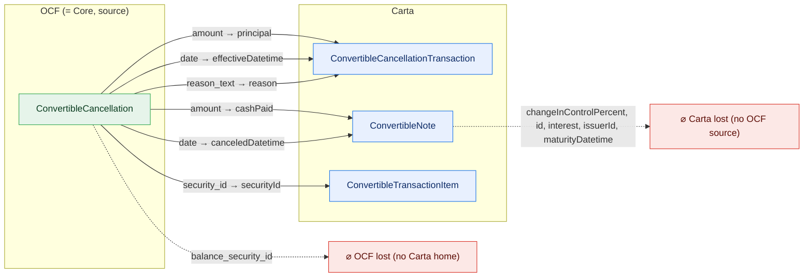
```mermaid
flowchart LR
  classDef adm fill:#e6f4ea,stroke:#34a853,color:#0b3d20;
  classDef notadm fill:#f1f3f4,stroke:#9aa0a6,color:#5f6368,stroke-dasharray:4 3;
  classDef carta fill:#e8f0fe,stroke:#1a73e8,color:#0d2b66;
  classDef lost fill:#fce8e6,stroke:#d93025,color:#5c0d06;
  subgraph SRC["OCF (= Core, source)"]
    direction TB
    o0["ConvertibleCancellation"]:::adm
  end
  subgraph TGT["Carta"]
    direction TB
    t0["ConvertibleCancellationTransaction"]:::carta
    t1["ConvertibleNote"]:::carta
    t2["ConvertibleTransactionItem"]:::carta
  end
  ocflost["⌀ OCF lost (no Carta home)"]:::lost
  cartalost["⌀ Carta lost (no OCF source)"]:::lost
  o0 -->|"amount → principal"| t0
  o0 -->|"amount → cashPaid"| t1
  o0 -->|"date → effectiveDatetime"| t0
  o0 -->|"date → canceledDatetime"| t1
  o0 -->|"reason_text → reason"| t0
  o0 -->|"security_id → securityId"| t2
  o0 -.->|"balance_security_id"| ocflost
  t1 -.->|"changeInControlPercent, id, interest, issuerId, maturityDatetime"| cartalost
```

**ConvertibleConversion → ConvertibleCancellationTransaction, ConvertibleNote, ConvertibleTransactionItem**

```mermaid
flowchart LR
  classDef adm fill:#e6f4ea,stroke:#34a853,color:#0b3d20;
  classDef notadm fill:#f1f3f4,stroke:#9aa0a6,color:#5f6368,stroke-dasharray:4 3;
  classDef carta fill:#e8f0fe,stroke:#1a73e8,color:#0d2b66;
  classDef lost fill:#fce8e6,stroke:#d93025,color:#5c0d06;
  subgraph SRC["OCF (= Core, source)"]
    direction TB
    o0["ConvertibleConversion"]:::adm
  end
  subgraph TGT["Carta"]
    direction TB
    t0["ConvertibleCancellationTransaction"]:::carta
    t1["ConvertibleNote"]:::carta
    t2["ConvertibleTransactionItem"]:::carta
  end
  ocflost["⌀ OCF lost (no Carta home)"]:::lost
  cartalost["⌀ Carta lost (no OCF source)"]:::lost
  o0 -->|"date → effectiveDatetime"| t0
  o0 -->|"date → conversionDatetime"| t1
  o0 -->|"quantity_converted → canceledQuantity"| t1
  o0 -->|"security_id → securityId"| t2
  o0 -->|"security_id → securityId"| t1
  o0 -.->|"balance_security_id, capitalization_definition, reason_text, resulting_security_ids, trigger_id"| ocflost
  t1 -.->|"changeInControlPercent, id, interest, issuerId, maturityDatetime"| cartalost
```

**EquityCompensationExercise [Sar] → Certificate, CertificatePrecededBy, SarExerciseTransaction, SarTransactionItem**

```mermaid
flowchart LR
  classDef adm fill:#e6f4ea,stroke:#34a853,color:#0b3d20;
  classDef notadm fill:#f1f3f4,stroke:#9aa0a6,color:#5f6368,stroke-dasharray:4 3;
  classDef carta fill:#e8f0fe,stroke:#1a73e8,color:#0d2b66;
  classDef lost fill:#fce8e6,stroke:#d93025,color:#5c0d06;
  subgraph SRC["OCF (= Core, source)"]
    direction TB
    o0["EquityCompensationExercise [Sar]"]:::adm
  end
  subgraph TGT["Carta"]
    direction TB
    t0["Certificate"]:::carta
    t1["CertificatePrecededBy"]:::carta
    t2["SarExerciseTransaction"]:::carta
    t3["SarTransactionItem"]:::carta
  end
  ocflost["⌀ OCF lost (no Carta home)"]:::lost
  cartalost["⌀ Carta lost (no OCF source)"]:::lost
  o0 -->|"date → sharesAcquiredDatetime"| t2
  o0 -->|"quantity → quantity"| t2
  o0 -->|"resulting_security_ids → securityId"| t0
  o0 -->|"resulting_security_ids → securities"| t1
  o0 -->|"security_id → securityId"| t3
  o0 -.->|"consideration_text"| ocflost
  t0 -.->|"id, issuerId, lastModifiedDatetime, returnedToPoolQuantity"| cartalost
  t1 -.->|"reason"| cartalost
  t2 -.->|"cashAcquired, resultingSecurityId, resultingSecurityLabel, resultingSecurityType, settledQuantity, withheldQuantity"| cartalost
```

**EquityCompensationCancellation [Sar] → SarCancellationTransaction, SarTransactionItem**

```mermaid
flowchart LR
  classDef adm fill:#e6f4ea,stroke:#34a853,color:#0b3d20;
  classDef notadm fill:#f1f3f4,stroke:#9aa0a6,color:#5f6368,stroke-dasharray:4 3;
  classDef carta fill:#e8f0fe,stroke:#1a73e8,color:#0d2b66;
  classDef lost fill:#fce8e6,stroke:#d93025,color:#5c0d06;
  subgraph SRC["OCF (= Core, source)"]
    direction TB
    o0["EquityCompensationCancellation [Sar]"]:::adm
  end
  subgraph TGT["Carta"]
    direction TB
    t0["SarCancellationTransaction"]:::carta
    t1["SarTransactionItem"]:::carta
  end
  ocflost["⌀ OCF lost (no Carta home)"]:::lost
  cartalost["⌀ Carta lost (no OCF source)"]:::lost
  o0 -->|"date → effectiveDatetime"| t0
  o0 -->|"quantity → quantity"| t0
  o0 -->|"reason_text → reason"| t0
  o0 -->|"security_id → securityId"| t1
  o0 -.->|"balance_security_id"| ocflost
  t0 -.->|"forfeitureDatetime, terminationDatetime"| cartalost
```

**StockConversion [Default] → Certificate, CertificatePrecededBy**

```mermaid
flowchart LR
  classDef adm fill:#e6f4ea,stroke:#34a853,color:#0b3d20;
  classDef notadm fill:#f1f3f4,stroke:#9aa0a6,color:#5f6368,stroke-dasharray:4 3;
  classDef carta fill:#e8f0fe,stroke:#1a73e8,color:#0d2b66;
  classDef lost fill:#fce8e6,stroke:#d93025,color:#5c0d06;
  subgraph SRC["OCF (= Core, source)"]
    direction TB
    o0["StockConversion [Default]"]:::notadm
  end
  subgraph TGT["Carta"]
    direction TB
    t0["Certificate"]:::carta
    t1["CertificatePrecededBy"]:::carta
  end
  ocflost["⌀ OCF lost (no Carta home)"]:::lost
  cartalost["⌀ Carta lost (no OCF source)"]:::lost
  o0 -->|"balance_security_id → securityId"| t0
  o0 -->|"balance_security_id → securities"| t1
  o0 -->|"resulting_security_ids → securityId"| t0
  o0 -->|"resulting_security_ids → securities"| t1
  o0 -.->|"date, quantity_converted, security_id"| ocflost
  t0 -.->|"id, issuerId, lastModifiedDatetime, returnedToPoolQuantity"| cartalost
  t1 -.->|"reason"| cartalost
```

**StockConversion [Rsa] → RestrictedStockAward, RestrictedStockAwardPrecededBy**

```mermaid
flowchart LR
  classDef adm fill:#e6f4ea,stroke:#34a853,color:#0b3d20;
  classDef notadm fill:#f1f3f4,stroke:#9aa0a6,color:#5f6368,stroke-dasharray:4 3;
  classDef carta fill:#e8f0fe,stroke:#1a73e8,color:#0d2b66;
  classDef lost fill:#fce8e6,stroke:#d93025,color:#5c0d06;
  subgraph SRC["OCF (= Core, source)"]
    direction TB
    o0["StockConversion [Rsa]"]:::notadm
  end
  subgraph TGT["Carta"]
    direction TB
    t0["RestrictedStockAward"]:::carta
    t1["RestrictedStockAwardPrecededBy"]:::carta
  end
  ocflost["⌀ OCF lost (no Carta home)"]:::lost
  cartalost["⌀ Carta lost (no OCF source)"]:::lost
  o0 -->|"balance_security_id → securityId"| t0
  o0 -->|"balance_security_id → securities"| t1
  o0 -->|"resulting_security_ids → securityId"| t0
  o0 -->|"resulting_security_ids → securities"| t1
  o0 -.->|"date, quantity_converted, security_id"| ocflost
  t0 -.->|"id, issuerId, lastModifiedDatetime, returnedToPoolQuantity, terminationDate, vestedQuantity +2 more"| cartalost
  t1 -.->|"reason"| cartalost
```

**StockPlanReturnToPool [Option] → OptionGrant, OptionPoolSummary, OptionTransactionItem**

```mermaid
flowchart LR
  classDef adm fill:#e6f4ea,stroke:#34a853,color:#0b3d20;
  classDef notadm fill:#f1f3f4,stroke:#9aa0a6,color:#5f6368,stroke-dasharray:4 3;
  classDef carta fill:#e8f0fe,stroke:#1a73e8,color:#0d2b66;
  classDef lost fill:#fce8e6,stroke:#d93025,color:#5c0d06;
  subgraph SRC["OCF (= Core, source)"]
    direction TB
    o0["StockPlanReturnToPool [Option]"]:::adm
  end
  subgraph TGT["Carta"]
    direction TB
    t0["OptionGrant"]:::carta
    t1["OptionPoolSummary"]:::carta
    t2["OptionTransactionItem"]:::carta
  end
  ocflost["⌀ OCF lost (no Carta home)"]:::lost
  cartalost["⌀ Carta lost (no OCF source)"]:::lost
  o0 -->|"quantity → returnedToPoolQuantity"| t0
  o0 -->|"security_id → securityId"| t2
  o0 -->|"security_id → securityId"| t0
  o0 -->|"stock_plan_id → optionPoolId"| t1
  o0 -.->|"date, reason_text"| ocflost
  t0 -.->|"disqualificationDate, expiredQuantity, forfeitedQuantity, id, isoNsoSplit, issuerId +6 more"| cartalost
  t1 -.->|"fullyDilutedShares, outstandingCommittedRestrictedStockAwards, outstandingEquityAwardDerivatives, terminatedDatetime"| cartalost
```

**StockPlanReturnToPool [Rsu] → OptionPoolSummary, RestrictedStockUnit, RsuTransactionItem**

```mermaid
flowchart LR
  classDef adm fill:#e6f4ea,stroke:#34a853,color:#0b3d20;
  classDef notadm fill:#f1f3f4,stroke:#9aa0a6,color:#5f6368,stroke-dasharray:4 3;
  classDef carta fill:#e8f0fe,stroke:#1a73e8,color:#0d2b66;
  classDef lost fill:#fce8e6,stroke:#d93025,color:#5c0d06;
  subgraph SRC["OCF (= Core, source)"]
    direction TB
    o0["StockPlanReturnToPool [Rsu]"]:::adm
  end
  subgraph TGT["Carta"]
    direction TB
    t0["OptionPoolSummary"]:::carta
    t1["RestrictedStockUnit"]:::carta
    t2["RsuTransactionItem"]:::carta
  end
  ocflost["⌀ OCF lost (no Carta home)"]:::lost
  cartalost["⌀ Carta lost (no OCF source)"]:::lost
  o0 -->|"quantity → returnedToPoolQuantity"| t1
  o0 -->|"security_id → securityId"| t2
  o0 -->|"security_id → securityId"| t1
  o0 -->|"stock_plan_id → optionPoolId"| t0
  o0 -.->|"date, reason_text"| ocflost
  t0 -.->|"fullyDilutedShares, outstandingCommittedRestrictedStockAwards, outstandingEquityAwardDerivatives, terminatedDatetime"| cartalost
  t1 -.->|"expiredQuantity, forfeitedQuantity, id, issuerId, lastModifiedDatetime, netSettledQuantity +3 more"| cartalost
```

**WarrantCancellation → WarrantCancellationTransaction, WarrantTransactionItem**

```mermaid
flowchart LR
  classDef adm fill:#e6f4ea,stroke:#34a853,color:#0b3d20;
  classDef notadm fill:#f1f3f4,stroke:#9aa0a6,color:#5f6368,stroke-dasharray:4 3;
  classDef carta fill:#e8f0fe,stroke:#1a73e8,color:#0d2b66;
  classDef lost fill:#fce8e6,stroke:#d93025,color:#5c0d06;
  subgraph SRC["OCF (= Core, source)"]
    direction TB
    o0["WarrantCancellation"]:::adm
  end
  subgraph TGT["Carta"]
    direction TB
    t0["WarrantCancellationTransaction"]:::carta
    t1["WarrantTransactionItem"]:::carta
  end
  ocflost["⌀ OCF lost (no Carta home)"]:::lost
  o0 -->|"date → effectiveDatetime"| t0
  o0 -->|"quantity → quantity"| t0
  o0 -->|"reason_text → reason"| t0
  o0 -->|"security_id → securityId"| t1
  o0 -.->|"balance_security_id"| ocflost
```

**WarrantTransfer → WarrantTransactionItem, WarrantTransferTransaction**

```mermaid
flowchart LR
  classDef adm fill:#e6f4ea,stroke:#34a853,color:#0b3d20;
  classDef notadm fill:#f1f3f4,stroke:#9aa0a6,color:#5f6368,stroke-dasharray:4 3;
  classDef carta fill:#e8f0fe,stroke:#1a73e8,color:#0d2b66;
  classDef lost fill:#fce8e6,stroke:#d93025,color:#5c0d06;
  subgraph SRC["OCF (= Core, source)"]
    direction TB
    o0["WarrantTransfer"]:::adm
  end
  subgraph TGT["Carta"]
    direction TB
    t0["WarrantTransactionItem"]:::carta
    t1["WarrantTransferTransaction"]:::carta
  end
  ocflost["⌀ OCF lost (no Carta home)"]:::lost
  cartalost["⌀ Carta lost (no OCF source)"]:::lost
  o0 -->|"date → transferredDatetime"| t1
  o0 -->|"quantity → quantity"| t1
  o0 -->|"resulting_security_ids → resultingSecurityId"| t1
  o0 -->|"security_id → securityId"| t0
  o0 -.->|"balance_security_id, consideration_text"| ocflost
  t1 -.->|"resultingSecurityLabel"| cartalost
```

**StakeholderRelationshipChangeEvent → Stakeholder**

```mermaid
flowchart LR
  classDef adm fill:#e6f4ea,stroke:#34a853,color:#0b3d20;
  classDef notadm fill:#f1f3f4,stroke:#9aa0a6,color:#5f6368,stroke-dasharray:4 3;
  classDef carta fill:#e8f0fe,stroke:#1a73e8,color:#0d2b66;
  classDef lost fill:#fce8e6,stroke:#d93025,color:#5c0d06;
  subgraph SRC["OCF (= Core, source)"]
    direction TB
    o0["StakeholderRelationshipChangeEvent"]:::adm
  end
  subgraph TGT["Carta"]
    direction TB
    t0["Stakeholder"]:::carta
  end
  ocflost["⌀ OCF lost (no Carta home)"]:::lost
  cartalost["⌀ Carta lost (no OCF source)"]:::lost
  o0 -->|"relationship_ended → relationship"| t0
  o0 -->|"relationship_started → relationship"| t0
  o0 -->|"stakeholder_id → id"| t0
  o0 -.->|"date"| ocflost
  t0 -.->|"group, issuerId"| cartalost
```

**StockConsolidation [Default] → Certificate, CertificatePrecededBy**

```mermaid
flowchart LR
  classDef adm fill:#e6f4ea,stroke:#34a853,color:#0b3d20;
  classDef notadm fill:#f1f3f4,stroke:#9aa0a6,color:#5f6368,stroke-dasharray:4 3;
  classDef carta fill:#e8f0fe,stroke:#1a73e8,color:#0d2b66;
  classDef lost fill:#fce8e6,stroke:#d93025,color:#5c0d06;
  subgraph SRC["OCF (= Core, source)"]
    direction TB
    o0["StockConsolidation [Default]"]:::notadm
  end
  subgraph TGT["Carta"]
    direction TB
    t0["Certificate"]:::carta
    t1["CertificatePrecededBy"]:::carta
  end
  ocflost["⌀ OCF lost (no Carta home)"]:::lost
  cartalost["⌀ Carta lost (no OCF source)"]:::lost
  o0 -->|"resulting_security_id → securityId"| t0
  o0 -->|"resulting_security_id → securities"| t1
  o0 -->|"security_ids → securities"| t1
  o0 -.->|"date, reason_text"| ocflost
  t0 -.->|"id, issuerId, lastModifiedDatetime, returnedToPoolQuantity"| cartalost
  t1 -.->|"reason"| cartalost
```

**StockConsolidation [Rsa] → RestrictedStockAward, RestrictedStockAwardPrecededBy**

```mermaid
flowchart LR
  classDef adm fill:#e6f4ea,stroke:#34a853,color:#0b3d20;
  classDef notadm fill:#f1f3f4,stroke:#9aa0a6,color:#5f6368,stroke-dasharray:4 3;
  classDef carta fill:#e8f0fe,stroke:#1a73e8,color:#0d2b66;
  classDef lost fill:#fce8e6,stroke:#d93025,color:#5c0d06;
  subgraph SRC["OCF (= Core, source)"]
    direction TB
    o0["StockConsolidation [Rsa]"]:::notadm
  end
  subgraph TGT["Carta"]
    direction TB
    t0["RestrictedStockAward"]:::carta
    t1["RestrictedStockAwardPrecededBy"]:::carta
  end
  ocflost["⌀ OCF lost (no Carta home)"]:::lost
  cartalost["⌀ Carta lost (no OCF source)"]:::lost
  o0 -->|"resulting_security_id → securityId"| t0
  o0 -->|"resulting_security_id → securities"| t1
  o0 -->|"security_ids → securities"| t1
  o0 -.->|"date, reason_text"| ocflost
  t0 -.->|"id, issuerId, lastModifiedDatetime, returnedToPoolQuantity, terminationDate, vestedQuantity +2 more"| cartalost
  t1 -.->|"reason"| cartalost
```

**StockRepurchase [Default] → Certificate, CertificatePrecededBy**

```mermaid
flowchart LR
  classDef adm fill:#e6f4ea,stroke:#34a853,color:#0b3d20;
  classDef notadm fill:#f1f3f4,stroke:#9aa0a6,color:#5f6368,stroke-dasharray:4 3;
  classDef carta fill:#e8f0fe,stroke:#1a73e8,color:#0d2b66;
  classDef lost fill:#fce8e6,stroke:#d93025,color:#5c0d06;
  subgraph SRC["OCF (= Core, source)"]
    direction TB
    o0["StockRepurchase [Default]"]:::adm
  end
  subgraph TGT["Carta"]
    direction TB
    t0["Certificate"]:::carta
    t1["CertificatePrecededBy"]:::carta
  end
  ocflost["⌀ OCF lost (no Carta home)"]:::lost
  cartalost["⌀ Carta lost (no OCF source)"]:::lost
  o0 -->|"balance_security_id → securityId"| t0
  o0 -->|"balance_security_id → securities"| t1
  o0 -->|"quantity → returnedToTreasuryQuantity"| t0
  o0 -.->|"consideration_text, date, price, security_id"| ocflost
  t0 -.->|"id, issuerId, lastModifiedDatetime, returnedToPoolQuantity"| cartalost
  t1 -.->|"reason"| cartalost
```

**StockRepurchase [Rsa] → RestrictedStockAward, RestrictedStockAwardPrecededBy**

```mermaid
flowchart LR
  classDef adm fill:#e6f4ea,stroke:#34a853,color:#0b3d20;
  classDef notadm fill:#f1f3f4,stroke:#9aa0a6,color:#5f6368,stroke-dasharray:4 3;
  classDef carta fill:#e8f0fe,stroke:#1a73e8,color:#0d2b66;
  classDef lost fill:#fce8e6,stroke:#d93025,color:#5c0d06;
  subgraph SRC["OCF (= Core, source)"]
    direction TB
    o0["StockRepurchase [Rsa]"]:::adm
  end
  subgraph TGT["Carta"]
    direction TB
    t0["RestrictedStockAward"]:::carta
    t1["RestrictedStockAwardPrecededBy"]:::carta
  end
  ocflost["⌀ OCF lost (no Carta home)"]:::lost
  cartalost["⌀ Carta lost (no OCF source)"]:::lost
  o0 -->|"balance_security_id → securityId"| t0
  o0 -->|"balance_security_id → securities"| t1
  o0 -->|"quantity → returnedToTreasuryQuantity"| t0
  o0 -.->|"consideration_text, date, price, security_id"| ocflost
  t0 -.->|"id, issuerId, lastModifiedDatetime, returnedToPoolQuantity, terminationDate, vestedQuantity +2 more"| cartalost
  t1 -.->|"reason"| cartalost
```

**WarrantExercise → WarrantExerciseTransaction, WarrantTransactionItem**

```mermaid
flowchart LR
  classDef adm fill:#e6f4ea,stroke:#34a853,color:#0b3d20;
  classDef notadm fill:#f1f3f4,stroke:#9aa0a6,color:#5f6368,stroke-dasharray:4 3;
  classDef carta fill:#e8f0fe,stroke:#1a73e8,color:#0d2b66;
  classDef lost fill:#fce8e6,stroke:#d93025,color:#5c0d06;
  subgraph SRC["OCF (= Core, source)"]
    direction TB
    o0["WarrantExercise"]:::notadm
  end
  subgraph TGT["Carta"]
    direction TB
    t0["WarrantExerciseTransaction"]:::carta
    t1["WarrantTransactionItem"]:::carta
  end
  ocflost["⌀ OCF lost (no Carta home)"]:::lost
  cartalost["⌀ Carta lost (no OCF source)"]:::lost
  o0 -->|"date → sharesAcquiredDatetime"| t0
  o0 -->|"resulting_security_ids → resultingSecurityId"| t0
  o0 -->|"security_id → securityId"| t1
  o0 -.->|"consideration_text, trigger_id"| ocflost
  t0 -.->|"quantity, resultingSecurityLabel, resultingSecurityType, settledQuantity, withheldQuantity"| cartalost
```

**Document → Document**

```mermaid
flowchart LR
  classDef adm fill:#e6f4ea,stroke:#34a853,color:#0b3d20;
  classDef notadm fill:#f1f3f4,stroke:#9aa0a6,color:#5f6368,stroke-dasharray:4 3;
  classDef carta fill:#e8f0fe,stroke:#1a73e8,color:#0d2b66;
  classDef lost fill:#fce8e6,stroke:#d93025,color:#5c0d06;
  subgraph SRC["OCF (= Core, source)"]
    direction TB
    o0["Document"]:::adm
  end
  subgraph TGT["Carta"]
    direction TB
    t0["Document"]:::carta
  end
  ocflost["⌀ OCF lost (no Carta home)"]:::lost
  cartalost["⌀ Carta lost (no OCF source)"]:::lost
  o0 -->|"path → fileId"| t0
  o0 -->|"uri → fileId"| t0
  o0 -.->|"md5, related_objects"| ocflost
  t0 -.->|"name, url"| cartalost
```

**Issuer → Issuer**

```mermaid
flowchart LR
  classDef adm fill:#e6f4ea,stroke:#34a853,color:#0b3d20;
  classDef notadm fill:#f1f3f4,stroke:#9aa0a6,color:#5f6368,stroke-dasharray:4 3;
  classDef carta fill:#e8f0fe,stroke:#1a73e8,color:#0d2b66;
  classDef lost fill:#fce8e6,stroke:#d93025,color:#5c0d06;
  subgraph SRC["OCF (= Core, source)"]
    direction TB
    o0["Issuer"]:::adm
  end
  subgraph TGT["Carta"]
    direction TB
    t0["Issuer"]:::carta
  end
  ocflost["⌀ OCF lost (no Carta home)"]:::lost
  cartalost["⌀ Carta lost (no OCF source)"]:::lost
  o0 -->|"dba → doingBusinessAsName"| t0
  o0 -->|"legal_name → legalName"| t0
  o0 -.->|"address, country_of_formation, country_subdivision_name_of_formation, country_subdivision_of_formation, email, formation_date +3 more"| ocflost
  t0 -.->|"website"| cartalost
```

**StockClassAuthorizedSharesAdjustment → ShareClass**

```mermaid
flowchart LR
  classDef adm fill:#e6f4ea,stroke:#34a853,color:#0b3d20;
  classDef notadm fill:#f1f3f4,stroke:#9aa0a6,color:#5f6368,stroke-dasharray:4 3;
  classDef carta fill:#e8f0fe,stroke:#1a73e8,color:#0d2b66;
  classDef lost fill:#fce8e6,stroke:#d93025,color:#5c0d06;
  subgraph SRC["OCF (= Core, source)"]
    direction TB
    o0["StockClassAuthorizedSharesAdjustment"]:::adm
  end
  subgraph TGT["Carta"]
    direction TB
    t0["ShareClass"]:::carta
  end
  ocflost["⌀ OCF lost (no Carta home)"]:::lost
  cartalost["⌀ Carta lost (no OCF source)"]:::lost
  o0 -->|"new_shares_authorized → authorizedShareCount"| t0
  o0 -->|"stock_class_id → id"| t0
  o0 -.->|"board_approval_date, date, stockholder_approval_date"| ocflost
  t0 -.->|"issuerId, preferredShareClassDetails"| cartalost
```

**StockClassConversionRatioAdjustment → ShareClass, ShareClassRightsAndPreferences**

```mermaid
flowchart LR
  classDef adm fill:#e6f4ea,stroke:#34a853,color:#0b3d20;
  classDef notadm fill:#f1f3f4,stroke:#9aa0a6,color:#5f6368,stroke-dasharray:4 3;
  classDef carta fill:#e8f0fe,stroke:#1a73e8,color:#0d2b66;
  classDef lost fill:#fce8e6,stroke:#d93025,color:#5c0d06;
  subgraph SRC["OCF (= Core, source)"]
    direction TB
    o0["StockClassConversionRatioAdjustment"]:::adm
  end
  subgraph TGT["Carta"]
    direction TB
    t0["ShareClass"]:::carta
    t1["ShareClassRightsAndPreferences"]:::carta
  end
  ocflost["⌀ OCF lost (no Carta home)"]:::lost
  cartalost["⌀ Carta lost (no OCF source)"]:::lost
  o0 -->|"new_ratio_conversion_mechanism → conversionRatio / conversionPrice"| t1
  o0 -->|"stock_class_id → id"| t0
  o0 -.->|"date"| ocflost
  t0 -.->|"issuerId, preferredShareClassDetails"| cartalost
  t1 -.->|"participating"| cartalost
```

**StockPlanReturnToPool [Sar] → OptionPoolSummary, SarTransactionItem**

```mermaid
flowchart LR
  classDef adm fill:#e6f4ea,stroke:#34a853,color:#0b3d20;
  classDef notadm fill:#f1f3f4,stroke:#9aa0a6,color:#5f6368,stroke-dasharray:4 3;
  classDef carta fill:#e8f0fe,stroke:#1a73e8,color:#0d2b66;
  classDef lost fill:#fce8e6,stroke:#d93025,color:#5c0d06;
  subgraph SRC["OCF (= Core, source)"]
    direction TB
    o0["StockPlanReturnToPool [Sar]"]:::notadm
  end
  subgraph TGT["Carta"]
    direction TB
    t0["OptionPoolSummary"]:::carta
    t1["SarTransactionItem"]:::carta
  end
  ocflost["⌀ OCF lost (no Carta home)"]:::lost
  cartalost["⌀ Carta lost (no OCF source)"]:::lost
  o0 -->|"security_id → securityId"| t1
  o0 -->|"stock_plan_id → optionPoolId"| t0
  o0 -.->|"date, quantity, reason_text"| ocflost
  t0 -.->|"fullyDilutedShares, outstandingCommittedRestrictedStockAwards, outstandingEquityAwardDerivatives, terminatedDatetime"| cartalost
```

**StockReissuance [Default] → Certificate, CertificatePrecededBy**

```mermaid
flowchart LR
  classDef adm fill:#e6f4ea,stroke:#34a853,color:#0b3d20;
  classDef notadm fill:#f1f3f4,stroke:#9aa0a6,color:#5f6368,stroke-dasharray:4 3;
  classDef carta fill:#e8f0fe,stroke:#1a73e8,color:#0d2b66;
  classDef lost fill:#fce8e6,stroke:#d93025,color:#5c0d06;
  subgraph SRC["OCF (= Core, source)"]
    direction TB
    o0["StockReissuance [Default]"]:::notadm
  end
  subgraph TGT["Carta"]
    direction TB
    t0["Certificate"]:::carta
    t1["CertificatePrecededBy"]:::carta
  end
  ocflost["⌀ OCF lost (no Carta home)"]:::lost
  cartalost["⌀ Carta lost (no OCF source)"]:::lost
  o0 -->|"resulting_security_ids → securityId"| t0
  o0 -->|"resulting_security_ids → securities"| t1
  o0 -.->|"date, reason_text, security_id, split_transaction_id"| ocflost
  t0 -.->|"id, issuerId, lastModifiedDatetime, returnedToPoolQuantity"| cartalost
  t1 -.->|"reason"| cartalost
```

**StockReissuance [Rsa] → RestrictedStockAward, RestrictedStockAwardPrecededBy**

```mermaid
flowchart LR
  classDef adm fill:#e6f4ea,stroke:#34a853,color:#0b3d20;
  classDef notadm fill:#f1f3f4,stroke:#9aa0a6,color:#5f6368,stroke-dasharray:4 3;
  classDef carta fill:#e8f0fe,stroke:#1a73e8,color:#0d2b66;
  classDef lost fill:#fce8e6,stroke:#d93025,color:#5c0d06;
  subgraph SRC["OCF (= Core, source)"]
    direction TB
    o0["StockReissuance [Rsa]"]:::notadm
  end
  subgraph TGT["Carta"]
    direction TB
    t0["RestrictedStockAward"]:::carta
    t1["RestrictedStockAwardPrecededBy"]:::carta
  end
  ocflost["⌀ OCF lost (no Carta home)"]:::lost
  cartalost["⌀ Carta lost (no OCF source)"]:::lost
  o0 -->|"resulting_security_ids → securityId"| t0
  o0 -->|"resulting_security_ids → securities"| t1
  o0 -.->|"date, reason_text, security_id, split_transaction_id"| ocflost
  t0 -.->|"id, issuerId, lastModifiedDatetime, returnedToPoolQuantity, terminationDate, vestedQuantity +2 more"| cartalost
  t1 -.->|"reason"| cartalost
```

**Valuation → ShareClassValuation**

```mermaid
flowchart LR
  classDef adm fill:#e6f4ea,stroke:#34a853,color:#0b3d20;
  classDef notadm fill:#f1f3f4,stroke:#9aa0a6,color:#5f6368,stroke-dasharray:4 3;
  classDef carta fill:#e8f0fe,stroke:#1a73e8,color:#0d2b66;
  classDef lost fill:#fce8e6,stroke:#d93025,color:#5c0d06;
  subgraph SRC["OCF (= Core, source)"]
    direction TB
    o0["Valuation"]:::adm
  end
  subgraph TGT["Carta"]
    direction TB
    t0["ShareClassValuation"]:::carta
  end
  ocflost["⌀ OCF lost (no Carta home)"]:::lost
  o0 -->|"price_per_share → price"| t0
  o0 -->|"stock_class_id → shareClassId"| t0
  o0 -.->|"board_approval_date, effective_date, provider, stockholder_approval_date, valuation_type"| ocflost
```

**EquityCompensationAcceptance [Option] → OptionGrant**

```mermaid
flowchart LR
  classDef adm fill:#e6f4ea,stroke:#34a853,color:#0b3d20;
  classDef notadm fill:#f1f3f4,stroke:#9aa0a6,color:#5f6368,stroke-dasharray:4 3;
  classDef carta fill:#e8f0fe,stroke:#1a73e8,color:#0d2b66;
  classDef lost fill:#fce8e6,stroke:#d93025,color:#5c0d06;
  subgraph SRC["OCF (= Core, source)"]
    direction TB
    o0["EquityCompensationAcceptance [Option]"]:::notadm
  end
  subgraph TGT["Carta"]
    direction TB
    t0["OptionGrant"]:::carta
  end
  ocflost["⌀ OCF lost (no Carta home)"]:::lost
  cartalost["⌀ Carta lost (no OCF source)"]:::lost
  o0 -->|"date → stakeholderAcceptanceDate"| t0
  o0 -.->|"security_id"| ocflost
  t0 -.->|"disqualificationDate, expiredQuantity, forfeitedQuantity, id, isoNsoSplit, issuerId +6 more"| cartalost
```

**EquityCompensationAcceptance [Rsu] → RestrictedStockUnit**

```mermaid
flowchart LR
  classDef adm fill:#e6f4ea,stroke:#34a853,color:#0b3d20;
  classDef notadm fill:#f1f3f4,stroke:#9aa0a6,color:#5f6368,stroke-dasharray:4 3;
  classDef carta fill:#e8f0fe,stroke:#1a73e8,color:#0d2b66;
  classDef lost fill:#fce8e6,stroke:#d93025,color:#5c0d06;
  subgraph SRC["OCF (= Core, source)"]
    direction TB
    o0["EquityCompensationAcceptance [Rsu]"]:::notadm
  end
  subgraph TGT["Carta"]
    direction TB
    t0["RestrictedStockUnit"]:::carta
  end
  ocflost["⌀ OCF lost (no Carta home)"]:::lost
  cartalost["⌀ Carta lost (no OCF source)"]:::lost
  o0 -->|"date → stakeholderAcceptanceDate"| t0
  o0 -.->|"security_id"| ocflost
  t0 -.->|"expiredQuantity, forfeitedQuantity, id, issuerId, lastModifiedDatetime, netSettledQuantity +3 more"| cartalost
```

**EquityCompensationRepricing [Option] → OptionGrant**

```mermaid
flowchart LR
  classDef adm fill:#e6f4ea,stroke:#34a853,color:#0b3d20;
  classDef notadm fill:#f1f3f4,stroke:#9aa0a6,color:#5f6368,stroke-dasharray:4 3;
  classDef carta fill:#e8f0fe,stroke:#1a73e8,color:#0d2b66;
  classDef lost fill:#fce8e6,stroke:#d93025,color:#5c0d06;
  subgraph SRC["OCF (= Core, source)"]
    direction TB
    o0["EquityCompensationRepricing [Option]"]:::adm
  end
  subgraph TGT["Carta"]
    direction TB
    t0["OptionGrant"]:::carta
  end
  ocflost["⌀ OCF lost (no Carta home)"]:::lost
  cartalost["⌀ Carta lost (no OCF source)"]:::lost
  o0 -->|"new_exercise_price → exercisePrice"| t0
  o0 -.->|"date, security_id"| ocflost
  t0 -.->|"disqualificationDate, expiredQuantity, forfeitedQuantity, id, isoNsoSplit, issuerId +6 more"| cartalost
```

**EquityCompensationRepricing [Sar] → SarIssuanceTransaction**

```mermaid
flowchart LR
  classDef adm fill:#e6f4ea,stroke:#34a853,color:#0b3d20;
  classDef notadm fill:#f1f3f4,stroke:#9aa0a6,color:#5f6368,stroke-dasharray:4 3;
  classDef carta fill:#e8f0fe,stroke:#1a73e8,color:#0d2b66;
  classDef lost fill:#fce8e6,stroke:#d93025,color:#5c0d06;
  subgraph SRC["OCF (= Core, source)"]
    direction TB
    o0["EquityCompensationRepricing [Sar]"]:::adm
  end
  subgraph TGT["Carta"]
    direction TB
    t0["SarIssuanceTransaction"]:::carta
  end
  ocflost["⌀ OCF lost (no Carta home)"]:::lost
  o0 -->|"new_exercise_price → exercisePrice"| t0
  o0 -.->|"date, security_id"| ocflost
```

**StakeholderStatusChangeEvent → Stakeholder**

```mermaid
flowchart LR
  classDef adm fill:#e6f4ea,stroke:#34a853,color:#0b3d20;
  classDef notadm fill:#f1f3f4,stroke:#9aa0a6,color:#5f6368,stroke-dasharray:4 3;
  classDef carta fill:#e8f0fe,stroke:#1a73e8,color:#0d2b66;
  classDef lost fill:#fce8e6,stroke:#d93025,color:#5c0d06;
  subgraph SRC["OCF (= Core, source)"]
    direction TB
    o0["StakeholderStatusChangeEvent"]:::notadm
  end
  subgraph TGT["Carta"]
    direction TB
    t0["Stakeholder"]:::carta
  end
  ocflost["⌀ OCF lost (no Carta home)"]:::lost
  cartalost["⌀ Carta lost (no OCF source)"]:::lost
  o0 -->|"stakeholder_id → id"| t0
  o0 -.->|"date, new_status"| ocflost
  t0 -.->|"group, issuerId"| cartalost
```

**StockAcceptance [Rsa] → RestrictedStockAward**

```mermaid
flowchart LR
  classDef adm fill:#e6f4ea,stroke:#34a853,color:#0b3d20;
  classDef notadm fill:#f1f3f4,stroke:#9aa0a6,color:#5f6368,stroke-dasharray:4 3;
  classDef carta fill:#e8f0fe,stroke:#1a73e8,color:#0d2b66;
  classDef lost fill:#fce8e6,stroke:#d93025,color:#5c0d06;
  subgraph SRC["OCF (= Core, source)"]
    direction TB
    o0["StockAcceptance [Rsa]"]:::notadm
  end
  subgraph TGT["Carta"]
    direction TB
    t0["RestrictedStockAward"]:::carta
  end
  ocflost["⌀ OCF lost (no Carta home)"]:::lost
  cartalost["⌀ Carta lost (no OCF source)"]:::lost
  o0 -->|"date → stakeholderAcceptanceDate"| t0
  o0 -.->|"security_id"| ocflost
  t0 -.->|"id, issuerId, lastModifiedDatetime, returnedToPoolQuantity, terminationDate, vestedQuantity +2 more"| cartalost
```

**VestingTerms → VestingScheduleTemplate**

```mermaid
flowchart LR
  classDef adm fill:#e6f4ea,stroke:#34a853,color:#0b3d20;
  classDef notadm fill:#f1f3f4,stroke:#9aa0a6,color:#5f6368,stroke-dasharray:4 3;
  classDef carta fill:#e8f0fe,stroke:#1a73e8,color:#0d2b66;
  classDef lost fill:#fce8e6,stroke:#d93025,color:#5c0d06;
  subgraph SRC["OCF (= Core, source)"]
    direction TB
    o0["VestingTerms"]:::adm
  end
  subgraph TGT["Carta"]
    direction TB
    t0["VestingScheduleTemplate"]:::carta
  end
  cartalost["⌀ Carta lost (no OCF source)"]:::lost
  o0 -->|"statements → periods"| t0
  t0 -.->|"description, issuerId, name, uuid, vestingScheduleType"| cartalost
```

## OCF → Core — per object (fields; clean = direct/coarsen, lossy = has a home but narrows, left behind = no home)

See `core-lossy-inventory.md` / `core-unmapped-inventory.md` for the property names. Counts here
are DISTINCT fields per object (variants collapsed; a field that lands in any variant is not
"left behind"), so totals run lower than those inventories' per-(entity,variant,field) row counts.

| OCF object | in Core | clean | lossy | left behind |
| --- | :---: | ---: | ---: | ---: |
| Issuer | ✓ | 2 | 0 | 9 |
| ConvertibleIssuance | ✓ | 6 | 2 | 5 |
| Stakeholder | ✓ | 3 | 5 | 2 |
| StockClass | ✓ | 6 | 4 | 3 |
| WarrantIssuance | ✓ | 9 | 1 | 6 |
| ConvertibleTransfer | ✗ | 0 | 0 | 6 |
| EquityCompensationTransfer | ✗ | 0 | 0 | 6 |
| StockIssuance | ✓ | 12 | 1 | 5 |
| StockRepurchase | ✓ | 0 | 2 | 4 |
| ConvertibleConversion | ✓ | 3 | 0 | 5 |
| IssuerAuthorizedSharesAdjustment | ✗ | 0 | 0 | 5 |
| StockConversion | ✗ | 0 | 2 | 3 |
| StockPlanPoolAdjustment | ✗ | 0 | 0 | 5 |
| StockReissuance | ✗ | 0 | 1 | 4 |
| Valuation | ✓ | 2 | 0 | 5 |
| Document | ✓ | 0 | 2 | 2 |
| EquityCompensationIssuance | ✓ | 17 | 2 | 2 |
| StockConsolidation | ✗ | 0 | 2 | 2 |
| StockPlan | ✓ | 3 | 1 | 3 |
| StockTransfer | ✓ | 2 | 2 | 2 |
| VestingAcceleration | ✗ | 0 | 0 | 4 |
| ConvertibleRetraction | ✗ | 0 | 0 | 3 |
| EquityCompensationRetraction | ✗ | 0 | 0 | 3 |
| Financing | ✗ | 0 | 0 | 3 |
| StockClassAuthorizedSharesAdjustment | ✓ | 2 | 0 | 3 |
| StockClassSplit | ✗ | 0 | 0 | 3 |
| StockRetraction | ✗ | 0 | 0 | 3 |
| VestingEvent | ✗ | 0 | 0 | 3 |
| WarrantExercise | ✗ | 2 | 1 | 2 |
| WarrantRetraction | ✗ | 0 | 0 | 3 |
| WarrantTransfer | ✓ | 3 | 1 | 2 |
| ConvertibleAcceptance | ✗ | 0 | 0 | 2 |
| ConvertibleCancellation | ✓ | 3 | 1 | 1 |
| EquityCompensationCancellation | ✓ | 3 | 1 | 1 |
| EquityCompensationExercise | ✓ | 3 | 1 | 1 |
| EquityCompensationRelease | ✓ | 5 | 1 | 1 |
| EquityCompensationRepricing | ✓ | 1 | 0 | 2 |
| StakeholderStatusChangeEvent | ✗ | 1 | 0 | 2 |
| StockCancellation | ✓ | 3 | 2 | 0 |
| StockClassConversionRatioAdjustment | ✓ | 1 | 1 | 1 |
| StockLegendTemplate | ✗ | 0 | 0 | 2 |
| StockPlanReturnToPool | ✓ | 3 | 0 | 2 |
| WarrantAcceptance | ✗ | 0 | 0 | 2 |
| WarrantCancellation | ✓ | 3 | 1 | 1 |
| EquityCompensationAcceptance | ✗ | 1 | 0 | 1 |
| StakeholderRelationshipChangeEvent | ✓ | 3 | 0 | 1 |
| StockAcceptance | ✗ | 1 | 0 | 1 |
| VestingTerms | ✓ | 0 | 1 | 0 |

## Carta → Core — per object (which Carta fields OCF fills vs leaves empty)

Only Carta objects with direct, reusable, implicit, structural, or deferred evidence are listed here.
`direct` = executable object/composite edge; `type-only` = reusable type correspondence;
`implicit` = fixed deterministic value; `structural` = populated through mapped child records;
`left behind` = an empty slot on this Carta object.

Caveat: `left behind` is slot-level. Carta denormalizes issuance-time attributes across a
security object and its issuance transaction (`OptionGrant`↔`OptionIssuanceTransaction`,
`Certificate`↔`CertificateIssuanceTransaction`, the RSA/RSU pairs); a mapping fills one twin,
so the other reads `left behind` even though the same OCF value already populates its sibling.
Those duplicated slots inflate the count — they are not capability Core lacks.

`deferred` = a slot a field's `defer:` placeholder claims: OCF *has* the data, the nested
extraction just isn't built yet (see the ledger's Deferred mappings). Not counted as left behind.

| Carta object | direct | type-only | implicit | structural | deferred | left behind | left-behind fields |
| --- | ---: | ---: | ---: | ---: | ---: | ---: | --- |
| OptionGrant | 21 | 0 | 0 | 2 | 0 | 12 | disqualificationDate, expiredQuantity, forfeitedQuantity, id, isoNsoSplit, issuerId, lastExercisableDate, lastModifiedDatetime, outstandingQuantity, returnedToTreasuryQuantity, terminationDate, vestedQuantity |
| RestrictedStockUnit | 17 | 0 | 0 | 2 | 0 | 9 | expiredQuantity, forfeitedQuantity, id, issuerId, lastModifiedDatetime, netSettledQuantity, returnedToTreasuryQuantity, terminationDate, vestedQuantity |
| OptionGrantVestingEvent | 0 | 2 | 0 | 0 | 0 | 8 | id, isoQuantity, maxQuantity, nsoQuantity, performanceCondition, targetQuantity, vested, vestedQuantity |
| RestrictedStockAward | 16 | 0 | 0 | 1 | 0 | 8 | id, issuerId, lastModifiedDatetime, returnedToPoolQuantity, terminationDate, vestedQuantity, vestingSchedule, vestingStartDate |
| OptionExerciseTransaction | 2 | 0 | 0 | 0 | 0 | 6 | exerciseMethod, id, recordType, resultingSecurityId, resultingSecurityLabel, resultingSecurityType |
| SarExerciseTransaction | 2 | 0 | 0 | 0 | 0 | 6 | cashAcquired, resultingSecurityId, resultingSecurityLabel, resultingSecurityType, settledQuantity, withheldQuantity |
| ConvertibleNote | 15 | 0 | 0 | 1 | 0 | 5 | changeInControlPercent, id, interest, issuerId, maturityDatetime |
| Exercise | 3 | 0 | 0 | 0 | 0 | 5 | exerciseId, exerciseType, fairMarketValueAsOfDate, qualified, status |
| RestrictedStockUnitSettlement | 3 | 0 | 0 | 0 | 0 | 5 | certificateId, certificateLabel, netSettlementQuantity, saleQuantity, withholdingQuantity |
| RsuSettlementTransaction | 2 | 0 | 0 | 0 | 0 | 5 | id, resultingSecurityId, resultingSecurityLabel, resultingSecurityType, withheldQuantity |
| VestingScheduleTemplate | 2 | 0 | 0 | 0 | 0 | 5 | description, issuerId, name, uuid, vestingScheduleType |
| WarrantExerciseTransaction | 2 | 0 | 0 | 0 | 0 | 5 | quantity, resultingSecurityLabel, resultingSecurityType, settledQuantity, withheldQuantity |
| Certificate | 12 | 0 | 0 | 1 | 0 | 4 | id, issuerId, lastModifiedDatetime, returnedToPoolQuantity |
| NoteBlock | 1 | 0 | 0 | 0 | 0 | 4 | id, name, prefix, status |
| OptionPoolSummary | 4 | 0 | 0 | 0 | 0 | 4 | fullyDilutedShares, outstandingCommittedRestrictedStockAwards, outstandingEquityAwardDerivatives, terminatedDatetime |
| ConvertibleIssuanceTransaction | 9 | 0 | 0 | 0 | 0 | 3 | maturityDatetime, noteBlockId, precededBySecurityId |
| VestingPeriod | 0 | 9 | 0 | 0 | 0 | 3 | immediatePercentage, milestoneName, vestingOccurs |
| VestingSchedule | 1 | 0 | 0 | 0 | 0 | 3 | endDate, lastModifiedDate, name |
| CertificateCancellationTransaction | 3 | 0 | 0 | 0 | 0 | 2 | forfeitureDatetime, terminationDatetime |
| Compliance | 1 | 0 | 0 | 0 | 0 | 2 | countryOfResidency, stateOfResidency |
| Document | 1 | 0 | 0 | 0 | 0 | 2 | name, url |
| OptionCancellationTransaction | 3 | 0 | 0 | 0 | 0 | 2 | forfeitureDatetime, terminationDatetime |
| PointOfContact | 0 | 2 | 0 | 0 | 0 | 2 | issuerId, type |
| RsaCancellationTransaction | 3 | 0 | 0 | 0 | 0 | 2 | forfeitureDatetime, terminationDatetime |
| RsuCancellationTransaction | 3 | 0 | 0 | 0 | 0 | 2 | forfeitureDatetime, terminationDatetime |
| SarCancellationTransaction | 3 | 0 | 0 | 0 | 0 | 2 | forfeitureDatetime, terminationDatetime |
| ShareClass | 8 | 0 | 0 | 0 | 0 | 2 | issuerId, preferredShareClassDetails |
| Stakeholder | 7 | 0 | 0 | 0 | 0 | 2 | group, issuerId |
| CertificateIssuanceTransaction | 6 | 0 | 1 | 0 | 0 | 1 | precededBySecurityId |
| CertificatePrecededBy | 1 | 0 | 0 | 0 | 0 | 1 | reason |
| Issuer | 3 | 0 | 0 | 0 | 0 | 1 | website |
| OptionIssuanceTransaction | 7 | 0 | 0 | 0 | 0 | 1 | stockOptionType |
| RestrictedStockAwardPrecededBy | 1 | 0 | 0 | 0 | 0 | 1 | reason |
| ShareClassRightsAndPreferences | 5 | 0 | 0 | 0 | 0 | 1 | participating |
| WarrantIssuanceTransaction | 6 | 0 | 0 | 0 | 0 | 1 | shareClassId |
| WarrantTransferTransaction | 3 | 0 | 0 | 0 | 0 | 1 | resultingSecurityLabel |
| CertificateTransactionItem | 3 | 0 | 0 | 2 | 0 | 0 | — |
| ConvertibleCancellationTransaction | 3 | 0 | 0 | 0 | 0 | 0 | — |
| ConvertibleTransactionItem | 3 | 0 | 0 | 2 | 0 | 0 | — |
| ExercisePeriods | 0 | 12 | 0 | 0 | 0 | 0 | — |
| Money | 0 | 2 | 0 | 0 | 0 | 0 | — |
| OptionTransactionItem | 3 | 0 | 0 | 3 | 0 | 0 | — |
| RsaIssuanceTransaction | 6 | 0 | 0 | 0 | 0 | 0 | — |
| RsaTransactionItem | 3 | 0 | 0 | 2 | 0 | 0 | — |
| RsuIssuanceTransaction | 5 | 0 | 0 | 0 | 0 | 0 | — |
| RsuTransactionItem | 3 | 0 | 0 | 3 | 0 | 0 | — |
| SarIssuanceTransaction | 7 | 0 | 0 | 0 | 0 | 0 | — |
| SarTransactionItem | 3 | 0 | 0 | 3 | 0 | 0 | — |
| ShareClassValuation | 4 | 0 | 0 | 0 | 0 | 0 | — |
| StakeholderAddress | 0 | 1 | 0 | 0 | 0 | 0 | — |
| WarrantCancellationTransaction | 3 | 0 | 0 | 0 | 0 | 0 | — |
| WarrantTransactionItem | 3 | 0 | 0 | 4 | 0 | 0 | — |

