# OCF Core — bidirectional coverage (generated, discussion artifact)

GENERATED by `npm run core:bidi`. NOT drift-gated — an analysis input, not a contract.

**OCF Core (rich)** is the interop hub. Both formats feed it: OCF *projects* into Core
(Core is OCF-shaped), and Carta *populates* Core via the reverse of each mapping edge. This
shows, from each side, what flows IN and what is LEFT BEHIND.

## Overview

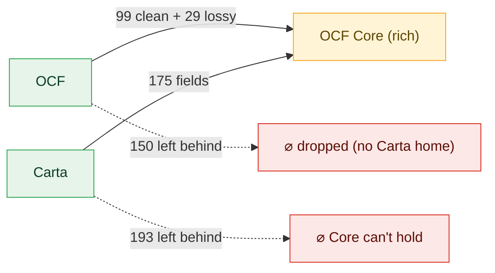

- **OCF → Core**: a property flows in if it is a Core member (mapped, even lossily); it is
  left behind only if it has **no Carta home** (`no-destination`).
- **Carta → Core**: a Carta field flows in if some mapping targets it (a Carta doc can fill
  that Core slot); left behind = a Carta field no mapping targets. Plus **41**
  object-typed Carta `$defs` are targeted nowhere at all (whole concepts OCF lacks — gap report b).

## Hub flow — per related group (what flows in vs is lost, both sides)

One diagram per connected group of related objects (OCF objects joined to the Carta objects
they map into). **Solid** edges = a property that FLOWS IN (`OCF field → Carta prop`). **Dashed**
edges to a red void = properties LOST: OCF fields with no Carta home, and Carta fields no OCF
source fills. Loss lists are capped per object (full names in the tables below); OCF nodes are
green (in Core) / dashed grey (not admissible). Groups are largest-first.

**→ Certificate, CertificateCancellationTransaction, CertificateIssuanceTransaction, CertificatePrecededBy, OptionExerciseTransaction, RestrictedStockAward, RestrictedStockAwardPrecededBy, RestrictedStockUnitSettlement, RsaCancellationTransaction, RsaIssuanceTransaction, RsuSettlementTransaction, SarExerciseTransaction**

```mermaid
flowchart LR
  classDef adm fill:#e6f4ea,stroke:#34a853,color:#0b3d20;
  classDef notadm fill:#f1f3f4,stroke:#9aa0a6,color:#5f6368,stroke-dasharray:4 3;
  classDef carta fill:#e8f0fe,stroke:#1a73e8,color:#0d2b66;
  classDef lost fill:#fce8e6,stroke:#d93025,color:#5c0d06;
  subgraph SRC["OCF (= Core, source)"]
    direction TB
    o0["EquityCompensationExercise"]:::adm
    o1["EquityCompensationRelease"]:::adm
    o2["StockAcceptance"]:::notadm
    o3["StockCancellation"]:::adm
    o4["StockConsolidation"]:::notadm
    o5["StockConversion"]:::notadm
    o6["StockIssuance"]:::adm
    o7["StockReissuance"]:::notadm
    o8["StockRepurchase"]:::notadm
    o9["StockTransfer"]:::adm
  end
  subgraph TGT["Carta"]
    direction TB
    t0["Certificate"]:::carta
    t1["CertificateCancellationTransaction"]:::carta
    t2["CertificateIssuanceTransaction"]:::carta
    t3["CertificatePrecededBy"]:::carta
    t4["OptionExerciseTransaction"]:::carta
    t5["RestrictedStockAward"]:::carta
    t6["RestrictedStockAwardPrecededBy"]:::carta
    t7["RestrictedStockUnitSettlement"]:::carta
    t8["RsaCancellationTransaction"]:::carta
    t9["RsaIssuanceTransaction"]:::carta
    t10["RsuSettlementTransaction"]:::carta
    t11["SarExerciseTransaction"]:::carta
  end
  ocflost["⌀ OCF lost (no Carta home)"]:::lost
  cartalost["⌀ Carta lost (no OCF source)"]:::lost
  o0 -->|"date → sharesAcquiredDatetime"| t4
  o0 -->|"date → sharesAcquiredDatetime"| t11
  o0 -->|"quantity → quantity"| t4
  o0 -->|"quantity → quantity"| t11
  o0 -->|"resulting_security_ids → securities"| t3
  o1 -->|"date → settlementDatetime"| t10
  o1 -->|"quantity → settledQuantity"| t10
  o1 -->|"release_price → settlementPrice"| t7
  o1 -->|"resulting_security_ids → securities"| t3
  o1 -->|"settlement_date → settlementDate"| t7
  o2 -->|"date → stakeholderAcceptanceDate"| t5
  o3 -->|"balance_security_id → securities"| t6
  o3 -->|"balance_security_id → securities"| t3
  o3 -->|"date → effectiveDatetime"| t8
  o3 -->|"date → effectiveDatetime"| t1
  o3 -->|"quantity → quantity"| t8
  o3 -->|"quantity → quantity"| t1
  o4 -->|"resulting_security_id → securities"| t6
  o4 -->|"resulting_security_id → securities"| t3
  o4 -->|"security_ids → securities"| t6
  o4 -->|"security_ids → securities"| t3
  o5 -->|"balance_security_id → securities"| t6
  o5 -->|"balance_security_id → securities"| t3
  o5 -->|"resulting_security_ids → securities"| t6
  o5 -->|"resulting_security_ids → securities"| t3
  o6 -->|"board_approval_date → boardApprovalDate"| t5
  o6 -->|"cost_basis → acquisitionCost"| t9
  o6 -->|"cost_basis → acquisitionCost"| t2
  o6 -->|"custom_id → securityLabel"| t5
  o6 -->|"custom_id → securityLabel"| t0
  o6 -->|"date → issueDatetime"| t9
  o6 -->|"date → issueDatetime"| t2
  o6 -->|"quantity → quantity"| t9
  o6 -->|"quantity → quantity"| t2
  o6 -->|"security_id → securityId"| t5
  o6 -->|"security_id → securityId"| t0
  o6 -->|"share_price → pricePerShare"| t5
  o6 -->|"share_price → pricePerShare"| t0
  o6 -->|"stakeholder_id → stakeholderId"| t5
  o6 -->|"stakeholder_id → stakeholderId"| t0
  o6 -->|"stock_class_id → shareClassId"| t5
  o6 -->|"stock_class_id → shareClassId"| t0
  o6 -->|"stock_plan_id → equityPlanId"| t9
  o6 -->|"stock_plan_id → equityPlanId"| t2
  o6 -->|"vesting_terms_id → vestingScheduleTemplateId"| t9
  o6 -->|"vesting_terms_id → vestingScheduleTemplateId"| t2
  o6 -->|"vestings → vestingEvents"| t5
  o7 -->|"resulting_security_ids → securities"| t6
  o7 -->|"resulting_security_ids → securities"| t3
  o8 -->|"balance_security_id → securities"| t6
  o8 -->|"balance_security_id → securities"| t3
  o9 -->|"balance_security_id → securities"| t6
  o9 -->|"balance_security_id → securities"| t3
  o9 -->|"date → issueDatetime"| t9
  o9 -->|"date → issueDatetime"| t2
  o9 -->|"quantity → quantity"| t9
  o9 -->|"quantity → quantity"| t2
  o9 -->|"resulting_security_ids → securities"| t6
  o9 -->|"resulting_security_ids → securities"| t3
  o0 -.->|"consideration_text, security_id"| ocflost
  o1 -.->|"consideration_text, security_id"| ocflost
  o2 -.->|"security_id"| ocflost
  o3 -.->|"reason_text, security_id"| ocflost
  o4 -.->|"date, reason_text"| ocflost
  o5 -.->|"date, quantity_converted, security_id"| ocflost
  o6 -.->|"consideration_text, issuance_type, security_law_exemptions, share_numbers_issued, stock_legend_ids, stockholder_approval_date"| ocflost
  o7 -.->|"date, reason_text, security_id, split_transaction_id"| ocflost
  o8 -.->|"consideration_text, date, price, quantity, security_id"| ocflost
  o9 -.->|"consideration_text, security_id"| ocflost
  t0 -.->|"id, vestingScheduleTemplateId, issuerId, shareClassName, issueDate, quantity +6 more"| cartalost
  t1 -.->|"reason, terminationDatetime, forfeitureDatetime"| cartalost
  t2 -.->|"shareClassId, issuanceReason, precededBySecurityId"| cartalost
  t3 -.->|"reason"| cartalost
  t4 -.->|"id, exerciseMethod, recordType, resultingSecurityId, resultingSecurityType, resultingSecurityLabel"| cartalost
  t5 -.->|"id, vestingScheduleTemplateId, issuerId, equityIncentivePlanName, shareClassName, issueDate +11 more"| cartalost
  t6 -.->|"reason"| cartalost
  t7 -.->|"releaseQuantity, saleQuantity, withholdingQuantity, netSettlementQuantity, certificateId, certificateLabel"| cartalost
  t8 -.->|"reason, terminationDatetime, forfeitureDatetime"| cartalost
  t9 -.->|"shareClassId"| cartalost
  t10 -.->|"id, withheldQuantity, resultingSecurityId, resultingSecurityType, resultingSecurityLabel"| cartalost
  t11 -.->|"withheldQuantity, settledQuantity, resultingSecurityId, resultingSecurityType, resultingSecurityLabel, cashAcquired"| cartalost
```

**→ OptionGrant, OptionIssuanceTransaction, RestrictedStockUnit, RsuIssuanceTransaction, SarIssuanceTransaction**

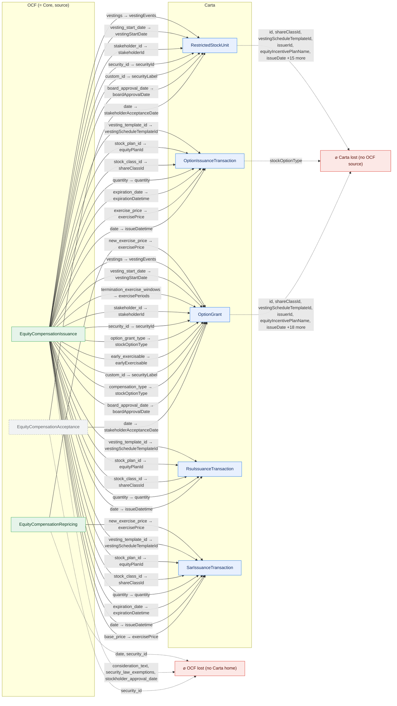

**→ Compliance, ConvertibleCancellationTransaction, ConvertibleIssuanceTransaction, ConvertibleNote, ConvertibleTransactionItem, NoteBlock, WarrantExerciseTransaction, WarrantIssuanceTransaction, WarrantTransactionItem, WarrantTransferTransaction**

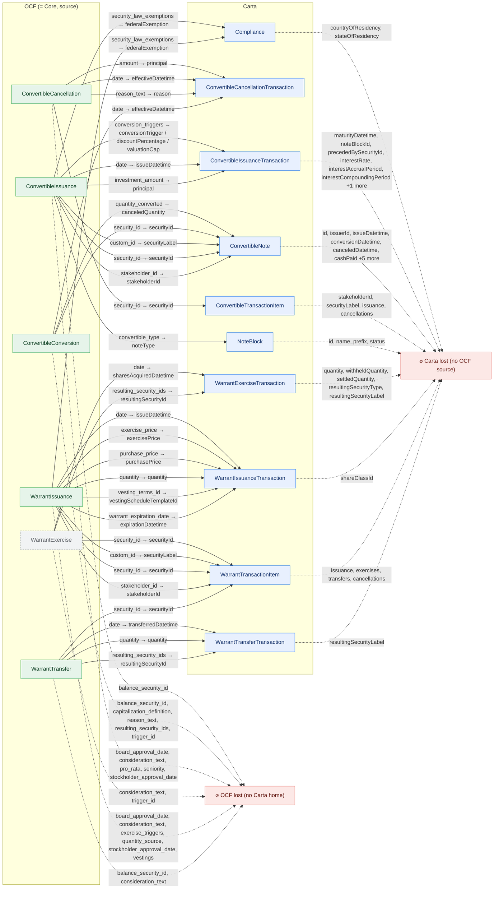

**→ ShareClass, ShareClassRightsAndPreferences**

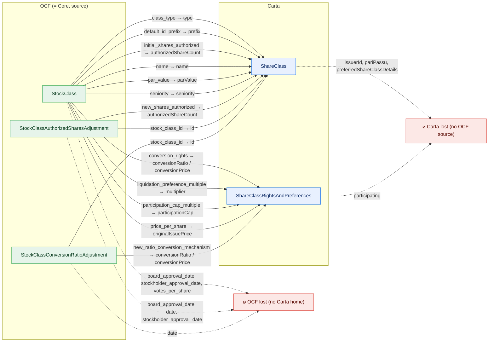

**→ Stakeholder**

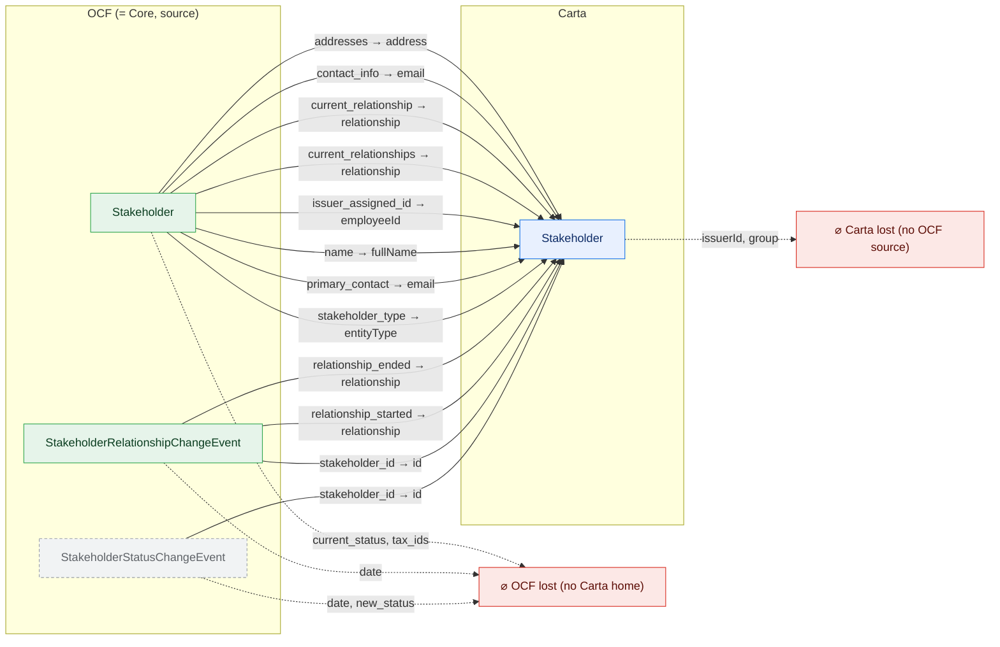

**→ OptionCancellationTransaction, RsuCancellationTransaction, SarCancellationTransaction**

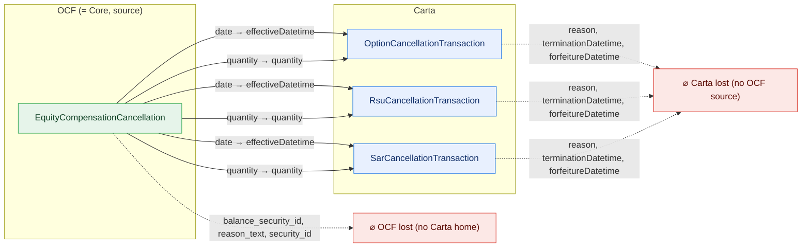

**→ OptionPoolSummary**

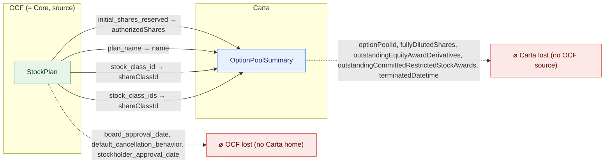

**→ WarrantCancellationTransaction**

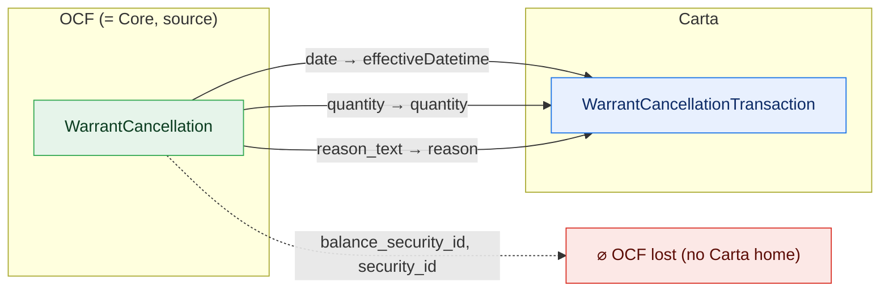

**→ Document**

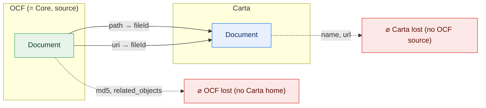

**→ Issuer**

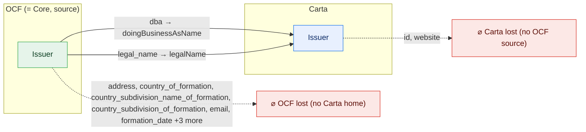

**→ ShareClassValuation**

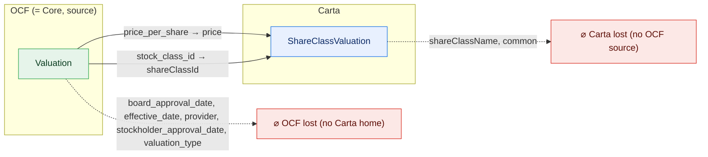

**→ VestingScheduleTemplate**

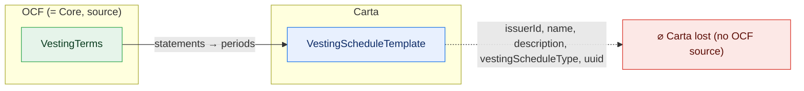

## OCF → Core — per object (fields; clean = direct/coarsen, lossy = has a home but narrows, left behind = no home)

See `core-lossy-inventory.md` / `core-unmapped-inventory.md` for the property names. Counts here
are DISTINCT fields per object (variants collapsed; a field that lands in any variant is not
"left behind"), so totals run lower than those inventories' per-(entity,variant,field) row counts.

| OCF object | in Core | clean | lossy | left behind |
| --- | :---: | ---: | ---: | ---: |
| Issuer | ✓ | 2 | 0 | 9 |
| ConvertibleIssuance | ✓ | 6 | 2 | 5 |
| WarrantIssuance | ✓ | 9 | 1 | 6 |
| ConvertibleTransfer | ✗ | 0 | 0 | 6 |
| EquityCompensationTransfer | ✗ | 0 | 0 | 6 |
| Stakeholder | ✓ | 4 | 4 | 2 |
| StockIssuance | ✓ | 12 | 0 | 6 |
| StockRepurchase | ✗ | 0 | 1 | 5 |
| ConvertibleConversion | ✓ | 3 | 0 | 5 |
| IssuerAuthorizedSharesAdjustment | ✗ | 0 | 0 | 5 |
| StockClass | ✓ | 8 | 2 | 3 |
| StockConversion | ✗ | 0 | 2 | 3 |
| StockPlanPoolAdjustment | ✗ | 0 | 0 | 5 |
| StockPlanReturnToPool | ✗ | 0 | 0 | 5 |
| StockReissuance | ✗ | 0 | 1 | 4 |
| Valuation | ✓ | 2 | 0 | 5 |
| Document | ✓ | 0 | 2 | 2 |
| EquityCompensationIssuance | ✓ | 17 | 1 | 3 |
| StockConsolidation | ✗ | 0 | 2 | 2 |
| StockPlan | ✓ | 3 | 1 | 3 |
| StockTransfer | ✓ | 2 | 2 | 2 |
| VestingAcceleration | ✗ | 0 | 0 | 4 |
| ConvertibleRetraction | ✗ | 0 | 0 | 3 |
| EquityCompensationCancellation | ✓ | 2 | 0 | 3 |
| EquityCompensationExercise | ✓ | 2 | 1 | 2 |
| EquityCompensationRelease | ✓ | 4 | 1 | 2 |
| EquityCompensationRetraction | ✗ | 0 | 0 | 3 |
| Financing | ✗ | 0 | 0 | 3 |
| StockCancellation | ✓ | 2 | 1 | 2 |
| StockClassAuthorizedSharesAdjustment | ✓ | 2 | 0 | 3 |
| StockClassSplit | ✗ | 0 | 0 | 3 |
| StockRetraction | ✗ | 0 | 0 | 3 |
| VestingEvent | ✗ | 0 | 0 | 3 |
| WarrantCancellation | ✓ | 2 | 1 | 2 |
| WarrantExercise | ✗ | 2 | 1 | 2 |
| WarrantRetraction | ✗ | 0 | 0 | 3 |
| WarrantTransfer | ✓ | 3 | 1 | 2 |
| ConvertibleAcceptance | ✗ | 0 | 0 | 2 |
| ConvertibleCancellation | ✓ | 3 | 1 | 1 |
| EquityCompensationRepricing | ✓ | 1 | 0 | 2 |
| StakeholderStatusChangeEvent | ✗ | 1 | 0 | 2 |
| StockClassConversionRatioAdjustment | ✓ | 1 | 1 | 1 |
| StockLegendTemplate | ✗ | 0 | 0 | 2 |
| WarrantAcceptance | ✗ | 0 | 0 | 2 |
| EquityCompensationAcceptance | ✗ | 1 | 0 | 1 |
| StakeholderRelationshipChangeEvent | ✓ | 3 | 0 | 1 |
| StockAcceptance | ✗ | 1 | 0 | 1 |
| VestingTerms | ✓ | 1 | 0 | 0 |

## Carta → Core — per object (which Carta fields OCF fills vs leaves empty)

Only Carta objects a green mapping writes into. `filled` = a Core slot a Carta doc can
populate; `left behind` = Carta capability Core (being OCF-shaped) doesn't represent.

| Carta object | fills | left behind | left-behind fields |
| --- | ---: | ---: | --- |
| OptionGrant | 11 | 24 | id, shareClassId, vestingScheduleTemplateId, issuerId, equityIncentivePlanName, issueDate, canceledDate, grantExpirationDate, lastExercisableDate, disqualificationDate, isoNsoSplit, quantity, outstandingQuantity, vestedQuantity, exercisedQuantity, exercises, terminationDate, vestingSchedule, canceledQuantity, forfeitedQuantity, expiredQuantity, returnedToPoolQuantity, returnedToTreasuryQuantity, lastModifiedDatetime |
| RestrictedStockUnit | 7 | 21 | id, shareClassId, vestingScheduleTemplateId, issuerId, equityIncentivePlanName, issueDate, quantity, vestedQuantity, releasedQuantity, releasePricePerShare, netSettledQuantity, canceledDate, terminationDate, settlements, vestingSchedule, canceledQuantity, forfeitedQuantity, expiredQuantity, returnedToPoolQuantity, returnedToTreasuryQuantity, lastModifiedDatetime |
| RestrictedStockAward | 8 | 17 | id, vestingScheduleTemplateId, issuerId, equityIncentivePlanName, shareClassName, issueDate, vestingStartDate, canceledDate, terminationDate, quantity, vestedQuantity, vestingSchedule, canceledQuantity, returnedToPoolQuantity, returnedToTreasuryQuantity, lastModifiedDatetime, precededBy |
| Certificate | 5 | 12 | id, vestingScheduleTemplateId, issuerId, shareClassName, issueDate, quantity, canceledDate, canceledQuantity, returnedToPoolQuantity, returnedToTreasuryQuantity, lastModifiedDatetime, precededBy |
| ConvertibleNote | 10 | 11 | id, issuerId, issueDatetime, conversionDatetime, canceledDatetime, cashPaid, maturityDatetime, interest, noteBlock, changeInControlPercent, conversionTrigger |
| OptionGrantVestingEvent | 2 | 8 | id, isoQuantity, nsoQuantity, performanceCondition, vested, maxQuantity, targetQuantity, vestedQuantity |
| ConvertibleIssuanceTransaction | 5 | 7 | maturityDatetime, noteBlockId, precededBySecurityId, interestRate, interestAccrualPeriod, interestCompoundingPeriod, dayCountBasis |
| OptionExerciseTransaction | 2 | 6 | id, exerciseMethod, recordType, resultingSecurityId, resultingSecurityType, resultingSecurityLabel |
| RestrictedStockUnitSettlement | 2 | 6 | releaseQuantity, saleQuantity, withholdingQuantity, netSettlementQuantity, certificateId, certificateLabel |
| SarExerciseTransaction | 2 | 6 | withheldQuantity, settledQuantity, resultingSecurityId, resultingSecurityType, resultingSecurityLabel, cashAcquired |
| OptionPoolSummary | 3 | 5 | optionPoolId, fullyDilutedShares, outstandingEquityAwardDerivatives, outstandingCommittedRestrictedStockAwards, terminatedDatetime |
| RsuSettlementTransaction | 2 | 5 | id, withheldQuantity, resultingSecurityId, resultingSecurityType, resultingSecurityLabel |
| VestingScheduleTemplate | 2 | 5 | issuerId, name, description, vestingScheduleType, uuid |
| WarrantExerciseTransaction | 2 | 5 | quantity, withheldQuantity, settledQuantity, resultingSecurityType, resultingSecurityLabel |
| ConvertibleTransactionItem | 1 | 4 | stakeholderId, securityLabel, issuance, cancellations |
| NoteBlock | 1 | 4 | id, name, prefix, status |
| WarrantTransactionItem | 3 | 4 | issuance, exercises, transfers, cancellations |
| CertificateCancellationTransaction | 2 | 3 | reason, terminationDatetime, forfeitureDatetime |
| CertificateIssuanceTransaction | 5 | 3 | shareClassId, issuanceReason, precededBySecurityId |
| OptionCancellationTransaction | 2 | 3 | reason, terminationDatetime, forfeitureDatetime |
| RsaCancellationTransaction | 2 | 3 | reason, terminationDatetime, forfeitureDatetime |
| RsuCancellationTransaction | 2 | 3 | reason, terminationDatetime, forfeitureDatetime |
| SarCancellationTransaction | 2 | 3 | reason, terminationDatetime, forfeitureDatetime |
| ShareClass | 7 | 3 | issuerId, pariPassu, preferredShareClassDetails |
| VestingPeriod | 9 | 3 | vestingOccurs, immediatePercentage, milestoneName |
| Compliance | 1 | 2 | countryOfResidency, stateOfResidency |
| Document | 1 | 2 | name, url |
| Issuer | 2 | 2 | id, website |
| PointOfContact | 2 | 2 | issuerId, type |
| ShareClassValuation | 2 | 2 | shareClassName, common |
| Stakeholder | 7 | 2 | issuerId, group |
| CertificatePrecededBy | 1 | 1 | reason |
| OptionIssuanceTransaction | 7 | 1 | stockOptionType |
| RestrictedStockAwardPrecededBy | 1 | 1 | reason |
| RsaIssuanceTransaction | 5 | 1 | shareClassId |
| ShareClassRightsAndPreferences | 5 | 1 | participating |
| WarrantIssuanceTransaction | 6 | 1 | shareClassId |
| WarrantTransferTransaction | 3 | 1 | resultingSecurityLabel |
| ConvertibleCancellationTransaction | 3 | 0 | — |
| ExercisePeriods | 12 | 0 | — |
| Money | 2 | 0 | — |
| RsuIssuanceTransaction | 5 | 0 | — |
| SarIssuanceTransaction | 7 | 0 | — |
| StakeholderAddress | 1 | 0 | — |
| WarrantCancellationTransaction | 3 | 0 | — |

