# OCF Core — bidirectional coverage (generated, discussion artifact)

GENERATED by `npm run core:bidi`. NOT drift-gated — an analysis input, not a contract.

**OCF Core (rich)** is the interop hub. Both formats feed it: OCF *projects* into Core
(Core is OCF-shaped), and Carta *populates* Core via the reverse of each mapping edge. This
shows, from each side, what flows IN and what is LEFT BEHIND.

## Overview

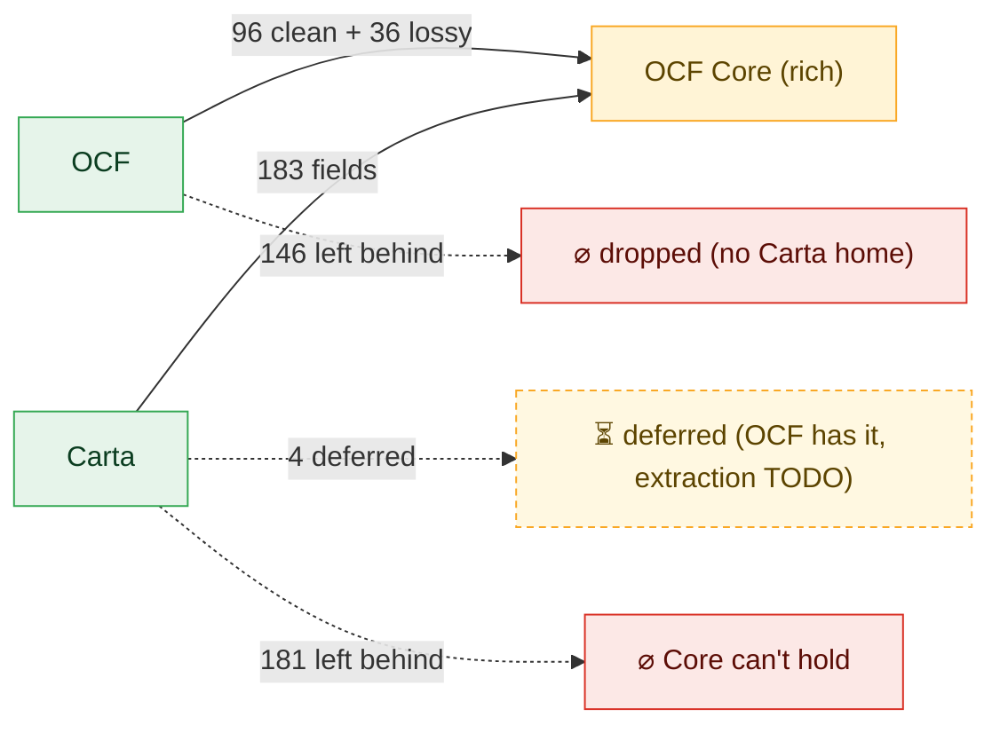

- **OCF → Core**: a property flows in if it is a Core member (mapped, even lossily); it is
  left behind only if it has **no Carta home** (`no-destination`).
- **Carta → Core**: a Carta field flows in if some mapping targets it (a Carta doc can fill
  that Core slot); left behind = a Carta field no mapping targets. Plus **41**
  object-typed Carta `$defs` get no field-level mapping — of these, **9** are `$ref`-reachable from a targeted parent (OCF data flows in
  via the parent, e.g. the `…VestingEvent` / `…PrecededBy` element types), leaving **32** untouched: mostly concepts OCF lacks (rollup
  summaries, phantom/PIU families) plus a few shared value-types (`Date`, `Jurisdiction`).
  See gap report b.

## Hub flow — per related group (what flows in vs is lost, both sides)

One diagram per OCF object — each polymorphic flavor (`Object [Variant]`) fully separate — with
the Carta objects it maps into. **Solid** edges = a property that FLOWS IN
(`OCF field → Carta prop`). **`⊙`** edges = a Carta slot the composite fills with a FIXED value
(the `*_TRANSFERRED` reason codes) — known implicitly, not from an OCF field. **Dashed** edges to
a red void = properties LOST: OCF fields with no Carta home, and Carta fields no OCF source fills.
Loss lists are capped per object (full names in the tables below); OCF nodes are green (in Core) /
dashed grey (not admissible).

**EquityCompensationIssuance [Option] → Compliance, OptionGrant, OptionIssuanceTransaction**

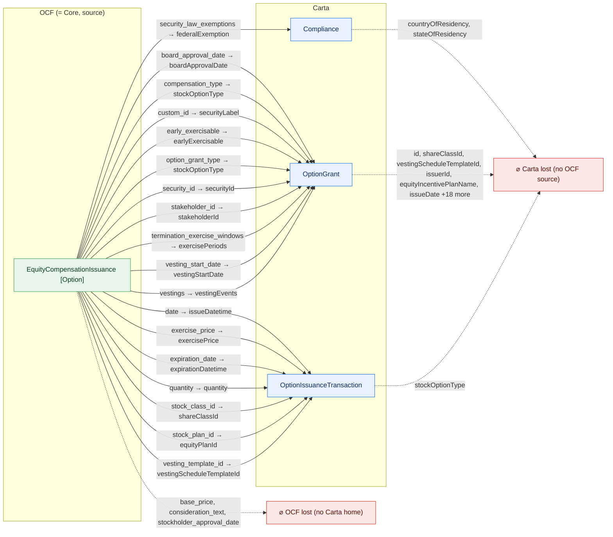

**StockIssuance [Rsa] → Compliance, RestrictedStockAward, RsaIssuanceTransaction**

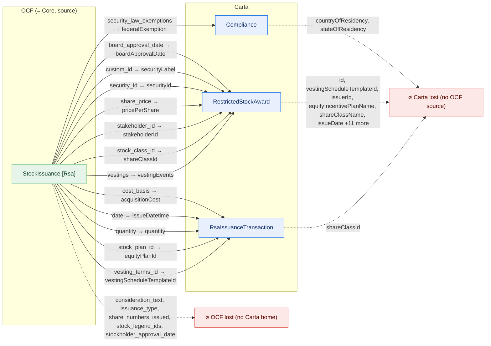

**EquityCompensationIssuance [Rsu] → Compliance, RestrictedStockUnit, RsuIssuanceTransaction**

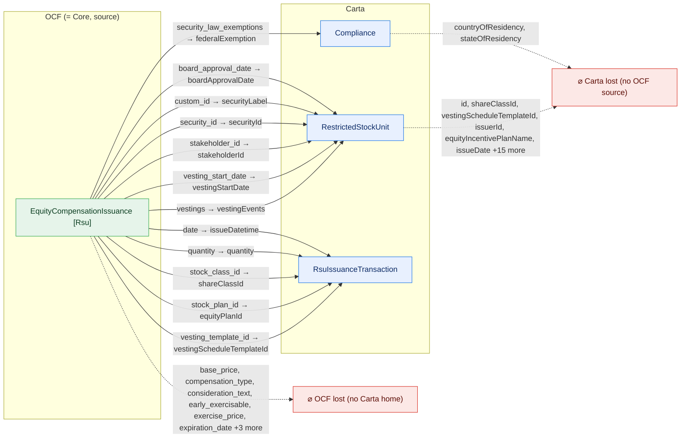

**StockIssuance [Default] → Certificate, CertificateIssuanceTransaction, Compliance**

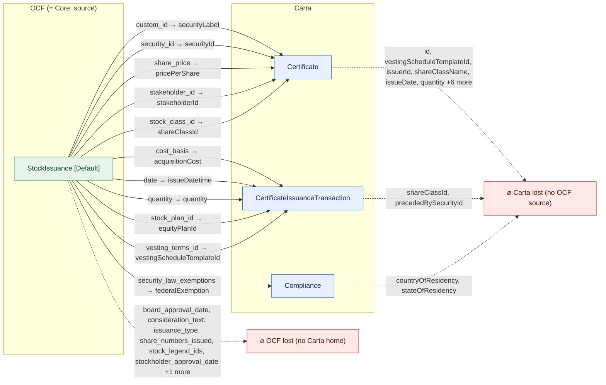

**StockClass → ShareClass, ShareClassRightsAndPreferences**

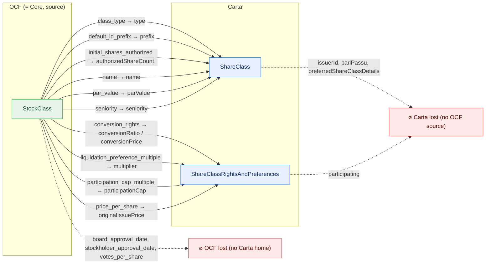

**WarrantIssuance → Compliance, WarrantIssuanceTransaction, WarrantTransactionItem**

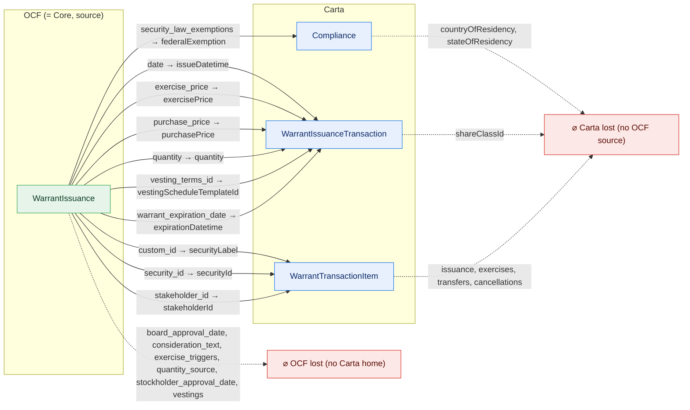

**ConvertibleIssuance → Compliance, ConvertibleIssuanceTransaction, ConvertibleNote, NoteBlock**

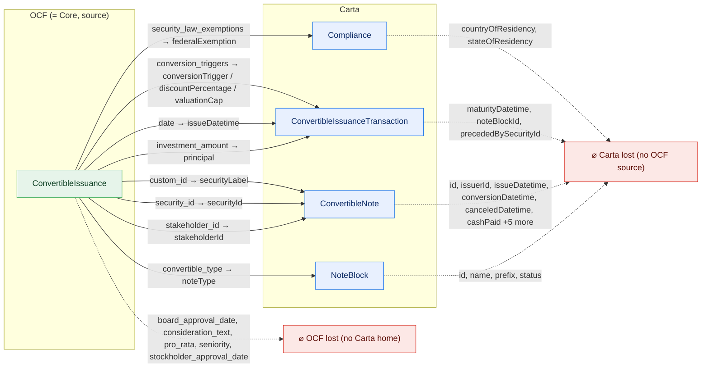

**EquityCompensationIssuance [Sar] → Compliance, SarIssuanceTransaction**

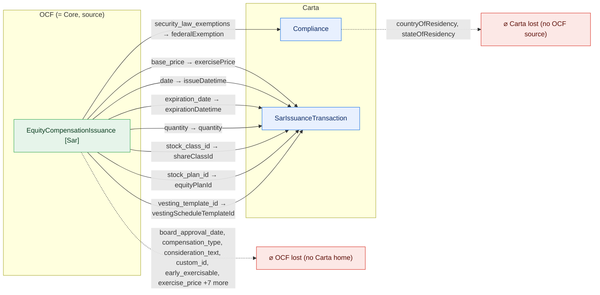

**Stakeholder → Stakeholder**


**StockTransfer [Default] → CertificateCancellationTransaction, CertificateIssuanceTransaction, CertificatePrecededBy**

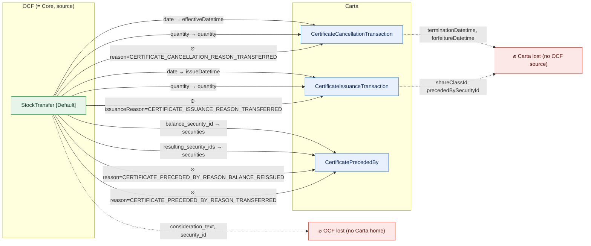

**StockTransfer [Rsa] → RestrictedStockAwardPrecededBy, RsaCancellationTransaction, RsaIssuanceTransaction**

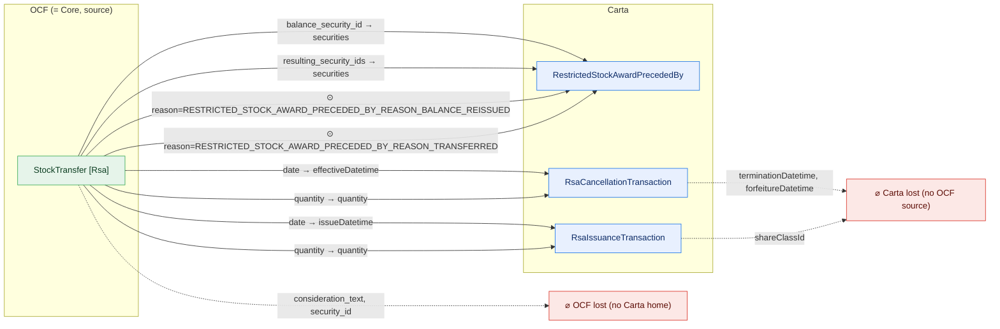

**EquityCompensationRelease [Rsu] → CertificatePrecededBy, RestrictedStockUnitSettlement, RsuSettlementTransaction**

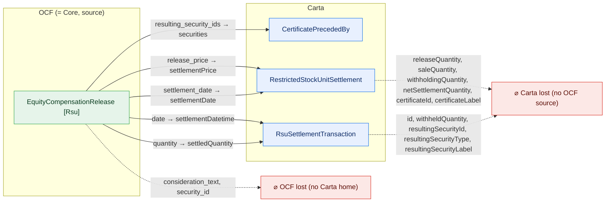

**ConvertibleCancellation → ConvertibleCancellationTransaction, ConvertibleTransactionItem**

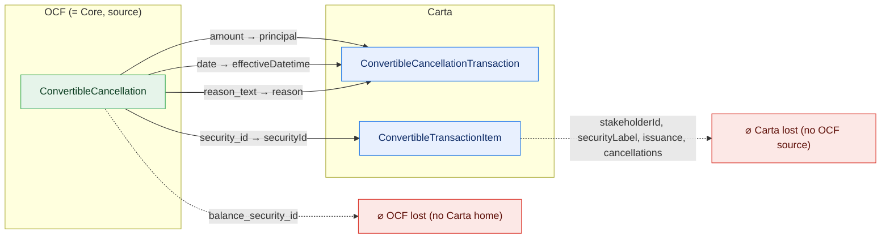

**StockCancellation [Default] → CertificateCancellationTransaction, CertificatePrecededBy**

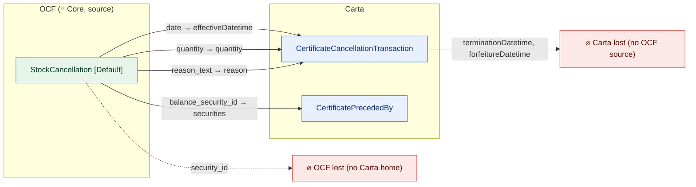

**StockCancellation [Rsa] → RestrictedStockAwardPrecededBy, RsaCancellationTransaction**

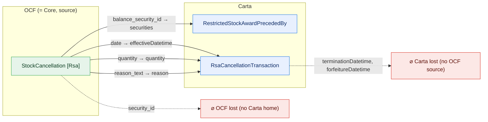

**StockPlan → OptionPoolSummary**

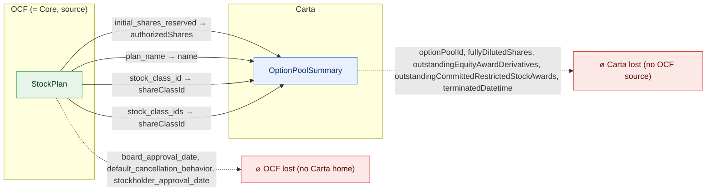

**WarrantTransfer → WarrantTransactionItem, WarrantTransferTransaction**

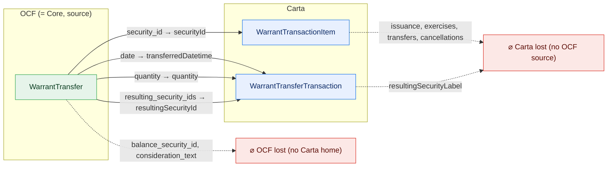

**ConvertibleConversion → ConvertibleCancellationTransaction, ConvertibleNote**

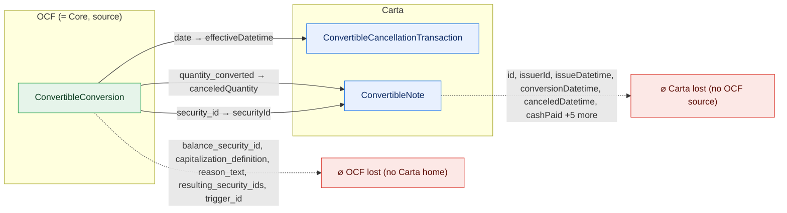

**EquityCompensationCancellation [Option] → OptionCancellationTransaction**

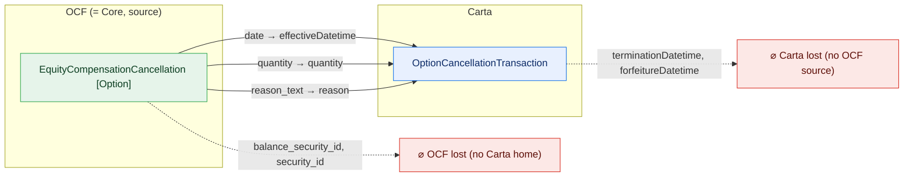

**EquityCompensationCancellation [Rsu] → RsuCancellationTransaction**

```mermaid
flowchart LR
  classDef adm fill:#e6f4ea,stroke:#34a853,color:#0b3d20;
  classDef notadm fill:#f1f3f4,stroke:#9aa0a6,color:#5f6368,stroke-dasharray:4 3;
  classDef carta fill:#e8f0fe,stroke:#1a73e8,color:#0d2b66;
  classDef lost fill:#fce8e6,stroke:#d93025,color:#5c0d06;
  subgraph SRC["OCF (= Core, source)"]
    direction TB
    o0["EquityCompensationCancellation [Rsu]"]:::adm
  end
  subgraph TGT["Carta"]
    direction TB
    t0["RsuCancellationTransaction"]:::carta
  end
  ocflost["⌀ OCF lost (no Carta home)"]:::lost
  cartalost["⌀ Carta lost (no OCF source)"]:::lost
  o0 -->|"date → effectiveDatetime"| t0
  o0 -->|"quantity → quantity"| t0
  o0 -->|"reason_text → reason"| t0
  o0 -.->|"balance_security_id, security_id"| ocflost
  t0 -.->|"terminationDatetime, forfeitureDatetime"| cartalost
```

**EquityCompensationCancellation [Sar] → SarCancellationTransaction**

```mermaid
flowchart LR
  classDef adm fill:#e6f4ea,stroke:#34a853,color:#0b3d20;
  classDef notadm fill:#f1f3f4,stroke:#9aa0a6,color:#5f6368,stroke-dasharray:4 3;
  classDef carta fill:#e8f0fe,stroke:#1a73e8,color:#0d2b66;
  classDef lost fill:#fce8e6,stroke:#d93025,color:#5c0d06;
  subgraph SRC["OCF (= Core, source)"]
    direction TB
    o0["EquityCompensationCancellation [Sar]"]:::adm
  end
  subgraph TGT["Carta"]
    direction TB
    t0["SarCancellationTransaction"]:::carta
  end
  ocflost["⌀ OCF lost (no Carta home)"]:::lost
  cartalost["⌀ Carta lost (no OCF source)"]:::lost
  o0 -->|"date → effectiveDatetime"| t0
  o0 -->|"quantity → quantity"| t0
  o0 -->|"reason_text → reason"| t0
  o0 -.->|"balance_security_id, security_id"| ocflost
  t0 -.->|"terminationDatetime, forfeitureDatetime"| cartalost
```

**EquityCompensationExercise [Option] → CertificatePrecededBy, OptionExerciseTransaction**

```mermaid
flowchart LR
  classDef adm fill:#e6f4ea,stroke:#34a853,color:#0b3d20;
  classDef notadm fill:#f1f3f4,stroke:#9aa0a6,color:#5f6368,stroke-dasharray:4 3;
  classDef carta fill:#e8f0fe,stroke:#1a73e8,color:#0d2b66;
  classDef lost fill:#fce8e6,stroke:#d93025,color:#5c0d06;
  subgraph SRC["OCF (= Core, source)"]
    direction TB
    o0["EquityCompensationExercise [Option]"]:::adm
  end
  subgraph TGT["Carta"]
    direction TB
    t0["CertificatePrecededBy"]:::carta
    t1["OptionExerciseTransaction"]:::carta
  end
  ocflost["⌀ OCF lost (no Carta home)"]:::lost
  cartalost["⌀ Carta lost (no OCF source)"]:::lost
  o0 -->|"date → sharesAcquiredDatetime"| t1
  o0 -->|"quantity → quantity"| t1
  o0 -->|"resulting_security_ids → securities"| t0
  o0 -.->|"consideration_text, security_id"| ocflost
  t1 -.->|"id, exerciseMethod, recordType, resultingSecurityId, resultingSecurityType, resultingSecurityLabel"| cartalost
```

**EquityCompensationExercise [Sar] → CertificatePrecededBy, SarExerciseTransaction**

```mermaid
flowchart LR
  classDef adm fill:#e6f4ea,stroke:#34a853,color:#0b3d20;
  classDef notadm fill:#f1f3f4,stroke:#9aa0a6,color:#5f6368,stroke-dasharray:4 3;
  classDef carta fill:#e8f0fe,stroke:#1a73e8,color:#0d2b66;
  classDef lost fill:#fce8e6,stroke:#d93025,color:#5c0d06;
  subgraph SRC["OCF (= Core, source)"]
    direction TB
    o0["EquityCompensationExercise [Sar]"]:::adm
  end
  subgraph TGT["Carta"]
    direction TB
    t0["CertificatePrecededBy"]:::carta
    t1["SarExerciseTransaction"]:::carta
  end
  ocflost["⌀ OCF lost (no Carta home)"]:::lost
  cartalost["⌀ Carta lost (no OCF source)"]:::lost
  o0 -->|"date → sharesAcquiredDatetime"| t1
  o0 -->|"quantity → quantity"| t1
  o0 -->|"resulting_security_ids → securities"| t0
  o0 -.->|"consideration_text, security_id"| ocflost
  t1 -.->|"withheldQuantity, settledQuantity, resultingSecurityId, resultingSecurityType, resultingSecurityLabel, cashAcquired"| cartalost
```

**StakeholderRelationshipChangeEvent → Stakeholder**

```mermaid
flowchart LR
  classDef adm fill:#e6f4ea,stroke:#34a853,color:#0b3d20;
  classDef notadm fill:#f1f3f4,stroke:#9aa0a6,color:#5f6368,stroke-dasharray:4 3;
  classDef carta fill:#e8f0fe,stroke:#1a73e8,color:#0d2b66;
  classDef lost fill:#fce8e6,stroke:#d93025,color:#5c0d06;
  subgraph SRC["OCF (= Core, source)"]
    direction TB
    o0["StakeholderRelationshipChangeEvent"]:::adm
  end
  subgraph TGT["Carta"]
    direction TB
    t0["Stakeholder"]:::carta
  end
  ocflost["⌀ OCF lost (no Carta home)"]:::lost
  cartalost["⌀ Carta lost (no OCF source)"]:::lost
  o0 -->|"relationship_ended → relationship"| t0
  o0 -->|"relationship_started → relationship"| t0
  o0 -->|"stakeholder_id → id"| t0
  o0 -.->|"date"| ocflost
  t0 -.->|"issuerId, group"| cartalost
```

**WarrantCancellation → WarrantCancellationTransaction**

```mermaid
flowchart LR
  classDef adm fill:#e6f4ea,stroke:#34a853,color:#0b3d20;
  classDef notadm fill:#f1f3f4,stroke:#9aa0a6,color:#5f6368,stroke-dasharray:4 3;
  classDef carta fill:#e8f0fe,stroke:#1a73e8,color:#0d2b66;
  classDef lost fill:#fce8e6,stroke:#d93025,color:#5c0d06;
  subgraph SRC["OCF (= Core, source)"]
    direction TB
    o0["WarrantCancellation"]:::adm
  end
  subgraph TGT["Carta"]
    direction TB
    t0["WarrantCancellationTransaction"]:::carta
  end
  ocflost["⌀ OCF lost (no Carta home)"]:::lost
  o0 -->|"date → effectiveDatetime"| t0
  o0 -->|"quantity → quantity"| t0
  o0 -->|"reason_text → reason"| t0
  o0 -.->|"balance_security_id, security_id"| ocflost
```

**WarrantExercise → WarrantExerciseTransaction, WarrantTransactionItem**

```mermaid
flowchart LR
  classDef adm fill:#e6f4ea,stroke:#34a853,color:#0b3d20;
  classDef notadm fill:#f1f3f4,stroke:#9aa0a6,color:#5f6368,stroke-dasharray:4 3;
  classDef carta fill:#e8f0fe,stroke:#1a73e8,color:#0d2b66;
  classDef lost fill:#fce8e6,stroke:#d93025,color:#5c0d06;
  subgraph SRC["OCF (= Core, source)"]
    direction TB
    o0["WarrantExercise"]:::notadm
  end
  subgraph TGT["Carta"]
    direction TB
    t0["WarrantExerciseTransaction"]:::carta
    t1["WarrantTransactionItem"]:::carta
  end
  ocflost["⌀ OCF lost (no Carta home)"]:::lost
  cartalost["⌀ Carta lost (no OCF source)"]:::lost
  o0 -->|"date → sharesAcquiredDatetime"| t0
  o0 -->|"resulting_security_ids → resultingSecurityId"| t0
  o0 -->|"security_id → securityId"| t1
  o0 -.->|"consideration_text, trigger_id"| ocflost
  t0 -.->|"quantity, withheldQuantity, settledQuantity, resultingSecurityType, resultingSecurityLabel"| cartalost
  t1 -.->|"issuance, exercises, transfers, cancellations"| cartalost
```

**Document → Document**

```mermaid
flowchart LR
  classDef adm fill:#e6f4ea,stroke:#34a853,color:#0b3d20;
  classDef notadm fill:#f1f3f4,stroke:#9aa0a6,color:#5f6368,stroke-dasharray:4 3;
  classDef carta fill:#e8f0fe,stroke:#1a73e8,color:#0d2b66;
  classDef lost fill:#fce8e6,stroke:#d93025,color:#5c0d06;
  subgraph SRC["OCF (= Core, source)"]
    direction TB
    o0["Document"]:::adm
  end
  subgraph TGT["Carta"]
    direction TB
    t0["Document"]:::carta
  end
  ocflost["⌀ OCF lost (no Carta home)"]:::lost
  cartalost["⌀ Carta lost (no OCF source)"]:::lost
  o0 -->|"path → fileId"| t0
  o0 -->|"uri → fileId"| t0
  o0 -.->|"md5, related_objects"| ocflost
  t0 -.->|"name, url"| cartalost
```

**Issuer → Issuer**

```mermaid
flowchart LR
  classDef adm fill:#e6f4ea,stroke:#34a853,color:#0b3d20;
  classDef notadm fill:#f1f3f4,stroke:#9aa0a6,color:#5f6368,stroke-dasharray:4 3;
  classDef carta fill:#e8f0fe,stroke:#1a73e8,color:#0d2b66;
  classDef lost fill:#fce8e6,stroke:#d93025,color:#5c0d06;
  subgraph SRC["OCF (= Core, source)"]
    direction TB
    o0["Issuer"]:::adm
  end
  subgraph TGT["Carta"]
    direction TB
    t0["Issuer"]:::carta
  end
  ocflost["⌀ OCF lost (no Carta home)"]:::lost
  cartalost["⌀ Carta lost (no OCF source)"]:::lost
  o0 -->|"dba → doingBusinessAsName"| t0
  o0 -->|"legal_name → legalName"| t0
  o0 -.->|"address, country_of_formation, country_subdivision_name_of_formation, country_subdivision_of_formation, email, formation_date +3 more"| ocflost
  t0 -.->|"id, website"| cartalost
```

**StockClassAuthorizedSharesAdjustment → ShareClass**

```mermaid
flowchart LR
  classDef adm fill:#e6f4ea,stroke:#34a853,color:#0b3d20;
  classDef notadm fill:#f1f3f4,stroke:#9aa0a6,color:#5f6368,stroke-dasharray:4 3;
  classDef carta fill:#e8f0fe,stroke:#1a73e8,color:#0d2b66;
  classDef lost fill:#fce8e6,stroke:#d93025,color:#5c0d06;
  subgraph SRC["OCF (= Core, source)"]
    direction TB
    o0["StockClassAuthorizedSharesAdjustment"]:::adm
  end
  subgraph TGT["Carta"]
    direction TB
    t0["ShareClass"]:::carta
  end
  ocflost["⌀ OCF lost (no Carta home)"]:::lost
  cartalost["⌀ Carta lost (no OCF source)"]:::lost
  o0 -->|"new_shares_authorized → authorizedShareCount"| t0
  o0 -->|"stock_class_id → id"| t0
  o0 -.->|"board_approval_date, date, stockholder_approval_date"| ocflost
  t0 -.->|"issuerId, pariPassu, preferredShareClassDetails"| cartalost
```

**StockClassConversionRatioAdjustment → ShareClass, ShareClassRightsAndPreferences**

```mermaid
flowchart LR
  classDef adm fill:#e6f4ea,stroke:#34a853,color:#0b3d20;
  classDef notadm fill:#f1f3f4,stroke:#9aa0a6,color:#5f6368,stroke-dasharray:4 3;
  classDef carta fill:#e8f0fe,stroke:#1a73e8,color:#0d2b66;
  classDef lost fill:#fce8e6,stroke:#d93025,color:#5c0d06;
  subgraph SRC["OCF (= Core, source)"]
    direction TB
    o0["StockClassConversionRatioAdjustment"]:::adm
  end
  subgraph TGT["Carta"]
    direction TB
    t0["ShareClass"]:::carta
    t1["ShareClassRightsAndPreferences"]:::carta
  end
  ocflost["⌀ OCF lost (no Carta home)"]:::lost
  cartalost["⌀ Carta lost (no OCF source)"]:::lost
  o0 -->|"new_ratio_conversion_mechanism → conversionRatio / conversionPrice"| t1
  o0 -->|"stock_class_id → id"| t0
  o0 -.->|"date"| ocflost
  t0 -.->|"issuerId, pariPassu, preferredShareClassDetails"| cartalost
  t1 -.->|"participating"| cartalost
```

**StockConsolidation [Default] → CertificatePrecededBy**

```mermaid
flowchart LR
  classDef adm fill:#e6f4ea,stroke:#34a853,color:#0b3d20;
  classDef notadm fill:#f1f3f4,stroke:#9aa0a6,color:#5f6368,stroke-dasharray:4 3;
  classDef carta fill:#e8f0fe,stroke:#1a73e8,color:#0d2b66;
  classDef lost fill:#fce8e6,stroke:#d93025,color:#5c0d06;
  subgraph SRC["OCF (= Core, source)"]
    direction TB
    o0["StockConsolidation [Default]"]:::notadm
  end
  subgraph TGT["Carta"]
    direction TB
    t0["CertificatePrecededBy"]:::carta
  end
  ocflost["⌀ OCF lost (no Carta home)"]:::lost
  o0 -->|"resulting_security_id → securities"| t0
  o0 -->|"security_ids → securities"| t0
  o0 -.->|"date, reason_text"| ocflost
```

**StockConsolidation [Rsa] → RestrictedStockAwardPrecededBy**

```mermaid
flowchart LR
  classDef adm fill:#e6f4ea,stroke:#34a853,color:#0b3d20;
  classDef notadm fill:#f1f3f4,stroke:#9aa0a6,color:#5f6368,stroke-dasharray:4 3;
  classDef carta fill:#e8f0fe,stroke:#1a73e8,color:#0d2b66;
  classDef lost fill:#fce8e6,stroke:#d93025,color:#5c0d06;
  subgraph SRC["OCF (= Core, source)"]
    direction TB
    o0["StockConsolidation [Rsa]"]:::notadm
  end
  subgraph TGT["Carta"]
    direction TB
    t0["RestrictedStockAwardPrecededBy"]:::carta
  end
  ocflost["⌀ OCF lost (no Carta home)"]:::lost
  o0 -->|"resulting_security_id → securities"| t0
  o0 -->|"security_ids → securities"| t0
  o0 -.->|"date, reason_text"| ocflost
```

**StockConversion [Default] → CertificatePrecededBy**

```mermaid
flowchart LR
  classDef adm fill:#e6f4ea,stroke:#34a853,color:#0b3d20;
  classDef notadm fill:#f1f3f4,stroke:#9aa0a6,color:#5f6368,stroke-dasharray:4 3;
  classDef carta fill:#e8f0fe,stroke:#1a73e8,color:#0d2b66;
  classDef lost fill:#fce8e6,stroke:#d93025,color:#5c0d06;
  subgraph SRC["OCF (= Core, source)"]
    direction TB
    o0["StockConversion [Default]"]:::notadm
  end
  subgraph TGT["Carta"]
    direction TB
    t0["CertificatePrecededBy"]:::carta
  end
  ocflost["⌀ OCF lost (no Carta home)"]:::lost
  o0 -->|"balance_security_id → securities"| t0
  o0 -->|"resulting_security_ids → securities"| t0
  o0 -.->|"date, quantity_converted, security_id"| ocflost
```

**StockConversion [Rsa] → RestrictedStockAwardPrecededBy**

```mermaid
flowchart LR
  classDef adm fill:#e6f4ea,stroke:#34a853,color:#0b3d20;
  classDef notadm fill:#f1f3f4,stroke:#9aa0a6,color:#5f6368,stroke-dasharray:4 3;
  classDef carta fill:#e8f0fe,stroke:#1a73e8,color:#0d2b66;
  classDef lost fill:#fce8e6,stroke:#d93025,color:#5c0d06;
  subgraph SRC["OCF (= Core, source)"]
    direction TB
    o0["StockConversion [Rsa]"]:::notadm
  end
  subgraph TGT["Carta"]
    direction TB
    t0["RestrictedStockAwardPrecededBy"]:::carta
  end
  ocflost["⌀ OCF lost (no Carta home)"]:::lost
  o0 -->|"balance_security_id → securities"| t0
  o0 -->|"resulting_security_ids → securities"| t0
  o0 -.->|"date, quantity_converted, security_id"| ocflost
```

**Valuation → ShareClassValuation**

```mermaid
flowchart LR
  classDef adm fill:#e6f4ea,stroke:#34a853,color:#0b3d20;
  classDef notadm fill:#f1f3f4,stroke:#9aa0a6,color:#5f6368,stroke-dasharray:4 3;
  classDef carta fill:#e8f0fe,stroke:#1a73e8,color:#0d2b66;
  classDef lost fill:#fce8e6,stroke:#d93025,color:#5c0d06;
  subgraph SRC["OCF (= Core, source)"]
    direction TB
    o0["Valuation"]:::adm
  end
  subgraph TGT["Carta"]
    direction TB
    t0["ShareClassValuation"]:::carta
  end
  ocflost["⌀ OCF lost (no Carta home)"]:::lost
  cartalost["⌀ Carta lost (no OCF source)"]:::lost
  o0 -->|"price_per_share → price"| t0
  o0 -->|"stock_class_id → shareClassId"| t0
  o0 -.->|"board_approval_date, effective_date, provider, stockholder_approval_date, valuation_type"| ocflost
  t0 -.->|"shareClassName, common"| cartalost
```

**EquityCompensationAcceptance [Option] → OptionGrant**

```mermaid
flowchart LR
  classDef adm fill:#e6f4ea,stroke:#34a853,color:#0b3d20;
  classDef notadm fill:#f1f3f4,stroke:#9aa0a6,color:#5f6368,stroke-dasharray:4 3;
  classDef carta fill:#e8f0fe,stroke:#1a73e8,color:#0d2b66;
  classDef lost fill:#fce8e6,stroke:#d93025,color:#5c0d06;
  subgraph SRC["OCF (= Core, source)"]
    direction TB
    o0["EquityCompensationAcceptance [Option]"]:::notadm
  end
  subgraph TGT["Carta"]
    direction TB
    t0["OptionGrant"]:::carta
  end
  ocflost["⌀ OCF lost (no Carta home)"]:::lost
  cartalost["⌀ Carta lost (no OCF source)"]:::lost
  o0 -->|"date → stakeholderAcceptanceDate"| t0
  o0 -.->|"security_id"| ocflost
  t0 -.->|"id, shareClassId, vestingScheduleTemplateId, issuerId, equityIncentivePlanName, issueDate +18 more"| cartalost
```

**EquityCompensationAcceptance [Rsu] → RestrictedStockUnit**

```mermaid
flowchart LR
  classDef adm fill:#e6f4ea,stroke:#34a853,color:#0b3d20;
  classDef notadm fill:#f1f3f4,stroke:#9aa0a6,color:#5f6368,stroke-dasharray:4 3;
  classDef carta fill:#e8f0fe,stroke:#1a73e8,color:#0d2b66;
  classDef lost fill:#fce8e6,stroke:#d93025,color:#5c0d06;
  subgraph SRC["OCF (= Core, source)"]
    direction TB
    o0["EquityCompensationAcceptance [Rsu]"]:::notadm
  end
  subgraph TGT["Carta"]
    direction TB
    t0["RestrictedStockUnit"]:::carta
  end
  ocflost["⌀ OCF lost (no Carta home)"]:::lost
  cartalost["⌀ Carta lost (no OCF source)"]:::lost
  o0 -->|"date → stakeholderAcceptanceDate"| t0
  o0 -.->|"security_id"| ocflost
  t0 -.->|"id, shareClassId, vestingScheduleTemplateId, issuerId, equityIncentivePlanName, issueDate +15 more"| cartalost
```

**EquityCompensationRepricing [Option] → OptionGrant**

```mermaid
flowchart LR
  classDef adm fill:#e6f4ea,stroke:#34a853,color:#0b3d20;
  classDef notadm fill:#f1f3f4,stroke:#9aa0a6,color:#5f6368,stroke-dasharray:4 3;
  classDef carta fill:#e8f0fe,stroke:#1a73e8,color:#0d2b66;
  classDef lost fill:#fce8e6,stroke:#d93025,color:#5c0d06;
  subgraph SRC["OCF (= Core, source)"]
    direction TB
    o0["EquityCompensationRepricing [Option]"]:::adm
  end
  subgraph TGT["Carta"]
    direction TB
    t0["OptionGrant"]:::carta
  end
  ocflost["⌀ OCF lost (no Carta home)"]:::lost
  cartalost["⌀ Carta lost (no OCF source)"]:::lost
  o0 -->|"new_exercise_price → exercisePrice"| t0
  o0 -.->|"date, security_id"| ocflost
  t0 -.->|"id, shareClassId, vestingScheduleTemplateId, issuerId, equityIncentivePlanName, issueDate +18 more"| cartalost
```

**EquityCompensationRepricing [Sar] → SarIssuanceTransaction**

```mermaid
flowchart LR
  classDef adm fill:#e6f4ea,stroke:#34a853,color:#0b3d20;
  classDef notadm fill:#f1f3f4,stroke:#9aa0a6,color:#5f6368,stroke-dasharray:4 3;
  classDef carta fill:#e8f0fe,stroke:#1a73e8,color:#0d2b66;
  classDef lost fill:#fce8e6,stroke:#d93025,color:#5c0d06;
  subgraph SRC["OCF (= Core, source)"]
    direction TB
    o0["EquityCompensationRepricing [Sar]"]:::adm
  end
  subgraph TGT["Carta"]
    direction TB
    t0["SarIssuanceTransaction"]:::carta
  end
  ocflost["⌀ OCF lost (no Carta home)"]:::lost
  o0 -->|"new_exercise_price → exercisePrice"| t0
  o0 -.->|"date, security_id"| ocflost
```

**StakeholderStatusChangeEvent → Stakeholder**

```mermaid
flowchart LR
  classDef adm fill:#e6f4ea,stroke:#34a853,color:#0b3d20;
  classDef notadm fill:#f1f3f4,stroke:#9aa0a6,color:#5f6368,stroke-dasharray:4 3;
  classDef carta fill:#e8f0fe,stroke:#1a73e8,color:#0d2b66;
  classDef lost fill:#fce8e6,stroke:#d93025,color:#5c0d06;
  subgraph SRC["OCF (= Core, source)"]
    direction TB
    o0["StakeholderStatusChangeEvent"]:::notadm
  end
  subgraph TGT["Carta"]
    direction TB
    t0["Stakeholder"]:::carta
  end
  ocflost["⌀ OCF lost (no Carta home)"]:::lost
  cartalost["⌀ Carta lost (no OCF source)"]:::lost
  o0 -->|"stakeholder_id → id"| t0
  o0 -.->|"date, new_status"| ocflost
  t0 -.->|"issuerId, group"| cartalost
```

**StockAcceptance [Rsa] → RestrictedStockAward**

```mermaid
flowchart LR
  classDef adm fill:#e6f4ea,stroke:#34a853,color:#0b3d20;
  classDef notadm fill:#f1f3f4,stroke:#9aa0a6,color:#5f6368,stroke-dasharray:4 3;
  classDef carta fill:#e8f0fe,stroke:#1a73e8,color:#0d2b66;
  classDef lost fill:#fce8e6,stroke:#d93025,color:#5c0d06;
  subgraph SRC["OCF (= Core, source)"]
    direction TB
    o0["StockAcceptance [Rsa]"]:::notadm
  end
  subgraph TGT["Carta"]
    direction TB
    t0["RestrictedStockAward"]:::carta
  end
  ocflost["⌀ OCF lost (no Carta home)"]:::lost
  cartalost["⌀ Carta lost (no OCF source)"]:::lost
  o0 -->|"date → stakeholderAcceptanceDate"| t0
  o0 -.->|"security_id"| ocflost
  t0 -.->|"id, vestingScheduleTemplateId, issuerId, equityIncentivePlanName, shareClassName, issueDate +11 more"| cartalost
```

**StockReissuance [Default] → CertificatePrecededBy**

```mermaid
flowchart LR
  classDef adm fill:#e6f4ea,stroke:#34a853,color:#0b3d20;
  classDef notadm fill:#f1f3f4,stroke:#9aa0a6,color:#5f6368,stroke-dasharray:4 3;
  classDef carta fill:#e8f0fe,stroke:#1a73e8,color:#0d2b66;
  classDef lost fill:#fce8e6,stroke:#d93025,color:#5c0d06;
  subgraph SRC["OCF (= Core, source)"]
    direction TB
    o0["StockReissuance [Default]"]:::notadm
  end
  subgraph TGT["Carta"]
    direction TB
    t0["CertificatePrecededBy"]:::carta
  end
  ocflost["⌀ OCF lost (no Carta home)"]:::lost
  o0 -->|"resulting_security_ids → securities"| t0
  o0 -.->|"date, reason_text, security_id, split_transaction_id"| ocflost
```

**StockReissuance [Rsa] → RestrictedStockAwardPrecededBy**

```mermaid
flowchart LR
  classDef adm fill:#e6f4ea,stroke:#34a853,color:#0b3d20;
  classDef notadm fill:#f1f3f4,stroke:#9aa0a6,color:#5f6368,stroke-dasharray:4 3;
  classDef carta fill:#e8f0fe,stroke:#1a73e8,color:#0d2b66;
  classDef lost fill:#fce8e6,stroke:#d93025,color:#5c0d06;
  subgraph SRC["OCF (= Core, source)"]
    direction TB
    o0["StockReissuance [Rsa]"]:::notadm
  end
  subgraph TGT["Carta"]
    direction TB
    t0["RestrictedStockAwardPrecededBy"]:::carta
  end
  ocflost["⌀ OCF lost (no Carta home)"]:::lost
  o0 -->|"resulting_security_ids → securities"| t0
  o0 -.->|"date, reason_text, security_id, split_transaction_id"| ocflost
```

**StockRepurchase [Default] → CertificatePrecededBy**

```mermaid
flowchart LR
  classDef adm fill:#e6f4ea,stroke:#34a853,color:#0b3d20;
  classDef notadm fill:#f1f3f4,stroke:#9aa0a6,color:#5f6368,stroke-dasharray:4 3;
  classDef carta fill:#e8f0fe,stroke:#1a73e8,color:#0d2b66;
  classDef lost fill:#fce8e6,stroke:#d93025,color:#5c0d06;
  subgraph SRC["OCF (= Core, source)"]
    direction TB
    o0["StockRepurchase [Default]"]:::notadm
  end
  subgraph TGT["Carta"]
    direction TB
    t0["CertificatePrecededBy"]:::carta
  end
  ocflost["⌀ OCF lost (no Carta home)"]:::lost
  o0 -->|"balance_security_id → securities"| t0
  o0 -.->|"consideration_text, date, price, quantity, security_id"| ocflost
```

**StockRepurchase [Rsa] → RestrictedStockAwardPrecededBy**

```mermaid
flowchart LR
  classDef adm fill:#e6f4ea,stroke:#34a853,color:#0b3d20;
  classDef notadm fill:#f1f3f4,stroke:#9aa0a6,color:#5f6368,stroke-dasharray:4 3;
  classDef carta fill:#e8f0fe,stroke:#1a73e8,color:#0d2b66;
  classDef lost fill:#fce8e6,stroke:#d93025,color:#5c0d06;
  subgraph SRC["OCF (= Core, source)"]
    direction TB
    o0["StockRepurchase [Rsa]"]:::notadm
  end
  subgraph TGT["Carta"]
    direction TB
    t0["RestrictedStockAwardPrecededBy"]:::carta
  end
  ocflost["⌀ OCF lost (no Carta home)"]:::lost
  o0 -->|"balance_security_id → securities"| t0
  o0 -.->|"consideration_text, date, price, quantity, security_id"| ocflost
```

**VestingTerms → VestingScheduleTemplate**

```mermaid
flowchart LR
  classDef adm fill:#e6f4ea,stroke:#34a853,color:#0b3d20;
  classDef notadm fill:#f1f3f4,stroke:#9aa0a6,color:#5f6368,stroke-dasharray:4 3;
  classDef carta fill:#e8f0fe,stroke:#1a73e8,color:#0d2b66;
  classDef lost fill:#fce8e6,stroke:#d93025,color:#5c0d06;
  subgraph SRC["OCF (= Core, source)"]
    direction TB
    o0["VestingTerms"]:::adm
  end
  subgraph TGT["Carta"]
    direction TB
    t0["VestingScheduleTemplate"]:::carta
  end
  cartalost["⌀ Carta lost (no OCF source)"]:::lost
  o0 -->|"statements → periods"| t0
  t0 -.->|"issuerId, name, description, vestingScheduleType, uuid"| cartalost
```

## OCF → Core — per object (fields; clean = direct/coarsen, lossy = has a home but narrows, left behind = no home)

See `core-lossy-inventory.md` / `core-unmapped-inventory.md` for the property names. Counts here
are DISTINCT fields per object (variants collapsed; a field that lands in any variant is not
"left behind"), so totals run lower than those inventories' per-(entity,variant,field) row counts.

| OCF object | in Core | clean | lossy | left behind |
| --- | :---: | ---: | ---: | ---: |
| Issuer | ✓ | 2 | 0 | 9 |
| ConvertibleIssuance | ✓ | 6 | 2 | 5 |
| Stakeholder | ✓ | 3 | 5 | 2 |
| WarrantIssuance | ✓ | 9 | 1 | 6 |
| ConvertibleTransfer | ✗ | 0 | 0 | 6 |
| EquityCompensationTransfer | ✗ | 0 | 0 | 6 |
| StockClass | ✓ | 7 | 3 | 3 |
| StockIssuance | ✓ | 12 | 1 | 5 |
| StockRepurchase | ✗ | 0 | 1 | 5 |
| ConvertibleConversion | ✓ | 3 | 0 | 5 |
| IssuerAuthorizedSharesAdjustment | ✗ | 0 | 0 | 5 |
| StockConversion | ✗ | 0 | 2 | 3 |
| StockPlanPoolAdjustment | ✗ | 0 | 0 | 5 |
| StockPlanReturnToPool | ✗ | 0 | 0 | 5 |
| StockReissuance | ✗ | 0 | 1 | 4 |
| Valuation | ✓ | 2 | 0 | 5 |
| Document | ✓ | 0 | 2 | 2 |
| EquityCompensationIssuance | ✓ | 17 | 2 | 2 |
| StockConsolidation | ✗ | 0 | 2 | 2 |
| StockPlan | ✓ | 3 | 1 | 3 |
| StockTransfer | ✓ | 2 | 2 | 2 |
| VestingAcceleration | ✗ | 0 | 0 | 4 |
| ConvertibleRetraction | ✗ | 0 | 0 | 3 |
| EquityCompensationCancellation | ✓ | 2 | 1 | 2 |
| EquityCompensationExercise | ✓ | 2 | 1 | 2 |
| EquityCompensationRelease | ✓ | 4 | 1 | 2 |
| EquityCompensationRetraction | ✗ | 0 | 0 | 3 |
| Financing | ✗ | 0 | 0 | 3 |
| StockCancellation | ✓ | 2 | 2 | 1 |
| StockClassAuthorizedSharesAdjustment | ✓ | 2 | 0 | 3 |
| StockClassSplit | ✗ | 0 | 0 | 3 |
| StockRetraction | ✗ | 0 | 0 | 3 |
| VestingEvent | ✗ | 0 | 0 | 3 |
| WarrantCancellation | ✓ | 2 | 1 | 2 |
| WarrantExercise | ✗ | 2 | 1 | 2 |
| WarrantRetraction | ✗ | 0 | 0 | 3 |
| WarrantTransfer | ✓ | 3 | 1 | 2 |
| ConvertibleAcceptance | ✗ | 0 | 0 | 2 |
| ConvertibleCancellation | ✓ | 3 | 1 | 1 |
| EquityCompensationRepricing | ✓ | 1 | 0 | 2 |
| StakeholderStatusChangeEvent | ✗ | 1 | 0 | 2 |
| StockClassConversionRatioAdjustment | ✓ | 1 | 1 | 1 |
| StockLegendTemplate | ✗ | 0 | 0 | 2 |
| WarrantAcceptance | ✗ | 0 | 0 | 2 |
| EquityCompensationAcceptance | ✗ | 1 | 0 | 1 |
| StakeholderRelationshipChangeEvent | ✓ | 3 | 0 | 1 |
| StockAcceptance | ✗ | 1 | 0 | 1 |
| VestingTerms | ✓ | 0 | 1 | 0 |

## Carta → Core — per object (which Carta fields OCF fills vs leaves empty)

Only Carta objects a green mapping writes into. `filled` = a Core slot a Carta doc can
populate; `left behind` = Carta capability Core (being OCF-shaped) doesn't represent.

Caveat: `left behind` is slot-level. Carta denormalizes issuance-time attributes across a
security object and its issuance transaction (`OptionGrant`↔`OptionIssuanceTransaction`,
`Certificate`↔`CertificateIssuanceTransaction`, the RSA/RSU pairs); a mapping fills one twin,
so the other reads `left behind` even though the same OCF value already populates its sibling.
Those duplicated slots inflate the count — they are not capability Core lacks.

`deferred` = a slot a field's `defer:` placeholder claims: OCF *has* the data, the nested
extraction just isn't built yet (see the ledger's Deferred mappings). Not counted as left behind.

| Carta object | fills | deferred | left behind | left-behind fields |
| --- | ---: | ---: | ---: | --- |
| OptionGrant | 11 | 0 | 24 | id, shareClassId, vestingScheduleTemplateId, issuerId, equityIncentivePlanName, issueDate, canceledDate, grantExpirationDate, lastExercisableDate, disqualificationDate, isoNsoSplit, quantity, outstandingQuantity, vestedQuantity, exercisedQuantity, exercises, terminationDate, vestingSchedule, canceledQuantity, forfeitedQuantity, expiredQuantity, returnedToPoolQuantity, returnedToTreasuryQuantity, lastModifiedDatetime |
| RestrictedStockUnit | 7 | 0 | 21 | id, shareClassId, vestingScheduleTemplateId, issuerId, equityIncentivePlanName, issueDate, quantity, vestedQuantity, releasedQuantity, releasePricePerShare, netSettledQuantity, canceledDate, terminationDate, settlements, vestingSchedule, canceledQuantity, forfeitedQuantity, expiredQuantity, returnedToPoolQuantity, returnedToTreasuryQuantity, lastModifiedDatetime |
| RestrictedStockAward | 8 | 0 | 17 | id, vestingScheduleTemplateId, issuerId, equityIncentivePlanName, shareClassName, issueDate, vestingStartDate, canceledDate, terminationDate, quantity, vestedQuantity, vestingSchedule, canceledQuantity, returnedToPoolQuantity, returnedToTreasuryQuantity, lastModifiedDatetime, precededBy |
| Certificate | 5 | 0 | 12 | id, vestingScheduleTemplateId, issuerId, shareClassName, issueDate, quantity, canceledDate, canceledQuantity, returnedToPoolQuantity, returnedToTreasuryQuantity, lastModifiedDatetime, precededBy |
| ConvertibleNote | 10 | 0 | 11 | id, issuerId, issueDatetime, conversionDatetime, canceledDatetime, cashPaid, maturityDatetime, interest, noteBlock, changeInControlPercent, conversionTrigger |
| OptionGrantVestingEvent | 2 | 0 | 8 | id, isoQuantity, nsoQuantity, performanceCondition, vested, maxQuantity, targetQuantity, vestedQuantity |
| OptionExerciseTransaction | 2 | 0 | 6 | id, exerciseMethod, recordType, resultingSecurityId, resultingSecurityType, resultingSecurityLabel |
| RestrictedStockUnitSettlement | 2 | 0 | 6 | releaseQuantity, saleQuantity, withholdingQuantity, netSettlementQuantity, certificateId, certificateLabel |
| SarExerciseTransaction | 2 | 0 | 6 | withheldQuantity, settledQuantity, resultingSecurityId, resultingSecurityType, resultingSecurityLabel, cashAcquired |
| OptionPoolSummary | 3 | 0 | 5 | optionPoolId, fullyDilutedShares, outstandingEquityAwardDerivatives, outstandingCommittedRestrictedStockAwards, terminatedDatetime |
| RsuSettlementTransaction | 2 | 0 | 5 | id, withheldQuantity, resultingSecurityId, resultingSecurityType, resultingSecurityLabel |
| VestingScheduleTemplate | 2 | 0 | 5 | issuerId, name, description, vestingScheduleType, uuid |
| WarrantExerciseTransaction | 2 | 0 | 5 | quantity, withheldQuantity, settledQuantity, resultingSecurityType, resultingSecurityLabel |
| ConvertibleTransactionItem | 1 | 0 | 4 | stakeholderId, securityLabel, issuance, cancellations |
| NoteBlock | 1 | 0 | 4 | id, name, prefix, status |
| WarrantTransactionItem | 3 | 0 | 4 | issuance, exercises, transfers, cancellations |
| ConvertibleIssuanceTransaction | 5 | 4 | 3 | maturityDatetime, noteBlockId, precededBySecurityId |
| ShareClass | 7 | 0 | 3 | issuerId, pariPassu, preferredShareClassDetails |
| VestingPeriod | 9 | 0 | 3 | vestingOccurs, immediatePercentage, milestoneName |
| CertificateCancellationTransaction | 3 | 0 | 2 | terminationDatetime, forfeitureDatetime |
| CertificateIssuanceTransaction | 6 | 0 | 2 | shareClassId, precededBySecurityId |
| Compliance | 1 | 0 | 2 | countryOfResidency, stateOfResidency |
| Document | 1 | 0 | 2 | name, url |
| Issuer | 2 | 0 | 2 | id, website |
| OptionCancellationTransaction | 3 | 0 | 2 | terminationDatetime, forfeitureDatetime |
| PointOfContact | 2 | 0 | 2 | issuerId, type |
| RsaCancellationTransaction | 3 | 0 | 2 | terminationDatetime, forfeitureDatetime |
| RsuCancellationTransaction | 3 | 0 | 2 | terminationDatetime, forfeitureDatetime |
| SarCancellationTransaction | 3 | 0 | 2 | terminationDatetime, forfeitureDatetime |
| ShareClassValuation | 2 | 0 | 2 | shareClassName, common |
| Stakeholder | 7 | 0 | 2 | issuerId, group |
| OptionIssuanceTransaction | 7 | 0 | 1 | stockOptionType |
| RsaIssuanceTransaction | 5 | 0 | 1 | shareClassId |
| ShareClassRightsAndPreferences | 5 | 0 | 1 | participating |
| WarrantIssuanceTransaction | 6 | 0 | 1 | shareClassId |
| WarrantTransferTransaction | 3 | 0 | 1 | resultingSecurityLabel |
| CertificatePrecededBy | 2 | 0 | 0 | — |
| ConvertibleCancellationTransaction | 3 | 0 | 0 | — |
| ExercisePeriods | 12 | 0 | 0 | — |
| Money | 2 | 0 | 0 | — |
| RestrictedStockAwardPrecededBy | 2 | 0 | 0 | — |
| RsuIssuanceTransaction | 5 | 0 | 0 | — |
| SarIssuanceTransaction | 7 | 0 | 0 | — |
| StakeholderAddress | 1 | 0 | 0 | — |
| WarrantCancellationTransaction | 3 | 0 | 0 | — |

