# OCF Core — lossy-home inventory (generated, discussion artifact)

GENERATED by `npm run core:lossy` from the same derived ledger as the build.
NOT drift-gated — this is an analysis input for the rich-Core work, not a contract.

Fields that today fall **out** of Core, split by whether Carta offers a home at all.
`OCF-req` marks fields OCF itself requires — a lossy home on a required field is the
strongest rich-Core / upstream-OCF signal. The **overview diagram** shows the whole flow;
**A** breaks it down per OCF object; **B** inverts it (per Carta slot); **C** is no-home.

## Overview — flow diagrams, one per connected group

Objects that exchange properties — directly, or transitively via a shared Carta target —
are drawn in the SAME diagram; unrelated mappings get their own. OCF source objects are
green (in strict Core) or dashed grey (not yet admissible); each edge is labelled with the
field count. Groups are largest-first — the opener is the reverse-edge lineage converging
on the two `…PrecededBy`.

**→ CertificatePrecededBy, RestrictedStockAwardPrecededBy**

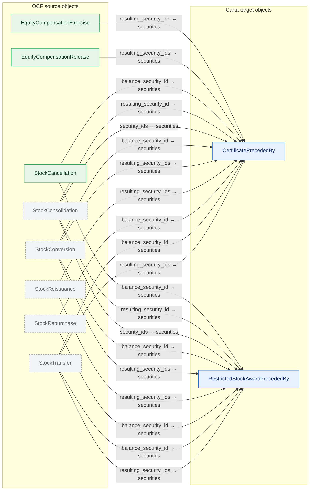

**→ Stakeholder**

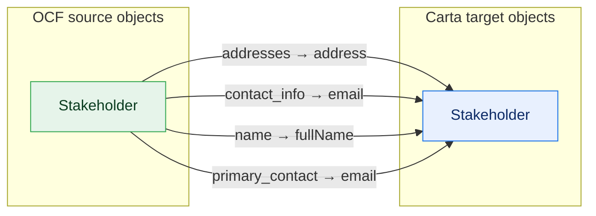

**→ Compliance, ConvertibleIssuanceTransaction**

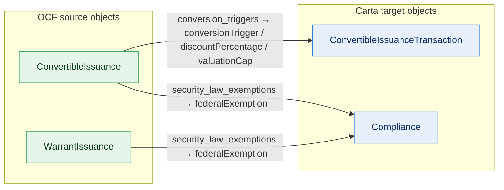

**→ ShareClass, ShareClassRightsAndPreferences**

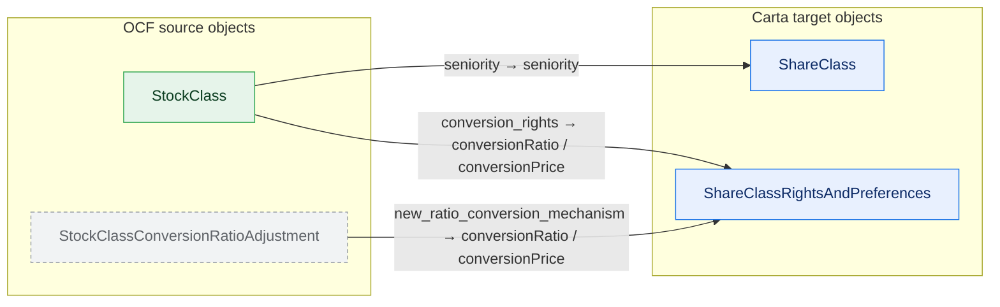

**→ Document**

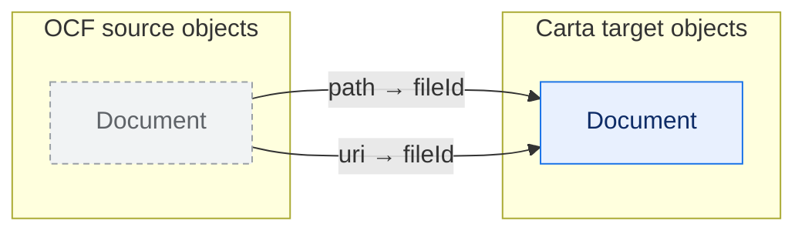

**→ ConvertibleCancellationTransaction**

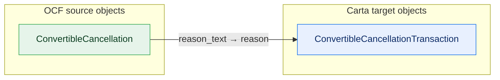

**→ OptionGrant**

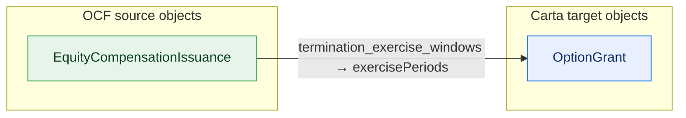

**→ OptionPoolSummary**

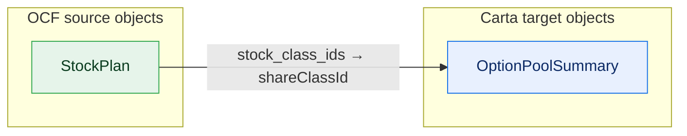

**→ WarrantCancellationTransaction**

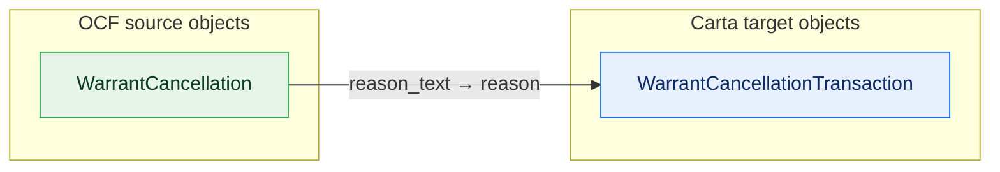

**→ WarrantExerciseTransaction**

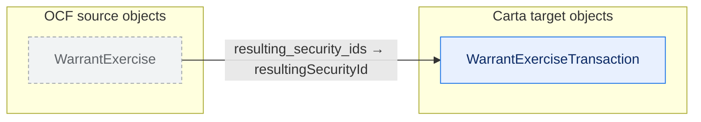

**→ WarrantTransferTransaction**

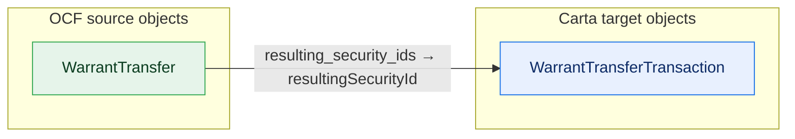

## A. Lossy home — by OCF object, flowing to Carta (39 (entity,variant,field) rows across 20 objects; 24 OCF-required)

Each field HAS a Carta home but the fold loses fidelity: `existence-loss` = the shape
collapses (object/array → scalar); `heuristic` = a non-1:1 transform (combine/split/computed).
A field mapping the same way across variants is shown once, the variants listed.

### ConvertibleCancellation — in Core (admissible)

| field | OCF-req | variant(s) | flows to (Carta) | loss |
| --- | :---: | --- | --- | --- |
| reason_text | **yes** |  | ConvertibleCancellationTransaction.reason | heuristic (computed) |

### ConvertibleIssuance — in Core (admissible)

| field | OCF-req | variant(s) | flows to (Carta) | loss |
| --- | :---: | --- | --- | --- |
| conversion_triggers | **yes** |  | ConvertibleIssuanceTransaction.{conversionTrigger, discountPercentage, valuationCap} | heuristic (split) |
| security_law_exemptions | **yes** |  | Compliance.federalExemption | heuristic (computed) |

### Document — not yet admissible

| field | OCF-req | variant(s) | flows to (Carta) | loss |
| --- | :---: | --- | --- | --- |
| path |  |  | Document.fileId | heuristic (computed) |
| uri |  |  | Document.fileId | heuristic (computed) |

### EquityCompensationExercise — in Core (admissible)

| field | OCF-req | variant(s) | flows to (Carta) | loss |
| --- | :---: | --- | --- | --- |
| resulting_security_ids | **yes** | Option, Sar | CertificatePrecededBy.securities | heuristic (computed) |

### EquityCompensationIssuance — in Core (admissible)

| field | OCF-req | variant(s) | flows to (Carta) | loss |
| --- | :---: | --- | --- | --- |
| termination_exercise_windows | **yes** | Option | OptionGrant.exercisePeriods | existence-loss (array→scalar) |

### EquityCompensationRelease — in Core (admissible)

| field | OCF-req | variant(s) | flows to (Carta) | loss |
| --- | :---: | --- | --- | --- |
| resulting_security_ids | **yes** | Rsu | CertificatePrecededBy.securities | heuristic (computed) |

### Stakeholder — in Core (admissible)

| field | OCF-req | variant(s) | flows to (Carta) | loss |
| --- | :---: | --- | --- | --- |
| addresses |  |  | Stakeholder.address | existence-loss (array→scalar) |
| contact_info |  |  | Stakeholder.email | heuristic (combine) |
| name | **yes** |  | Stakeholder.fullName | existence-loss (structure→scalar) |
| primary_contact |  |  | Stakeholder.email | heuristic (combine) |

### StockCancellation — in Core (admissible)

| field | OCF-req | variant(s) | flows to (Carta) | loss |
| --- | :---: | --- | --- | --- |
| balance_security_id |  | Rsa | RestrictedStockAwardPrecededBy.securities | heuristic (computed) |
| balance_security_id |  | Default | CertificatePrecededBy.securities | heuristic (computed) |

### StockClass — in Core (admissible)

| field | OCF-req | variant(s) | flows to (Carta) | loss |
| --- | :---: | --- | --- | --- |
| conversion_rights |  |  | ShareClassRightsAndPreferences.{conversionRatio, conversionPrice} | heuristic (split) |
| seniority | **yes** |  | ShareClass.seniority | heuristic (computed) |

### StockClassConversionRatioAdjustment — not yet admissible

| field | OCF-req | variant(s) | flows to (Carta) | loss |
| --- | :---: | --- | --- | --- |
| new_ratio_conversion_mechanism | **yes** |  | ShareClassRightsAndPreferences.{conversionRatio, conversionPrice} | heuristic (split) |

### StockConsolidation — not yet admissible

| field | OCF-req | variant(s) | flows to (Carta) | loss |
| --- | :---: | --- | --- | --- |
| resulting_security_id | **yes** | Rsa | RestrictedStockAwardPrecededBy.securities | heuristic (computed) |
| resulting_security_id | **yes** | Default | CertificatePrecededBy.securities | heuristic (computed) |
| security_ids | **yes** | Rsa | RestrictedStockAwardPrecededBy.securities | heuristic (computed) |
| security_ids | **yes** | Default | CertificatePrecededBy.securities | heuristic (computed) |

### StockConversion — not yet admissible

| field | OCF-req | variant(s) | flows to (Carta) | loss |
| --- | :---: | --- | --- | --- |
| balance_security_id |  | Rsa | RestrictedStockAwardPrecededBy.securities | heuristic (computed) |
| balance_security_id |  | Default | CertificatePrecededBy.securities | heuristic (computed) |
| resulting_security_ids | **yes** | Rsa | RestrictedStockAwardPrecededBy.securities | heuristic (computed) |
| resulting_security_ids | **yes** | Default | CertificatePrecededBy.securities | heuristic (computed) |

### StockPlan — in Core (admissible)

| field | OCF-req | variant(s) | flows to (Carta) | loss |
| --- | :---: | --- | --- | --- |
| stock_class_ids |  |  | OptionPoolSummary.shareClassId | existence-loss (array→scalar) |

### StockReissuance — not yet admissible

| field | OCF-req | variant(s) | flows to (Carta) | loss |
| --- | :---: | --- | --- | --- |
| resulting_security_ids | **yes** | Rsa | RestrictedStockAwardPrecededBy.securities | heuristic (computed) |
| resulting_security_ids | **yes** | Default | CertificatePrecededBy.securities | heuristic (computed) |

### StockRepurchase — not yet admissible

| field | OCF-req | variant(s) | flows to (Carta) | loss |
| --- | :---: | --- | --- | --- |
| balance_security_id |  | Rsa | RestrictedStockAwardPrecededBy.securities | heuristic (computed) |
| balance_security_id |  | Default | CertificatePrecededBy.securities | heuristic (computed) |

### StockTransfer — not yet admissible

| field | OCF-req | variant(s) | flows to (Carta) | loss |
| --- | :---: | --- | --- | --- |
| balance_security_id |  | Rsa | RestrictedStockAwardPrecededBy.securities | heuristic (computed) |
| balance_security_id |  | Default | CertificatePrecededBy.securities | heuristic (computed) |
| resulting_security_ids | **yes** | Rsa | RestrictedStockAwardPrecededBy.securities | heuristic (computed) |
| resulting_security_ids | **yes** | Default | CertificatePrecededBy.securities | heuristic (computed) |

### WarrantCancellation — in Core (admissible)

| field | OCF-req | variant(s) | flows to (Carta) | loss |
| --- | :---: | --- | --- | --- |
| reason_text | **yes** |  | WarrantCancellationTransaction.reason | heuristic (computed) |

### WarrantExercise — not yet admissible

| field | OCF-req | variant(s) | flows to (Carta) | loss |
| --- | :---: | --- | --- | --- |
| resulting_security_ids | **yes** |  | WarrantExerciseTransaction.resultingSecurityId | existence-loss (array→scalar) |

### WarrantIssuance — in Core (admissible)

| field | OCF-req | variant(s) | flows to (Carta) | loss |
| --- | :---: | --- | --- | --- |
| security_law_exemptions | **yes** |  | Compliance.federalExemption | heuristic (computed) |

### WarrantTransfer — in Core (admissible)

| field | OCF-req | variant(s) | flows to (Carta) | loss |
| --- | :---: | --- | --- | --- |
| resulting_security_ids | **yes** |  | WarrantTransferTransaction.resultingSecurityId | existence-loss (array→scalar) |

## B. Flow map — Carta slot ← OCF sources

Sorted by fan-in. Slots with several sources are where distinct OCF properties **converge**
onto one Carta field — most visibly the reverse-edge lineage collapsing onto `…PrecededBy.securities`.

- `CertificatePrecededBy.securities` ← 11: `EquityCompensationExercise.resulting_security_ids [Option, Sar]`, `EquityCompensationRelease.resulting_security_ids [Rsu]`, `StockCancellation.balance_security_id [Default]`, `StockConsolidation.resulting_security_id [Default]`, `StockConsolidation.security_ids [Default]`, `StockConversion.balance_security_id [Default]`, `StockConversion.resulting_security_ids [Default]`, `StockReissuance.resulting_security_ids [Default]`, `StockRepurchase.balance_security_id [Default]`, `StockTransfer.balance_security_id [Default]`, `StockTransfer.resulting_security_ids [Default]`
- `RestrictedStockAwardPrecededBy.securities` ← 9: `StockCancellation.balance_security_id [Rsa]`, `StockConsolidation.resulting_security_id [Rsa]`, `StockConsolidation.security_ids [Rsa]`, `StockConversion.balance_security_id [Rsa]`, `StockConversion.resulting_security_ids [Rsa]`, `StockReissuance.resulting_security_ids [Rsa]`, `StockRepurchase.balance_security_id [Rsa]`, `StockTransfer.balance_security_id [Rsa]`, `StockTransfer.resulting_security_ids [Rsa]`
- `Compliance.federalExemption` ← 2: `ConvertibleIssuance.security_law_exemptions`, `WarrantIssuance.security_law_exemptions`
- `Document.fileId` ← 2: `Document.path`, `Document.uri`
- `ShareClassRightsAndPreferences.conversionPrice` ← 2: `StockClass.conversion_rights`, `StockClassConversionRatioAdjustment.new_ratio_conversion_mechanism`
- `ShareClassRightsAndPreferences.conversionRatio` ← 2: `StockClass.conversion_rights`, `StockClassConversionRatioAdjustment.new_ratio_conversion_mechanism`
- `Stakeholder.email` ← 2: `Stakeholder.contact_info`, `Stakeholder.primary_contact`
- `ConvertibleCancellationTransaction.reason` ← 1: `ConvertibleCancellation.reason_text`
- `ConvertibleIssuanceTransaction.conversionTrigger` ← 1: `ConvertibleIssuance.conversion_triggers`
- `ConvertibleIssuanceTransaction.discountPercentage` ← 1: `ConvertibleIssuance.conversion_triggers`
- `ConvertibleIssuanceTransaction.valuationCap` ← 1: `ConvertibleIssuance.conversion_triggers`
- `OptionGrant.exercisePeriods` ← 1: `EquityCompensationIssuance.termination_exercise_windows [Option]`
- `OptionPoolSummary.shareClassId` ← 1: `StockPlan.stock_class_ids`
- `ShareClass.seniority` ← 1: `StockClass.seniority`
- `Stakeholder.address` ← 1: `Stakeholder.addresses`
- `Stakeholder.fullName` ← 1: `Stakeholder.name`
- `WarrantCancellationTransaction.reason` ← 1: `WarrantCancellation.reason_text`
- `WarrantExerciseTransaction.resultingSecurityId` ← 1: `WarrantExercise.resulting_security_ids`
- `WarrantTransferTransaction.resultingSecurityId` ← 1: `WarrantTransfer.resulting_security_ids`

## C. No home — no Carta target at all (263 across 47 objects)

A different animal: Carta has no field to hold these (also in core-gaps.md §a). NOT what
rich-Core recovers — listed for contrast.

- **ConvertibleAcceptance** *(not yet admissible)* — **date**, **security_id**
- **ConvertibleCancellation** — balance_security_id
- **ConvertibleConversion** — balance_security_id, capitalization_definition, **reason_text**, **resulting_security_ids**, **trigger_id**
- **ConvertibleIssuance** — board_approval_date, consideration_text, pro_rata, **seniority**, stockholder_approval_date
- **ConvertibleRetraction** *(not yet admissible)* — **date**, **reason_text**, **security_id**
- **ConvertibleTransfer** *(not yet admissible)* — **amount**, balance_security_id, consideration_text, **date**, **resulting_security_ids**, **security_id**
- **Document** *(not yet admissible)* — **md5**, related_objects
- **EquityCompensationAcceptance** *(not yet admissible)* — **date**, **security_id**
- **EquityCompensationCancellation** — balance_security_id, **reason_text**, **security_id**
- **EquityCompensationExercise** — consideration_text, **date**, **quantity**, **resulting_security_ids**, **security_id**
- **EquityCompensationIssuance** — base_price, board_approval_date, **compensation_type**, consideration_text, **custom_id**, early_exercisable, exercise_price, **expiration_date**, option_grant_type, **security_id**, **security_law_exemptions**, **stakeholder_id**, stockholder_approval_date, **termination_exercise_windows**, vesting_start_date, vestings
- **EquityCompensationRelease** — consideration_text, **date**, **quantity**, **release_price**, **resulting_security_ids**, **security_id**, **settlement_date**
- **EquityCompensationRepricing** — **date**, **new_exercise_price**, **security_id**
- **EquityCompensationRetraction** *(not yet admissible)* — **date**, **reason_text**, **security_id**
- **EquityCompensationTransfer** *(not yet admissible)* — balance_security_id, consideration_text, **date**, **quantity**, **resulting_security_ids**, **security_id**
- **Financing** *(not yet admissible)* — **date**, **issuance_ids**, **name**
- **Issuer** — address, **country_of_formation**, country_subdivision_name_of_formation, country_subdivision_of_formation, email, **formation_date**, initial_shares_authorized, phone, tax_ids
- **IssuerAuthorizedSharesAdjustment** *(not yet admissible)* — board_approval_date, **date**, **issuer_id**, **new_shares_authorized**, stockholder_approval_date
- **Stakeholder** — current_status, tax_ids
- **StakeholderRelationshipChangeEvent** — **date**
- **StakeholderStatusChangeEvent** *(not yet admissible)* — **date**, **new_status**
- **StockAcceptance** *(not yet admissible)* — **date**, **security_id**
- **StockCancellation** — **reason_text**, **security_id**
- **StockClass** — board_approval_date, stockholder_approval_date, **votes_per_share**
- **StockClassAuthorizedSharesAdjustment** — board_approval_date, **date**, stockholder_approval_date
- **StockClassConversionRatioAdjustment** *(not yet admissible)* — **date**
- **StockClassSplit** *(not yet admissible)* — **date**, **split_ratio**, **stock_class_id**
- **StockConsolidation** *(not yet admissible)* — **date**, reason_text
- **StockConversion** *(not yet admissible)* — **date**, **quantity_converted**, **security_id**
- **StockIssuance** — board_approval_date, consideration_text, issuance_type, **security_law_exemptions**, share_numbers_issued, **stock_legend_ids**, stockholder_approval_date, vestings
- **StockLegendTemplate** *(not yet admissible)* — **name**, **text**
- **StockPlan** — board_approval_date, default_cancellation_behavior, stockholder_approval_date
- **StockPlanPoolAdjustment** *(not yet admissible)* — board_approval_date, **date**, **shares_reserved**, **stock_plan_id**, stockholder_approval_date
- **StockPlanReturnToPool** *(not yet admissible)* — **date**, **quantity**, **reason_text**, **security_id**, **stock_plan_id**
- **StockReissuance** *(not yet admissible)* — **date**, reason_text, **security_id**, split_transaction_id
- **StockRepurchase** *(not yet admissible)* — consideration_text, **date**, **price**, **quantity**, **security_id**
- **StockRetraction** *(not yet admissible)* — **date**, **reason_text**, **security_id**
- **StockTransfer** *(not yet admissible)* — consideration_text, **date**, **quantity**, **security_id**
- **Valuation** — board_approval_date, **effective_date**, provider, stockholder_approval_date, **valuation_type**
- **VestingAcceleration** *(not yet admissible)* — **date**, **quantity**, **reason_text**, **security_id**
- **VestingEvent** *(not yet admissible)* — **date**, **event_id**, **security_id**
- **WarrantAcceptance** *(not yet admissible)* — **date**, **security_id**
- **WarrantCancellation** — balance_security_id, **security_id**
- **WarrantExercise** *(not yet admissible)* — consideration_text, **trigger_id**
- **WarrantIssuance** — board_approval_date, consideration_text, **exercise_triggers**, quantity_source, stockholder_approval_date, vestings
- **WarrantRetraction** *(not yet admissible)* — **date**, **reason_text**, **security_id**
- **WarrantTransfer** — balance_security_id, consideration_text

