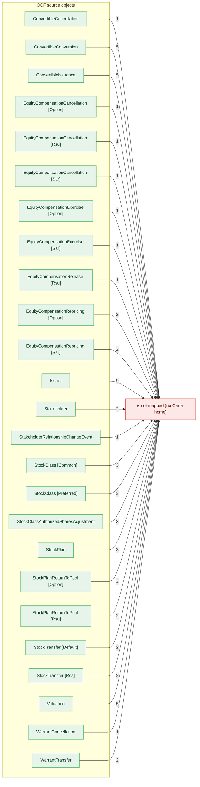

# OCF Core — unmapped-property inventory (generated, discussion artifact)

GENERATED by `npm run core:unmapped` from the same derived ledger as the build.
NOT drift-gated — an analysis input, not a contract.

OCF properties with **no Carta home at all** (`kind: unmappable`) — they don't flow
anywhere; the fold to Carta simply drops them. This is the complement of the lossy-home
inventory (`core-lossy-inventory.md`), which covers properties that DO land, only lossily.
OCF bookkeeping (`id`/`object_type`/`comments`) is excluded. `OCF-req` marks fields OCF
itself requires; an unmapped field on an **in-Core** object is the sharper loss.

**Variant scope.** For a polymorphic object the drop is per-flavor: a property is listed if
it is unmappable in **at least one** variant. Ones marked `†` also **land in another variant**
of the same object (e.g. `EquityCompensationIssuance.board_approval_date` maps for Option/Rsu,
drops only for Sar), so "no Carta home" is a per-flavor statement here, not object-level. The
magnitude diagrams split flavors apart; `core-bidirectional-flow.md` gives the distinct-field,
best-landing view (its lower "left behind" count).

## Magnitude — unmapped properties per OCF object (163 distinct across 46 objects; 240 per-flavor rows, 144 OCF-required)

Each OCF object → the void, edge labelled with how many of its properties are dropped.
Green = the object is in strict Core (we carry it but lose these fields); dashed grey = the
object isn't admissible anyway. Property names are in the tables below.

**In-Core objects (we carry the object, drop these fields)**

**Not-yet-admissible objects**

```mermaid
flowchart LR
  classDef adm fill:#e6f4ea,stroke:#34a853,color:#0b3d20;
  classDef notadm fill:#f1f3f4,stroke:#9aa0a6,color:#5f6368,stroke-dasharray:4 3;
  classDef sink fill:#fce8e6,stroke:#d93025,color:#5c0d06;
  subgraph SRC["OCF source objects"]
    direction TB
    o0["ConvertibleAcceptance"]:::notadm
    o1["ConvertibleRetraction"]:::notadm
    o2["ConvertibleTransfer"]:::notadm
    o3["Document"]:::notadm
    o4["EquityCompensationAcceptance [Option]"]:::notadm
    o5["EquityCompensationAcceptance [Rsu]"]:::notadm
    o6["EquityCompensationAcceptance [Sar]"]:::notadm
    o7["EquityCompensationExercise [Rsu]"]:::notadm
    o8["EquityCompensationIssuance [Option]"]:::notadm
    o9["EquityCompensationIssuance [Rsu]"]:::notadm
    o10["EquityCompensationIssuance [Sar]"]:::notadm
    o11["EquityCompensationRelease [Option]"]:::notadm
    o12["EquityCompensationRelease [Sar]"]:::notadm
    o13["EquityCompensationRepricing [Rsu]"]:::notadm
    o14["EquityCompensationRetraction [Option]"]:::notadm
    o15["EquityCompensationRetraction [Rsu]"]:::notadm
    o16["EquityCompensationRetraction [Sar]"]:::notadm
    o17["EquityCompensationTransfer [Option]"]:::notadm
    o18["EquityCompensationTransfer [Rsu]"]:::notadm
    o19["EquityCompensationTransfer [Sar]"]:::notadm
    o20["Financing"]:::notadm
    o21["IssuerAuthorizedSharesAdjustment"]:::notadm
    o22["StakeholderStatusChangeEvent"]:::notadm
    o23["StockAcceptance [Default]"]:::notadm
    o24["StockAcceptance [Rsa]"]:::notadm
    o25["StockClassConversionRatioAdjustment"]:::notadm
    o26["StockClassSplit"]:::notadm
    o27["StockConsolidation [Default]"]:::notadm
    o28["StockConsolidation [Rsa]"]:::notadm
    o29["StockConversion [Default]"]:::notadm
    o30["StockConversion [Rsa]"]:::notadm
    o31["StockIssuance [Default]"]:::notadm
    o32["StockIssuance [Rsa]"]:::notadm
    o33["StockLegendTemplate"]:::notadm
    o34["StockPlanPoolAdjustment"]:::notadm
    o35["StockPlanReturnToPool [Sar]"]:::notadm
    o36["StockReissuance [Default]"]:::notadm
    o37["StockReissuance [Rsa]"]:::notadm
    o38["StockRepurchase [Default]"]:::notadm
    o39["StockRepurchase [Rsa]"]:::notadm
    o40["StockRetraction [Default]"]:::notadm
    o41["StockRetraction [Rsa]"]:::notadm
    o42["VestingAcceleration"]:::notadm
    o43["VestingEvent"]:::notadm
    o44["WarrantAcceptance"]:::notadm
    o45["WarrantExercise"]:::notadm
    o46["WarrantIssuance"]:::notadm
    o47["WarrantRetraction"]:::notadm
  end
  void["⌀ not mapped (no Carta home)"]:::sink
  o0 -->|2| void
  o1 -->|3| void
  o2 -->|6| void
  o3 -->|2| void
  o4 -->|1| void
  o5 -->|1| void
  o6 -->|2| void
  o7 -->|5| void
  o8 -->|3| void
  o9 -->|9| void
  o10 -->|10| void
  o11 -->|7| void
  o12 -->|7| void
  o13 -->|3| void
  o14 -->|3| void
  o15 -->|3| void
  o16 -->|3| void
  o17 -->|6| void
  o18 -->|6| void
  o19 -->|6| void
  o20 -->|3| void
  o21 -->|5| void
  o22 -->|2| void
  o23 -->|2| void
  o24 -->|1| void
  o25 -->|1| void
  o26 -->|3| void
  o27 -->|2| void
  o28 -->|2| void
  o29 -->|3| void
  o30 -->|3| void
  o31 -->|7| void
  o32 -->|5| void
  o33 -->|2| void
  o34 -->|5| void
  o35 -->|3| void
  o36 -->|4| void
  o37 -->|4| void
  o38 -->|4| void
  o39 -->|4| void
  o40 -->|3| void
  o41 -->|3| void
  o42 -->|4| void
  o43 -->|3| void
  o44 -->|2| void
  o45 -->|2| void
  o46 -->|6| void
  o47 -->|3| void
```

## By OCF object — the dropped properties

`†` = also maps in another variant of this object (dropped only in some flavors).

### ConvertibleAcceptance — not yet admissible (2 unmapped)

| property | OCF-req | what it is (OCF) |
| --- | :---: | --- |
| date | **yes** | Date on which the transaction occurred |
| security_id | **yes** | Identifier for the security (stock, plan security, warrant, or convertible) by which it can be referenced by other transaction objects. N… |

### ConvertibleCancellation — in Core (admissible) (1 unmapped)

| property | OCF-req | what it is (OCF) |
| --- | :---: | --- |
| balance_security_id |  | Identifier for the security that holds the remainder balance (for partial cancellations) |

### ConvertibleConversion — in Core (admissible) (5 unmapped)

| property | OCF-req | what it is (OCF) |
| --- | :---: | --- |
| balance_security_id |  | Identifier for the convertible that holds the remainder balance (for partial conversions) |
| capitalization_definition |  | If this conversion event and its `quantity_converted` value was based on the company's capitalization, please specify what stock classes,… |
| reason_text | **yes** | Reason for the conversion |
| resulting_security_ids | **yes** | Identifier for the security (or securities) that resulted from the conversion |
| trigger_id | **yes** | What is the id of the convertible's conversion trigger that resulted in this conversion |

### ConvertibleIssuance — in Core (admissible) (5 unmapped)

| property | OCF-req | what it is (OCF) |
| --- | :---: | --- |
| board_approval_date |  | Date of board approval for the security |
| consideration_text |  | Unstructured text description of consideration provided in exchange for security issuance |
| pro_rata |  | What pro-rata (if any) is the holder entitled to buy at the next round? |
| seniority | **yes** | If different convertible instruments have seniorty over one another, use this value to build a seniority stack, with 1 being highest seni… |
| stockholder_approval_date |  | Date on which the stockholders approved the security |

### ConvertibleRetraction — not yet admissible (3 unmapped)

| property | OCF-req | what it is (OCF) |
| --- | :---: | --- |
| date | **yes** | Date on which the transaction occurred |
| reason_text | **yes** | Reason for the retraction |
| security_id | **yes** | Identifier for the security (stock, plan security, warrant, or convertible) by which it can be referenced by other transaction objects. N… |

### ConvertibleTransfer — not yet admissible (6 unmapped)

| property | OCF-req | what it is (OCF) |
| --- | :---: | --- |
| amount | **yes** | Amount of monetary value transferred |
| balance_security_id |  | Identifier for the security that holds the remainder balance (for partial transfers) |
| consideration_text |  | Unstructured text description of consideration provided in exchange for security transfer |
| date | **yes** | Date on which the transaction occurred |
| resulting_security_ids | **yes** | Array of identifiers for new security (or securities) created as a result of the transaction |
| security_id | **yes** | Identifier for the security (stock, plan security, warrant, or convertible) by which it can be referenced by other transaction objects. N… |

### Document — not yet admissible (2 unmapped)

| property | OCF-req | what it is (OCF) |
| --- | :---: | --- |
| md5 | **yes** | MD5 file checksum |
| related_objects |  | List of objects which this document is related to |

### EquityCompensationAcceptance — not yet admissible (2 unmapped)

| property | OCF-req | what it is (OCF) |
| --- | :---: | --- |
| date † | **yes** | Date on which the transaction occurred |
| security_id | **yes** | Identifier for the security (stock, plan security, warrant, or convertible) by which it can be referenced by other transaction objects. N… |

### EquityCompensationCancellation — in Core (admissible) (1 unmapped)

| property | OCF-req | what it is (OCF) |
| --- | :---: | --- |
| balance_security_id |  | Identifier for the security that holds the remainder balance (for partial cancellations) |

### EquityCompensationExercise — in Core (admissible) (5 unmapped)

| property | OCF-req | what it is (OCF) |
| --- | :---: | --- |
| consideration_text |  | Unstructured text description of consideration provided in exchange for security exercise |
| date † | **yes** | Date on which the transaction occurred |
| quantity † | **yes** | Quantity of shares exercised |
| resulting_security_ids † | **yes** | Identifier for the security (or securities) that resulted from the exercise |
| security_id † | **yes** | Identifier for the security (stock, plan security, warrant, or convertible) by which it can be referenced by other transaction objects. N… |

### EquityCompensationIssuance — not yet admissible (12 unmapped)

| property | OCF-req | what it is (OCF) |
| --- | :---: | --- |
| base_price † |  | Required for stock appreciation right compensation types (CSAR, SSAR). The base price used to calculate appreciation. |
| board_approval_date † |  | Date of board approval for the security, when applicable. |
| compensation_type † | **yes** | The kind of equity compensation. Determines which type-specific fields are required. |
| consideration_text |  | Unstructured text description of consideration provided in exchange for the issuance. |
| early_exercisable † |  | If true, the security is exercisable prior to completion of vesting; the schedule then governs a right-of-repurchase lapse rather than th… |
| exercise_price † |  | Required for option compensation types. The price per share at which the option can be exercised. |
| expiration_date † | **yes** | Expiration date of the security, or null if it does not expire. |
| option_grant_type † |  | If the security is an option, what kind. Retained from v1 for compatibility; in the new model this has been incorporated into Compensatio… |
| stockholder_approval_date |  | Date of stockholder approval for the security, when applicable. |
| termination_exercise_windows † | **yes** | Exercise periods applicable after a termination, by reason. |
| vesting_start_date † |  | The per-grant vesting commencement date — the anchor every statement of the referenced template grids from. Required whenever `vesting_te… |
| vestings † |  | Optional materialized projection of exact vesting dates and amounts. A grant may be described by the declarative template (`vesting_templ… |

### EquityCompensationRelease — in Core (admissible) (7 unmapped)

| property | OCF-req | what it is (OCF) |
| --- | :---: | --- |
| consideration_text |  | Unstructured text description of consideration provided in exchange for security release |
| date † | **yes** | Date on which the transaction occurred |
| quantity † | **yes** | Quantity of shares released |
| release_price † | **yes** | The release price used to determine the value of the security at the time of release |
| resulting_security_ids † | **yes** | Identifier of the new security (or securities) issuance resulting from a release transaction |
| security_id † | **yes** | Identifier for the security (stock, plan security, warrant, or convertible) by which it can be referenced by other transaction objects. N… |
| settlement_date † | **yes** | The settlement date for the shares released, typically after the release transaction date |

### EquityCompensationRepricing — in Core (admissible) (3 unmapped)

| property | OCF-req | what it is (OCF) |
| --- | :---: | --- |
| date | **yes** | Date on which the transaction occurred |
| new_exercise_price † | **yes** | What is the exercise price of the option after the repricing? |
| security_id | **yes** | Identifier for the security (stock, plan security, warrant, or convertible) by which it can be referenced by other transaction objects. N… |

### EquityCompensationRetraction — not yet admissible (3 unmapped)

| property | OCF-req | what it is (OCF) |
| --- | :---: | --- |
| date | **yes** | Date on which the transaction occurred |
| reason_text | **yes** | Reason for the retraction |
| security_id | **yes** | Identifier for the security (stock, plan security, warrant, or convertible) by which it can be referenced by other transaction objects. N… |

### EquityCompensationTransfer — not yet admissible (6 unmapped)

| property | OCF-req | what it is (OCF) |
| --- | :---: | --- |
| balance_security_id |  | Identifier for the security that holds the remainder balance (for partial transfers) |
| consideration_text |  | Unstructured text description of consideration provided in exchange for security transfer |
| date | **yes** | Date on which the transaction occurred |
| quantity | **yes** | Quantity of non-monetary security units transferred |
| resulting_security_ids | **yes** | Array of identifiers for new security (or securities) created as a result of the transaction |
| security_id | **yes** | Identifier for the security (stock, plan security, warrant, or convertible) by which it can be referenced by other transaction objects. N… |

### Financing — not yet admissible (3 unmapped)

| property | OCF-req | what it is (OCF) |
| --- | :---: | --- |
| date | **yes** | Date on which the financing event occurred |
| issuance_ids | **yes** | Array of issuance IDs associated with the financing |
| name | **yes** | Name for the financing |

### Issuer — in Core (admissible) (9 unmapped)

| property | OCF-req | what it is (OCF) |
| --- | :---: | --- |
| address |  | The headquarters address of the issuing company |
| country_of_formation | **yes** | The country where the issuer company was legally formed (ISO 3166-1 alpha-2) |
| country_subdivision_name_of_formation |  | The text name of state, province, or subdivision where the issuer company was legally formed if the code is not available |
| country_subdivision_of_formation |  | The code for the state, province, or subdivision where the issuer company was legally formed |
| email |  | A work email that the issuer company can be reached at |
| formation_date | **yes** | Date of formation |
| initial_shares_authorized |  | The initial number of shares authorized for this issuer |
| phone |  | A phone number that the issuer company can be reached at |
| tax_ids |  | The tax ids for this issuer company |

### IssuerAuthorizedSharesAdjustment — not yet admissible (5 unmapped)

| property | OCF-req | what it is (OCF) |
| --- | :---: | --- |
| board_approval_date |  | Date on which the board approved the change to the issuer |
| date | **yes** | Date on which the transaction occurred |
| issuer_id | **yes** | Identifier of the Issuer object, a subject of this transaction |
| new_shares_authorized | **yes** | The new number of shares authorized for this issuer as of the event of this transaction |
| stockholder_approval_date |  | Date on which the stockholders approved the change to the issuer |

### Stakeholder — in Core (admissible) (2 unmapped)

| property | OCF-req | what it is (OCF) |
| --- | :---: | --- |
| current_status |  | What is the current activity status of the stakeholder? |
| tax_ids |  | The tax ids for this stakeholder |

### StakeholderRelationshipChangeEvent — in Core (admissible) (1 unmapped)

| property | OCF-req | what it is (OCF) |
| --- | :---: | --- |
| date | **yes** | Date on which the transaction occurred |

### StakeholderStatusChangeEvent — not yet admissible (2 unmapped)

| property | OCF-req | what it is (OCF) |
| --- | :---: | --- |
| date | **yes** | Date on which the transaction occurred |
| new_status | **yes** | Denoting the beginning of this activity status on the change date |

### StockAcceptance — not yet admissible (2 unmapped)

| property | OCF-req | what it is (OCF) |
| --- | :---: | --- |
| date † | **yes** | Date on which the transaction occurred |
| security_id | **yes** | Identifier for the security (stock, plan security, warrant, or convertible) by which it can be referenced by other transaction objects. N… |

### StockClass — in Core (admissible) (3 unmapped)

| property | OCF-req | what it is (OCF) |
| --- | :---: | --- |
| board_approval_date |  | Date on which the board approved the stock class |
| stockholder_approval_date |  | Date on which the stockholders approved the stock class |
| votes_per_share | **yes** | The number of votes each share of this stock class gets |

### StockClassAuthorizedSharesAdjustment — in Core (admissible) (3 unmapped)

| property | OCF-req | what it is (OCF) |
| --- | :---: | --- |
| board_approval_date |  | Date on which the board approved the change to the stock class |
| date | **yes** | Date on which the transaction occurred |
| stockholder_approval_date |  | This optional field tracks when the stockholders approved the change to the stock class. |

### StockClassConversionRatioAdjustment — not yet admissible (1 unmapped)

| property | OCF-req | what it is (OCF) |
| --- | :---: | --- |
| date | **yes** | Date on which the transaction occurred |

### StockClassSplit — not yet admissible (3 unmapped)

| property | OCF-req | what it is (OCF) |
| --- | :---: | --- |
| date | **yes** | Date on which the transaction occurred |
| split_ratio | **yes** | Ratio of new shares to old shares. For 2-for-1 split the numerator of the ratio is 2 and the denominator is 1. |
| stock_class_id | **yes** | Identifier of the StockClass object, a subject of this transaction |

### StockConsolidation — not yet admissible (2 unmapped)

| property | OCF-req | what it is (OCF) |
| --- | :---: | --- |
| date | **yes** | Date on which the transaction occurred |
| reason_text |  | Free-form human-readable reason for stock consolidation |

### StockConversion — not yet admissible (3 unmapped)

| property | OCF-req | what it is (OCF) |
| --- | :---: | --- |
| date | **yes** | Date on which the transaction occurred |
| quantity_converted | **yes** | Quantity of non-monetary security units converted |
| security_id | **yes** | Identifier for the security (stock, plan security, warrant, or convertible) by which it can be referenced by other transaction objects. N… |

### StockIssuance — not yet admissible (7 unmapped)

| property | OCF-req | what it is (OCF) |
| --- | :---: | --- |
| board_approval_date † |  | Date of board approval for the security |
| consideration_text |  | Unstructured text description of consideration provided in exchange for security issuance |
| issuance_type |  | Optional field to flag certain special types of issuances (like RSAs) |
| share_numbers_issued |  | Range(s) of the specific share numbers included in this issuance. This is different from a certificate number you might include in the `c… |
| stock_legend_ids | **yes** | List of stock legend ids that apply to this stock |
| stockholder_approval_date |  | Date on which the stockholders approved the security |
| vestings † |  | List of exact vesting dates and amounts for this security. When `vestings` array is present then `vesting_terms_id` may be ignored. |

### StockLegendTemplate — not yet admissible (2 unmapped)

| property | OCF-req | what it is (OCF) |
| --- | :---: | --- |
| name | **yes** | Name for the stock legend template |
| text | **yes** | The full text of the stock legend |

### StockPlan — in Core (admissible) (3 unmapped)

| property | OCF-req | what it is (OCF) |
| --- | :---: | --- |
| board_approval_date |  | Date on which board approved the plan |
| default_cancellation_behavior |  | If a security issued under this Stock Plan is cancelled, what happens to the reserved shares by default? NOTE: for any given security iss… |
| stockholder_approval_date |  | This optional field tracks when the stockholders approved this stock plan. This is intended for use by US companies that want to issue In… |

### StockPlanPoolAdjustment — not yet admissible (5 unmapped)

| property | OCF-req | what it is (OCF) |
| --- | :---: | --- |
| board_approval_date |  | Date on which board approved the change to the plan. |
| date | **yes** | Date on which the transaction occurred |
| shares_reserved | **yes** | The number of shares reserved in the pool for this stock plan by the Board or equivalent body as of the effective date of this pool adjus… |
| stock_plan_id | **yes** | Identifier of the Stock Plan object, a subject of this transaction |
| stockholder_approval_date |  | This optional field tracks when the stockholders approved this change to the stock plan. This is intended for use by US companies that wa… |

### StockPlanReturnToPool — in Core (admissible) (3 unmapped)

| property | OCF-req | what it is (OCF) |
| --- | :---: | --- |
| date | **yes** | Date on which the transaction occurred |
| quantity † | **yes** | How many shares were returned to the pool? |
| reason_text | **yes** | Reason for the return to the pool |

### StockReissuance — not yet admissible (4 unmapped)

| property | OCF-req | what it is (OCF) |
| --- | :---: | --- |
| date | **yes** | Date on which the transaction occurred |
| reason_text |  | Free-form human-readable reason for stock reissuance |
| security_id | **yes** | Identifier for the security (stock, plan security, warrant, or convertible) by which it can be referenced by other transaction objects. N… |
| split_transaction_id |  | When stock is reissued as a result of a stock split, this field contains id of the respective stock class split transaction. It is not se… |

### StockRepurchase — not yet admissible (4 unmapped)

| property | OCF-req | what it is (OCF) |
| --- | :---: | --- |
| consideration_text |  | Unstructured text description of consideration provided in exchange for security repurchase |
| date | **yes** | Date on which the transaction occurred |
| price | **yes** | Repurchase price per share of the stock |
| security_id | **yes** | Identifier for the security (stock, plan security, warrant, or convertible) by which it can be referenced by other transaction objects. N… |

### StockRetraction — not yet admissible (3 unmapped)

| property | OCF-req | what it is (OCF) |
| --- | :---: | --- |
| date | **yes** | Date on which the transaction occurred |
| reason_text | **yes** | Reason for the retraction |
| security_id | **yes** | Identifier for the security (stock, plan security, warrant, or convertible) by which it can be referenced by other transaction objects. N… |

### StockTransfer — in Core (admissible) (2 unmapped)

| property | OCF-req | what it is (OCF) |
| --- | :---: | --- |
| consideration_text |  | Unstructured text description of consideration provided in exchange for security transfer |
| security_id | **yes** | Identifier for the security (stock, plan security, warrant, or convertible) by which it can be referenced by other transaction objects. N… |

### Valuation — in Core (admissible) (5 unmapped)

| property | OCF-req | what it is (OCF) |
| --- | :---: | --- |
| board_approval_date |  | Date on which board approved the valuation. This is essential for 409A valuations, in particular, which require the Board to approve the … |
| effective_date | **yes** | Date on which this valuation is first valid |
| provider |  | Entity which provided the valuation |
| stockholder_approval_date |  | This optional field tracks when the stockholders approved the valuation. |
| valuation_type | **yes** | Seam for supporting different types of valuations in future versions |

### VestingAcceleration — not yet admissible (4 unmapped)

| property | OCF-req | what it is (OCF) |
| --- | :---: | --- |
| date | **yes** | Date on which the transaction occurred |
| quantity | **yes** | Number of shares vesting ahead of schedule |
| reason_text | **yes** | Reason for the acceleration; unstructured text |
| security_id | **yes** | Identifier for the security (stock, plan security, warrant, or convertible) by which it can be referenced by other transaction objects. N… |

### VestingEvent — not yet admissible (3 unmapped)

| property | OCF-req | what it is (OCF) |
| --- | :---: | --- |
| date | **yes** | Date the event fired. |
| event_id | **yes** | Identifier of the named event that fired. Matches `event_id` on the `event_condition` of some VestingStatement on this security's template. |
| security_id | **yes** | Identifier of the security whose VestingStatement(s) reference this event. The firing is scoped to a single security; cross-grant fan-out… |

### WarrantAcceptance — not yet admissible (2 unmapped)

| property | OCF-req | what it is (OCF) |
| --- | :---: | --- |
| date | **yes** | Date on which the transaction occurred |
| security_id | **yes** | Identifier for the security (stock, plan security, warrant, or convertible) by which it can be referenced by other transaction objects. N… |

### WarrantCancellation — in Core (admissible) (1 unmapped)

| property | OCF-req | what it is (OCF) |
| --- | :---: | --- |
| balance_security_id |  | Identifier for the security that holds the remainder balance (for partial cancellations) |

### WarrantExercise — not yet admissible (2 unmapped)

| property | OCF-req | what it is (OCF) |
| --- | :---: | --- |
| consideration_text |  | Unstructured text description of consideration provided in exchange for security exercise |
| trigger_id | **yes** | What is the id of the warrant's exercise trigger that resulted in this exercise |

### WarrantIssuance — not yet admissible (6 unmapped)

| property | OCF-req | what it is (OCF) |
| --- | :---: | --- |
| board_approval_date |  | Date of board approval for the security |
| consideration_text |  | Unstructured text description of consideration provided in exchange for security issuance |
| exercise_triggers | **yes** | In event the Warrant can convert due to trigger events (e.g. Maturity, Next Qualified Financing, Change of Control, at Election of Holder… |
| quantity_source |  | If quantity is provided, use this to specify where the number came from - e.g. was it a fixed value from the instrument (`INSTRUMENT_FIXE… |
| stockholder_approval_date |  | Date on which the stockholders approved the security |
| vestings |  | List of exact vesting dates and amounts for this security. When `vestings` array is present then `vesting_terms_id` may be ignored. |

### WarrantRetraction — not yet admissible (3 unmapped)

| property | OCF-req | what it is (OCF) |
| --- | :---: | --- |
| date | **yes** | Date on which the transaction occurred |
| reason_text | **yes** | Reason for the retraction |
| security_id | **yes** | Identifier for the security (stock, plan security, warrant, or convertible) by which it can be referenced by other transaction objects. N… |

### WarrantTransfer — in Core (admissible) (2 unmapped)

| property | OCF-req | what it is (OCF) |
| --- | :---: | --- |
| balance_security_id |  | Identifier for the security that holds the remainder balance (for partial transfers) |
| consideration_text |  | Unstructured text description of consideration provided in exchange for security transfer |

