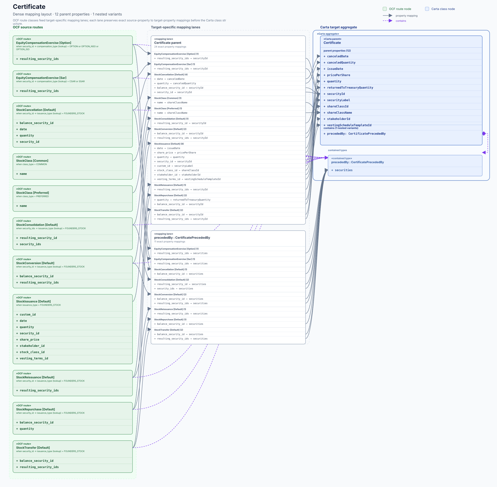
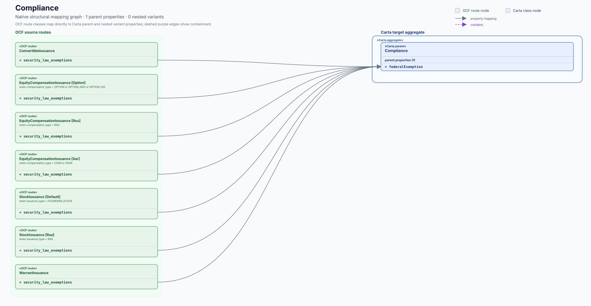
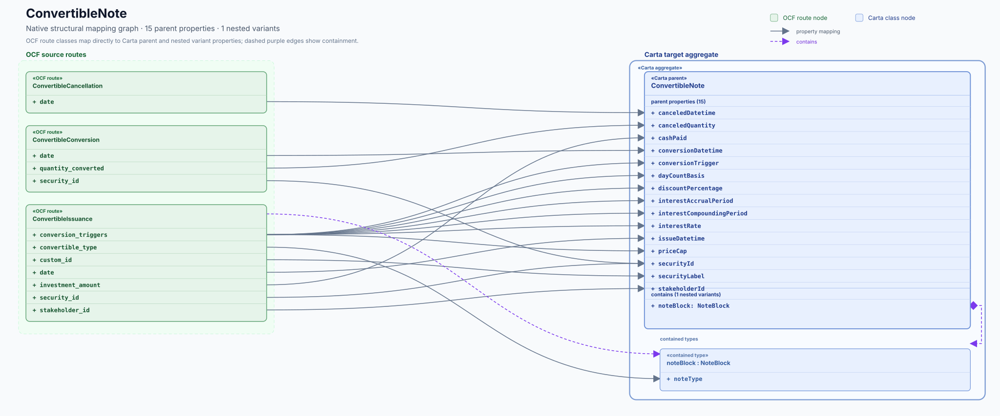
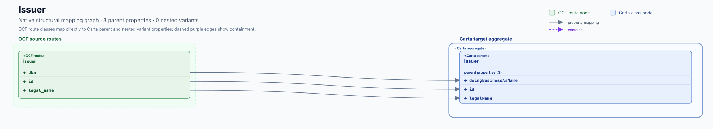
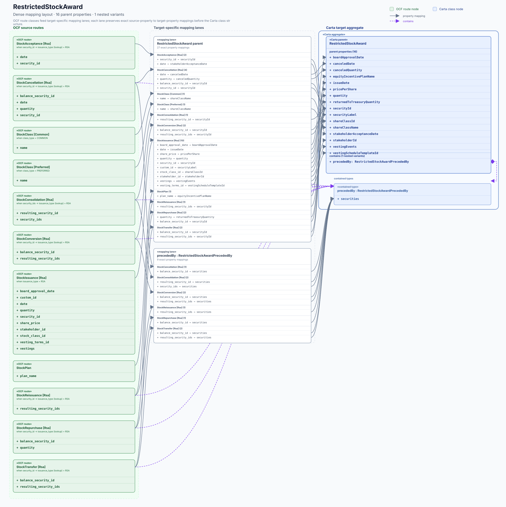
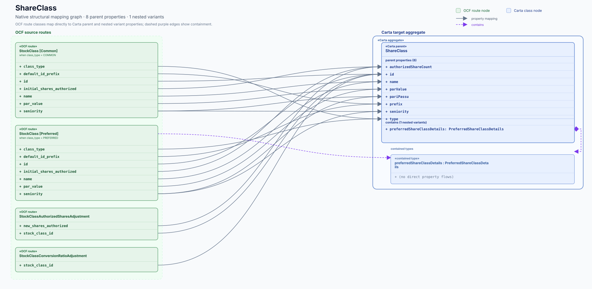
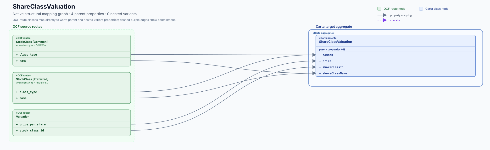
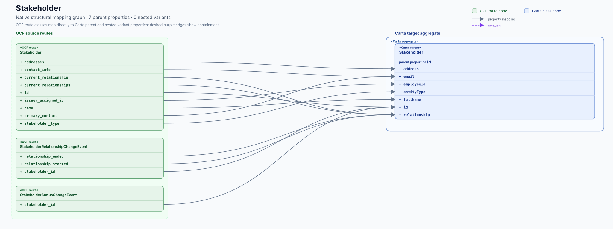
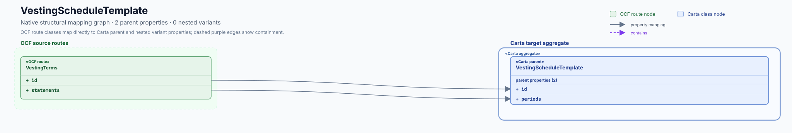

# Related-object flow gallery

These native SVGs show the inverse mapping ledger as UML-like class/data-flow graphs.

Each image is one mapped Carta target object. Green class nodes are OCF routes; blue class nodes are
the Carta target and any contained types. The solid blue boundary makes a target and its nested
variants read as one Carta aggregate. Smaller families use solid arrows for explicit source property
→ target property mappings. Dense families use target-specific mapping lanes; each lane keeps the
exact property mappings in a compact ledger while grouped arrows preserve the data flow. Dashed purple
edges show containment. The Carta parent node explicitly reports its parent-property count and lists
those properties, including parent-only routes where they contribute to the family.

CI also publishes a self-contained interactive HTML viewer as the `mapping-inverse-interactive`
artifact. It lets reviewers toggle target lanes and source routes, zoom the diagram, then click or
shift-click exact mapping arrows to focus selected flows. A reproducible copy is checked in at
[`../mapping-flows-interactive/index.html`](../mapping-flows-interactive/index.html). GitHub's code
browser displays that file as source; opening the downloaded CI artifact (or serving the checked-in
file) provides the interactive view.

From a checkout, run `python3 -m http.server 8000 --directory docs/generated/mapping-flows-interactive`
and open `http://127.0.0.1:8000/` to use the viewer locally.

| Carta target | Preview |
| --- | --- |
| [Certificate](./Certificate.svg) |  |
| [CertificateTransactionItem](./CertificateTransactionItem.svg) |  |
| [Compliance](./Compliance.svg) |  |
| [ConvertibleNote](./ConvertibleNote.svg) |  |
| [ConvertibleTransactionItem](./ConvertibleTransactionItem.svg) |  |
| [Issuer](./Issuer.svg) |  |
| [OptionGrant](./OptionGrant.svg) |  |
| [OptionTransactionItem](./OptionTransactionItem.svg) |  |
| [RestrictedStockAward](./RestrictedStockAward.svg) |  |
| [RestrictedStockUnit](./RestrictedStockUnit.svg) |  |
| [RsaTransactionItem](./RsaTransactionItem.svg) |  |
| [RsuTransactionItem](./RsuTransactionItem.svg) |  |
| [SarTransactionItem](./SarTransactionItem.svg) |  |
| [ShareClass](./ShareClass.svg) |  |
| [ShareClassValuation](./ShareClassValuation.svg) |  |
| [Stakeholder](./Stakeholder.svg) |  |
| [VestingScheduleTemplate](./VestingScheduleTemplate.svg) |  |
| [WarrantTransactionItem](./WarrantTransactionItem.svg) |  |
