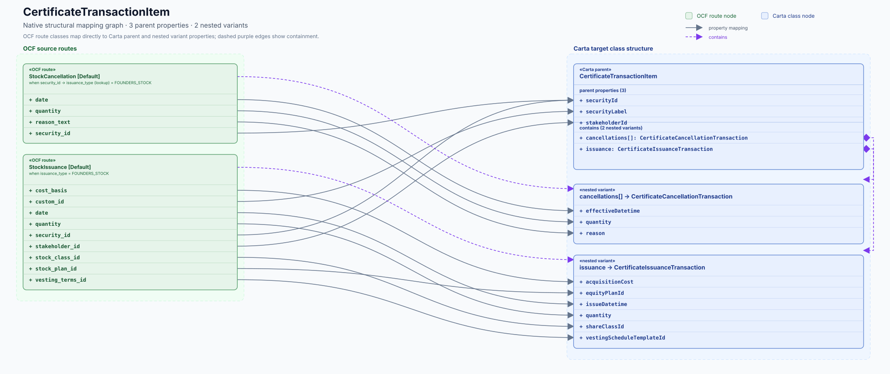
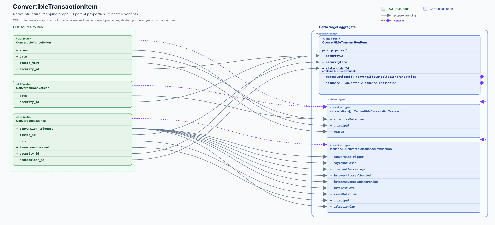
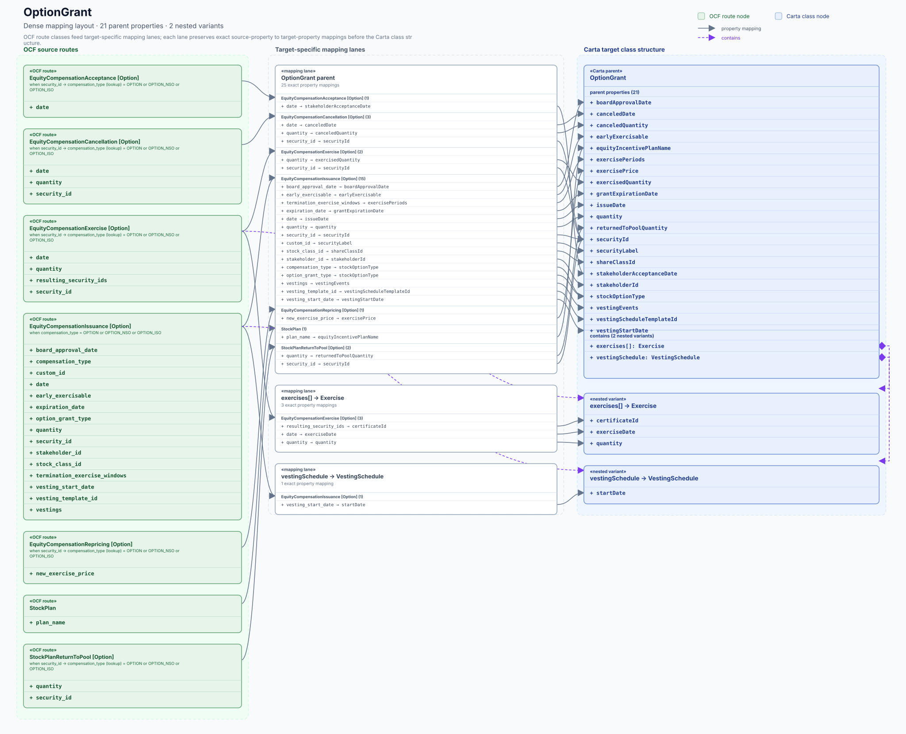
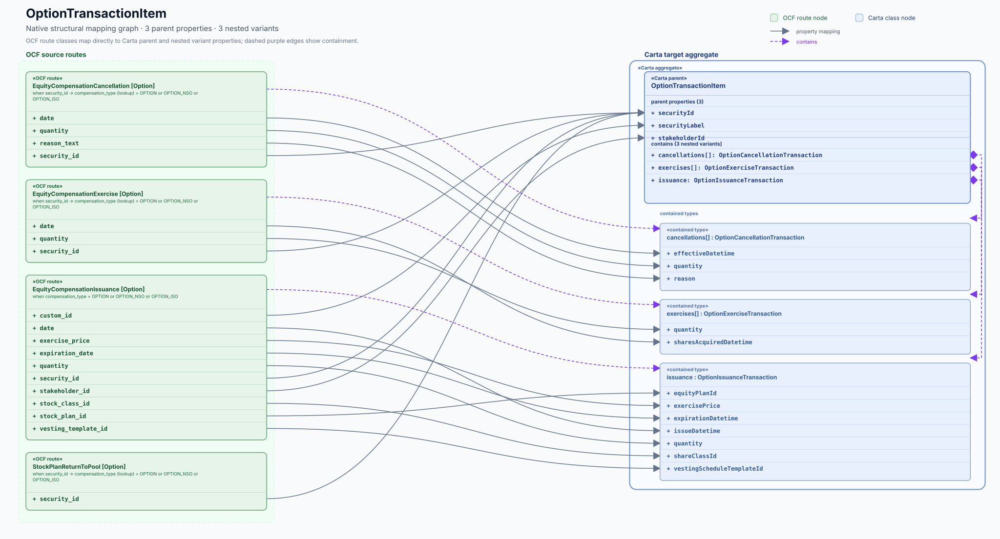
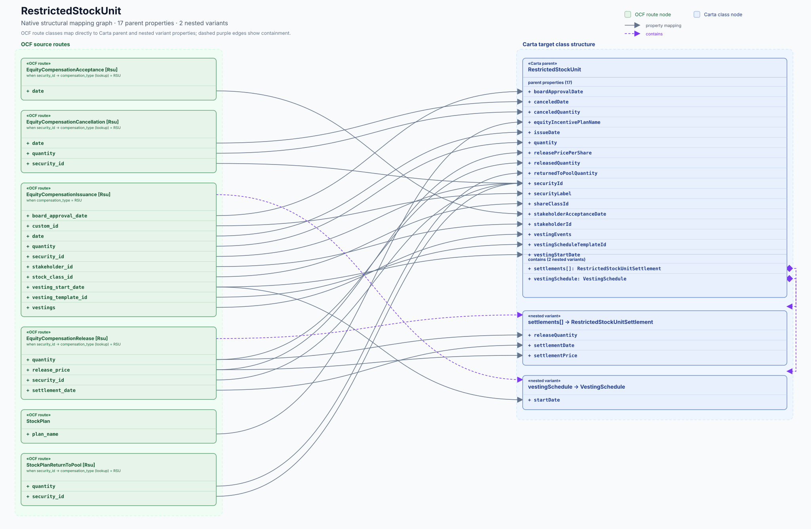
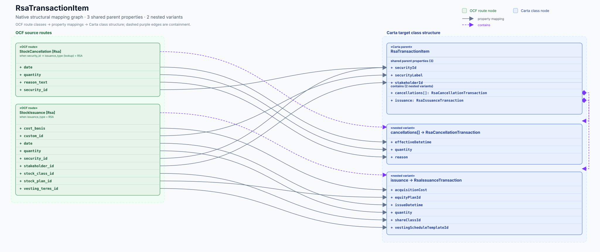
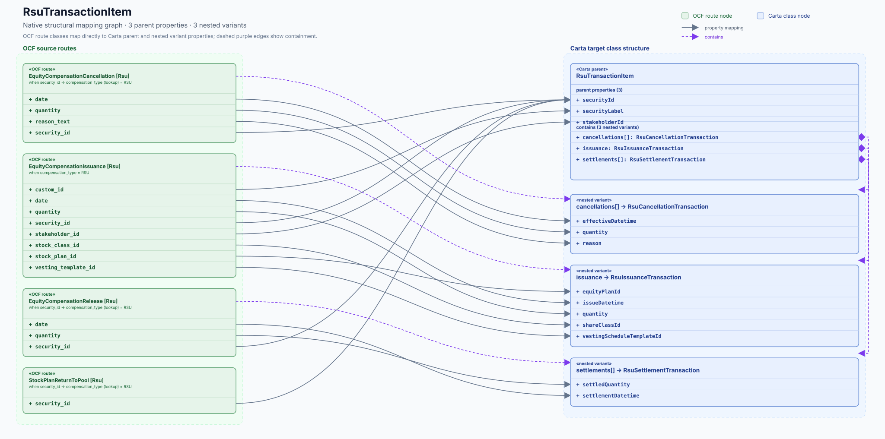
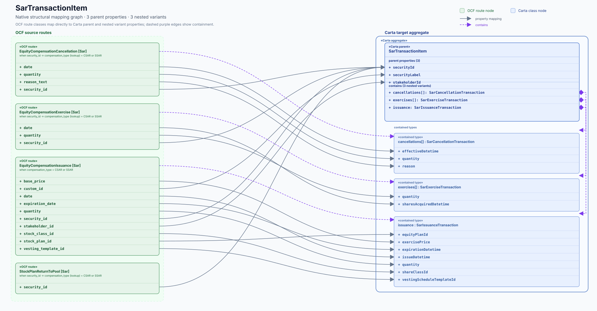
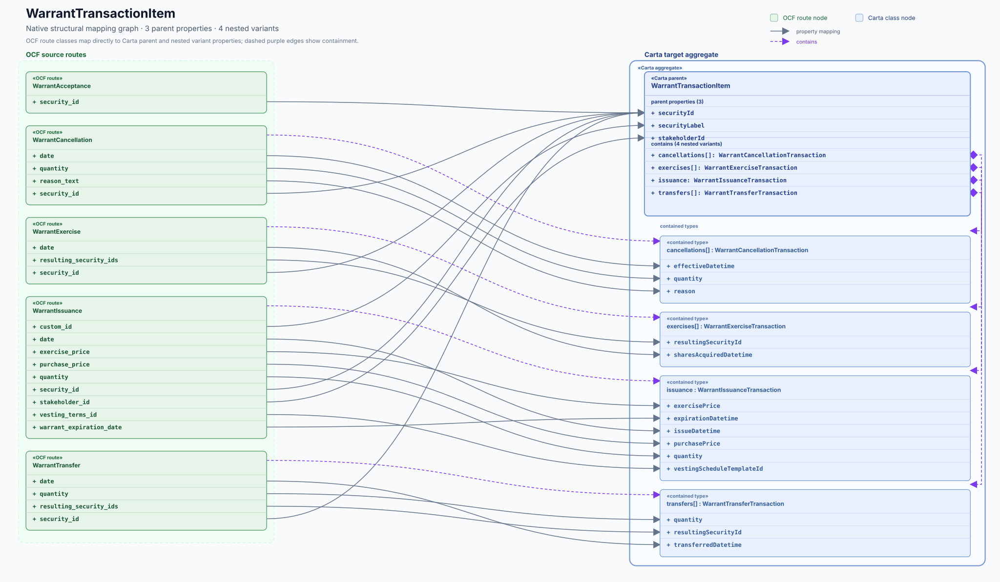

# Related-object flow gallery

These native SVGs show the inverse mapping ledger as UML-like class/data-flow graphs.

Each image is one Carta parent object. Green class nodes are OCF routes; blue class nodes are
the Carta parent and contained types. The solid blue boundary makes the parent and its nested
variants read as one Carta aggregate. Smaller families use solid arrows for explicit source property
→ target property mappings. Dense families use target-specific mapping lanes; each lane keeps the
exact property mappings in a compact ledger while grouped arrows preserve the data flow.
Dashed purple edges show containment. The Carta parent node explicitly reports its parent-property
count and lists those properties, including parent-only routes where they contribute to the family.

CI also publishes a self-contained interactive HTML viewer as the `mapping-inverse-interactive`
artifact. It lets reviewers toggle target lanes and source routes, zoom the diagram, then click or
shift-click exact mapping arrows to focus selected flows. A reproducible copy is checked in at
[`../mapping-flows-interactive/index.html`](../mapping-flows-interactive/index.html). GitHub's code
browser displays that file as source; opening the downloaded CI artifact (or serving the checked-in
file locally) provides the interactive view. GitHub Pages can serve the same `docs/` path if the
repository later enables Pages.

From a checkout, run `python3 -m http.server 8000 --directory docs/generated/mapping-flows-interactive`
and open `http://127.0.0.1:8000/` to use the viewer locally.

| Carta parent | Preview |
| --- | --- |
| [CertificateTransactionItem](./CertificateTransactionItem.svg) |  |
| [ConvertibleTransactionItem](./ConvertibleTransactionItem.svg) |  |
| [OptionGrant](./OptionGrant.svg) |  |
| [OptionTransactionItem](./OptionTransactionItem.svg) |  |
| [RestrictedStockUnit](./RestrictedStockUnit.svg) |  |
| [RsaTransactionItem](./RsaTransactionItem.svg) |  |
| [RsuTransactionItem](./RsuTransactionItem.svg) |  |
| [SarTransactionItem](./SarTransactionItem.svg) |  |
| [WarrantTransactionItem](./WarrantTransactionItem.svg) |  |
