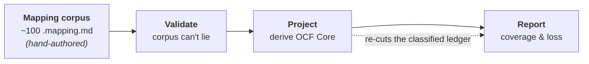

# The shape of our transforms — an architecture guide

This is the high-level map: what kind of thing each part of this repo *is*, how they compose,
and the handful of rules that hold everywhere. It is deliberately **not** a reference — for
the exact grammar see [`mapping-validation.md`](./mapping-validation.md) and
[`polymorphic-transaction-routing.md`](./polymorphic-transaction-routing.md); for the derivation
mechanics see [`ocf-core-goal.md`](./ocf-core-goal.md) and [`ocf-core-spec.md`](./ocf-core-spec.md).
Read this first to understand the *shape*; read those when you need the *details*.

## The one big idea

**We hand-author one substantive thing, and derive everything else from it.**

The authored artifact of substance is the **mapping corpus** — ~100 `.mapping.md` files, one per
OCF schema, each declaring in plain YAML how that OCF object's fields land in the target standard
(Carta). Everything downstream — the validity gate, the OCF Core standard, every coverage and
loss report, every diagram — is a **computed view** over that corpus. Nobody writes the Core
schema; nobody hand-maintains a loss spreadsheet. If you want to change what's in Core, you sharpen
a mapping and rebuild.

Two *thin* curated files ride alongside the corpus, but neither carries field mappings — they're
wiring and sign-off, not content: an **`allow-list.yml`** (which entities a human has ratified into
Core) and a **`reference-graph.yml`** (which `*_id` fields are foreign keys to which object, and
which fields count as payload vs. bookkeeping). Everything *about the data* still comes from the
mappings.

This is the *"derive, don't declare"* thesis, and it dictates the whole architecture: one
authored layer, three derived layers, each a pure transform of the layer before it.



Four stages, each with a distinct *shape*:

| Stage | Shape | Input → Output |
| --- | --- | --- |
| **Mapping** | a declarative DSL | OCF schema → a `fields:` map of per-property transforms |
| **Validate** | a pure rules function | (mapping, source schema, target bundle) → `error[]` |
| **Project** | a filter / restriction | mapping corpus → an OCF-shaped Core projection |
| **Report** | a re-cut / render | the derived ledger → Markdown tables and flow maps |

The rest of this guide walks each stage: its shape, its rules, and one illustrative example.

---

## Current workflow and commands

This document is the canonical overview of the mapping lifecycle. The authored source of truth is
the set of `objects/*.mapping.md` and `types/*.mapping.md` files; generated Core schemas, ledgers,
gap reports, and coverage reports are outputs and must not be edited by hand.

The mapping-skeleton CLI is a bootstrap and schema-refresh helper, not the source of mapping
decisions:

```bash
npm run mapping:skeleton                  # write missing skeletons
npm run mapping:skeleton -- --dry-run     # preview writes
npm run mapping:skeleton -- --force       # overwrite existing mappings; use deliberately
```

It derives each skeleton from the composed OCF schemas. By default it skips existing mapping files,
so completed mapping decisions remain intact. The current mapping corpus contains 102 mapping files;
the count is derived from the repository and should not be copied into a hand-maintained plan.

After changing a mapping, run the checks in this order:

```bash
npm run mapping:validate                  # mapping grammar, pointers, coverage, and enums
npm run core:check                         # Core derivation, allow-list, and artifact drift
npm test -- --runInBand                    # behavior and CLI regression tests
npm run typecheck && npm run lint          # static and formatting checks
```

For the exact mapping grammar and validator rules, see [`mapping-validation.md`](./mapping-validation.md).
For Core membership and emission, see [`ocf-core-spec.md`](./ocf-core-spec.md). This workflow
supersedes the removed mapping-skeleton design and implementation-plan documents.

---

## Stage 1 — The mapping corpus (the substance we write by hand)

### Shape

One file per OCF schema, living next to the schema it describes (`objects/…`, `types/…`). Each
file is **doc-first**: prose an engineer can read, with a single machine-parseable core. The
anatomy is always the same —

- **frontmatter** — identity + `status` + `target_standard`, and
- a single **`## Mapping` YAML block** whose heart is a `fields:` map:
  `<ocf property> → { kind, target, … }`.

That per-field entry is the atom of the whole system. Its `kind` is the transform verb. The
canonical operator reference, including cardinality and examples, lives in
[`docs/mapping-validation.md#dsl-operator-reference`](./mapping-validation.md#dsl-operator-reference).

| `kind` / block | scope | cardinality |
| --- | --- | --- |
| `rename` | value transfer | 1 → 1 |
| `construct` | scalar shape construction | 1 scalar → 1 object slot |
| `select` | value reduction | 1 aggregate → 1 |
| `split` | field fan-out | 1 → N |
| `sequential_transform` | ordered field-level composition | 1 aggregate → N target slots |
| `combine` | field fan-in | N → 1 |
| `enum-remap` / `union-map` | alternative/value routing | 1 → 1 declared outcome |
| `computed` | derivation | N → 1 |
| `unmappable` / `TODO` | no destination / unresolved | 1 → 0 / unresolved |
| `composite:` | record fold, all steps emitted | 1 record → N records |

Targets are **JSON pointers into a pinned target bundle** (`target-schema/Carta.schema.json`) —
never free-text. Coverage is derived from the source schema and mapping entries; it is reported in
the validator output and generated heatmap, not copied into each mapping file. A `status` lifecycle
(`draft → partial → complete → reviewed`) gates how strict the file must be.

### The three mapping forms

- **Simple** — a `fields:` map sends one OCF object to one target family.
- **Polymorphic** — one OCF object fans out to *several* Carta families, selected by one
  `route_by_property:` block. It uses `on_property` for a local route or `lookup_by` for an
  explicit keyed lookup through another mapping. Variants are **mutually exclusive** — pick one.
- **Composite** — one OCF *verb* has no single Carta target and folds into an **ordered set** of
  Carta transactions, **all emitted**. It is declared alongside a polymorphic block; composite
  steps are additive while variants remain exclusive.

Polymorphic mappings can also record a **`routed_to:`** edge: when a variant `null`s an enum value
because it belongs to a *sibling* variant, `routed_to` names that sibling and the validator confirms
it genuinely claims the value — a machine-checked round-trip that turns "dropped here" into "handled
over there."

### Forward transforms and inverse recoverability are separate axes

The mapping `kind` answers **how OCF data reaches Carta**. An optional `inverse:` block answers
**what a consumer can recover when walking that Carta data back toward OCF**. A target can therefore
have valid forward mapping evidence without being a reconstructible OCF record:

```yaml
quantity:
  kind: rename
  target: "#/$defs/OptionGrant/properties/returnedToPoolQuantity"
  inverse:
    role: aggregate-projection
    note: Repeated return events are summed into one per-security total.
```

The inverse roles are `record-construction` (the default), `reference-only`, `state-projection`,
`aggregate-projection`, and `event-reconstruction`. The inverse ledger carries these roles on its
target edges and reports them without changing ordinary forward slot coverage. Target-level policy
is a separate concern: a `report-rollup` definition can receive forward edges while being excluded
from standalone inverse source construction. Curated policy uses `override: true` only when that
classification must supersede direct shape evidence.

The option-pool case demonstrates why both axes are needed. In the current June 22 Carta bundle,
`StockPlanReturnToPool.security_id` and `stock_plan_id` are explicitly `unmappable`, `quantity`
has no retained pool-summary target, and `StockPlan.initial_shares_reserved` is no longer a live
`state-projection` because `OptionPoolSummary` was removed. The Carta bundle exposes no pool
authorization ledger, effective-date history, available-share field, or return-to-pool transaction.
Consequently, available pool shares may be calculated as an OCF-side replay/read model when the
complete event stream is present, but that calculation does not become a writable Carta field or
make the inverse event reconstruction lossless. See the detailed
[pool mapping notes](../objects/transactions/return_to_pool/StockPlanReturnToPool.mapping.md) and
the [inverse-semantics reference](./mapping-validation.md#inverse-semantics).

### High-level rules

- **Nothing is silent.** Every source property is accounted for — it either lands somewhere or is
  explicitly `unmappable` with a typed `reason`. There is no "we just didn't map this."
- **Loss is recorded where it happens.** A lossy value collapse is written into the `enum-remap`
  `values:` map (`INSTITUTION: UNKNOWN`); a missing concept is an `unmappable` reason. The mapping
  *is* the loss ledger.
- **Doc-first, parseable-later.** The file reads as documentation; the machine only needs the one
  YAML block. Prose and notes carry the *why*.
- **A mapping lives where its target lives** (the type-mapping policy). A reusable OCF type maps at
  the *type* level when Carta has one analogous type (`CurrencyCode → Iso4217CurrencyAlphaCode`);
  when Carta instead inlines the concept as bare fields across many objects, the *type* is marked
  `no-equivalent` and each consuming object maps it locally; when Carta lacks the concept entirely,
  it's `no-equivalent` everywhere. (Bare scalar types with no properties simply carry
  `fields: {}` — the correspondence is described in prose.) The discipline is to
  avoid a "lazy `unmappable`" — declaring no home for a type that has a perfectly good one.

### Example — a simple mapping (`Stakeholder`)

```yaml
status: complete
fields:
  name:
    kind: rename
    target: "#/$defs/Stakeholder/properties/fullName"
  stakeholder_type:
    kind: enum-remap
    target: "#/$defs/Stakeholder/properties/entityType"
    values:
      INDIVIDUAL:  INDIVIDUAL
      INSTITUTION: UNKNOWN          # lossy collapse — Carta has no institution type
  current_status:
    kind: unmappable
    target: null
    reason: no-equivalent
```

`name` moves verbatim; `stakeholder_type` coarsens value-by-value (and the loss is visible right
there); `current_status` has no Carta home and says so. That's the entire vocabulary of the base
case.

---

## Stage 2 — Validation (keeping the corpus honest)

### Shape

A **pure function**: `validateMapping(mapping, sourceSchema, targetBundle) → error[]`. It reads
no files and touches no network — all I/O (walking the tree, loading schemas, resolving the target
bundle) lives in a thin CLI wrapper. That purity is the point: the rules are deterministic and
testable, and CI runs them on every PR.

The whole reason this stage exists: **make the corpus trustworthy enough to build on without
hand-auditing.** Stages 3 and 4 consume the mappings as ground truth; validation is what earns
that trust.

### High-level rules

Three families of check, tightening as a file matures:

- **Structural** (every file) — required keys present; `kind` matches its target shape; the two
  copies of `status` agree.
- **Semantic** (once a real target is pinned) — every pointer **resolves** in the target bundle;
  `enum-remap` values are checked **member-by-member** against the target enum; a pointer landing
  on an excluded schema is an error (use `unmappable` instead).
- **Status-conditional** — a `complete`/`reviewed` file may carry no `TODO`s, must cover every
  source property, and must give every `unmappable` a reason.

Two invariants are worth calling out because they're what make derivation safe:

- **Coverage can't lie.** `X/N` is re-derived from the schema and re-counted from the entries —
  both directions. Add a property to an OCF schema and every `complete` mapping of it fails until
  updated. **The schema is the source of truth, not the mapping's self-report.**
- **Routing must be total.** In a polymorphic mapping the variants' `when:` sets must *partition*
  the route property's enum — pairwise-disjoint, and (when exhaustive) covering every value. No
  value is claimed twice and none falls through.

---

## Stage 3 — Projection (deriving OCF Core)

This is the payoff. **OCF Core** is a minimal, OCF-shaped projection whose mapped values are
statically admissible for the Carta fold — and it is **computed from the mapping corpus, never
written by hand.** Core is not necessarily valid against the live OCF schema's requiredness rules;
an explicit enrichment step produces **OCF Extended** when omitted context is available (see
[`ocf-core-enrichment.md`](./ocf-core-enrichment.md)).

### The defining invariant

> A document is strict Core **iff its mapped value shapes are statically admissible for the Carta
> fold and every required mapped fact has a destination**. Runtime fold totality, source
> requiredness, and enrichment are separate concerns.

The strict projection therefore keeps the OCF facts that have a statically admissible, lossless
destination; rich Core also records explicitly classified lossy homes. Any omitted required OCF
context is handled by the enrichment boundary rather than silently assumed to be present.

### Shape

A five-step pipeline (one function that both the build and the CI check call, so they can never
disagree on what Core is):

```
load green corpus → classify every field → admissibility per entity → collapse variants → emit package
```

The central data structure is the **membership ledger**: one **verdict** per
`(entity, variant, field)`.

- **Field classification** — does this field land in Carta via a *clear, deterministic, total,
  lossless* rule? Verdict is `core` (with a loss note: `direct` / `widening` / `value-coarsening`)
  or `out` (with a reason: `no-destination` / `existence-loss` / `partial` / `heuristic`).
- **Entity admissibility** — lift field verdicts to the whole object. An entity enters Core only if
  it clears two gates: **non-degeneracy** (it lands at least one real *payload* field, not just
  ids and dates and references) and **referential closure** (every reference it carries — wired by
  the curated `reference-graph.yml`, since the schemas don't say which id points where — resolves to
  another admissible entity). In practice **non-degeneracy is the gate that actually binds today**:
  once the foundational objects went green every reference resolves, so closure never fires in the
  current corpus, and the long tail of transfers/retractions/acceptances is held out purely because
  it lands no payload. (A third, spec-level "the fold-required fields must all land" gate collapsed
  into non-degeneracy once it turned out every Carta target declares `required: []` — a nice case of
  reality pruning a rule down to the one that does the work.)
- **Collapse & emit** — a Carta-driven variant split (e.g. `StockIssuance` Default/Rsa) collapses
  back into *one* OCF entity, and the package is emitted in **OCF's own shape** — same field names,
  same types, same event model. (Some entities are *alias wrappers* — e.g. `PlanSecurityIssuance`
  inherits `EquityCompensationIssuance`'s shape, carries no mapping of its own, and simply mirrors
  the base entity's admissibility.)

### The governing rule: value-loss OK, existence-loss not

This one line decides most verdicts. The fold may **coarsen a value** — clamp a decimal, bucket an
enum, widen a type — and the field stays `core`. But it may **never drop an element, entity, or
relationship**: `array → scalar` or "pick the primary of N" is *existence loss* and forces the
field `out`. And a rule must be **total over the field's full OCF domain** — a lookup that has no
answer for some legal input is out, because Core must *always* fold.

### One ledger, two readings: strict vs rich

Both profiles run the identical pipeline and differ in a **single membership predicate**:

- **strict** (`core/`) — only `core`-class fields. The lossless intersection; everything in it is
  faithfully Carta-expressible.
- **rich** (`core-rich/`) — strict *plus* "lossy-home" fields (ones with a Carta target that
  narrows on the way out, like a structured `Address` when Carta holds only a country). Rich keeps
  them in OCF's shape and **relocates** the loss onto the Core→Carta edge. It's a discussion
  artifact, not a second contract.

### Build vs check

`core:build` regenerates the Core package and reports; `core:check` re-derives in memory and
asserts two gates in CI — **drift** (committed artifacts equal a fresh recompute) and **subset**
(every entity the machine wants to admit is ratified in a thin human `allow-list.yml`). This is a
**two-way ratchet**: the machine can't publish an entity a human hasn't sanctioned (subset), and a
human can't let the committed Core drift from what the mappings actually derive (drift). A name can
be ratified in the allow-list *before* its mapping is green — it simply sits pending and graduates
automatically the moment the mapping lands. Neither side can move Core unilaterally.

### Example — how one property admits an entity, and how loss is surfaced

`StockTransfer` is the emblematic case. Carta has no transfer transaction, so the mapping folds it
into an ordered **cancel + issue** pair (a composite), and the transfer's payload lands on those
steps:

```yaml
composite:
  - step: cancel
    target: { Default: "#/$defs/CertificateCancellationTransaction", Rsa: "#/$defs/RsaCancellationTransaction" }
    const:  { Default: { reason: CERTIFICATE_CANCELLATION_REASON_TRANSFERRED } }
  - step: issue
    target: { Default: "#/$defs/CertificateIssuanceTransaction", Rsa: "#/$defs/RsaIssuanceTransaction" }
shared:
  quantity:                         # ← the payload that used to have no home
    kind: rename
    target:
      cancel: { Default: "#/…/CertificateCancellationTransaction/properties/quantity", Rsa: "#/…" }
      issue:  { Default: "#/…/CertificateIssuanceTransaction/properties/quantity",     Rsa: "#/…" }
  consideration_text: { kind: unmappable, target: null, reason: no-equivalent }
```

Trace it through the projection:

1. **Mapping** — `quantity` lands a real value on both steps; `consideration_text` has no home.
2. **Classify** — `quantity → core` (`widening`, OCF `Numeric` → Carta `Decimal`);
   `consideration_text → out` (`no-destination`); the lineage fields (`resulting_security_ids`) are
   `out / heuristic` reverse-edges that *don't* count as payload.
3. **Admissibility** — because `quantity` is a real payload landing, the non-degeneracy gate is
   satisfied and `StockTransfer` becomes **Core-admissible**. Before the composite mapping existed
   it landed only lineage references and was held out with `no-payload`.
4. **Report** — the same object simultaneously *enters* Core on `quantity` and *drops*
   `consideration_text`; that dual fact is written into the ledger and the loss reports, not
   hand-noted.

The counter-example is `StockClass.votes_per_share`: OCF-*required*, but Carta has nowhere to put
it. It falls out of the projection and is surfaced as an **OCF gap to discuss** — never smuggled
into Core.

---

## Stage 4 — Reports (making fidelity legible)

### Shape

The source-side loss inventories re-derive the Core ledger (a cheap `deriveCore` call under the
strict profile) and recut its verdicts into Markdown tables and flow maps. The canonical
target-first inverse report and visuals load the green mapping corpus once, build the shared
Carta-side inverse ledger, and render the text report, SVG gallery, and interactive HTML viewer.
The key discipline is the same in both paths: **no report re-implements classification.** The loss
semantics live in the classifier and inverse ledger; renderers only *read* those facts. Change a
mapping or schema rule and every relevant artifact follows for free.

### The canonical report families, and what each asks

| Report | Question it answers |
| --- | --- |
| **inverse coverage** (`mapping:artifacts`) | Which Carta targets and properties have executable OCF mapping evidence, what remains empty, and how do source routes reach nested targets? |
| **lossy inventory** (`core:lossy`) | Which fields fall out of Core but *do* have a (lossy) Carta home, vs none at all? |
| **unmapped inventory** (`core:unmapped`) | Which OCF properties have *no* Carta home at all? |

Loss is typed straight off the classifier verdict: `no-destination` (dropped entirely),
`existence-loss` (shape collapses), `heuristic` (non-1:1 transform), `partial` (an enum value with
no route). Polymorphic flavors are drawn as **separate nodes** so you can see that
`StockIssuance [Rsa]` and `[Default]` land on different Carta objects. Fixed `const:` fills are
credited as *filled* targets, not phantom gaps.

> **The target-first inverse artifacts are drift-checked.** The OCF-side lossy/unmapped inventories
> remain discussion artifacts derived from the Core classifier. They are intentionally separate:
> the inverse ledger cannot answer whether an OCF field is lossy or has no destination.

### Canonical target-first artifacts

Run `npm run mapping:artifacts` to regenerate the checked-in
[Mapping Explorer](./generated/mapping-explorer/index.html), including its
[inverse report](./generated/mapping-explorer/assets/mapping-inverse-report.md),
[native SVG assets](./generated/mapping-explorer/assets/mapping-flows/), and
[interactive viewer](./generated/mapping-explorer/assets/mapping-flows-interactive/index.html). The report preserves the
target-first audit ledger; the SVGs preserve exact source-property → target-property edges and
containment for every mapped Carta target with executable object evidence.

The source-side inventories remain the authoritative place for `no-destination`,
`existence-loss`, and `heuristic` OCF fields. Those facts are intentionally not duplicated in the
target-first report.

---

## The rules that hold across every stage

If you remember nothing else, remember these — they're the DNA the whole system shares:

1. **Derive, don't declare.** One authored layer (the mappings); everything else is a computed view.
   To change a derived artifact, change its input and rebuild — never edit the output.
2. **Loss is explicit and typed, never silent.** Every field either lands or carries a reason it
   can't. The mapping records value-loss where it happens; the classifier types it; the reports
   surface it.
3. **Everything must be total and deterministic.** No heuristic, no partial lookup, no "usually
   works" gets into Core. If a rule can't answer for some legal input, it's out.
4. **Core is OCF-shaped, one-way down.** Core uses OCF objects and field names, with intentionally
   relaxed requiredness; it is not automatically an instance-valid OCF document. It folds *to* Carta
   and can be enriched into OCF Extended; we never require recovering Core *from* Carta.
5. **Single source of truth per fact.** The schema owns the property set; the ledger owns
   membership; one predicate owns strict-vs-rich; one `allow-list` owns ratification. No fact is
   stated in two places that could disagree.
6. **Nothing is trusted on its own word — everything is checked against a *pinned external*.**
   Coverage is re-derived from the OCF schema (not the mapping's self-report); every target pointer
   must resolve in the *pinned* Carta bundle; enum members are checked against the *target* enum;
   the classifier inspects *both* resolved shapes; and drift re-derives Core from source. Each stage
   validates against an independently-pinned source of truth rather than against itself.
7. **Pure core, I/O at the edges.** The validator and the reporters are pure functions; file and
   network access is quarantined in thin CLI wrappers. That's what makes the whole chain
   deterministic and CI-checkable.

## Where each stage lives

| Stage | Author / run | Key code | Docs |
| --- | --- | --- | --- |
| Mapping | `objects/…`, `types/…` `*.mapping.md` | — | [mapping-validation](./mapping-validation.md), [polymorphic-transaction-routing](./polymorphic-transaction-routing.md) |
| Validate | `npm run mapping:validate` | `scripts/lib/mapping-{parser,validator}.ts` | [mapping-validation](./mapping-validation.md) |
| Project | `npm run core:build` / `core:check` | `scripts/lib/core-{pipeline,classifier,admissibility,schema-emitter}.ts` | [ocf-core-goal](./ocf-core-goal.md), [ocf-core-spec](./ocf-core-spec.md) |
| Report | `core:build` emits the **gated** ledger/gap reports (`core/`, `core-rich/`) and the OCF-side loss inventories; `mapping:artifacts` emits the canonical Carta-side inverse report and Pages explorer | `scripts/lib/report-flow.ts`, `scripts/derive-core-*.ts`, `scripts/lib/mapping-inverse-report.ts`, `scripts/generate-mapping-inverse-artifacts.ts` | generated `core/core-{ledger,gaps}.md`, `docs/core-{lossy-inventory,unmapped-inventory}.md`, `docs/generated/mapping-explorer/**` |
