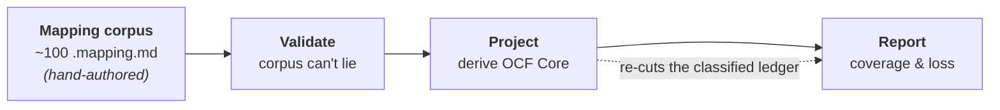
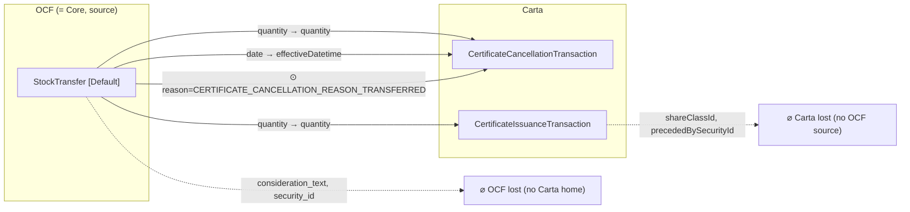

# The shape of our transforms — an architecture guide

This is the high-level map: what kind of thing each part of this repo *is*, how they compose,
and the handful of rules that hold everywhere. It is deliberately **not** a reference — for
the exact grammar see [`mapping-validation.md`](./mapping-validation.md) and
[`polymorphic-transaction-routing.md`](./polymorphic-transaction-routing.md); for the derivation
mechanics see [`ocf-core-goal.md`](./ocf-core-goal.md) and [`ocf-core-spec.md`](./ocf-core-spec.md).
Read this first to understand the *shape*; read those when you need the *details*.

## The one big idea

**We hand-author one substantive thing, and derive everything else from it.**

The authored artifact of substance is the **mapping corpus** — ~100 `.mapping.md` files, one per
OCF schema, each declaring in plain YAML how that OCF object's fields land in the target standard
(Carta). Everything downstream — the validity gate, the OCF Core standard, every coverage and
loss report, every diagram — is a **computed view** over that corpus. Nobody writes the Core
schema; nobody hand-maintains a loss spreadsheet. If you want to change what's in Core, you sharpen
a mapping and rebuild.

Two *thin* curated files ride alongside the corpus, but neither carries field mappings — they're
wiring and sign-off, not content: an **`allow-list.yml`** (which entities a human has ratified into
Core) and a **`reference-graph.yml`** (which `*_id` fields are foreign keys to which object, and
which fields count as payload vs. bookkeeping). Everything *about the data* still comes from the
mappings.

This is the *"derive, don't declare"* thesis, and it dictates the whole architecture: one
authored layer, three derived layers, each a pure transform of the layer before it.



Four stages, each with a distinct *shape*:

| Stage | Shape | Input → Output |
| --- | --- | --- |
| **Mapping** | a declarative DSL | OCF schema → a `fields:` map of per-property transforms |
| **Validate** | a pure rules function | (mapping, source schema, target bundle) → `error[]` |
| **Project** | a filter / restriction | mapping corpus → OCF Core (a subset of OCF) |
| **Report** | a re-cut / render | the derived ledger → markdown + mermaid |

The rest of this guide walks each stage: its shape, its rules, and one illustrative example.

---

## Stage 1 — The mapping corpus (the substance we write by hand)

### Shape

One file per OCF schema, living next to the schema it describes (`objects/…`, `types/…`). Each
file is **doc-first**: prose an engineer can read, with a single machine-parseable core. The
anatomy is always the same —

- **frontmatter** — identity + `status` + `target_standard`, and
- a single **`## Mapping` YAML block** whose heart is a `fields:` map:
  `<ocf property> → { kind, target, … }`.

That per-field entry is the atom of the whole system. Its `kind` is the transform verb:

| `kind` | what it does | target shape |
| --- | --- | --- |
| `rename` | move the value verbatim | one pointer |
| `enum-remap` | rewrite value-by-value | one pointer + a `values:` map |
| `split` | fan one field to several | ≥2 pointers |
| `combine` / `computed` | derive from one or more | one pointer |
| `unmappable` | no home; record *why* | `null` + a `reason:` |
| `TODO` | not yet mapped | literal `TODO` |

Targets are **JSON pointers into a pinned target bundle** (`target-schema/Carta.schema.json`) —
never free-text. Coverage is derived from the source schema and mapping entries; it is reported in
the validator output and generated heatmap, not copied into each mapping file. A `status` lifecycle
(`draft → partial → complete → reviewed`) gates how strict the file must be.

### The three shapes a mapping can take

Most files are the simple 1:1 case. Two extensions handle the hard cases where OCF and Carta
disagree on structure:

- **Polymorphic** — one OCF object fans out to *several* Carta families, selected by a
  discriminator. Either the discriminator is a field on this schema (`discriminator:`,
  *issuance-time*) or it lives on a joined record reached by a foreign key (`route_by_security:`,
  *downstream*). Variants are **mutually exclusive** — pick one.
- **Composite** — one OCF *verb* has no single Carta target and folds into an **ordered set** of
  Carta transactions, **all emitted**. Orthogonal to variants (which are exclusive), composite
  steps are additive.

Polymorphic mappings can also record a **`routed_to:`** edge: when a variant `null`s an enum value
because it belongs to a *sibling* variant, `routed_to` names that sibling and the validator confirms
it genuinely claims the value — a machine-checked round-trip that turns "dropped here" into "handled
over there."

### High-level rules

- **Nothing is silent.** Every source property is accounted for — it either lands somewhere or is
  explicitly `unmappable` with a typed `reason`. There is no "we just didn't map this."
- **Loss is recorded where it happens.** A lossy value collapse is written into the `enum-remap`
  `values:` map (`INSTITUTION: UNKNOWN`); a missing concept is an `unmappable` reason. The mapping
  *is* the loss ledger.
- **Doc-first, parseable-later.** The file reads as documentation; the machine only needs the one
  YAML block. Prose and notes carry the *why*.
- **A mapping lives where its target lives** (the type-mapping policy). A reusable OCF type maps at
  the *type* level when Carta has one analogous type (`CurrencyCode → Iso4217CurrencyAlphaCode`);
  when Carta instead inlines the concept as bare fields across many objects, the *type* is marked
  `no-equivalent` and each consuming object maps it locally; when Carta lacks the concept entirely,
  it's `no-equivalent` everywhere. (Bare scalar types with no properties simply carry
  `fields: {}` — the correspondence is described in prose.) The discipline is to
  avoid a "lazy `unmappable`" — declaring no home for a type that has a perfectly good one.

### Example — a simple mapping (`Stakeholder`)

```yaml
status: complete
fields:
  name:
    kind: rename
    target: "#/$defs/Stakeholder/properties/fullName"
  stakeholder_type:
    kind: enum-remap
    target: "#/$defs/Stakeholder/properties/entityType"
    values:
      INDIVIDUAL:  INDIVIDUAL
      INSTITUTION: UNKNOWN          # lossy collapse — Carta has no institution type
  current_status:
    kind: unmappable
    target: null
    reason: no-equivalent
```

`name` moves verbatim; `stakeholder_type` coarsens value-by-value (and the loss is visible right
there); `current_status` has no Carta home and says so. That's the entire vocabulary of the base
case.

---

## Stage 2 — Validation (keeping the corpus honest)

### Shape

A **pure function**: `validateMapping(mapping, sourceSchema, targetBundle) → error[]`. It reads
no files and touches no network — all I/O (walking the tree, loading schemas, resolving the target
bundle) lives in a thin CLI wrapper. That purity is the point: the rules are deterministic and
testable, and CI runs them on every PR.

The whole reason this stage exists: **make the corpus trustworthy enough to build on without
hand-auditing.** Stages 3 and 4 consume the mappings as ground truth; validation is what earns
that trust.

### High-level rules

Three families of check, tightening as a file matures:

- **Structural** (every file) — required keys present; `kind` matches its target shape; the two
  copies of `status` agree.
- **Semantic** (once a real target is pinned) — every pointer **resolves** in the target bundle;
  `enum-remap` values are checked **member-by-member** against the target enum; a pointer landing
  on an excluded schema is an error (use `unmappable` instead).
- **Status-conditional** — a `complete`/`reviewed` file may carry no `TODO`s, must cover every
  source property, and must give every `unmappable` a reason.

Two invariants are worth calling out because they're what make derivation safe:

- **Coverage can't lie.** `X/N` is re-derived from the schema and re-counted from the entries —
  both directions. Add a property to an OCF schema and every `complete` mapping of it fails until
  updated. **The schema is the source of truth, not the mapping's self-report.**
- **Routing must be total.** In a polymorphic mapping the variants' `when:` sets must *partition*
  the discriminator enum — pairwise-disjoint, and (when exhaustive) covering every value. No value
  is claimed twice and none falls through.

---

## Stage 3 — Projection (deriving OCF Core)

This is the payoff. **OCF Core** is a minimal, Carta-cleanly-convertible subset of OCF — and it is
**computed from the mapping corpus, never written by hand.**

### The defining invariant

> A document is Core **iff the fold down to Carta is *total* over it** — it always produces a valid
> Carta snapshot and never silently drops a datum with nowhere to land.

Core is *exactly* the domain on which that fold is guaranteed to succeed. So the projection is:
**start from all of OCF, keep only what provably survives the mapping to Carta.**

### Shape

A five-step pipeline (one function that both the build and the CI check call, so they can never
disagree on what Core is):

```
load green corpus → classify every field → admissibility per entity → collapse variants → emit package
```

The central data structure is the **membership ledger**: one **verdict** per
`(entity, variant, field)`.

- **Field classification** — does this field land in Carta via a *clear, deterministic, total,
  lossless* rule? Verdict is `core` (with a loss note: `direct` / `widening` / `value-coarsening`)
  or `out` (with a reason: `no-destination` / `existence-loss` / `partial` / `heuristic`).
- **Entity admissibility** — lift field verdicts to the whole object. An entity enters Core only if
  it clears two gates: **non-degeneracy** (it lands at least one real *payload* field, not just
  ids and dates and references) and **referential closure** (every reference it carries — wired by
  the curated `reference-graph.yml`, since the schemas don't say which id points where — resolves to
  another admissible entity). In practice **non-degeneracy is the gate that actually binds today**:
  once the foundational objects went green every reference resolves, so closure never fires in the
  current corpus, and the long tail of transfers/retractions/acceptances is held out purely because
  it lands no payload. (A third, spec-level "the fold-required fields must all land" gate collapsed
  into non-degeneracy once it turned out every Carta target declares `required: []` — a nice case of
  reality pruning a rule down to the one that does the work.)
- **Collapse & emit** — a Carta-driven variant split (e.g. `StockIssuance` Default/Rsa) collapses
  back into *one* OCF entity, and the package is emitted in **OCF's own shape** — same field names,
  same types, same event model. (Some entities are *alias wrappers* — e.g. `PlanSecurityIssuance`
  inherits `EquityCompensationIssuance`'s shape, carries no mapping of its own, and simply mirrors
  the base entity's admissibility.)

### The governing rule: value-loss OK, existence-loss not

This one line decides most verdicts. The fold may **coarsen a value** — clamp a decimal, bucket an
enum, widen a type — and the field stays `core`. But it may **never drop an element, entity, or
relationship**: `array → scalar` or "pick the primary of N" is *existence loss* and forces the
field `out`. And a rule must be **total over the field's full OCF domain** — a lookup that has no
answer for some legal input is out, because Core must *always* fold.

### One ledger, two readings: strict vs rich

Both profiles run the identical pipeline and differ in a **single membership predicate**:

- **strict** (`core/`) — only `core`-class fields. The lossless intersection; everything in it is
  faithfully Carta-expressible.
- **rich** (`core-rich/`) — strict *plus* "lossy-home" fields (ones with a Carta target that
  narrows on the way out, like a structured `Address` when Carta holds only a country). Rich keeps
  them in OCF's shape and **relocates** the loss onto the Core→Carta edge. It's a discussion
  artifact, not a second contract.

### Build vs check

`core:build` regenerates the Core package and reports; `core:check` re-derives in memory and
asserts two gates in CI — **drift** (committed artifacts equal a fresh recompute) and **subset**
(every entity the machine wants to admit is ratified in a thin human `allow-list.yml`). This is a
**two-way ratchet**: the machine can't publish an entity a human hasn't sanctioned (subset), and a
human can't let the committed Core drift from what the mappings actually derive (drift). A name can
be ratified in the allow-list *before* its mapping is green — it simply sits pending and graduates
automatically the moment the mapping lands. Neither side can move Core unilaterally.

### Example — how one property admits an entity, and how loss is surfaced

`StockTransfer` is the emblematic case. Carta has no transfer transaction, so the mapping folds it
into an ordered **cancel + issue** pair (a composite), and the transfer's payload lands on those
steps:

```yaml
composite:
  - step: cancel
    target: { Default: "#/$defs/CertificateCancellationTransaction", Rsa: "#/$defs/RsaCancellationTransaction" }
    const:  { Default: { reason: CERTIFICATE_CANCELLATION_REASON_TRANSFERRED } }
  - step: issue
    target: { Default: "#/$defs/CertificateIssuanceTransaction", Rsa: "#/$defs/RsaIssuanceTransaction" }
shared:
  quantity:                         # ← the payload that used to have no home
    kind: rename
    target:
      cancel: { Default: "#/…/CertificateCancellationTransaction/properties/quantity", Rsa: "#/…" }
      issue:  { Default: "#/…/CertificateIssuanceTransaction/properties/quantity",     Rsa: "#/…" }
  consideration_text: { kind: unmappable, target: null, reason: no-equivalent }
```

Trace it through the projection:

1. **Mapping** — `quantity` lands a real value on both steps; `consideration_text` has no home.
2. **Classify** — `quantity → core` (`widening`, OCF `Numeric` → Carta `Decimal`);
   `consideration_text → out` (`no-destination`); the lineage fields (`resulting_security_ids`) are
   `out / heuristic` reverse-edges that *don't* count as payload.
3. **Admissibility** — because `quantity` is a real payload landing, the non-degeneracy gate is
   satisfied and `StockTransfer` becomes **Core-admissible**. Before the composite mapping existed
   it landed only lineage references and was held out with `no-payload`.
4. **Report** — the same object simultaneously *enters* Core on `quantity` and *drops*
   `consideration_text`; that dual fact is written into the ledger and the loss reports, not
   hand-noted.

The counter-example is `StockClass.votes_per_share`: OCF-*required*, but Carta has nowhere to put
it. It falls out of the projection and is surfaced as an **OCF gap to discuss** — never smuggled
into Core.

---

## Stage 4 — Reports (making fidelity legible)

### Shape

Each report re-derives the ledger (a cheap `deriveCore` call, under the profile its question needs
— `core:bidi` under rich, `core:unmapped` under strict) and re-cuts it into markdown tables and
mermaid diagrams. The key discipline: **no report re-implements classification.** The loss
semantics live in exactly one place (the classifier); reports only *read* its verdicts and render
them. Change what "loss" means and every report follows for free. The atom here is a **flow**: one
OCF field traced to the Carta slot(s) its mapping sends it to (or to a "no home" sink).

### The three flavors, and what each asks

| Report | Question it answers |
| --- | --- |
| **bidirectional coverage** (`core:bidi`) | Treating rich Core as an interop hub, what flows *in* from each side and what's *left behind*? |
| **lossy inventory** (`core:lossy`) | Which fields fall out of Core but *do* have a (lossy) Carta home, vs none at all? |
| **unmapped inventory** (`core:unmapped`) | Which OCF properties have *no* Carta home at all? |

Loss is typed straight off the classifier verdict: `no-destination` (dropped entirely),
`existence-loss` (shape collapses), `heuristic` (non-1:1 transform), `partial` (an enum value with
no route). Polymorphic flavors are drawn as **separate nodes** so you can see that
`StockIssuance [Rsa]` and `[Default]` land on different Carta objects. Fixed `const:` fills are
credited as *filled* targets, not phantom gaps.

> **These three are discussion artifacts — not drift-gated.** The membership ledger and the gap
> report *are* gated; the bidi/lossy/unmapped inventories are analysis inputs for the rich-Core
> conversation. Same rendering engine, two different gating contracts.

### Example — the generated flow diagram (`StockTransfer [Default]`)

Trimmed straight from the generated `docs/core-bidirectional-flow.md` (the hub view):



Solid edges are property flows (`quantity` to *both* steps); the `⊙` edge is a fixed `const` reason
code; and loss is shown *both* directions — a dashed edge to `⌀ OCF lost` for OCF fields with no
Carta home, and one to `⌀ Carta lost` for Carta slots no OCF field fills. This is the whole
pipeline made visible: authored mapping → validated → projected → rendered as a per-object fidelity
picture.

---

## The rules that hold across every stage

If you remember nothing else, remember these — they're the DNA the whole system shares:

1. **Derive, don't declare.** One authored layer (the mappings); everything else is a computed view.
   To change a derived artifact, change its input and rebuild — never edit the output.
2. **Loss is explicit and typed, never silent.** Every field either lands or carries a reason it
   can't. The mapping records value-loss where it happens; the classifier types it; the reports
   surface it.
3. **Everything must be total and deterministic.** No heuristic, no partial lookup, no "usually
   works" gets into Core. If a rule can't answer for some legal input, it's out.
4. **Core is OCF-shaped, one-way down.** Core is a *subset of OCF* — same objects and field names,
   no Carta-isms, no invented objects. It folds *to* Carta; we never require recovering it *from*
   Carta.
5. **Single source of truth per fact.** The schema owns the property set; the ledger owns
   membership; one predicate owns strict-vs-rich; one `allow-list` owns ratification. No fact is
   stated in two places that could disagree.
6. **Nothing is trusted on its own word — everything is checked against a *pinned external*.**
   Coverage is re-derived from the OCF schema (not the mapping's self-report); every target pointer
   must resolve in the *pinned* Carta bundle; enum members are checked against the *target* enum;
   the classifier inspects *both* resolved shapes; and drift re-derives Core from source. Each stage
   validates against an independently-pinned source of truth rather than against itself.
7. **Pure core, I/O at the edges.** The validator and the reporters are pure functions; file and
   network access is quarantined in thin CLI wrappers. That's what makes the whole chain
   deterministic and CI-checkable.

## Where each stage lives

| Stage | Author / run | Key code | Docs |
| --- | --- | --- | --- |
| Mapping | `objects/…`, `types/…` `*.mapping.md` | — | [mapping-validation](./mapping-validation.md), [polymorphic-transaction-routing](./polymorphic-transaction-routing.md) |
| Validate | `npm run mapping:validate` | `scripts/lib/mapping-{parser,validator}.ts` | [mapping-validation](./mapping-validation.md) |
| Project | `npm run core:build` / `core:check` | `scripts/lib/core-{pipeline,classifier,admissibility,schema-emitter}.ts` | [ocf-core-goal](./ocf-core-goal.md), [ocf-core-spec](./ocf-core-spec.md) |
| Report | `core:build` emits the **gated** ledger/gap reports (`core/`, `core-rich/`); `core:bidi` / `core:lossy` / `core:unmapped` emit the **non-gated** inventories (`docs/core-*.md`) | `scripts/lib/report-flow.ts`, `scripts/derive-core-*.ts` | generated `core/core-{ledger,gaps}.md`, `docs/core-{bidirectional-flow,lossy-inventory,unmapped-inventory}.md` |
